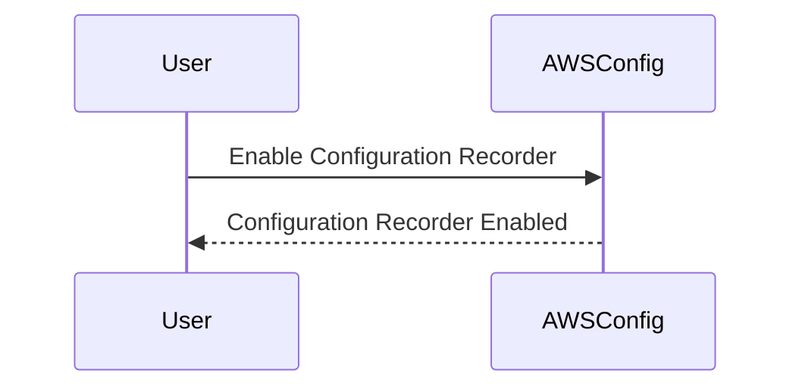
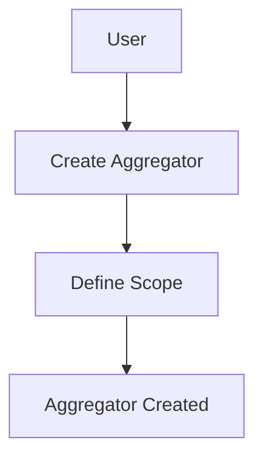
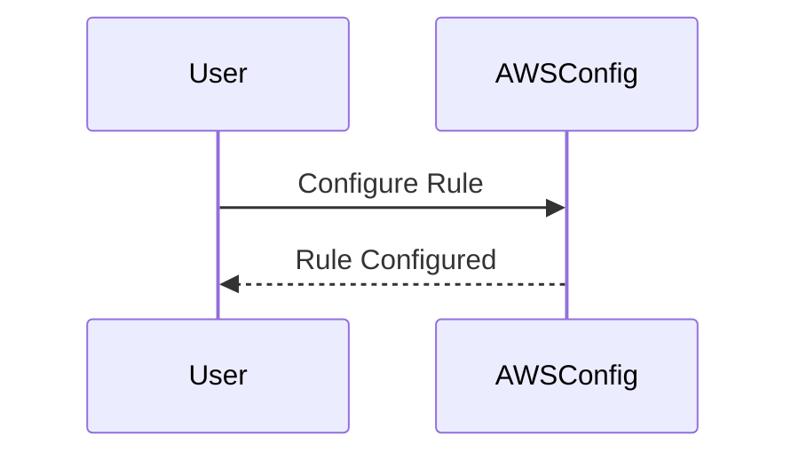
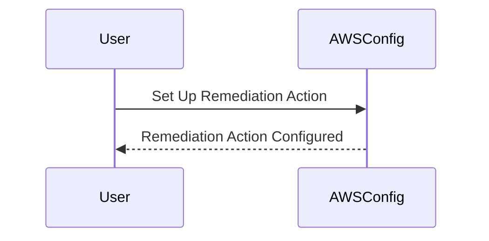
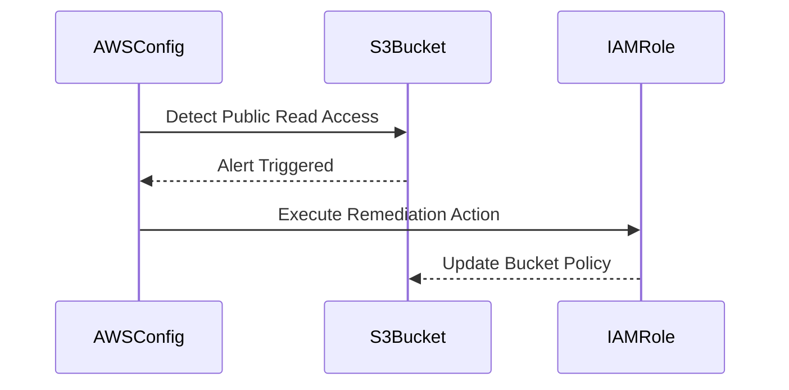

## Introduction to Compliance as Code

### What is Compliance as Code?

Compliance as Code is a DevSecOps practice that automates the enforcement of compliance policies within an organization’s infrastructure. This approach leverages Infrastructure as Code (IaC) principles to ensure that compliance requirements are embedded directly into the infrastructure code. By doing so, organizations can maintain continuous compliance throughout the development lifecycle, reducing the risk of non-compliance and associated penalties.

### Why AWS Config?

AWS Config is a service provided by Amazon Web Services (AWS) that enables you to assess, audit, and record configurations and configuration changes of your AWS resources. It helps you maintain compliance by continuously monitoring your resources against predefined rules and benchmarks. AWS Config supports various compliance standards, including the Center for Internet Security (CIS) benchmarks, which are widely recognized and used in the industry.

### How AWS Config Works

AWS Config operates by collecting configuration details of your AWS resources and storing them in a central repository. These details include metadata such as resource type, properties, and relationships. AWS Config then evaluates these configurations against predefined rules to determine compliance status. You can configure AWS Config to notify you of any non-compliant resources and even automate the remediation process.

#### Key Components of AWS Config

1. **Configuration Items**: Detailed records of your AWS resources at a specific point in time.
2. **Configuration Recorder**: A component that captures the configuration history of your resources.
3. **Aggregators**: Tools that collect and consolidate configuration data from multiple accounts or regions.
4. **Rules**: Predefined checks that evaluate your resources against compliance standards.
5. **Remediation Actions**: Automated processes that correct non-compliant resources.

### Setting Up AWS Config

To set up AWS Config, you need to enable the service and configure it to monitor your resources. Here’s a step-by-step guide:

1. **Enable Configuration Recorder**:
    - Log in to the AWS Management Console.
    - Navigate to the AWS Config dashboard.
    - Click on "Get started" to enable the configuration recorder.
    - Select the IAM role that has permissions to access your resources.



2. **Create Aggregators**:
    - If you have multiple AWS accounts or regions, create aggregators to consolidate configuration data.
    - Define the scope of the aggregator, specifying which accounts or regions to include.



3. **Configure Rules**:
    - Choose from pre-defined rules or create custom rules based on your compliance requirements.
    - Specify the resources to which the rules should apply.



4. **Set Up Remediation Actions**:
    - Define actions to automatically correct non-compliant resources.
    - Ensure that the IAM roles have necessary permissions to execute these actions.



### Real-World Examples

#### Example 1: Non-Compliant S3 Bucket

Consider a scenario where an S3 bucket is configured to allow public read access, which violates your organization’s compliance policy. AWS Config can detect this non-compliance and trigger a remediation action to restrict public access.

**Vulnerable Configuration**:

```yaml
Resources:
  MyBucket:
    Type: AWS::S3::Bucket
    Properties:
      AccessControl: PublicRead
```

**Compliant Configuration**:

```yaml
Resources:
  MyBucket:
    Type: AWS::S3::Bucket
    Properties:
      AccessControl: Private
```

**Detection and Remediation**:

1. **Detection**:
    - AWS Config rule detects the public read access.
    - Triggers an alert or notification.

2. **Remediation**:
    - Automatically updates the bucket policy to restrict public access.



### Recent Breaches and CVEs

#### Example 2: CVE-2021-20225

In 2021, a vulnerability (CVE-2021-20225) was discovered in AWS S3 buckets that allowed unauthorized access due to misconfigured bucket policies. AWS Config could have detected and prevented this by enforcing strict access control rules.

**Vulnerable Configuration**:

```json
{
  "Version": "2012-10-17",
  "Statement": [
    {
      "Sid": "PublicReadGetObject",
      "Effect": "Allow",
      "Principal": "*",
      "Action": "s3:GetObject",
      "Resource": "arn:aws:s3:::my-bucket/*"
    }
  ]
}
```

**Compliant Configuration**:

```json
{
  "Version": "2012-10-17",
  "Statement": [
    {
      "Sid": "DenyPublicAccess",
      "Effect": "Deny",
      "Principal": "*",
      "Action": "s3:*",
      "Resource": "arn:aws:s3:::my-bucket/*",
      "Condition": {
        "StringNotEquals": {
          "aws:PrincipalArn": "arn:aws:iam::123456789012:root"
        }
      }
    }
  ]
}
```

### How to Prevent / Defend

#### Detection

1. **Use AWS Config Rules**: Implement rules to detect non-compliant configurations.
2. **Monitor Logs**: Regularly review AWS CloudTrail logs for suspicious activities.

#### Prevention

1. **Enforce Strict Policies**: Use IAM roles and policies to restrict access.
2. **Automate Remediation**: Configure AWS Config to automatically correct non-compliant resources.

#### Secure Coding Fixes

**Vulnerable Pattern**:

```yaml
Resources:
  MyInstance:
    Type: AWS::EC2::Instance
    Properties:
      ImageId: ami-0abcdef1234567890
      InstanceType: t2.micro
      SecurityGroupIds:
        - sg-0123456789abcdef0
```

**Secure Pattern**:

```yaml
Resources:
  MyInstance:
    Type: AWS::EC2::Instance
    Properties:
      ImageId: ami-0abcdef1234567890
      InstanceType: t2.micro
      SecurityGroupIds:
        - !Ref MySecurityGroup
  MySecurityGroup:
    Type: AWS::EC2::SecurityGroup
    Properties:
      GroupDescription: "My Security Group"
      VpcId: vpc-0123456789abcdef0
      SecurityGroupIngress:
        - IpProtocol: tcp
          FromPort: 22
          ToPort: 22
          CidrIp: 10.0.0.0/24
```

### Complete Example: Full HTTP Request and Response

#### Example 3: Monitoring EC2 Instances

**HTTP Request**:

```http
POST /aws-config/rules HTTP/1.1
Host: config.amazonaws.com
Content-Type: application/json

{
  "RuleName": "ec2-instance-monitoring-enabled",
  "Scope": {
    "ComplianceResourceTypes": ["AWS::EC2::Instance"]
  },
  "Source": {
    "Owner": "AWS",
    "SourceIdentifier": "EC2_INSTANCE_MONITORING_ENABLED"
  },
  "InputParameters": {
    "MonitoringEnabled": true
  }
}
```

**HTTP Response**:

```http
HTTP/1.1 200 OK
Content-Type: application/json

{
  "RuleARN": "arn:aws:config:us-east-1:123456789012:rule/ec2-instance-monitoring-enabled",
  "RuleId": "r-1234567890abcdef0"
}
```

### Common Pitfalls and Best Practices

#### Pitfall 1: Overlooking IAM Permissions

Ensure that the IAM roles used by AWS Config have the necessary permissions to access and modify resources. Insufficient permissions can lead to incomplete or inaccurate compliance evaluations.

#### Best Practice: Regular Audits

Regularly audit your AWS Config setup to ensure that it remains aligned with your compliance requirements. This includes reviewing and updating rules, aggregators, and remediation actions as needed.

### Hands-On Labs

For practical experience with AWS Config and compliance as code, consider the following labs:

- **CloudGoat**: A cloud security training platform that includes exercises on AWS Config and compliance.
- **flaws.cloud**: A cloud security lab that provides scenarios for configuring and using AWS Config effectively.
- **AWS Official Workshops**: AWS offers several workshops that cover compliance and security practices, including the use of AWS Config.

By following these steps and best practices, you can effectively implement compliance as code using AWS Config, ensuring that your AWS environment remains compliant and secure throughout its lifecycle.

---
<!-- nav -->
[[01-Introduction to Compliance as Code with AWS Config|Introduction to Compliance as Code with AWS Config]] | [[DevSecOps/DevSecOps Bootcamp/02-Security Governance & Compliance/02-Compliance as Code/01-Demo Overview and Introduction to AWS Config/00-Overview|Overview]] | [[03-Compliance as Code with AWS Config|Compliance as Code with AWS Config]]
