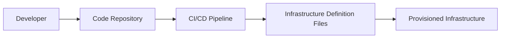
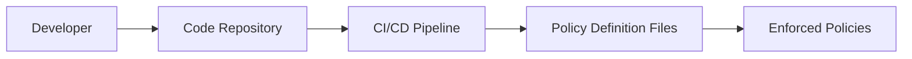

## Introduction to Compliance as Code

In the realm of DevSecOps, ensuring that systems are secure and compliant with regulatory requirements is paramount. This chapter delves into the concept of compliance as code, which integrates automated compliance checks into the development and deployment pipeline. By doing so, organizations can ensure that their systems adhere to regulatory standards and security best practices throughout their lifecycle.

### What is Compliance?

Compliance refers to the adherence to a set of regulatory requirements imposed by governing bodies. These regulations are designed to ensure that organizations protect sensitive data, maintain operational integrity, and meet specific legal obligations. Compliance is not merely a set of guidelines but a mandatory framework that organizations must follow to avoid legal penalties and reputational damage.

#### Regulatory Requirements

Regulatory requirements vary depending on the industry and jurisdiction. Some common regulatory frameworks include:

- **GDPR (General Data Protection Regulation)**: Applies to organizations processing personal data of individuals within the European Union.
- **HIPAA (Health Insurance Portability and Accountability Act)**: Governs the handling of health information in the United States.
- **PCI DSS (Payment Card Industry Data Security Standard)**: Ensures the secure handling of credit card information.
- **SOX (Sarbanes-Oxley Act)**: Requires public companies to maintain accurate financial records and internal controls.

These regulations mandate specific security measures, such as encryption, access controls, and audit trails, to protect sensitive data and ensure operational integrity.

### Why Compliance Matters

Compliance is crucial for several reasons:

1. **Legal Obligations**: Non-compliance can result in significant fines and legal penalties.
2. **Reputation Management**: Organizations that fail to comply with regulations may suffer reputational damage, leading to loss of customer trust and business.
3. **Data Protection**: Compliance ensures that sensitive data is adequately protected against unauthorized access and breaches.
4. **Operational Integrity**: Compliance helps maintain the integrity of organizational operations by enforcing consistent security practices.

### How Compliance Works

Compliance involves a combination of policies, procedures, and technical controls to ensure that an organization meets regulatory requirements. The process typically includes:

1. **Policy Development**: Creating internal policies that align with regulatory requirements.
2. **Procedure Implementation**: Establishing procedures to enforce these policies.
3. **Technical Controls**: Implementing technical measures to enforce compliance, such as encryption, access controls, and monitoring.

### Compliance as Code

Compliance as code extends the concept of compliance by integrating automated compliance checks into the development and deployment pipeline. This approach leverages Infrastructure as Code (IaC) and Policy as Code (PaC) principles to ensure that compliance requirements are enforced automatically.

#### Infrastructure as Code (IaC)

Infrastructure as Code involves managing and provisioning infrastructure through machine-readable definition files. This approach allows organizations to define their infrastructure in code, making it easier to manage, version control, and automate.



#### Policy as Code (PaC)

Policy as Code involves defining security and compliance policies in code. This approach enables organizations to enforce policies consistently across their infrastructure and applications.



### Integrating Compliance as Code

Integrating compliance as code involves several steps:

1. **Define Compliance Policies**: Create policies that align with regulatory requirements.
2. **Automate Compliance Checks**: Integrate automated compliance checks into the CI/CD pipeline.
3. **Monitor and Audit**: Continuously monitor and audit compliance to ensure ongoing adherence.

#### Example: GDPR Compliance

Let's consider an example of implementing GDPR compliance using compliance as code.

##### Step 1: Define Compliance Policies

Create policies that align with GDPR requirements, such as data protection, access controls, and audit trails.

```yaml
# gdpr_policy.yaml
policies:
  - name: data_protection
    description: Ensure data is encrypted at rest and in transit.
    enforcement: strict
  - name: access_controls
    description: Restrict access to sensitive data based on roles.
    enforcement: strict
  - name: audit_trails
    description: Maintain detailed logs of data access and modifications.
    enforcement: strict
```

##### Step 2: Automate Compliance Checks

Integrate automated compliance checks into the CI/CD pipeline using tools like Terraform, Ansible, or Kubernetes.

```hcl
# main.tf
resource "aws_s3_bucket" "secure_bucket" {
  bucket = "secure-data-bucket"
  acl    = "private"

  server_side_encryption_configuration {
    rule {
      apply_server_side_encryption_by_default {
        sse_algorithm = "AES256"
      }
    }
  }
}
```

##### Step 3: Monitor and Audit

Continuously monitor and audit compliance to ensure ongoing adherence. Use tools like AWS Config, Azure Policy, or Kubernetes Admission Controllers to enforce policies.

```json
{
  "policy": {
    "mode": "all",
    "rules": [
      {
        "type": "Microsoft.Storage/storageAccounts",
        "name": "EnsureStorageAccountsAreEncrypted",
        "parameters": {
          "effect": "Deny",
          "roleDefinitionIds": [
            "/providers/Microsoft.Authorization/roleDefinitions/b24986ac-6180-42a0-ab88-20f7382dd24c"
          ]
        }
      }
    ]
  }
}
```

### Real-World Examples

#### Recent Breaches and CVEs

Several recent breaches highlight the importance of compliance as code:

- **Equifax Breach (2017)**: Equifax failed to patch a known vulnerability (CVE-2017-5638), leading to the exposure of sensitive data. Compliance as code could have ensured that critical patches were applied automatically.
- **Capital One Breach (2019)**: Capital One suffered a breach due to misconfigured web application firewall rules. Compliance as code could have enforced proper configuration management.

#### Secure Coding Practices

Secure coding practices are essential for compliance. Here’s an example of a vulnerable code snippet and its secure counterpart:

**Vulnerable Code:**

```python
import sqlite3

def login(username, password):
    conn = sqlite3.connect('database.db')
    cursor = conn.cursor()
    cursor.execute(f"SELECT * FROM users WHERE username='{username}' AND password='{password}'")
    user = cursor.fetchone()
    if user:
        return True
    else:
        return False
```

**Secure Code:**

```python
import sqlite3

def login(username, password):
    conn = sqlite3.connect('database.db')
    cursor = conn.cursor()
    cursor.execute("SELECT * FROM users WHERE username=? AND password=?", (username, password))
    user = cursor.fetchone()
    if user:
        return True
    else:
        return False
```

### How to Prevent / Defend

#### Detection

Use tools like static code analysis, dynamic analysis, and continuous monitoring to detect compliance violations.

- **Static Code Analysis**: Tools like SonarQube, Veracode, and Checkmarx can identify security vulnerabilities in code.
- **Dynamic Analysis**: Tools like OWASP ZAP, Burp Suite, and AppScan can test applications for runtime vulnerabilities.
- **Continuous Monitoring**: Tools like AWS CloudTrail, Azure Monitor, and Splunk can monitor infrastructure for compliance violations.

#### Prevention

Implement preventive measures to ensure ongoing compliance.

- **Automated Patch Management**: Use tools like Ansible, Puppet, or Chef to automate patch management.
- **Configuration Management**: Use tools like Terraform, Ansible, or Kubernetes to enforce consistent configurations.
- **Access Control**: Implement role-based access control (RBAC) to restrict access to sensitive data.

#### Secure-Coding Fixes

Show the vulnerable pattern and the corrected secure version side by side.

**Vulnerable Pattern:**

```yaml
apiVersion: v1
kind: Pod
metadata:
  name: my-pod
spec:
  containers:
  - name: my-container
    image: my-image
    ports:
    - containerPort: 80
```

**Secure Pattern:**

```yaml
apiVersion: v1
kind: Pod
metadata:
  name: my-pod
spec:
  containers:
  - name: my-container
    image: my-image
    ports:
    - containerPort: 80
    securityContext:
      runAsUser: 1000
      runAsGroup: 3000
      readOnlyRootFilesystem: true
```

### Conclusion

Compliance as code is a powerful approach to ensuring that organizations meet regulatory requirements and maintain high levels of security. By integrating automated compliance checks into the development and deployment pipeline, organizations can enforce consistent security practices and avoid costly breaches and penalties.

### Hands-On Labs

For hands-on practice with compliance as code, consider the following labs:

- **PortSwigger Web Security Academy**: Offers interactive labs on web application security, including compliance-related topics.
- **OWASP Juice Shop**: A deliberately insecure web application for practicing security testing and compliance.
- **CloudGoat**: Provides scenarios for practicing cloud security and compliance in AWS.
- **Kubernetes Goat**: Offers scenarios for practicing Kubernetes security and compliance.

By leveraging these resources, you can gain practical experience in implementing compliance as code and ensure that your systems remain secure and compliant.

---
<!-- nav -->
[[DevSecOps/DevSecOps Bootcamp/02-Security Governance & Compliance/02-Compliance as Code/02-What is Compliance/00-Overview|Overview]] | [[DevSecOps/DevSecOps Bootcamp/02-Security Governance & Compliance/02-Compliance as Code/02-What is Compliance/02-What is Compliance|What is Compliance]]
