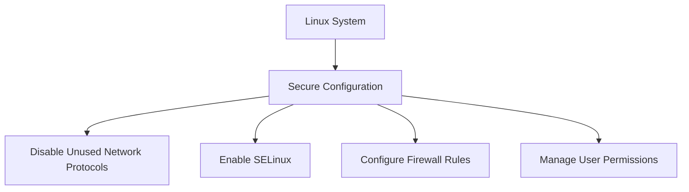
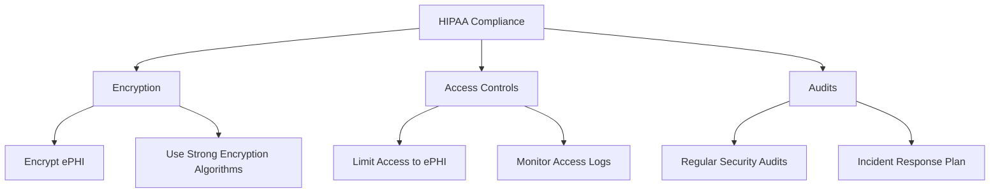
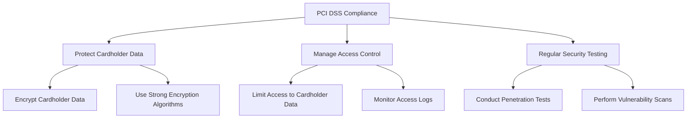
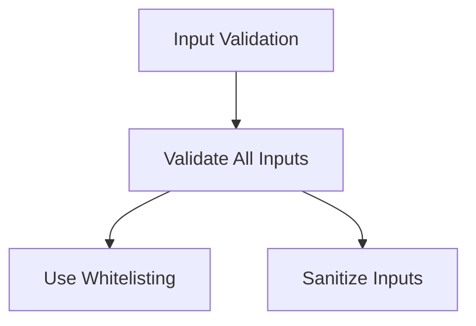
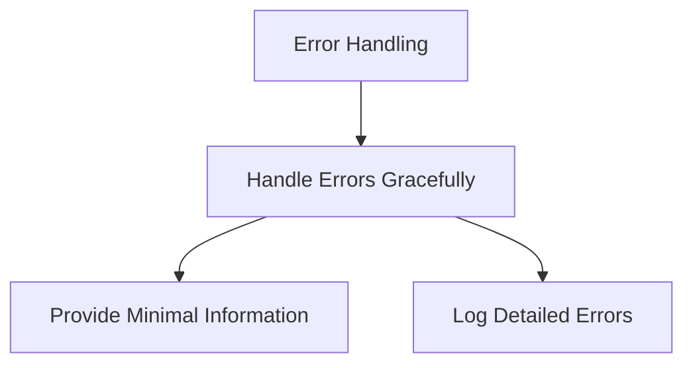
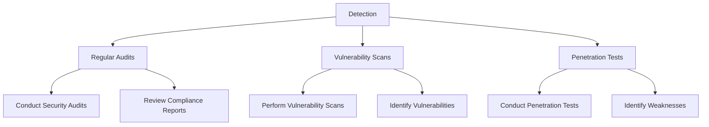
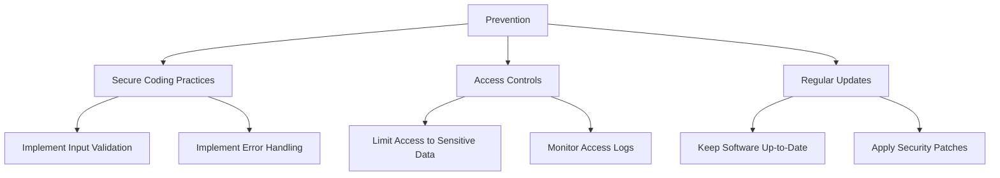

## What is Compliance?

Compliance refers to the adherence to a set of rules, regulations, and standards that govern the operations of an organization. In the context of DevSecOps, compliance ensures that the development, deployment, and maintenance of software systems adhere to specific security and operational guidelines. This is crucial because non-compliance can lead to legal penalties, financial losses, and reputational damage. 

### Why Compliance Matters

Compliance is essential for several reasons:

1. **Legal Requirements**: Many industries have strict regulatory requirements that must be met. For example, the healthcare industry must comply with HIPAA (Health Insurance Portability and Accountability Act) in the United States, which mandates the protection of patient health information.
   
2. **Trust and Reputation**: Demonstrating compliance helps build trust with customers, partners, and stakeholders. Non-compliance can result in loss of business and damage to the organization’s reputation.

3. **Risk Management**: Compliance helps identify and mitigate risks associated with non-compliance. By adhering to established standards, organizations can reduce the likelihood of security breaches and other incidents.

### Compliance Checklists and Benchmarks

One way to ensure compliance is through the use of checklists and benchmarks. These tools provide a structured approach to verifying that all necessary security measures are in place. A compliance checklist typically includes a list of security controls and configurations that must be implemented and verified.

#### CIS Benchmarks

The Center for Internet Security (CIS) provides a widely recognized set of benchmarks known as the CIS Controls. These controls are designed to help organizations protect their IT environments against cyber threats. The CIS Controls are organized into three tiers:

1. **Tier 1**: Essential Cyber Hygiene
2. **Tier 2**: Foundational Cyber Defense
3. **Tier 3**: Organizational Cyber Defense

Each tier contains a series of controls that address different aspects of cybersecurity. For example, Tier 1 includes basic controls such as inventorying assets, securing configurations, and managing vulnerabilities.

### How CIS Benchmarks Work

CIS Benchmarks provide detailed guidance on how to implement security controls. They include specific recommendations for various operating systems, applications, and network devices. For instance, the CIS Benchmark for Linux might include recommendations for securing SSH, configuring firewall rules, and managing user permissions.

#### Example: CIS Benchmark for Linux

Let's take a closer look at some of the controls in the CIS Benchmark for Linux:

- **Disable Unused Network Protocols**: This control recommends disabling unused network protocols to reduce the attack surface. For example, you might disable unnecessary services like NIS or NFS.

- **Enable SELinux**: SELinux (Security-Enhanced Linux) is a security module that provides mandatory access controls. Enabling SELinux adds an additional layer of security by enforcing strict access policies.

- **Configure Firewall Rules**: Configuring firewall rules helps control inbound and outbound traffic. This can be done using tools like `iptables` or `firewalld`.

- **Manage User Permissions**: Properly managing user permissions ensures that users have only the necessary privileges to perform their tasks. This can be achieved by using groups and setting appropriate file permissions.

### Implementing CIS Benchmarks

Implementing CIS Benchmarks involves several steps:

1. **Assessment**: Conduct an assessment to determine the current state of your system and identify areas that need improvement.
   
2. **Planning**: Develop a plan to implement the recommended controls. This might involve creating a roadmap and assigning responsibilities.

3. **Implementation**: Implement the controls according to the recommendations. This might involve making changes to system configurations, installing security tools, and training staff.

4. **Verification**: Verify that the controls have been correctly implemented. This can be done through automated tools or manual checks.

5. **Maintenance**: Regularly review and update the controls to ensure ongoing compliance.

### Real-World Examples

#### Example 1: HIPAA Compliance

HIPAA compliance is critical for healthcare organizations. One of the key requirements is ensuring the confidentiality, integrity, and availability of electronic protected health information (ePHI). This can be achieved by implementing controls such as encryption, access controls, and regular audits.

- **Encryption**: Encrypting ePHI ensures that even if data is intercepted, it cannot be read without the proper decryption key. Strong encryption algorithms such as AES (Advanced Encryption Standard) should be used.

- **Access Controls**: Limiting access to ePHI ensures that only authorized personnel can view or modify the data. Access logs should be monitored to detect any unauthorized access attempts.

- **Audits**: Regular security audits help identify and address any compliance issues. An incident response plan should be in place to handle any security incidents.

#### Example 2: PCI DSS Compliance

PCI DSS (Payment Card Industry Data Security Standard) is a set of security standards designed to ensure that all companies that accept, process, store, or transmit credit card information maintain a secure environment. Compliance with PCI DSS is mandatory for any organization that processes credit card payments.

- **Protect Cardholder Data**: Encrypting cardholder data ensures that even if data is intercepted, it cannot be read without the proper decryption key. Strong encryption algorithms such as AES should be used.

- **Manage Access Control**: Limiting access to cardholder data ensures that only authorized personnel can view or modify the data. Access logs should be monitored to detect any unauthorized access attempts.

- **Regular Security Testing**: Conducting penetration tests and performing vulnerability scans helps identify and address any security weaknesses.

### Common Pitfalls and How to Prevent Them

#### Pitfall 1: Incomplete Implementation

**Problem**: Organizations may fail to fully implement all required controls, leading to gaps in security.

**Solution**: Conduct thorough assessments and planning to ensure all necessary controls are implemented. Use automated tools to verify compliance and regularly review and update controls.

#### Pitfall 2: Lack of Regular Audits

**Problem**: Without regular audits, organizations may not be aware of compliance issues until it is too late.

**Solution**: Schedule regular security audits and incident response drills. Use automated tools to monitor compliance and detect any deviations from the required controls.

#### Pitfall 3: Insufficient Training

**Problem**: Staff may lack the necessary knowledge and skills to properly implement and maintain compliance controls.

**Solution**: Provide regular training and awareness programs to ensure staff understand the importance of compliance and know how to implement and maintain the required controls.

### Secure Coding Practices

Secure coding practices are essential for ensuring compliance. Here are some examples of secure coding practices and how they can be implemented:

#### Example 1: Input Validation

Input validation is crucial for preventing attacks such as SQL injection and cross-site scripting (XSS).

- **Validate All Inputs**: Ensure that all inputs are validated to prevent malicious input from being processed.
  
- **Use Whitelisting**: Use whitelisting to allow only valid inputs. For example, if an input field expects a number, only allow numeric characters.

- **Sanitize Inputs**: Sanitize inputs to remove any potentially harmful characters. For example, escape special characters in SQL queries to prevent SQL injection.

#### Example 2: Error Handling

Proper error handling is important for preventing information leakage and ensuring the security of the application.

- **Handle Errors Gracefully**: Handle errors gracefully to prevent the application from crashing and to provide minimal information to the user.
  
- **Provide Minimal Information**: Provide minimal information to the user to prevent information leakage. For example, instead of displaying a detailed error message, display a generic message such as "An error occurred."

- **Log Detailed Errors**: Log detailed errors for debugging purposes. This can help identify and address any security issues.

### Detection and Prevention

#### Detection

Detection involves identifying compliance issues and security vulnerabilities. This can be done through regular audits, vulnerability scans, and penetration tests.

- **Regular Audits**: Conduct regular security audits to identify any compliance issues and security vulnerabilities.
  
- **Vulnerability Scans**: Perform vulnerability scans to identify any weaknesses in the system. This can help identify potential security issues before they can be exploited.

- **Penetration Tests**: Conduct penetration tests to simulate real-world attacks and identify any weaknesses in the system.

#### Prevention

Prevention involves implementing controls to prevent compliance issues and security vulnerabilities. This can be done through secure coding practices, access controls, and regular updates.

- **Secure Coding Practices**: Implement secure coding practices to prevent security vulnerabilities. This includes input validation, error handling, and secure coding principles.

- **Access Controls**: Implement access controls to limit access to sensitive data. Monitor access logs to detect any unauthorized access attempts.

- **Regular Updates**: Keep software up-to-date and apply security patches to address any known vulnerabilities.

### Hands-On Labs

To gain practical experience with compliance as code, consider the following hands-on labs:

- **PortSwigger Web Security Academy**: Offers a variety of labs focused on web application security, including compliance-related topics.
- **OWASP Juice Shop**: A deliberately insecure web application that can be used to practice security testing and compliance.
- **DVWA (Damn Vulnerable Web Application)**: Another intentionally vulnerable web application that can be used to practice security testing and compliance.

These labs provide a safe environment to practice implementing compliance controls and detecting security vulnerabilities.

### Conclusion

Compliance is a critical aspect of DevSecOps that ensures organizations adhere to specific security and operational guidelines. By using checklists and benchmarks such as the CIS Controls, organizations can systematically verify that all necessary security measures are in place. Implementing these controls requires careful planning, implementation, verification, and maintenance. By following secure coding practices and conducting regular audits, organizations can prevent compliance issues and security vulnerabilities. Hands-on labs provide a practical way to gain experience with compliance as code.

---
<!-- nav -->
[[DevSecOps/DevSecOps Bootcamp/02-Security Governance & Compliance/02-Compliance as Code/02-What is Compliance/01-Introduction to Compliance as Code|Introduction to Compliance as Code]] | [[DevSecOps/DevSecOps Bootcamp/02-Security Governance & Compliance/02-Compliance as Code/02-What is Compliance/00-Overview|Overview]] | [[DevSecOps/DevSecOps Bootcamp/02-Security Governance & Compliance/02-Compliance as Code/02-What is Compliance/03-Practice Questions & Answers|Practice Questions & Answers]]
