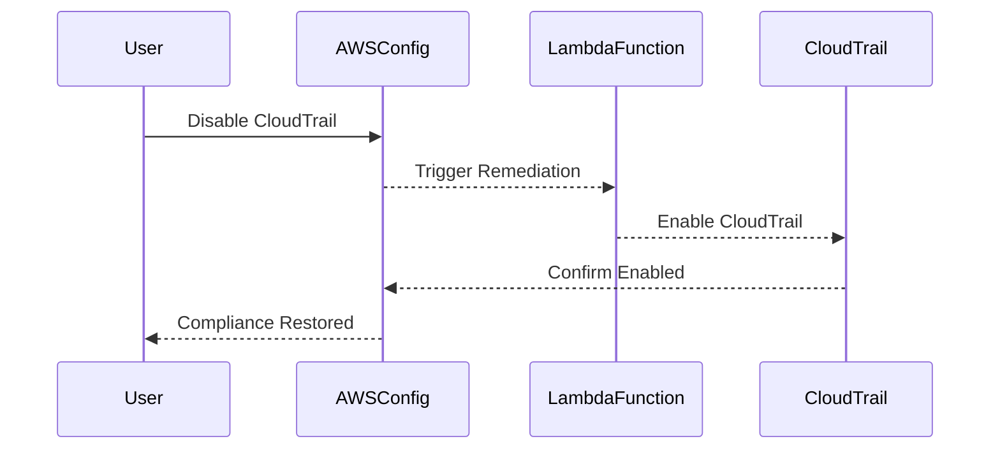

## Introduction to Compliance as Code

Compliance as Code (CaC) is an approach to ensuring that infrastructure and applications comply with regulatory requirements and internal policies through automated, code-driven processes. This method leverages Infrastructure as Code (IaC) principles to define, deploy, and maintain compliance configurations. In the context of AWS, this involves using AWS Config Rules to enforce compliance policies and AWS Config Managed Rules to automatically remediate non-compliant resources.

### Background Theory

AWS Config is a service that enables you to assess, audit, and record changes to your AWS resources. It provides a detailed view of your resources and their configurations, allowing you to track changes over time. AWS Config Rules are predefined checks that evaluate the configuration of your resources against a set of criteria. These rules can be used to ensure that your resources meet specific compliance standards.

### Why Compliance as Code?

Compliance as Code offers several benefits:

1. **Automation**: Automates the process of checking and enforcing compliance, reducing the risk of human error.
2. **Consistency**: Ensures that compliance policies are consistently applied across all environments.
3. **Traceability**: Provides a detailed audit trail of compliance checks and remediations.
4. **Scalability**: Easily scales to manage compliance across large and complex environments.

### Real-World Example: Recent Breaches

In 2021, a major breach occurred at a financial institution due to misconfigured AWS S3 buckets. The lack of proper compliance controls allowed unauthorized access to sensitive data. This incident highlights the importance of implementing robust compliance mechanisms to prevent such breaches.

### CloudTrail and Compliance

CloudTrail is an AWS service that enables you to log, continuously monitor, and retain account activity related to actions across your AWS infrastructure. It captures API calls made to your AWS account and delivers log files to an Amazon S3 bucket. Ensuring that CloudTrail is enabled and properly configured is crucial for maintaining compliance.

### Configuring Auto Remediation for CloudTrail Logging

To ensure that CloudTrail remains enabled and configured correctly, you can set up auto-remediation actions using AWS Config Rules. This involves defining a rule that checks whether CloudTrail is enabled and configuring a remediation action to automatically enable it if it is disabled.

#### Step-by-Step Mechanics

1. **Define the Config Rule**:
   - Create a new Config Rule that checks whether CloudTrail is enabled.
   - Specify the rule parameters, such as the regions to check.

2. **Configure Remediation Action**:
   - Define a remediation action that will be triggered if the rule detects that CloudTrail is disabled.
   - The remediation action can be an AWS Lambda function that enables CloudTrail.

3. **Test the Configuration**:
   - Disable CloudTrail to simulate a non-compliant state.
   - Verify that the remediation action is triggered and CloudTrail is re-enabled.

### Detailed Example

Let's walk through the process of setting up a Config Rule to ensure CloudTrail is enabled and configuring an auto-remediation action.

#### Step 1: Define the Config Rule

First, create a new Config Rule using the AWS Management Console or the AWS CLI.

```bash
aws configservice put-config-rule \
    --config-rule-name "cloudtrail-enabled" \
    --source-owner "AWS" \
    --source-type "CONFIG_DATA" \
    --source-details "[{\"eventType\":\"CONFIG_RULE_EVALUATION\",\"messageType\":\"RULE_EVALUATION\"}]" \
    --input-parameters "{\"regions\":[\"us-east-1\",\"us-west-2\"]}"
```

This command creates a new Config Rule named `cloudtrail-enabled` that checks whether CloudTrail is enabled in the specified regions (`us-east-1` and `us-west-2`).

#### Step 2: Configure Remediation Action

Next, configure a remediation action that will be triggered if the rule detects that CloudTrail is disabled. This can be done using an AWS Lambda function.

```yaml
Resources:
  LambdaFunction:
    Type: AWS::Lambda::Function
    Properties:
      Handler: index.lambda_handler
      Role: !GetAtt LambdaExecutionRole.Arn
      Runtime: python3.8
      Code:
        ZipFile: |
          import boto3
          def lambda_handler(event, context):
              client = boto3.client('cloudtrail')
              client.start_logging(Name='YourTrailName')

  LambdaExecutionRole:
    Type: AWS::IAM::Role
    Properties:
      AssumeRolePolicyDocument:
        Version: '2012-10-17'
        Statement:
          - Effect: Allow
            Principal:
              Service: lambda.amazonaws.com
            Action: sts:AssumeRole
      Policies:
        - PolicyName: CloudTrailAccess
          PolicyDocument:
            Version: '2012-10-17'
            Statement:
              - Effect: Allow
                Action:
                  - cloudtrail:StartLogging
                Resource: '*'

Outputs:
  LambdaFunctionArn:
    Value: !Ref LambdaFunction
```

This CloudFormation template defines a Lambda function that starts CloudTrail logging. The function is assigned an execution role with the necessary permissions to start logging.

#### Step 3: Test the Configuration

To test the configuration, disable CloudTrail and verify that the remediation action is triggered.

```bash
aws cloudtrail stop-logging --name YourTrailName
```

After disabling CloudTrail, wait for AWS Config to re-evaluate the compliance status. If the rule detects that CloudTrail is disabled, the remediation action will be triggered, and CloudTrail will be re-enabled.

### Mermaid Diagrams

#### Config Rule Evaluation Flow



### Pitfalls and Common Mistakes

1. **Incorrect Region Configuration**: Ensure that the Config Rule is configured to check the correct regions.
2. **Insufficient Permissions**: Make sure the Lambda function has the necessary permissions to start CloudTrail logging.
3. **Manual Overrides**: Avoid manually overriding the remediation actions, as this can lead to inconsistent compliance states.

### How to Prevent / Defend

#### Detection

Use AWS Config to continuously monitor the compliance status of your resources. Set up alerts to notify you when a resource becomes non-compliant.

```bash
aws configservice put-configuration-recorder \
    --configuration-recorder name=default,roleARN=arn:aws:iam::123456789012:role/aws-config-role

aws configservice put-delivery-channel \
    --delivery-channel s3Bucket=my-bucket,s3KeyPrefix=config/,snsTopicARN=arn:aws:sns:us-east-1:123456789012:my-topic
```

#### Prevention

Implement strict IAM policies to restrict who can disable CloudTrail. Use AWS Organizations to enforce compliance policies across multiple accounts.

```json
{
    "Version": "2012-10-17",
    "Statement": [
        {
            "Effect": "Deny",
            "Action": [
                "cloudtrail:StopLogging"
            ],
            "Resource": "*"
        }
    ]
}
```

#### Secure Coding Fixes

Compare the vulnerable and secure versions of the IAM policy:

**Vulnerable Policy:**

```json
{
    "Version": "2012-10-17",
    "Statement": [
        {
            "Effect": "Allow",
            "Action": [
                "cloudtrail:*"
            ],
            "Resource": "*"
        }
    ]
}
```

**Secure Policy:**

```json
{
    "Version": "2012-10-17",
    "Statement": [
        {
            "Effect": "Allow",
            "Action": [
                "cloudtrail:CreateTrail",
                "cloudtrail:DescribeTrails",
                "cloudtrail:GetTrailStatus",
                "cloudtrail:UpdateTrail"
            ],
            "Resource": "*"
        },
        {
            "Effect": "Deny",
            "Action": [
                "cloudtrail:StopLogging"
            ],
            "Resource": "*"
        }
    ]
}
```

### Conclusion

By implementing Compliance as Code, you can ensure that your AWS resources remain compliant with regulatory requirements and internal policies. Using AWS Config Rules and auto-remediation actions, you can automate the process of checking and enforcing compliance, reducing the risk of human error and ensuring consistent application of compliance policies.

### Hands-On Labs

For hands-on practice with Compliance as Code, consider the following labs:

- **PortSwigger Web Security Academy**: Focuses on web application security but includes modules on compliance and logging.
- **OWASP Juice Shop**: A deliberately insecure web application for security training, which can be used to practice compliance and logging configurations.
- **DVWA (Damn Vulnerable Web Application)**: Another web application for security training, useful for practicing compliance and logging configurations.

These labs provide practical experience in setting up and managing compliance configurations, helping you to master the concepts discussed in this chapter.

---
<!-- nav -->
[[DevSecOps/DevSecOps Bootcamp/02-Security Governance & Compliance/02-Compliance as Code/Configure Auto Remediation for CloudTrail Logging if switched off/00-Overview|Overview]] | [[DevSecOps/DevSecOps Bootcamp/02-Security Governance & Compliance/02-Compliance as Code/Configure Auto Remediation for CloudTrail Logging if switched off/02-Compliance as Code Auto Remediation for CloudTrail Logging|Compliance as Code Auto Remediation for CloudTrail Logging]]
