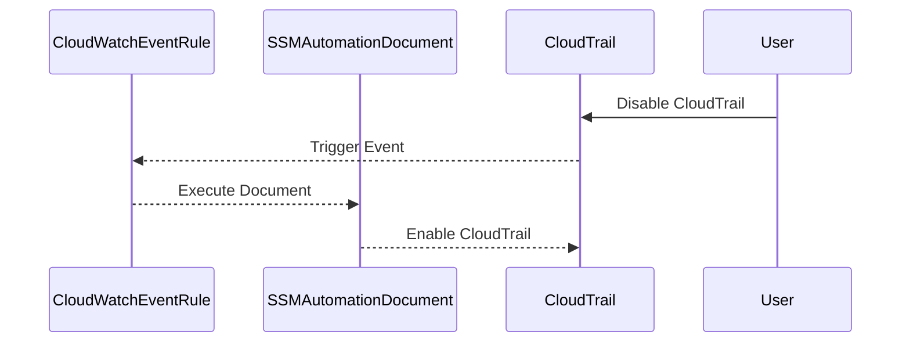

## Compliance as Code: Auto Remediation for CloudTrail Logging

### Introduction to Compliance as Code

Compliance as Code (CaC) is a DevSecOps practice that automates compliance checks and remediations using code. This approach ensures that security policies and compliance requirements are enforced consistently across environments. One critical aspect of CaC is the ability to automatically remediate violations, such as ensuring that CloudTrail logging remains enabled in an AWS environment.

### Importance of CloudTrail Logging

CloudTrail is a service provided by AWS that enables governance, compliance, operational auditing, and risk auditing of your AWS account. It logs API calls made within the AWS account and tracks changes to resources. Ensuring that CloudTrail logging is always enabled is crucial because:

- **Auditability**: It provides a record of all actions taken within the AWS account, which is essential for compliance and auditing purposes.
- **Security Monitoring**: It helps in detecting unauthorized activities and potential security threats.
- **Incident Response**: During an incident, CloudTrail logs can provide valuable information to understand what happened and how to respond.

### Configuring Auto Remediation for CloudTrail Logging

To ensure that CloudTrail logging remains enabled, we can configure auto remediation using AWS Systems Manager (SSM) Automation. This process involves setting up a rule that triggers an automation document when CloudTrail logging is disabled.

#### Step-by-Step Configuration

1. **Create a CloudWatch Event Rule**:
    - Define a CloudWatch event rule that triggers when CloudTrail logging is disabled.
    - Use the `aws.config.change` event type to monitor changes in CloudTrail settings.

2. **Configure the SSM Automation Document**:
    - Create an SSM automation document that re-enables CloudTrail logging.
    - Use the `AWS-ConfigureCloudTrailLogging` document to automate the remediation process.

3. **Set Up the Auto Remediation**:
    - Configure the CloudWatch event rule to trigger the SSM automation document.
    - Set the frequency of checks (e.g., every minute).

#### Detailed Example

Let's walk through the steps with a detailed example.

##### 1. Create a CloudWatch Event Rule

First, create a CloudWatch event rule that triggers when CloudTrail logging is disabled.

```json
{
  "ruleName": "CloudTrailDisabledRule",
  "scheduleExpression": "rate(1 minute)",
  "state": "ENABLED",
  "targets": [
    {
      "id": "EnableCloudTrail",
      "arn": "arn:aws:ssm:<region>:<account-id>:document/AWS-ConfigureCloudTrailLogging"
    }
  ]
}
```

This rule will check every minute if CloudTrail logging is disabled and trigger the SSM automation document if it is.

##### 2. Configure the SSM Automation Document

Next, create an SSM automation document that re-enables CloudTrail logging.

```yaml
---
schemaVersion: '0.3'
description: 'Enables CloudTrail logging if it is disabled.'
parameters:
  CloudTrailName:
    type: String
    description: 'The name of the CloudTrail to enable.'
mainSteps:
  - name: 'CheckCloudTrailStatus'
    action: 'aws:runCommand'
    inputs:
      DocumentName: 'AWS-RunShellScript'
      InstanceIds: ['i-0123456789abcdef0']
      Parameters:
        commands:
          - 'aws cloudtrail describe-trails --trail-name {{CloudTrailName}} | jq .trailList[0].IsLoggingEnabled'
  - name: 'EnableCloudTrail'
    action: 'aws:runCommand'
    inputs:
      DocumentName: 'AWS-RunShellScript'
      InstanceIds: ['i-0123456789abcdef0']
      Parameters:
        commands:
          - 'aws cloudtrail start-logging --name {{CloudTrailName}}'
```

This document checks the status of CloudTrail logging and starts logging if it is disabled.

##### 3. Set Up the Auto Remediation

Finally, set up the auto remediation by linking the CloudWatch event rule to the SSM automation document.

```json
{
  "ruleName": "CloudTrailDisabledRule",
  "scheduleExpression": "rate(1 minute)",
  "state": "ENABLED",
  "targets": [
    {
      "id": "EnableCloudTrail",
      "arn": "arn:aws:ssm:<region>:<account-id>:document/AWS-ConfigureCloudTrailLogging"
    }
  ]
}
```

### Mermaid Diagrams

#### CloudWatch Event Rule and SSM Automation Flow



### Real-World Examples

#### Recent Breach Example

In a recent breach, an attacker managed to disable CloudTrail logging, making it difficult to trace their activities. By implementing auto remediation, the organization could have quickly restored logging and detected the unauthorized activity.

### Common Pitfalls

1. **Incorrect Configuration**: Ensure that the CloudWatch event rule and SSM automation document are correctly configured.
2. **IAM Permissions**: Verify that the necessary IAM roles and permissions are in place to execute the SSM automation document.
3. **Frequency of Checks**: Balance the frequency of checks to avoid excessive API calls and associated costs.

### How to Prevent / Defend

#### Detection

- **CloudWatch Logs**: Monitor CloudWatch logs for events related to CloudTrail configuration changes.
- **AWS Config**: Use AWS Config to track changes in CloudTrail settings.

#### Prevention

- **IAM Policies**: Restrict IAM permissions to prevent unauthorized users from disabling CloudTrail.
- **Multi-Factor Authentication (MFA)**: Require MFA for administrative actions that involve changing CloudTrail settings.

#### Secure Coding Fixes

**Vulnerable Code**

```python
# Vulnerable code that disables CloudTrail logging
import boto3

cloudtrail = boto3.client('cloudtrail')
response = cloudtrail.stop_logging(Name='my-cloudtrail')
print(response)
```

**Secure Code**

```python
# Secure code that ensures CloudTrail logging is always enabled
import boto3

cloudtrail = boto3.client('cloudtrail')

def check_cloudtrail_status():
    response = cloudtrail.describe_trails()
    trails = response['trailList']
    for trail in trails:
        if not trail['IsLoggingEnabled']:
            print(f"CloudTrail {trail['Name']} is not enabled.")
            enable_cloudtrail(trail['Name'])

def enable_cloudtrail(trail_name):
    response = cloudtrail.start_logging(Name=trail_name)
    print(f"CloudTrail {trail_name} is now enabled.")

check_cloudtrail_status()
```

### Complete Example

#### Full HTTP Request and Response

**HTTP Request**

```http
POST / HTTP/1.1
Host: cloudtrail.amazonaws.com
Content-Type: application/json
Authorization: Bearer <access_token>

{
  "Action": "StopLogging",
  "Name": "my-cloudtrail"
}
```

**HTTP Response**

```http
HTTP/1.1 200 OK
Content-Type: application/json

{
  "ResponseMetadata": {
    "RequestId": "12345678-1234-1234-1234-1234567890ab"
  }
}
```

### Practice Labs

For hands-on experience with configuring auto remediation for CloudTrail logging, consider the following labs:

- **PortSwigger Web Security Academy**: Offers modules on AWS security and compliance.
- **OWASP Juice Shop**: Provides scenarios for practicing security configurations in a simulated environment.
- **DVWA (Damn Vulnerable Web Application)**: Useful for learning about various security practices, including compliance as code.

By following these steps and best practices, you can ensure that CloudTrail logging remains enabled and that your AWS environment remains compliant and secure.

---
<!-- nav -->
[[DevSecOps/DevSecOps Bootcamp/02-Security Governance & Compliance/02-Compliance as Code/Configure Auto Remediation for CloudTrail Logging if switched off/01-Introduction to Compliance as Code|Introduction to Compliance as Code]] | [[DevSecOps/DevSecOps Bootcamp/02-Security Governance & Compliance/02-Compliance as Code/Configure Auto Remediation for CloudTrail Logging if switched off/00-Overview|Overview]] | [[03-Compliance as Code Configuring Auto Remediation for CloudTrail Logging Part 1|Compliance as Code Configuring Auto Remediation for CloudTrail Logging Part 1]]
