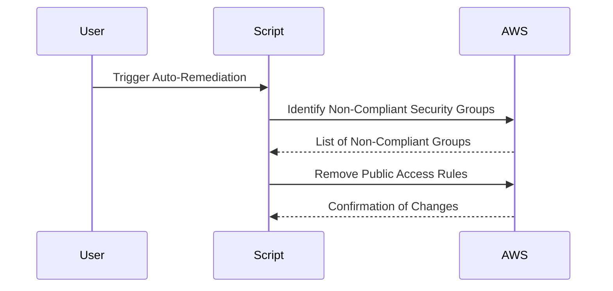

## Introduction to Compliance as Code

Compliance as Code is a DevSecOps practice that automates the enforcement of security policies and compliance requirements within infrastructure as code (IaC) environments. This approach ensures that security policies are consistently applied across all systems and configurations, reducing the risk of human error and ensuring adherence to regulatory standards. One key aspect of Compliance as Code is auto-remediation, which automatically corrects non-compliant configurations to bring them back into alignment with defined policies.

### Security Groups in AWS EC2

In Amazon Web Services (AWS), security groups act as virtual firewalls that control inbound and outbound traffic to your EC2 instances. They are stateful, meaning that if you allow incoming traffic on a specific port, the corresponding outgoing traffic is also allowed. Security groups can be attached to multiple EC2 instances, and each instance can have multiple security groups attached to it.

#### Importance of Secure Security Groups

Public access to EC2 instances via open security groups poses significant security risks. For example, if an SSH or RDP port is left open to all IP addresses (often denoted as `0.0.0.0/0`), unauthorized users could potentially gain access to the server. This is a common misconfiguration that has led to numerous breaches and vulnerabilities.

### Example Vulnerability: CVE-2021-26614

One notable example of a vulnerability related to insecure security groups is CVE-2021-26614. This vulnerability involved unsecured MongoDB databases exposed to the internet due to misconfigured security groups. Attackers exploited these misconfigurations to gain unauthorized access and steal sensitive data. This highlights the importance of properly securing security groups to prevent such incidents.

### Auto-Remediation Scripts for Security Groups

To address these issues, organizations often implement auto-remediation scripts that automatically correct non-compliant security group configurations. These scripts can be triggered by continuous monitoring tools like AWS Config Rules or custom scripts that check for specific conditions.

#### Script Examples

Here are some example scripts that can be used to enforce compliance:

1. **Closed Security Group**: Ensures that no inbound rules are set.
2. **Delete Unused Security Group**: Removes security groups that are no longer in use.
3. **Disable Public Access for Security Group**: Disables public access to critical ports like SSH and RDP.

### Disable Public Access for Security Group

Let's focus on the script that disables public access for security groups. This script checks for security groups that have inbound rules allowing access from `0.0.0.0/0` on critical ports and removes those rules.

#### Step-by-Step Mechanics

1. **Identify Non-Compliant Security Groups**:
   - Query AWS Config or use the AWS SDK to find security groups with inbound rules allowing access from `0.0.0.0/0`.
   
2. **Remove Non-Compliant Rules**:
   - For each identified security group, remove the rules that allow public access on critical ports.

3. **Automate Execution**:
   - Schedule the script to run periodically using AWS Lambda or another scheduling service.

#### Example Code

Here is a Python script that demonstrates how to identify and remove non-compliant security group rules:

```python
import boto3

def get_non_compliant_security_groups():
    ec2 = boto3.client('ec2')
    response = ec2.describe_security_groups()
    non_compliant_groups = []
    
    for sg in response['SecurityGroups']:
        for ip_permission in sg['IpPermissions']:
            for ip_range in ip_permission['IpRanges']:
                if ip_range['CidrIp'] == '0.0.0.0/0':
                    non_compliant_groups.append(sg)
                    break
    
    return non_compliant_groups

def remove_public_access_rules(security_group_id):
    ec2 = boto3.client('ec2')
    response = ec2.describe_security_groups(GroupIds=[security_group_id])
    sg = response['SecurityGroups'][0]
    
    for ip_permission in sg['IpPermissions']:
        for ip_range in ip_permission['IpRanges']:
            if ip_range['CidrIp'] == '0.0.0.0/0':
                ec2.revoke_security_group_ingress(
                    GroupId=security_group_id,
                    IpPermissions=[ip_permission]
                )
                print(f"Removed public access rule from {security_group_id}")

non_compliant_groups = get_non_compliant_security_groups()

for sg in non_compliant_groups:
    remove_public_access_rules(sg['GroupId'])
```

### Mermaid Diagrams

#### Network Topology

```mermaid
graph LR
  A[EC2 Instance] --> B[Security Group]
  B --> C[Inbound Rule (SSH)]
  B --> D[Inbound Rule (RDP)]
  E[Internet] --> C
  E --> D
```

#### Sequence Diagram



### Pitfalls and Common Mistakes

1. **Overly Broad Permissions**: Ensure that the script does not inadvertently remove necessary permissions.
2. **Concurrency Issues**: Handle concurrent executions to avoid race conditions.
3. **Testing**: Thoroughly test the script in a staging environment before deploying it to production.

### How to Prevent / Defend

#### Detection

Use AWS Config Rules to continuously monitor security group configurations. Set up alerts for any changes that violate compliance policies.

#### Prevention

1. **Secure Coding Practices**: Implement secure coding practices to ensure that security groups are configured correctly from the start.
2. **Configuration Hardening**: Harden security group configurations by limiting access to trusted IP ranges.
3. **Regular Audits**: Conduct regular audits to ensure compliance with security policies.

#### Secure-Coding Fixes

##### Vulnerable Configuration

```json
{
  "GroupId": "sg-12345678",
  "IpPermissions": [
    {
      "IpProtocol": "tcp",
      "FromPort": 22,
      "ToPort": 22,
      "IpRanges": [
        {
          "CidrIp": "0.0.0.0/0"
        }
      ]
    }
  ]
}
```

##### Fixed Configuration

```json
{
  "GroupId": "sg-12345678",
  "IpPermissions": [
    {
      "IpProtocol": "tcp",
      "FromPort": 22,
      "ToPort": 22,
      "IpRanges": [
        {
          "CidrIp": "192.168.1.0/24"
        }
      ]
    }
  ]
}
```

### Conclusion

Implementing Compliance as Code with auto-remediation scripts for security groups is crucial for maintaining a secure and compliant environment in AWS. By automating the enforcement of security policies, organizations can reduce the risk of misconfigurations and ensure that their infrastructure remains secure. Regular testing and auditing are essential to maintain the effectiveness of these measures.

### Practice Labs

For hands-on experience with Compliance as Code and auto-remediation, consider the following labs:

- **CloudGoat**: Provides a series of challenges and scenarios to practice securing AWS resources.
- **flaws.cloud**: Offers a platform to practice identifying and fixing security misconfigurations in AWS.
- **AWS Official Workshops**: Includes detailed guides and exercises to learn about AWS security best practices.

By leveraging these resources, you can gain practical experience in implementing and maintaining secure configurations in AWS.

---
<!-- nav -->
[[DevSecOps/DevSecOps Bootcamp/02-Security Governance & Compliance/02-Compliance as Code/Configure Auto Remediation for Insecure Security Groups for EC2 Instances/01-Introduction to Compliance as Code Part 1|Introduction to Compliance as Code Part 1]] | [[DevSecOps/DevSecOps Bootcamp/02-Security Governance & Compliance/02-Compliance as Code/Configure Auto Remediation for Insecure Security Groups for EC2 Instances/00-Overview|Overview]] | [[DevSecOps/DevSecOps Bootcamp/02-Security Governance & Compliance/02-Compliance as Code/Configure Auto Remediation for Insecure Security Groups for EC2 Instances/03-Introduction to Compliance as Code Part 3|Introduction to Compliance as Code Part 3]]
