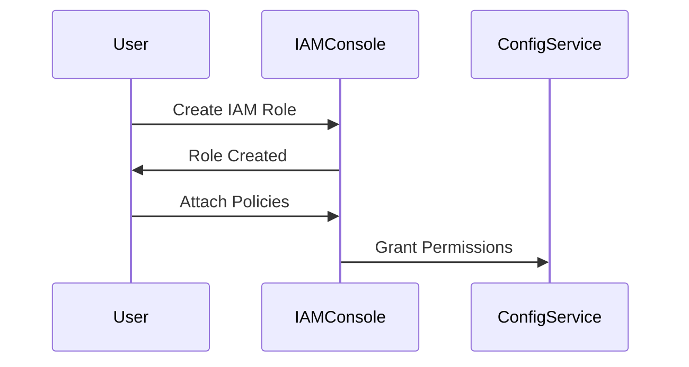

## Introduction to Compliance as Code

Compliance as Code is a practice that integrates compliance requirements into the development process through automated tools and scripts. This ensures that systems and applications meet regulatory and organizational standards consistently and efficiently. One key aspect of Compliance as Code is the ability to automatically remediate non-compliant configurations, such as insecure security groups for EC2 instances in AWS.

### Understanding Roles and Permissions in AWS

In AWS, roles are used to grant permissions to various services and resources. A role is an IAM entity that defines a set of permissions. These permissions determine what actions a service can perform within the AWS environment. For example, AWS Config requires a role with specific permissions to execute scripts and make changes to security groups.

#### Creating an IAM Role for AWS Config

To create an IAM role for AWS Config, follow these steps:

1. **Navigate to IAM Console**: Open the IAM console in the AWS Management Console.
2. **Create Role**: Click on "Roles" and then "Create role".
3. **Select Trusted Entity**: Choose "AWS service" as the trusted entity.
4. **Choose Service**: Select "Config" as the service that will use this role.
5. **Attach Policies**: Attach policies that grant the necessary permissions. For example, `AmazonEC2ReadOnlyAccess` and `AWSConfigRole`.



### Using SSM Documents for Automation

Systems Manager (SSM) is a powerful tool in AWS that allows you to automate tasks across your AWS resources. SSM documents are essentially scripts that can be executed on various resources, including EC2 instances and security groups.

#### Creating an SSM Document

To create an SSM document, follow these steps:

1. **Navigate to SSM Console**: Open the SSM console in the AWS Management Console.
2. **Create Document**: Click on "Documents" and then "Create document".
3. **Define Content**: Define the content of the document using JSON or YAML. For example, to disable public access for a security group:

```yaml
---
schemaVersion: '2.2'
description: Disable public access for security group
parameters:
  SecurityGroupId:
    type: String
    description: (Required) The ID of the security group to modify.
    default: sg-0123456789abcdef0
mainSteps:
  - action: aws:runShellScript
    name: DisablePublicAccess
    inputs:
      runCommand:
        - aws ec2 revoke-security-group-ingress --group-id $SecurityGroupId --protocol tcp --port 22 --cidr 0.0.0.0/0
```

### Automating Remediation with AWS Config

AWS Config can be configured to monitor resources and trigger remediation actions when non-compliant configurations are detected. This involves setting up rules and associating them with SSM documents.

#### Setting Up AWS Config Rules

To set up AWS Config rules, follow these steps:

1. **Navigate to Config Console**: Open the Config console in the AWS Management Console.
2. **Create Rule**: Click on "Rules" and then "Create rule".
3. **Define Rule**: Define the rule to check for non-compliant security groups. For example, a rule to check for open SSH ports:

```json
{
  "configRuleName": "securityGroupOpenSSH",
  "inputParameters": {
    "portNumber": "22"
  },
  "scope": {
    "complianceResourceTypes": [
      "AWS::EC2::SecurityGroup"
    ]
  },
  "source": {
    "owner": "AWS",
    "sourceIdentifier": "SECURITY_GROUP_OPEN_PORT"
  }
}
```

4. **Associate SSM Document**: Associate the SSM document created earlier with this rule.

### Example of Non-Compliant Security Group

Consider a scenario where an EC2 instance has a security group with an open SSH port (TCP 22) accessible from the internet (`0.0.0.0/0`). This is a common misconfiguration that can lead to unauthorized access.

#### Vulnerable Configuration

```json
{
  "IpPermissions": [
    {
      "FromPort": 22,
      "ToPort": 22,
      "IpProtocol": "tcp",
      "Ipv6Ranges": [],
      "PrefixListIds": [],
      "UserIdGroupPairs": [],
      "IpRanges": [
        {
          "CidrIp": "0.0.0.0/0"
        }
      ]
    }
  ]
}
```

#### Secure Configuration

After remediation, the security group should be updated to restrict access to a specific IP range or deny public access:

```json
{
  "IpPermissions": [
    {
      "FromPort": 22,
      "ToPort": 22,
      "IpProtocol": "tcp",
      "Ipv6Ranges": [],
      "PrefixListIds": [],
      "UserIdGroupPairs": [],
      "IpRanges": [
        {
          "CidrIp": "192.168.1.0/24"
        }
      ]
    }
  ]
}
```

### Real-World Examples and Breaches

One notable breach involving misconfigured security groups was the Capital One data breach in 2019. The attacker exploited a misconfigured AWS security group, which allowed unauthorized access to sensitive data. This highlights the importance of proper configuration and automated remediation.

### How to Prevent / Defend

#### Detection

Use AWS Config to continuously monitor security groups for non-compliant configurations. Set up rules to detect open ports and public access.

#### Prevention

1. **Automate Remediation**: Use SSM documents to automatically remediate non-compliant configurations.
2. **Secure Coding Practices**: Ensure that security groups are configured securely during the development process.
3. **Regular Audits**: Conduct regular audits to ensure compliance with organizational and regulatory standards.

#### Secure-Coding Fixes

Compare the vulnerable and secure configurations side by side:

**Vulnerable Configuration**

```json
{
  "IpPermissions": [
    {
      "FromPort": 22,
      "ToPort": 22,
      "IpProtocol": "tcp",
      "Ipv6Ranges": [],
      "PrefixListIds": [],
      "UserIdGroupPairs": [],
      "IpRanges": [
        {
          "CidrIp": "0.0.0.0/0"
        }
      ]
    }
  ]
}
```

**Secure Configuration**

```json
{
  "IpPermissions": [
    {
      "FromPort": 22,
      "ToPort": 22,
      "IpProtocol": "tcp",
      "Ipv6Ranges": [],
      "PrefixListIds": [],
      "UserIdGroupPairs": [],
      "IpRanges": [
        {
          "CidrIp": "192.168.1.0/24"
        }
      ]
    }
  ]
}
```

### Hands-On Labs

For hands-on practice with Compliance as Code and auto-remediation, consider the following labs:

- **CloudGoat**: A cloud security training platform that includes scenarios for configuring and remediating security groups.
- **flaws.cloud**: A cloud security lab that provides exercises for securing AWS resources, including EC2 instances and security groups.
- **AWS Well-Architected Labs**: Official AWS labs that cover best practices for securing and managing AWS resources.

By integrating Compliance as Code into your DevSecOps pipeline, you can ensure that your systems remain compliant and secure throughout their lifecycle.

---
<!-- nav -->
[[DevSecOps/DevSecOps Bootcamp/02-Security Governance & Compliance/02-Compliance as Code/Configure Auto Remediation for Insecure Security Groups for EC2 Instances/02-Introduction to Compliance as Code Part 2|Introduction to Compliance as Code Part 2]] | [[DevSecOps/DevSecOps Bootcamp/02-Security Governance & Compliance/02-Compliance as Code/Configure Auto Remediation for Insecure Security Groups for EC2 Instances/00-Overview|Overview]] | [[DevSecOps/DevSecOps Bootcamp/02-Security Governance & Compliance/02-Compliance as Code/Configure Auto Remediation for Insecure Security Groups for EC2 Instances/04-Introduction to Compliance as Code Part 4|Introduction to Compliance as Code Part 4]]
