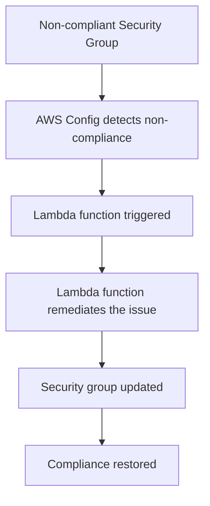

## Introduction to Compliance as Code

Compliance as Code (CaC) is an approach to automating compliance checks and enforcement within infrastructure-as-code (IaC) tools like Terraform, Ansible, or CloudFormation. This method ensures that your infrastructure adheres to predefined policies and regulations, reducing the risk of human error and ensuring consistent compliance across all environments.

### Why Compliance as Code?

In the DevSecOps paradigm, compliance is not just a one-time task but an ongoing process. Traditional methods of compliance often involve manual audits and periodic checks, which can be time-consuming and prone to errors. By integrating compliance checks directly into your IaC workflows, you can ensure that your infrastructure remains compliant at all times.

### How Compliance as Code Works

The core idea behind CaC is to define compliance policies as code and integrate them into your deployment pipelines. This allows you to automatically enforce these policies during the deployment process. If a resource violates a policy, the system can either alert you or automatically remediate the issue.

### Example Scenario: Insecure Security Groups for EC2 Instances

Let's consider a scenario where you have an EC2 instance with an insecure security group. A security group is essentially a virtual firewall that controls inbound and outbound traffic to your EC2 instances. If a security group is configured incorrectly, it can expose your instances to unauthorized access.

#### Problem Statement

Imagine you have an EC2 instance with a security group that allows SSH access from any IP address. This is a significant security risk because anyone on the internet could potentially SSH into your instance. To mitigate this risk, you can use AWS Config and AWS Lambda to automatically remediate such issues.

### Background Theory

Before diving into the specifics of configuring auto-remediation, it's important to understand the underlying concepts:

1. **AWS Config**: AWS Config is a service that enables you to assess, audit, and record changes to your AWS resources. You can use AWS Config to evaluate whether your AWS resources comply with your internal guidelines, regulatory standards, and best practices.
   
2. **AWS Lambda**: AWS Lambda is a serverless compute service that lets you run code without provisioning or managing servers. You can use Lambda functions to automate tasks, including compliance checks and remediations.

3. **Security Groups**: Security groups act as a virtual firewall for your EC2 instances, controlling inbound and outbound traffic. Each security group consists of a set of rules that specify which traffic is allowed or denied.

### Real-World Examples

Recent breaches and vulnerabilities have highlighted the importance of securing EC2 instances. For example, the 2021 SolarWinds breach involved unauthorized access to systems through misconfigured security groups. Ensuring that your security groups are properly configured can help prevent such incidents.

### Step-by-Step Configuration

To configure auto-remediation for insecure security groups, follow these steps:

1. **Define Compliance Rules**: Create a compliance rule using AWS Config to detect insecure security groups.
2. **Create a Lambda Function**: Write a Lambda function that will automatically remediate the detected issues.
3. **Integrate with AWS Config**: Configure AWS Config to trigger the Lambda function whenever a non-compliant resource is detected.

#### Define Compliance Rules

First, you need to define a compliance rule that detects insecure security groups. Here’s an example of how you can create a rule using AWS Config:

```yaml
# AWS Config Rule Definition
{
  "ConfigRuleName": "restrict-ssh-access",
  "Description": "Ensure that SSH access is restricted to specific IP addresses.",
  "Scope": {
    "ComplianceResourceTypes": [
      "AWS::EC2::SecurityGroup"
    ]
  },
  "Source": {
    "Owner": "AWS",
    "SourceIdentifier": "SECURITY_GROUP_RULES"
  },
  "InputParameters": {
    "allowedIpRanges": "192.168.1.0/24"
  }
}
```

This rule checks if the security group allows SSH access from any IP address and flags it as non-compliant if it does.

#### Create a Lambda Function

Next, you need to create a Lambda function that will automatically remediate the detected issues. Here’s an example of a Lambda function written in Python:

```python
import boto3

def lambda_handler(event, context):
    ec2 = boto3.client('ec2')
    
    # Get the list of non-compliant security groups
    non_compliant_groups = event['configItem']['resourceId']
    
    # Update the security group to restrict SSH access
    for group_id in non_compliant_groups:
        ec2.revoke_security_group_ingress(
            GroupId=group_id,
            IpPermissions=[
                {
                    'IpProtocol': 'tcp',
                    'FromPort': 22,
                    'ToPort': 22,
                    'IpRanges': [{'CidrIp': '0.0.0.0/0'}]
                }
            ]
        )
        
        ec2.authorize_security_group_ingress(
            GroupId=group_id,
            IpPermissions=[
                {
                    'IpProtocol': 'tcp',
                    'FromPort': 22,
                    'ToPort': 22,
                    'IpRanges': [{'CidrIp': '192.168.1.0/24'}]
                }
            ]
        )
```

This function revokes the existing SSH rule that allows access from any IP address and then authorizes a new rule that restricts SSH access to a specific IP range.

#### Integrate with AWS Config

Finally, you need to configure AWS Config to trigger the Lambda function whenever a non-compliant resource is detected. Here’s an example of how you can do this:

```yaml
# AWS Config Rule Definition
{
  "ConfigRuleName": "restrict-ssh-access",
  "Description": "Ensure that SSH access is restricted to specific IP addresses.",
  "Scope": {
    "ComplianceResourceTypes": [
      "AWS::EC2::SecurityGroup"
    ]
  },
  "Source": {
    "Owner": "Custom",
    "SourceIdentifier": "arn:aws:lambda:us-east-1:123456789012:function:restrict_ssh_access"
  },
  "InputParameters": {
    "allowedIpRanges": "192.168.1.0/24"
  }
}
```

This configuration tells AWS Config to trigger the `restrict_ssh_access` Lambda function whenever a non-compliant security group is detected.

### Mermaid Diagrams

Here’s a mermaid diagram showing the flow of the auto-remediation process:



### Common Pitfalls

When implementing auto-remediation, there are several common pitfalls to avoid:

1. **Overwriting Automatic Fixes**: As mentioned in the lecture, junior engineers might overwrite automatic fixes by manually editing security groups. To prevent this, you can implement strict access controls and logging mechanisms.
   
2. **Incomplete Remediation**: Ensure that your Lambda function covers all possible scenarios. For example, if you have multiple security groups, make sure the function updates all of them.

3. **False Positives/Negatives**: Ensure that your compliance rules are accurate and do not generate false positives or negatives. Regularly review and update your rules based on feedback and new compliance requirements.

### How to Prevent / Defend

To prevent and defend against insecure security groups, follow these best practices:

1. **Secure Coding Practices**: Implement secure coding practices to ensure that your infrastructure is configured correctly from the start. For example, use parameterized queries and input validation to prevent SQL injection attacks.

2. **Access Controls**: Implement strict access controls to prevent unauthorized access to your infrastructure. Use IAM roles and policies to control who can access your resources.

3. **Logging and Monitoring**: Enable logging and monitoring to detect and respond to security incidents in real-time. Use tools like AWS CloudTrail and AWS CloudWatch to monitor your infrastructure.

4. **Regular Audits**: Perform regular audits to ensure that your infrastructure remains compliant. Use tools like AWS Config and AWS Trusted Advisor to perform automated audits.

### Secure-Coding Fixes

Here’s an example of a vulnerable security group configuration and the corresponding secure configuration:

**Vulnerable Configuration**

```json
{
  "GroupId": "sg-12345678",
  "IpPermissions": [
    {
      "IpProtocol": "tcp",
      "FromPort": 22,
      "ToPort": 22,
      "IpRanges": [
        {
          "CidrIp": "0.0.0.0/0"
        }
      ]
    }
  ]
}
```

**Secure Configuration**

```json
{
  "GroupId": "sg-12345678",
  "IpPermissions": [
    {
      "IpProtocol": "tcp",
      "FromPort": 22,
      "ToPort": 22,
      "IpRanges": [
        {
          "CidrIp": "192.168.1.0/24"
        }
      ]
    }
  ]
}
```

### Complete Example

Here’s a complete example of how you can configure auto-remediation for insecure security groups:

#### Full HTTP Request and Response

**HTTP Request**

```http
POST /aws-config/rules/restrict-ssh-access HTTP/1.1
Host: config.amazonaws.com
Content-Type: application/json

{
  "ConfigRuleName": "restrict-ssh-access",
  "Description": "Ensure that SSH access is restricted to specific IP addresses.",
  "Scope": {
    "ComplianceResourceTypes": [
      "AWS::EC2::SecurityGroup"
    ]
  },
  "Source": {
    "Owner": "Custom",
    "SourceIdentifier": "arn:aws:lambda:us-east-1:123456789012:function:restrict_ssh_access"
  },
  "InputParameters": {
    "allowedIpRanges": "192.168.1.0/24"
  }
}
```

**HTTP Response**

```http
HTTP/1.1 200 OK
Content-Type: application/json

{
  "ConfigRuleArn": "arn:aws:config:us-east-1:123456789012:config-rule/restrict-ssh-access",
  "ConfigRuleId": "cr-1234567890abcdef",
  "ConfigRuleName": "restrict-ssh-access",
  "Description": "Ensure that SSH access is restricted to specific IP addresses.",
  "Scope": {
    "ComplianceResourceTypes": [
      "AWS::EC2::SecurityGroup"
    ]
  },
  "Source": {
    "Owner": "Custom",
    "SourceIdentifier": "arn:aws:lambda:us-east-1:123456789012:function:restrict_ssh_access"
  },
  "InputParameters": {
    "allowedIpRanges": "192.168.1.0/24"
  }
}
```

#### Full Policy/Config File

**IAM Policy JSON**

```json
{
  "Version": "2012-10-17",
  "Statement": [
    {
      "Effect": "Allow",
      "Action": [
        "config:PutEvaluations",
        "logs:CreateLogGroup",
        "logs:CreateLogStream",
        "logs:PutLogEvents"
      ],
      "Resource": "*"
    }
  ]
}
```

**Lambda Function Code**

```python
import boto3

def lambda_handler(event, context):
    ec2 = boto3.client('ec2')
    
    # Get the list of non-compliant security groups
    non_compliant_groups = event['configItem']['resourceId']
    
    # Update the security group to restrict SSH access
    for group_id in non_compliant_groups:
        ec2.revoke_security_group_ingress(
            GroupId=group_id,
            IpPermissions=[
                {
                    'IpProtocol': 'tcp',
                    'FromPort': 22,
                    'ToPort': 22,
                    'IpRanges': [{'CidrIp': '0.0.0.0/0'}]
                }
            ]
        )
        
        ec2.authorize_security_group_ingress(
            GroupId=group_id,
            IpPermissions=[
                {
                    'IpProtocol': 'tcp',
                    'FromPort': 22,
                    'ToPort': 22,
                    'IpRanges': [{'CidrIp': '192.168.1.0/24'}]
                }
            ]
        )
```

### Expected Result/Output

After configuring the auto-remediation process, you should see the following:

1. **AWS Config Rule Created**: The `restrict-ssh-access` rule is created and configured to trigger the Lambda function.
2. **Lambda Function Triggered**: Whenever a non-compliant security group is detected, the Lambda function is triggered and updates the security group to restrict SSH access.
3. **Compliance Restored**: The security group is updated to restrict SSH access, and the compliance status is restored.

### Practice Labs

To practice configuring auto-remediation for insecure security groups, you can use the following labs:

- **CloudGoat**: A cloud security training platform that includes labs for configuring AWS Config and Lambda functions.
- **flaws.cloud**: A cloud security training platform that includes labs for configuring AWS Config and Lambda functions.
- **AWS Official Workshops**: AWS provides official workshops that cover various aspects of DevSecOps, including compliance as code.

By following these steps and practicing with real-world examples, you can ensure that your infrastructure remains compliant and secure.

---
<!-- nav -->
[[05-Introduction to Compliance as Code Part 5|Introduction to Compliance as Code Part 5]] | [[DevSecOps/DevSecOps Bootcamp/02-Security Governance & Compliance/02-Compliance as Code/Configure Auto Remediation for Insecure Security Groups for EC2 Instances/00-Overview|Overview]] | [[07-Introduction to Compliance as Code|Introduction to Compliance as Code]]
