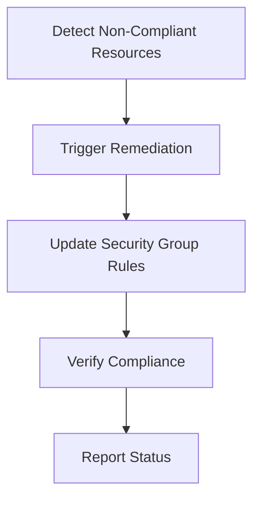

## Introduction to Compliance as Code

Compliance as Code is a DevSecOps practice that automates the enforcement of compliance policies within an organization’s infrastructure. This approach ensures that systems adhere to regulatory requirements and internal policies through automated checks and remediations. One of the key areas where Compliance as Code is applied is in managing AWS security groups for EC2 instances. Security groups act as virtual firewalls that control inbound and outbound traffic to EC2 instances, making them critical for maintaining the security posture of an environment.

### Why Compliance as Code Matters

In today’s dynamic cloud environments, manual management of security configurations becomes impractical and error-prone, especially in large-scale infrastructures. Compliance as Code allows organizations to:

- **Automate Policy Enforcement**: Ensure that all resources comply with predefined security policies.
- **Continuous Monitoring**: Continuously monitor and enforce compliance across all resources.
- **Scalability**: Handle large numbers of resources efficiently without manual intervention.
- **Consistency**: Maintain consistent security configurations across different environments.

### AWS Config and Security Groups

AWS Config is a service that enables you to assess, audit, and evaluate the configurations of your AWS resources. It provides a detailed view of your resources’ configurations and helps you maintain compliance with internal standards and external regulations.

Security groups are a fundamental component of AWS security. They define rules that allow or deny inbound and outbound traffic to EC2 instances. Non-compliant security groups can expose your instances to unauthorized access, leading to potential security breaches.

### Example Scenario: Non-Compliant Security Groups

Consider a scenario where an organization has hundreds of EC2 instances, each with its own set of security groups. A recent audit reveals that several security groups are configured to allow unrestricted access from the internet, which violates the organization’s security policy.

#### Manual Fixing

For a small setup, you might manually inspect and fix these non-compliant security groups. For example, you could restrict access to specific IP addresses or remove unnecessary rules.

```python
# Example of manually updating a security group using Boto3
import boto3

ec2 = boto3.resource('ec2')
security_group = ec2.SecurityGroup('sg-0123456789abcdef0')

# Remove a rule that allows all inbound traffic
security_group.revoke_ingress(IpPermissions=[{'IpProtocol': '-1', 'IpRanges': [{'CidrIp': '0.0.0.0/0'}]}])

# Add a rule to allow SSH access only from a specific IP
security_group.authorize_ingress(IpPermissions=[{'IpProtocol': 'tcp', 'FromPort': 22, 'ToPort': 22, 'IpRanges': [{'CidrIp': '192.168.1.1/32'}]}])
```

However, this approach becomes impractical in large-scale environments.

### Automated Remediation

Automated remediation involves setting up processes that automatically identify and fix non-compliant resources. This ensures that your environment remains secure even as new resources are added or existing ones are modified.

#### Using AWS Config Rules

AWS Config Rules can be used to automatically detect non-compliant resources. Once detected, you can trigger automated actions to remediate these issues.

```yaml
# Example AWS Config Rule to detect non-compliant security groups
{
  "ConfigRuleName": "restrict-inbound-access",
  "Description": "Checks that security groups do not allow unrestricted inbound access.",
  "Scope": {
    "ComplianceResourceTypes": ["AWS::EC2::SecurityGroup"]
  },
  "Source": {
    "Owner": "AWS",
    "SourceIdentifier": "SECURITY_GROUP_UNRESTRICTED_INBOUND"
  }
}
```

### Real-World Example: Recent Breach

A recent breach at a major cloud service provider highlighted the importance of automated compliance monitoring. The breach occurred due to misconfigured security groups that allowed unrestricted access to sensitive data. The provider had to manually inspect and fix these configurations, which took significant time and resources.

#### How to Prevent / Defend

To prevent such breaches, organizations should implement automated compliance monitoring and remediation. Here’s how you can set up an automated system to detect and fix non-compliant security groups:

1. **Define Compliance Policies**: Define clear policies for security group configurations.
2. **Set Up AWS Config Rules**: Create Config Rules to detect non-compliant resources.
3. **Automate Remediation**: Set up automated actions to fix detected issues.

```yaml
# Example AWS Config Rule to detect non-compliant security groups
{
  "ConfigRuleName": "restrict-inbound-access",
  "Description": "Checks that security groups do not allow unrestricted inbound access.",
  "Scope": {
    "ComplianceResourceTypes": ["AWS::EC2::SecurityGroup"]
  },
  "Source": {
    "Owner": "AWS",
    "SourceIdentifier": "SECURITY_GROUP_UNRESTRICTED_INBOUND"
  }
}
```

### Automated Remediation Workflow

The following diagram illustrates the workflow for automated remediation of non-compliant security groups:



### Detailed Steps for Automated Remediation

1. **Detect Non-Compliant Resources**:
   - Use AWS Config to scan for non-compliant security groups.
   - Identify security groups that allow unrestricted inbound access.

2. **Trigger Remediation**:
   - Set up AWS Lambda functions to trigger remediation actions.
   - Use AWS CloudFormation to manage the deployment of these functions.

3. **Update Security Group Rules**:
   - Use Boto3 to programmatically update security group rules.
   - Restrict access to specific IP addresses or remove unnecessary rules.

4. **Verify Compliance**:
   - Re-run AWS Config checks to ensure compliance.
   - Generate reports to document the remediation process.

5. **Report Status**:
   - Send notifications to stakeholders regarding the status of remediation.
   - Log all actions for auditing purposes.

### Example Code for Automated Remediation

Here’s an example of how you can automate the remediation process using Python and Boto3:

```python
import boto3

def remediate_security_groups():
    ec2 = boto3.client('ec2')
    response = ec2.describe_security_groups()

    for sg in response['SecurityGroups']:
        for ip_permission in sg['IpPermissions']:
            if ip_permission['IpRanges'] and ip_permission['IpRanges'][0]['CidrIp'] == '0.0.0.0/0':
                print(f"Found non-compliant security group: {sg['GroupId']}")
                ec2.revoke_security_group_ingress(
                    GroupId=sg['GroupId'],
                    IpPermissions=[ip_permission]
                )
                print(f"Revoked rule for security group: {sg['GroupId']}")

remediate_security_groups()
```

### Common Pitfalls and Best Practices

1. **Testing and Validation**:
   - Thoroughly test automated remediation scripts in a staging environment before deploying them in production.
   - Validate that the scripts do not inadvertently lock out legitimate access.

2. **Monitoring and Logging**:
   - Implement comprehensive logging to track all remediation actions.
   - Monitor the environment for any unexpected behavior post-remediation.

3. **Regular Audits**:
   - Conduct regular audits to ensure ongoing compliance.
   - Update compliance policies as needed to reflect changing regulatory requirements.

### Conclusion

Implementing Compliance as Code for managing AWS security groups is essential for maintaining a secure and compliant environment. By automating the detection and remediation of non-compliant resources, organizations can significantly reduce the risk of security breaches and ensure continuous compliance with internal and external policies.

### Practice Labs

For hands-on experience with Compliance as Code, consider the following labs:

- **CloudGoat**: A cloud security training platform that includes scenarios for managing AWS security groups.
- **flaws.cloud**: A cloud security training platform that provides real-world scenarios for securing AWS environments.
- **AWS Well-Architected Labs**: Official AWS labs that cover various aspects of cloud security, including compliance.

These labs provide practical experience in setting up and managing automated compliance monitoring and remediation in AWS environments.

---
<!-- nav -->
[[06-Introduction to Compliance as Code Part 6|Introduction to Compliance as Code Part 6]] | [[DevSecOps/DevSecOps Bootcamp/02-Security Governance & Compliance/02-Compliance as Code/Configure Auto Remediation for Insecure Security Groups for EC2 Instances/00-Overview|Overview]] | [[08-Compliance as Code Configuring Auto Remediation for Insecure Security Groups for EC2 Instances Part 1|Compliance as Code Configuring Auto Remediation for Insecure Security Groups for EC2 Instances Part 1]]
