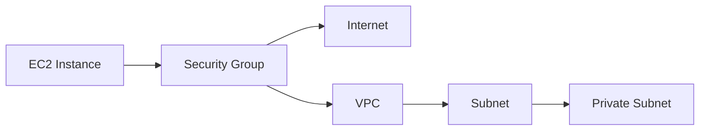
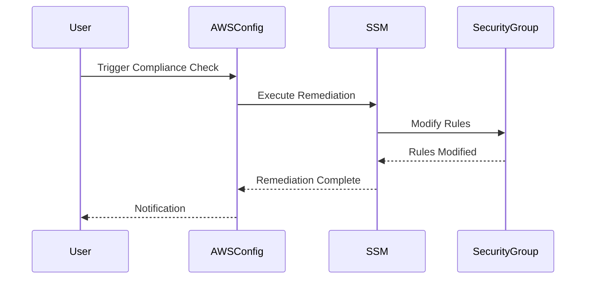

## Compliance as Code: Configuring Auto Remediation for Insecure Security Groups for EC2 Instances

### Background Theory

Compliance as Code (CaC) is a practice that integrates compliance requirements into the development lifecycle through automation. This approach ensures that infrastructure and applications adhere to regulatory standards and internal policies. One key aspect of CaC is the ability to automatically remediate non-compliant resources, reducing the risk of security vulnerabilities and ensuring continuous compliance.

In the context of AWS, Security Groups are virtual firewalls that control inbound and outbound traffic to your EC2 instances. Ensuring these Security Groups are configured securely is critical for maintaining the integrity and confidentiality of your resources. Automated remediation allows you to correct misconfigurations without manual intervention, thereby enhancing security and operational efficiency.

### Creating an IAM Role for SSM Service

To enable automatic remediation of non-compliant Security Groups, we need to create an IAM role that grants the necessary permissions to the Systems Manager (SSM) service. This role will allow SSM to modify Security Group rules as needed.

#### Step-by-Step Process

1. **Navigate to IAM Service**:
    - Log in to the AWS Management Console.
    - Navigate to the Identity and Access Management (IAM) service.

2. **Create a New Role**:
    - Click on "Roles" in the left-hand menu.
    - Click on "Create role".
    - Select "AWS service" as the trusted entity.
    - Choose "EC2" as the service that will use this role.
    - Click "Next: Permissions".

3. **Attach Custom Policy**:
    - Instead of using an AWS managed policy, we will create a custom policy.
    - Click "Next: Tags".
    - Add any tags as required.
    - Click "Next: Review".

4. **Review and Create Role**:
    - Provide a name for the role, such as `SSM-SecurityGroup-Remediation`.
    - Review the details and click "Create role".

### Defining the Custom Policy

The custom policy will specify the permissions required for the SSM service to modify Security Group rules. This policy will be attached to the IAM role created earlier.

#### Step-by-Step Process

1. **Create a New Policy**:
    - In the IAM console, navigate to "Policies".
    - Click on "Create policy".
    - Click on "JSON" to edit the policy in JSON format.

2. **Define the Policy Document**:
    - The policy document should grant the necessary permissions to modify Security Group rules. Here is an example policy:

```json
{
    "Version": "2012-10-17",
    "Statement": [
        {
            "Effect": "Allow",
            "Action": [
                "ec2:AuthorizeSecurityGroupIngress",
                "ec2:RevokeSecurityGroupIngress",
                "ec2:AuthorizeSecurityGroupEgress",
                "ec2:RevokeSecurityGroupEgress"
            ],
            "Resource": "*"
        }
    ]
}
```

This policy allows the SSM service to authorize and revoke ingress and egress rules for Security Groups.

3. **Attach the Policy to the Role**:
    - After creating the policy, attach it to the IAM role `SSM-SecurityGroup-Remediation`.

### Enabling Auto Remediation

Once the IAM role and custom policy are set up, you can configure AWS Config to automatically remediate non-compliant Security Groups.

#### Step-by-Step Process

1. **Navigate to AWS Config**:
    - In the AWS Management Console, navigate to the AWS Config service.

2. **Enable Auto Remediation**:
    - Click on "Remediation" in the left-hand menu.
    - Click on "Add rule".
    - Search for a rule that checks for insecure Security Group configurations, such as `SECURITYGROUP_OPEN_ALL_PORTS`.
    - Configure the rule to use the IAM role `SSM-SecurityGroup-Remediation` for remediation.

3. **Configure the Rule Parameters**:
    - Set the parameters for the rule, such as the maximum number of open ports allowed.
    - Enable the rule to automatically remediate non-compliant resources.

### Example of Auto Remediation in Action

Consider a scenario where an EC2 instance has a Security Group that allows all inbound traffic on all ports. This configuration is insecure and violates compliance policies. With auto remediation enabled, AWS Config will automatically close unnecessary ports and restrict access to only the required ports.

#### Example Configuration

Here is an example of how the Security Group might be configured before and after auto remediation:

**Before Auto Remediation:**

```json
{
    "GroupId": "sg-0123456789abcdef0",
    "IpPermissions": [
        {
            "IpProtocol": "-1",
            "FromPort": -1,
            "ToPort": -1,
            "UserIdGroupPairs": [],
            "IpRanges": [
                {
                    "CidrIp": "0.0.0.0/0"
                }
            ]
        }
    ]
}
```

**After Auto Remediation:**

```json
{
    "GroupId": "sg-0123456789abcdef0",
    "IpPermissions": [
        {
            "IpProtocol": "tcp",
            "FromPort": 22,
            "ToPort": 22,
            "UserIdGroupPairs": [],
            "IpRanges": [
                {
                    "CidrIp": "10.0.0.0/24"
                }
            ]
        },
        {
            "IpProtocol": "tcp",
            "FromPort": 80,
            "ToPort": 80,
            "UserIdGroupPairs": [],
            "IpRanges": [
                {
                    "CidrIp": "0.0.0.0/0"
                }
            ]
        }
    ]
}
```

### How to Prevent / Defend

#### Detection

To detect insecure Security Group configurations, you can use AWS Config to continuously monitor and audit your resources. Additionally, you can use tools like AWS Trusted Advisor to identify potential security issues.

#### Prevention

1. **Use IAM Roles and Policies**: Ensure that IAM roles and policies are correctly configured to limit permissions to only what is necessary.
2. **Automate Compliance Checks**: Use AWS Config and AWS Lambda to automate compliance checks and remediation.
3. **Regular Audits**: Conduct regular audits of your Security Groups to ensure they comply with your organization's security policies.

#### Secure Coding Fixes

Here is an example of how to secure the configuration of a Security Group using AWS SDK:

**Vulnerable Code:**

```python
import boto3

ec2 = boto3.resource('ec2')
security_group = ec2.SecurityGroup('sg-0123456789abcdef0')

# Open all ports to all IP addresses
security_group.authorize_ingress(
    IpProtocol="-1",
    FromPort=-1,
    ToPort=-1,
    CidrIp="0.0.0.0/0"
)
```

**Secure Code:**

```python
import boto3

ec2 = boto3.resource('ec2')
security_group = ec2.SecurityGroup('sg-0123456789abcdef0')

# Restrict SSH access to a specific subnet
security_group.authorize_ingress(
    IpProtocol="tcp",
    FromPort=22,
    ToPort=22,
    CidrIp="10.0.0.0/24"
)

# Allow HTTP access from anywhere
security_group.authorize_ingress(
    IpProtocol="tcp",
    FromPort=80,
    ToPort=80,
    CidrIp="0.0.0.0/0"
)
```

### Real-World Examples

#### Recent Breaches and CVEs

One notable breach involving insecure Security Group configurations is the Capital One data breach in 2019. The attacker exploited misconfigured Security Groups to gain unauthorized access to sensitive customer data. This breach highlights the importance of securing Security Groups and implementing auto remediation to prevent such incidents.

### Mermaid Diagrams

#### Network Topology



#### Request/Response Flow



### Practice Labs

For hands-on experience with configuring auto remediation for Security Groups, consider the following labs:

- **CloudGoat**: A cloud security training platform that includes scenarios for securing and remediating Security Groups.
- **flaws.cloud**: A cloud security lab that provides exercises for configuring and auditing Security Groups.
- **AWS Official Workshops**: AWS offers various workshops and labs that cover compliance and security best practices, including auto remediation.

By following these steps and best practices, you can ensure that your Security Groups are configured securely and automatically remediated to maintain compliance and enhance security.

---
<!-- nav -->
[[07-Introduction to Compliance as Code|Introduction to Compliance as Code]] | [[DevSecOps/DevSecOps Bootcamp/02-Security Governance & Compliance/02-Compliance as Code/Configure Auto Remediation for Insecure Security Groups for EC2 Instances/00-Overview|Overview]] | [[09-Compliance as Code Configuring Auto Remediation for Insecure Security Groups for EC2 Instances Part 2|Compliance as Code Configuring Auto Remediation for Insecure Security Groups for EC2 Instances Part 2]]
