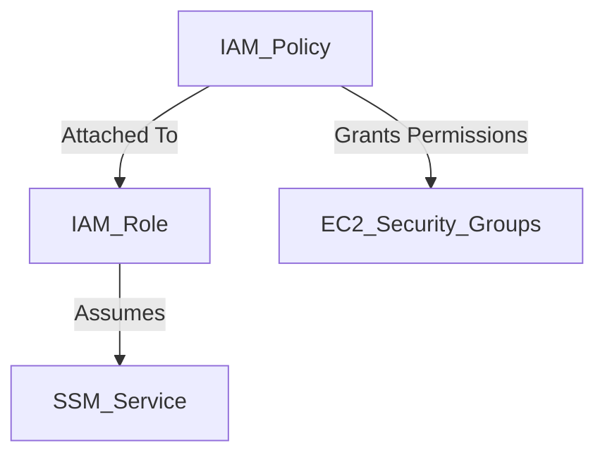
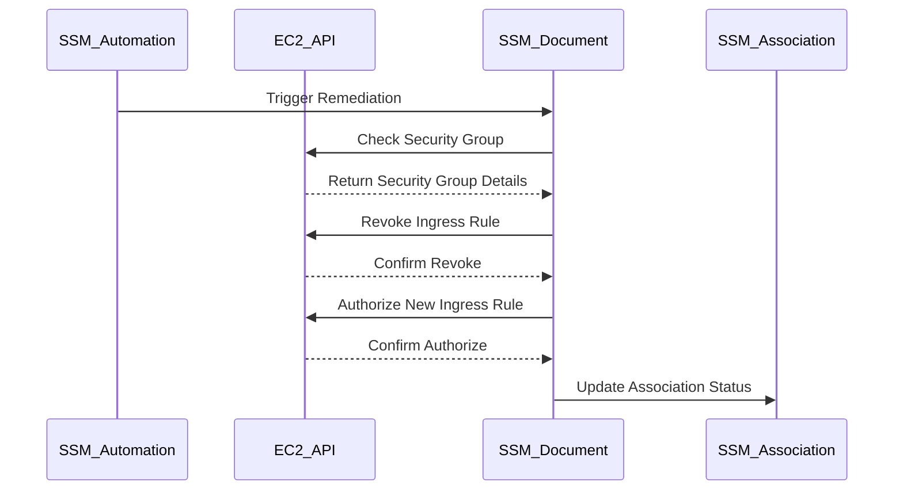

## Compliance as Code: Configuring Auto Remediation for Insecure Security Groups for EC2 Instances

### Background Theory

Compliance as Code (CaC) is an approach to ensuring that infrastructure and applications adhere to compliance requirements through automated, code-based mechanisms. This method leverages Infrastructure as Code (IaC) principles to define and enforce policies that govern the configuration of cloud resources. One critical aspect of CaC is the ability to automatically remediate non-compliant configurations, such as insecure security groups for EC2 instances.

Security groups in Amazon EC2 act as virtual firewalls that control inbound and outbound traffic to your instances. They are stateful, meaning that if you allow incoming traffic on a port, the corresponding outgoing traffic is also allowed. However, misconfigured security groups can expose your instances to unauthorized access, leading to potential security breaches.

### Setting Up Auto Remediation

To configure auto-remediation for insecure security groups, we need to set up AWS Systems Manager (SSM) to manage the process. SSM provides a way to automate tasks and maintain compliance across your AWS environment.

#### Step 1: Create a Policy for SSM

The first step is to create an IAM policy that grants SSM the necessary permissions to modify security groups. This policy will be attached to an IAM role that SSM assumes to perform the remediation actions.

```json
{
    "Version": "2012-10-17",
    "Statement": [
        {
            "Effect": "Allow",
            "Action": [
                "ec2:AuthorizeSecurityGroupIngress",
                "ec2:RevokeSecurityGroupIngress",
                "ec2:DescribeSecurityGroups"
            ],
            "Resource": "*"
        },
        {
            "Effect": "Allow",
            "Action": [
                "ssm:CreateAssociation",
                "ssm:DeleteAssociation",
                "ssm:GetAssociation",
                "ssm:ListAssociations",
                "ssm:UpdateAssociation"
            ],
            "Resource": "*"
        }
    ]
}
```

This policy includes permissions for EC2 actions related to security groups and SSM actions required to manage associations.

#### Step 2: Create an IAM Role for SSM

Next, we create an IAM role that SSM can assume to perform the remediation actions. This role should have the trust relationship set up to allow SSM to assume it.

```json
{
    "Version": "2012-10-17",
    "Statement": [
        {
            "Effect": "Allow",
            "Principal": {
                "Service": "ssm.amazonaws.com"
            },
            "Action": "sts:AssumeRole"
        }
    ]
}
```

#### Step 3: Attach the Policy to the Role

After creating the role, we attach the previously created policy to it. This ensures that SSM has the necessary permissions to modify security groups.

```json
{
    "Version": "2012-08-10",
    "Statement": [
        {
            "Sid": "VisualEditor0",
            "Effect": "Allow",
            "Action": [
                "ec2:AuthorizeSecurityGroupIngress",
                "ec2:RevokeSecurityGroupIngress",
                "ec2:DescribeSecurityGroups",
                "ssm:CreateAssociation",
                "ssm:DeleteAssociation",
                "ssm:GetAssociation",
                "ssm:ListAssociations",
                "ssm:UpdateAssociation"
            ],
            "Resource": "*"
        }
    ]
}
```

### Configuring Auto Remediation

Once the policy and role are set up, we can configure SSM to automatically remediate non-compliant security groups.

#### Step 1: Define the Remediation Action

We define a remediation action using SSM Automation. This action specifies the steps to take when a non-compliant security group is detected.

```yaml
---
description: "Remediate Insecure Security Groups"
schemaVersion: '0.3'
parameters:
  SecurityGroupId:
    type: String
    description: "ID of the security group to remediate"
mainSteps:
  - name: "CheckSecurityGroup"
    action: "aws:runCommand"
    inputs:
      DocumentName: "AWS-RunShellScript"
      InstanceIds: ["i-0123456789abcdef0"]
      Parameters:
        commands:
          - "aws ec2 describe-security-groups --group-ids {{ SecurityGroupId }}"
  - name: "RemediateSecurityGroup"
    action: "aws:runCommand"
    inputs:
      DocumentName: "AWS-RunShellScript"
      InstanceIds: ["i-0123456789abcdef0"]
      Parameters:
        commands:
          - "aws ec2 revoke-security-group-ingress --group-id {{ SecurityGroupId }} --protocol tcp --port 22 --cidr 0.0.0.0/0"
          - "aws ec2 authorize-security-group-ingress --group-id {{ SecurityGroupId }} --protocol tcp --port 22 --cidr 10.0.0.0/24"
```

#### Step 2: Create an SSM Association

We create an SSM association that triggers the remediation action based on a specific condition, such as a non-compliant security group being detected.

```json
{
    "Name": "RemediateInsecureSecurityGroups",
    "DocumentVersion": "$LATEST",
    "Targets": [
        {
            "Key": "tag:Environment",
            "Values": ["Production"]
        }
    ],
    "ScheduleExpression": "cron(0 2 * * ? *)",
    "Parameters": {
        "SecurityGroupId": ["sg-0123456789abcdef0"]
    },
    "OutputLocation": {
        "S3Location": {
            "OutputS3BucketName": "my-bucket",
            "OutputS3KeyPrefix": "ssm/remediation"
        }
    }
}
```

### Mermaid Diagrams

#### IAM Role and Policy Relationship



#### SSM Automation Workflow



### Real-World Examples

#### Recent Breach Example

A recent breach at a major financial institution was traced back to an insecure security group that allowed unrestricted SSH access from the internet. The attackers exploited this misconfiguration to gain initial access to the network and then moved laterally to compromise sensitive systems.

#### Secure Configuration Example

To prevent such breaches, the following secure configuration ensures that SSH access is restricted to a trusted IP range:

```json
{
    "IpPermissions": [
        {
            "IpProtocol": "tcp",
            "FromPort": 22,
            "ToPort": 22,
            "IpRanges": [
                {
                    "CidrIp": "10.0.0.0/24"
                }
            ]
        }
    ]
}
```

### How to Prevent / Defend

#### Detection

Regularly audit security groups to ensure they are configured securely. Use AWS Config rules to monitor for non-compliant security groups.

```json
{
    "ConfigRuleName": "SecurityGroupOpenToWorld",
    "Description": "Checks for security groups that allow unrestricted access.",
    "Scope": {
        "ComplianceResourceTypes": [
            "AWS::EC2::SecurityGroup"
        ]
    },
    "Source": {
        "Owner": "AWS",
        "SourceIdentifier": "SECURITY_GROUP_OPEN_TO_WORLD"
    }
}
```

#### Prevention

Implement strict security group policies that limit access to trusted sources. Use SSM Automation to automatically remediate non-compliant configurations.

#### Secure Coding Fixes

Compare the vulnerable and secure versions of a security group configuration:

**Vulnerable Configuration:**

```json
{
    "IpPermissions": [
        {
            "IpProtocol": "tcp",
            "FromPort": 22,
            "ToPort": 22,
            "IpRanges": [
                {
                    "CidrIp": "0.0.0.0/0"
                }
            ]
        }
    ]
}
```

**Secure Configuration:**

```json
{
    "IpPermissions": [
        {
            "IpProtocol": "tcp",
            "FromPort": 22,
            "ToPort": 22,
            "IpRanges": [
                {
                    "CidrIp": "10.0.0.0/24"
                }
            ]
        }
    ]
}
```

### Hands-On Labs

For practical experience with configuring auto-remediation for insecure security groups, consider the following labs:

- **CloudGoat**: A cloud security training platform that includes scenarios for securing EC2 instances and their associated security groups.
- **flaws.cloud**: A cloud security training platform that provides hands-on exercises for identifying and remediating security group misconfigurations.

These labs provide a controlled environment to practice and reinforce the concepts covered in this chapter.

### Conclusion

By implementing Compliance as Code and configuring auto-remediation for insecure security groups, organizations can significantly reduce the risk of security breaches caused by misconfigured cloud resources. Regular audits, strict policies, and automated remediation are key components of a robust security strategy in the cloud.

---
<!-- nav -->
[[08-Compliance as Code Configuring Auto Remediation for Insecure Security Groups for EC2 Instances Part 1|Compliance as Code Configuring Auto Remediation for Insecure Security Groups for EC2 Instances Part 1]] | [[DevSecOps/DevSecOps Bootcamp/02-Security Governance & Compliance/02-Compliance as Code/Configure Auto Remediation for Insecure Security Groups for EC2 Instances/00-Overview|Overview]] | [[10-Compliance as Code Configuring Auto Remediation for Insecure Security Groups for EC2 Instances|Compliance as Code Configuring Auto Remediation for Insecure Security Groups for EC2 Instances]]
