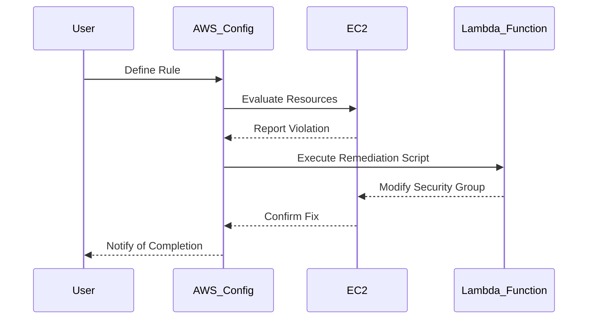

## Compliance as Code: Configuring Auto Remediation for Insecure Security Groups for EC2 Instances

### Introduction to Compliance as Code

Compliance as Code is a practice that leverages automation and infrastructure-as-code principles to ensure that systems and applications comply with regulatory requirements and internal policies. This approach helps organizations maintain consistent compliance across their environments, reducing the risk of non-compliance and associated penalties.

In the context of AWS, Compliance as Code can be implemented using AWS Config, which provides a way to assess, audit, and record the configurations of your AWS resources. One of the key features of AWS Config is the ability to perform automatic remediation, which can help maintain compliance by automatically fixing issues that arise.

### Automatic Remediation Overview

Automatic remediation is a feature within AWS Config that allows you to automatically correct non-compliant resources. This is particularly useful for maintaining compliance with security policies, such as ensuring that EC2 instances are not exposed to the internet through overly permissive security groups.

#### How Automatic Remediation Works

When you enable automatic remediation, AWS Config will periodically check the state of your resources against defined rules. If a resource violates a rule, AWS Config can automatically run a script to correct the issue. This process includes:

1. **Rule Evaluation**: AWS Config evaluates the state of your resources against defined rules.
2. **Remediation Execution**: If a violation is detected, AWS Config triggers the execution of a remediation script.
3. **Retry Mechanism**: If the initial remediation attempt fails, AWS Config can retry the remediation process according to configured parameters.

#### Cost Considerations

It's important to note that executing remediation scripts incurs costs. Each time a script runs, AWS charges for the execution. In a small setup, this might not be significant, but in larger environments with many resources being scanned and remediated, the costs can add up. As an administrator, you should be aware of these costs when configuring AWS Config with auto remediation.

### Configuring Automatic Remediation

To configure automatic remediation for insecure security groups for EC2 instances, follow these steps:

#### Step 1: Define the Rule

First, you need to define a rule that checks for insecure security groups. This can be done using AWS Config managed rules or custom rules.

```yaml
# Example of a managed rule for EC2 security groups
{
  "ConfigRuleName": "ec2-security-group-restrict-ssh-ingress",
  "Description": "Checks whether SSH ingress is restricted to trusted IP addresses.",
  "Scope": {
    "ComplianceResourceTypes": [
      "AWS::EC2::SecurityGroup"
    ]
  },
  "Source": {
    "Owner": "AWS",
    "SourceIdentifier": "SECURITY_GROUP_RESTRICSSH_INGRESS"
  }
}
```

#### Step 2: Enable Automatic Remediation

Once the rule is defined, you can enable automatic remediation. This involves specifying how often the remediation script should be retried if it fails initially.

```yaml
# Example of enabling automatic remediation
{
  "ConfigRuleName": "ec2-security-group-restrict-ssh-ingress",
  "MaximumExecutionFrequency": "One_Hour",
  "RemediationConfiguration": {
    "Automatic": true,
    "Parameters": {
      "ActionId": "AWS_EC2_SecurityGroupRestrictSSHIngress",
      "TargetType": "AWS::EC2::SecurityGroup"
    },
    "RetryAttemptSeconds": 60,
    "MaxErrorCount": 2
  }
}
```

In this example, the remediation script will be retried up to two times, with a 60-second interval between retries.

### Remediation Action Details

When configuring automatic remediation, you need to specify the remediation action details. AWS provides predefined actions that you can choose from, which simplifies the process of creating remediation scripts.

#### Predefined Actions

AWS offers several predefined actions that can be used for remediation. These actions are designed to address common compliance issues and can be selected based on the specific resource type and the desired outcome.

For example, the `AWS_EC2_SecurityGroupRestrictSSHIngress` action restricts SSH access to trusted IP addresses. You can select this action when configuring the remediation for EC2 security groups.

### Example of a Remediation Script

While AWS provides predefined actions, you may also need to create custom remediation scripts. Here’s an example of a custom script that restricts SSH access to a specific IP address:

```python
import boto3

def lambda_handler(event, context):
    ec2 = boto3.client('ec2')
    
    # Get the security group ID from the event
    security_group_id = event['detail']['requestParameters']['groupId']
    
    # Remove existing SSH rule
    response = ec2.describe_security_groups(GroupIds=[security_group_id])
    for rule in response['SecurityGroups'][0]['IpPermissions']:
        if rule['IpProtocol'] == 'tcp' and rule['FromPort'] == 22 and rule['ToPort'] == 22:
            ec2.revoke_security_group_ingress(
                GroupId=security_group_id,
                IpPermissions=[rule]
            )
    
    # Add new SSH rule with restricted IP
    ec2.authorize_security_group_ingress(
        GroupId=security_group_id,
        IpPermissions=[
            {
                'IpProtocol': 'tcp',
                'FromPort': 22,
                'ToPort': 22,
                'IpRanges': [{'CidrIp': '192.168.1.1/32'}]
            }
        ]
    )
```

This script uses the Boto3 library to interact with the EC2 API and modify the security group rules.

### Diagramming the Process

To better understand the flow of automatic remediation, let's visualize it using a Mermaid diagram:



### Common Pitfalls and Best Practices

#### Common Pitfalls

1. **Overly Permissive Scripts**: Ensure that remediation scripts do not inadvertently open up additional security risks.
2. **Cost Management**: Monitor the costs associated with frequent remediation executions.
3. **Script Errors**: Test remediation scripts thoroughly to avoid errors that could lead to repeated failures.

#### Best Practices

1. **Regular Testing**: Regularly test remediation scripts in a staging environment to ensure they work as expected.
2. **Monitoring**: Set up monitoring to track the success rate and frequency of remediation attempts.
3. **Documentation**: Document the remediation process and scripts for future reference and troubleshooting.

### Real-World Examples

#### Recent Breaches and CVEs

Recent breaches have highlighted the importance of maintaining strict security controls. For example, the Capital One breach in 2019 was partly due to misconfigured security groups, which allowed unauthorized access to sensitive data. Implementing automatic remediation for security groups can help prevent similar incidents.

### How to Prevent / Defend

#### Detection

To detect non-compliant security groups, you can use AWS Config to continuously monitor your resources. Additionally, you can set up alerts in AWS CloudWatch to notify you of any violations.

#### Prevention

1. **Secure Configuration**: Ensure that security groups are configured securely from the start.
2. **Regular Audits**: Perform regular audits to identify and correct any non-compliant configurations.
3. **Automated Remediation**: Use automated remediation to quickly correct any violations.

#### Secure Coding Fixes

Here’s an example of a vulnerable security group configuration and the corresponding secure configuration:

**Vulnerable Configuration:**

```json
{
  "GroupId": "sg-12345678",
  "IpPermissions": [
    {
      "IpProtocol": "tcp",
      "FromPort": 22,
      "ToPort": 22,
      "IpRanges": [
        {
          "CidrIp": "0.0.0.0/0"
        }
      ]
    }
  ]
}
```

**Secure Configuration:**

```json
{
  "GroupId": "sg-12345678",
  "IpPermissions": [
    {
      "IpProtocol": "tcp",
      "FromPort": 22,
      "ToPort": 22,
      "IpRanges": [
        {
          "CidrIp": "192.168.1.1/32"
        }
      ]
    }
  ]
}
```

### Hands-On Labs

To gain practical experience with Compliance as Code and automatic remediation, consider the following labs:

- **CloudGoat**: A hands-on lab that simulates various cloud security scenarios, including compliance and remediation.
- **flaws.cloud**: A platform that provides real-world cloud security challenges, including configuring and testing automatic remediation scripts.
- **AWS Official Workshops**: AWS offers various workshops that cover Compliance as Code and related topics, providing step-by-step guidance and practical exercises.

By following these steps and best practices, you can effectively implement Compliance as Code and automatic remediation to maintain a secure and compliant environment in AWS.

---
<!-- nav -->
[[09-Compliance as Code Configuring Auto Remediation for Insecure Security Groups for EC2 Instances Part 2|Compliance as Code Configuring Auto Remediation for Insecure Security Groups for EC2 Instances Part 2]] | [[DevSecOps/DevSecOps Bootcamp/02-Security Governance & Compliance/02-Compliance as Code/Configure Auto Remediation for Insecure Security Groups for EC2 Instances/00-Overview|Overview]] | [[11-Configuring Auto Remediation for Insecure Security Groups|Configuring Auto Remediation for Insecure Security Groups]]
