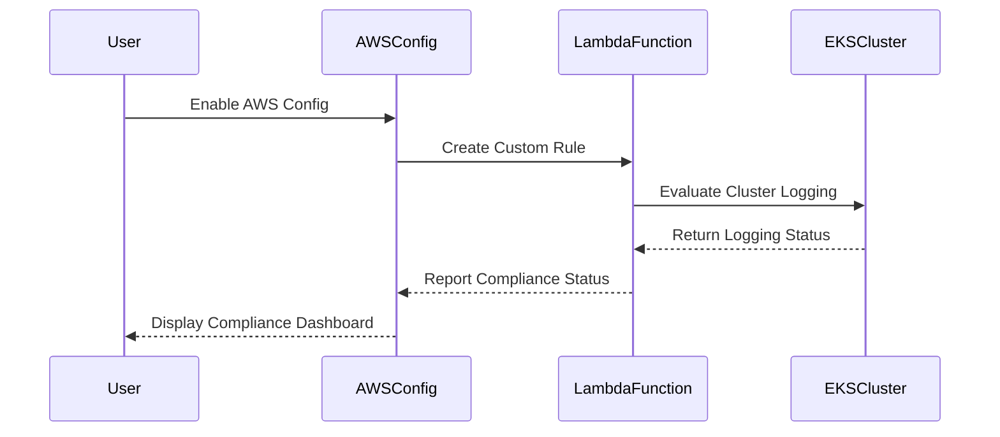

## Introduction to Compliance as Code

Compliance as Code is a practice that integrates compliance requirements into the development process through automated checks and configurations. This ensures that systems and applications adhere to regulatory standards and internal policies throughout their lifecycle. In the context of AWS Elastic Kubernetes Service (EKS), compliance as code helps ensure that Kubernetes clusters are configured securely and meet organizational compliance requirements.

### Why Compliance as Code Matters

In large organizations with numerous product teams and diverse engineers, maintaining consistent security and compliance across all systems can be challenging. Engineers may not be fully aware of all security best practices, leading to potential misconfigurations. By implementing compliance as code, organizations can:

- **Ensure Consistency**: Apply uniform security and compliance standards across all clusters.
- **Automate Audits**: Automatically check clusters against predefined compliance rules.
- **Reduce Human Error**: Minimize the risk of manual misconfigurations.
- **Facilitate Oversight**: Provide a centralized view of compliance status for all clusters.

### Overview of Compliance Rules for AWS EKS

AWS EKS provides tools and services to help manage and monitor Kubernetes clusters. Compliance rules can be set up to validate various aspects of cluster configuration, such as logging, encryption, and access controls. These rules can be enforced using AWS Config, which continuously monitors resources and reports on compliance status.

### Example Scenario: Logging in EKS Clusters

One critical aspect of compliance is ensuring that logging is enabled for all clusters. Logging helps in monitoring and auditing activities within the cluster, which is essential for detecting and responding to security incidents.

#### What is Logging in EKS Clusters?

Logging in EKS clusters refers to the collection and storage of operational data generated by the cluster components. This includes logs from the Kubernetes control plane (scheduler, controller manager, etc.), worker nodes, and applications running within the pods.

#### How Does AWS Check Logging?

AWS provides several mechanisms to enable and monitor logging in EKS clusters:

- **Control Plane Logging**: Logs from the Kubernetes control plane components.
- **Worker Node Logging**: Logs from the worker nodes.
- **Application Logging**: Logs from applications running in pods.

By default, logging is often disabled when creating an EKS cluster via the AWS UI. This means that unless explicitly configured, clusters will not generate logs, making it difficult to audit and troubleshoot issues.

### Setting Up Compliance Rules for Logging in EKS Clusters

To ensure that logging is enabled in all EKS clusters, we can set up compliance rules using AWS Config. These rules will automatically check if logging is enabled and report any non-compliant clusters.

#### Step-by-Step Guide to Set Up Compliance Rules

1. **Enable AWS Config**:
    - Ensure that AWS Config is enabled in your AWS account.
    - This can be done via the AWS Management Console or AWS CLI.

2. **Create a Custom Rule**:
    - Define a custom rule to check if logging is enabled in EKS clusters.
    - This rule will evaluate the current state of the cluster and report compliance status.

3. **Configure the Rule**:
    - Specify the criteria for the rule, such as checking if specific logging types (control plane, worker node, application) are enabled.
    - Use AWS Lambda functions to implement the logic for evaluating the rule.

4. **Deploy the Rule**:
    - Deploy the custom rule to your AWS account.
    - Monitor the compliance status of your EKS clusters.

#### Example Code for Custom Rule

Here is an example of a custom AWS Config rule written in Python to check if control plane logging is enabled in EKS clusters:

```python
import boto3

def lambda_handler(event, context):
    eks_client = boto3.client('eks')
    config_client = boto3.client('config')

    def evaluate_compliance(cluster_name):
        response = eks_client.describe_cluster(name=cluster_name)
        logging_enabled = response['cluster']['logging']['enabled']
        if logging_enabled:
            return 'COMPLIANT'
        else:
            return 'NON_COMPLIANT'

    results = []
    for record in event['configItem']:
        cluster_name = record['resourceName']
        compliance_status = evaluate_compliance(cluster_name)
        result = {
            'compliance_type': compliance_status,
            'annotation': f'Logging is {"enabled" if compliance_status == "COMPLIANT" else "disabled"} in {cluster_name}'
        }
        results.append(result)

    config_client.put_evaluations(Evaluations=results, ResultToken=event['resultToken'])

    return results
```

### Mermaid Diagram: Compliance Rule Flow



### Common Pitfalls and How to Avoid Them

1. **Manual Configuration Errors**: Ensure that logging is enabled during cluster creation and regularly review configurations.
2. **Incomplete Logging**: Ensure that all relevant logging types (control plane, worker node, application) are enabled.
3. **False Positives/Negatives**: Regularly test and validate compliance rules to ensure accuracy.

### How to Prevent / Defend

#### Detection

- **Regular Audits**: Use AWS Config to regularly audit EKS clusters for compliance.
- **Monitoring Tools**: Utilize monitoring tools like AWS CloudTrail and Amazon CloudWatch to track changes and log events.

#### Prevention

- **Automated Checks**: Implement automated compliance checks using AWS Config and Lambda functions.
- **Secure Configuration Templates**: Use secure configuration templates and infrastructure-as-code (IaC) tools like Terraform to enforce consistent configurations.

#### Secure Coding Fixes

**Vulnerable Code Example**:
```yaml
apiVersion: eks.aws.amazon.com/v1alpha1
kind: Cluster
metadata:
  name: my-cluster
spec:
  logging:
    enabled: false
```

**Fixed Code Example**:
```yaml
apiVersion: eks.aws.amazon.com/v1alpha1
kind: Cluster
metadata:
  name: my-cluster
spec:
  logging:
    enabled: true
```

### Real-World Examples and Breaches

Recent breaches and vulnerabilities have highlighted the importance of proper logging and monitoring in Kubernetes clusters. For example, the Log4j vulnerability (CVE-2021-44228) demonstrated the critical role of logging in identifying and responding to security incidents.

### Hands-On Labs

For practical experience with compliance as code in AWS EKS, consider the following labs:

- **PortSwigger Web Security Academy**: Offers modules on securing Kubernetes and AWS services.
- **CloudGoat**: Provides scenarios for practicing security and compliance in AWS environments.
- **Pacu**: A penetration testing framework for AWS that includes modules for testing compliance and security configurations.

By following these steps and best practices, organizations can effectively manage and maintain compliance in their AWS EKS clusters, ensuring a secure and auditable environment.

---
<!-- nav -->
[[DevSecOps/DevSecOps Bootcamp/02-Security Governance & Compliance/02-Compliance as Code/Configure Compliance Rules for AWS EKS Service/01-Introduction to Compliance as Code Part 1|Introduction to Compliance as Code Part 1]] | [[DevSecOps/DevSecOps Bootcamp/02-Security Governance & Compliance/02-Compliance as Code/Configure Compliance Rules for AWS EKS Service/00-Overview|Overview]] | [[DevSecOps/DevSecOps Bootcamp/02-Security Governance & Compliance/02-Compliance as Code/Configure Compliance Rules for AWS EKS Service/03-Introduction to Compliance as Code Part 3|Introduction to Compliance as Code Part 3]]
