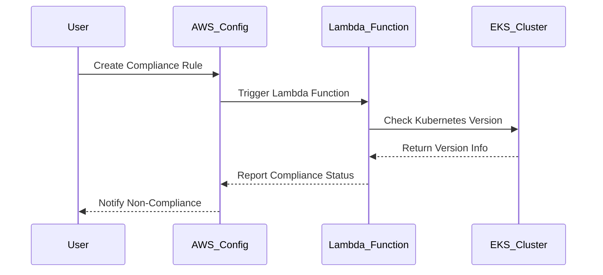

## Compliance as Code for AWS EKS Service

### Introduction to Compliance as Code

Compliance as Code (CaC) is a practice that automates the enforcement of compliance policies within an organization. In the context of AWS EKS (Elastic Kubernetes Service), CaC allows organizations to define and enforce rules around the versions of Kubernetes used in their clusters. This ensures that all clusters adhere to the organization’s standards, thereby reducing the risk of vulnerabilities and ensuring consistent security practices across the board.

### Defining Kubernetes Version Compliance Rules

One of the key aspects of CaC in AWS EKS is defining the minimum acceptable version of Kubernetes for your clusters. This is crucial because newer versions often come with important security patches and performance improvements. By setting a minimum version, you ensure that all clusters are running a version that meets your organization’s security requirements.

#### Example Scenario

Let's assume your organization decides that the minimum acceptable version of Kubernetes is `1.27`. This means any cluster running a version older than `1.27` will be flagged as non-compliant.

### Configuring Compliance Rules in AWS Config

AWS Config is a service that enables you to assess, audit, and record configurations of your AWS resources. You can use AWS Config to define compliance rules that automatically check your resources against specified criteria.

#### Step-by-Step Configuration

1. **Log in to the AWS Management Console**:
   - Navigate to the AWS Config service.
   - Click on "Rules" in the left-hand menu.

2. **Create a New Rule**:
   - Click on "Create rule".
   - Choose "Custom rule" and select "Lambda function" as the rule type.
   - Name your rule, e.g., `eks_kubernetes_version_compliance`.

3. **Define the Lambda Function**:
   - Write a Lambda function that checks the Kubernetes version of each EKS cluster.
   - Ensure the function is triggered by changes in the EKS clusters.

```python
import json
import boto3

def lambda_handler(event, context):
    eks_client = boto3.client('eks')
    config_client = boto3.client('config')

    # Define the minimum acceptable Kubernetes version
    min_version = '1.27'

    # Get a list of all EKS clusters
    clusters = eks_client.list_clusters()['clusters']

    for cluster_name in clusters:
        # Describe the cluster to get its version
        cluster_info = eks_client.describe_cluster(name=cluster_name)
        current_version = cluster_info['cluster']['version']

        # Check if the cluster version is below the minimum version
        if current_version < min_version:
            # Mark the cluster as non-compliant
            config_client.put_evaluations(
                Evaluations=[
                    {
                        'ComplianceResourceType': 'AWS::EKS::Cluster',
                        'ComplianceResourceId': cluster_name,
                        'ComplianceType': 'NON_COMPLIANT',
                        'Annotation': f'Kubernetes version {current_version} is below the minimum required version {min_version}.'
                    }
                ],
                ResultToken=event['resultToken']
            )
```

4. **Save and Deploy the Rule**:
   - Save the Lambda function and deploy it.
   - Ensure the rule is active and configured to run periodically.

### Monitoring Compliance Status

Once the rule is deployed, AWS Config will monitor all EKS clusters and flag those that are non-compliant based on the defined criteria.

#### Example HTTP Request and Response

When AWS Config runs the compliance check, it sends a request to the Lambda function and receives a response indicating whether the cluster is compliant or not.

```http
POST /2018-10-08/invocations HTTP/1.1
Host: lambda.amazonaws.com
Content-Type: application/json

{
  "event": {
    "resultToken": "abc123",
    "ruleParameters": {},
    "accountId": "123456789012",
    "awsRegion": "us-east-1",
    "evaluationId": "12345678901234567890123456789012"
  },
  "context": {
    "functionName": "eks_kubernetes_version_compliance",
    "functionVersion": "$LATEST",
    "invokedFunctionArn": "arn:aws:lambda:us-east-1:123456789012:function:eks_kubernetes_version_compliance",
    "memoryLimitInMB": 128,
    "logGroupName": "/aws/lambda/eks_kubernetes_version_compliance",
    "logStreamName": "2023/04/01/[$LATEST]1234567890abcdef1234567890abcdef",
    "getRemainingTimeInMillis": 29900,
    "identity": {
      "type": "IAMUser",
      "principalId": "AIDAJDPLRKLG7UEXAMPLE"
    },
    "clientContext": null,
    "custom": null,
    "clientContext": null,
    "cognitoIdentityPoolId": null,
    "cognitoIdentityId": null,
    "cognitoAuthenticationProvider": null,
    "cognitoAuthenticationType": null,
    "apiKeyId": null,
    "sourceIp": "127.0.0.1",
    "requestId": "c8af0b86-45b7-11e6-ba69-001a4a1648ca",
    "deadlineMs": 1555560000000
  }
}

HTTP/1.1 200 OK
Content-Type: application/json

{
  "Evaluations": [
    {
      "ComplianceResourceType": "AWS::EKS::Cluster",
      "ComplianceResourceId": "my-cluster",
      "ComplianceType": "NON_COMPLIANT",
      "Annotation": "Kubernetes version 1.26 is below the minimum required version 1.27."
    }
  ]
}
```

### Real-World Examples and Impact

Recent breaches and vulnerabilities have highlighted the importance of keeping Kubernetes up-to-date. For instance, the CVE-2021-25742 vulnerability in Kubernetes 1.22.x allowed attackers to bypass authentication mechanisms. Ensuring that all clusters are running at least version 1.27 helps mitigate such risks.

### How to Prevent / Defend

#### Detection

To detect non-compliant clusters, you can set up AWS Config to trigger alerts or notifications whenever a cluster is marked as non-compliant. This can be done via Amazon CloudWatch Events or AWS Lambda functions.

#### Prevention

1. **Automate Cluster Upgrades**:
   - Use tools like `eksctl` or AWS CLI to automate the upgrade process.
   - Set up scheduled tasks to regularly check and upgrade clusters.

2. **Secure Coding Practices**:
   - Ensure that all new clusters are created with the latest version of Kubernetes.
   - Implement CI/CD pipelines that enforce version checks during deployment.

3. **Configuration Hardening**:
   - Use IAM roles and policies to restrict permissions for creating or modifying clusters.
   - Enable AWS Config and CloudTrail to monitor and log all changes to EKS clusters.

### Mermaid Diagrams

#### Compliance Rule Flow



### Conclusion

By implementing Compliance as Code for AWS EKS, organizations can ensure that all Kubernetes clusters meet the required security standards. This not only reduces the risk of vulnerabilities but also promotes consistent and secure practices across the organization. Regular monitoring and automated upgrades are key to maintaining compliance and protecting your infrastructure.

### Practice Labs

For hands-on experience with Compliance as Code for AWS EKS, consider the following labs:

- **PortSwigger Web Security Academy**: Offers modules on securing Kubernetes environments.
- **CloudGoat**: Provides scenarios for practicing AWS security configurations, including EKS.
- **Pacu**: A framework for testing AWS security configurations, including EKS compliance rules.

These labs provide real-world scenarios and challenges to help you master the concepts covered in this chapter.

---
<!-- nav -->
[[06-Compliance Checks for EKS Clusters|Compliance Checks for EKS Clusters]] | [[DevSecOps/DevSecOps Bootcamp/02-Security Governance & Compliance/02-Compliance as Code/Configure Compliance Rules for AWS EKS Service/00-Overview|Overview]] | [[08-Configuring Compliance Rules for AWS EKS Service|Configuring Compliance Rules for AWS EKS Service]]
