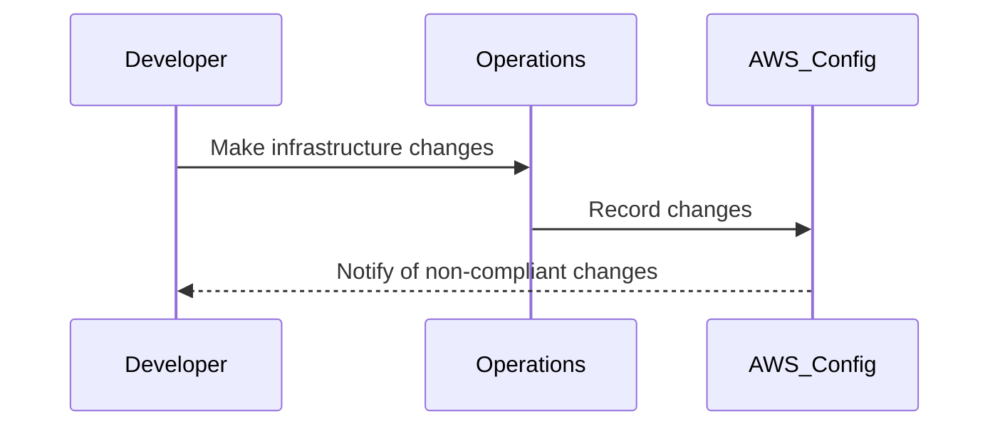
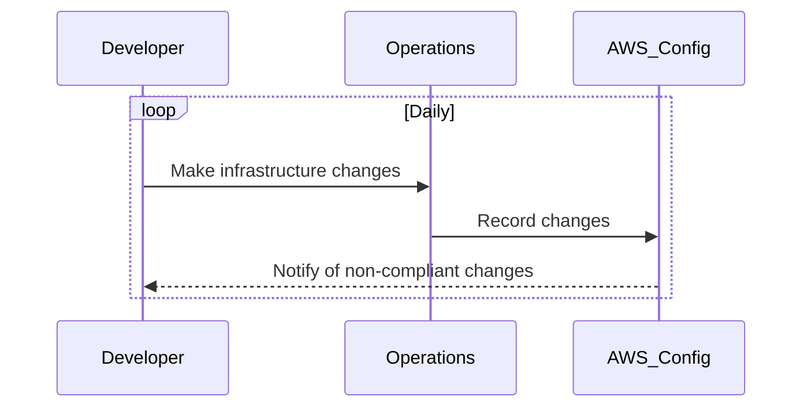
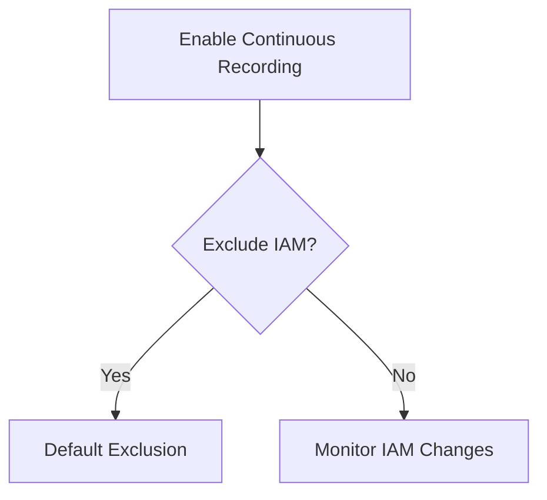
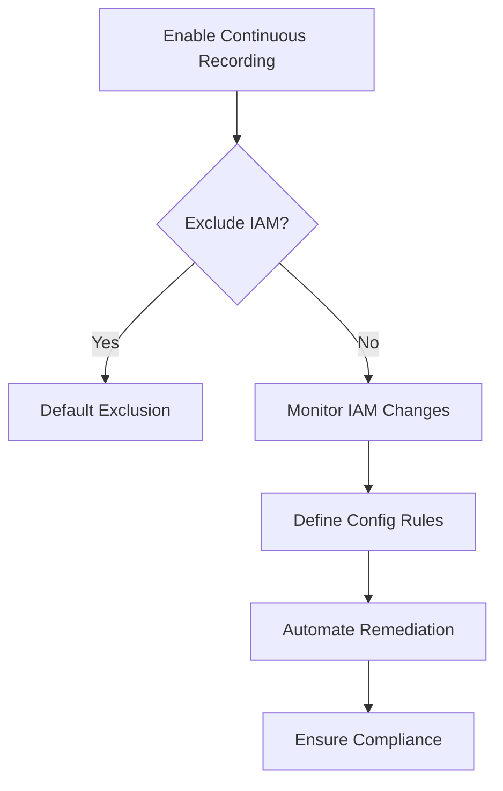

## Introduction to Compliance as Code

Compliance as Code is an approach to ensuring that your infrastructure and applications adhere to regulatory and organizational policies through automated, code-based mechanisms. This method leverages Infrastructure as Code (IaC) practices to define, enforce, and audit compliance requirements. In the context of AWS, AWS Config plays a pivotal role in enabling Compliance as Code by providing a way to assess, audit, and evaluate the configurations of AWS resources.

### What is AWS Config?

AWS Config is a service that enables you to assess, audit, and evaluate the configurations of your AWS resources. It provides a detailed view of the configuration history of your resources, allowing you to track changes and ensure compliance with internal policies and external regulations.

#### Key Features of AWS Config

- **Configuration Recording**: Tracks changes to your AWS resources and records their configurations.
- **Configuration Snapshots**: Provides a snapshot of your AWS resources at a specific point in time.
- **Configuration Aggregator**: Allows you to aggregate data across multiple accounts and regions.
- **Config Rules**: Enables you to define custom rules to check if your resources comply with specific policies.

### Continuous vs. Daily Recording

When setting up AWS Config, you can choose between continuous recording and daily recording. The choice depends on the frequency of changes in your environment and the level of monitoring required.

#### Continuous Recording

Continuous recording is ideal for environments where changes occur frequently. This mode ensures that every change is captured immediately, allowing for real-time monitoring and compliance checking.

**Use Case Example:**
Consider a production environment where developers and operations teams make frequent changes to infrastructure and applications. Continuous recording helps in identifying any non-compliant changes as soon as they occur, reducing the risk of security vulnerabilities.



#### Daily Recording

Daily recording captures changes once per day. This mode is suitable for environments where changes are less frequent, helping to reduce the overhead associated with continuous monitoring.

**Use Case Example:**
In a development environment where changes are less frequent, daily recording can be sufficient to ensure compliance without the need for constant monitoring.



### Override Resources

Override resources allow you to explicitly exclude certain resource types from being monitored. This can help in managing costs by reducing the amount of data that needs to be processed.

#### Default Exclusions

By default, AWS Config excludes IAM resource types from continuous recording to save costs. However, this exclusion can be removed if you want to monitor IAM changes for compliance.

**Use Case Example:**
If you have a critical security requirement to monitor IAM changes, you might choose to remove the default exclusion and enable continuous recording for IAM resources.



### Config Rules

Config Rules are custom rules that you can define to check if your resources comply with specific policies. These rules can be based on AWS managed rules or custom rules written using AWS Lambda functions.

#### Managed Rules

AWS provides a set of pre-defined rules that cover common compliance scenarios. These rules can be easily enabled to ensure compliance with various standards such as CIS Benchmarks, HIPAA, and GDPR.

**Example:**
The `IAM_PASSWORD_POLICY` rule checks if the password policy for IAM users meets the specified criteria.

```yaml
---
Type: AWS::Config::ConfigRule
Properties:
  Description: Checks if the IAM password policy meets the specified criteria.
  Source:
    Owner: AWS
    SourceIdentifier: IAM_PASSWORD_POLICY
  InputParameters:
    MinimumPasswordLength: 12
    RequireSymbols: true
    RequireNumbers: true
    RequireUppercaseCharacters: true
    RequireLowercaseCharacters: true
```

#### Custom Rules

Custom rules can be defined using AWS Lambda functions. These rules provide more flexibility in defining complex compliance checks.

**Example:**
A custom rule to check if all EC2 instances have a specific tag.

```yaml
---
Type: AWS::Config::ConfigRule
Properties:
  Description: Checks if all EC2 instances have a specific tag.
  Source:
    Owner: CUSTOM_LAMBDA
    SourceIdentifier: arn:aws:lambda:us-east-1:123456789012:function:CheckEC2Tags
  InputParameters:
    TagKey: Environment
    TagValue: Production
```

### How to Prevent / Defend

To ensure compliance and prevent non-compliant changes, follow these steps:

1. **Enable Continuous Recording**: Ensure that all critical resources are continuously monitored.
2. **Define Config Rules**: Use both managed and custom rules to enforce compliance.
3. **Monitor IAM Changes**: Remove the default exclusion for IAM resources to monitor critical security changes.
4. **Automate Remediation**: Use AWS Lambda functions to automatically remediate non-compliant resources.

#### Vulnerable vs. Secure Configuration

**Vulnerable Configuration:**

```yaml
---
Type: AWS::Config::ConfigRule
Properties:
  Description: Checks if the IAM password policy meets the specified criteria.
  Source:
    Owner: AWS
    SourceIdentifier: IAM_PASSWORD_POLICY
  InputParameters:
    MinimumPasswordLength: 6
    RequireSymbols: false
    RequireNumbers: false
    RequireUppercaseCharacters: false
    RequireLowercaseCharacters: false
```

**Secure Configuration:**

```yaml
---
Type: AWS::Config::ConfigRule
Properties:
  Description: Checks if the IAM password policy meets the specified criteria.
  Source:
    Owner: AWS
    SourceIdentifier: IAM_PASSWORD_POLICY
  InputParameters:
    MinimumPasswordLength: 12
    RequireSymbols: true
    RequireNumbers: true

    RequireUppercaseCharacters: true
    RequireLowercaseCharacters: true
```

### Real-World Examples

#### Recent Breaches

- **Capital One Data Breach (2019)**: A misconfigured S3 bucket led to unauthorized access to sensitive customer data. Proper use of AWS Config and Config Rules could have helped identify and mitigate such misconfigurations.
- **Twitter Hack (2020)**: Compromised AWS credentials were used to gain unauthorized access. Monitoring IAM changes with AWS Config could have alerted the organization to suspicious activity.

### Hands-On Labs

For practical experience with AWS Config and Compliance as Code, consider the following labs:

- **CloudGoat**: A series of labs designed to teach cloud security concepts, including AWS Config.
- **flaws.cloud**: A platform that simulates real-world cloud environments with intentional security flaws, including misconfigurations that can be detected using AWS Config.

### Conclusion

Compliance as Code is a powerful approach to ensuring that your AWS environment adheres to regulatory and organizational policies. By leveraging AWS Config and Config Rules, you can automate the process of monitoring and enforcing compliance, reducing the risk of security vulnerabilities and ensuring that your infrastructure remains secure and compliant.



This comprehensive guide covers the essential aspects of Compliance as Code using AWS Config, providing a deep understanding of the concepts, tools, and best practices to ensure a secure and compliant environment.

---
<!-- nav -->
[[DevSecOps/DevSecOps Bootcamp/02-Security Governance & Compliance/02-Compliance as Code/Setting up AWS Config Rules/01-Introduction to Compliance Monitoring with AWS Config Rules|Introduction to Compliance Monitoring with AWS Config Rules]] | [[DevSecOps/DevSecOps Bootcamp/02-Security Governance & Compliance/02-Compliance as Code/Setting up AWS Config Rules/00-Overview|Overview]] | [[03-Introduction to Compliance as Code Part 2|Introduction to Compliance as Code Part 2]]
