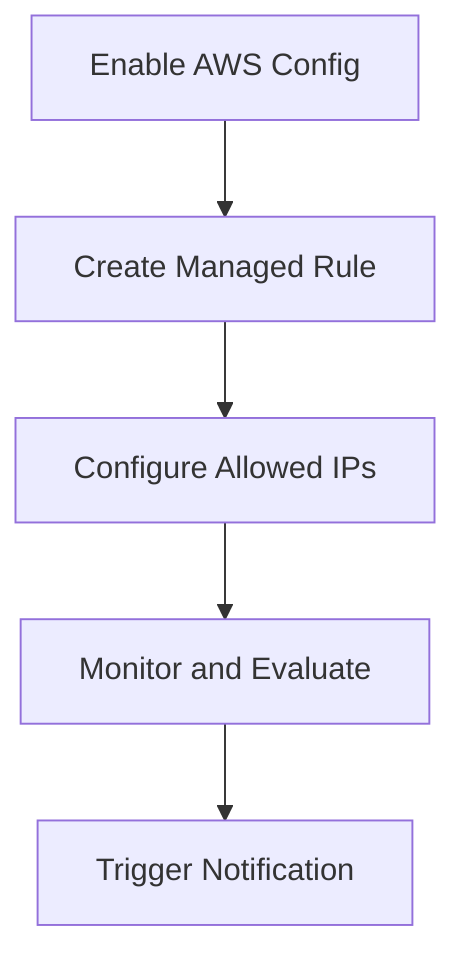

## Introduction to Compliance as Code

Compliance as Code is an approach to automating the enforcement of compliance requirements within an organization. This method leverages infrastructure as code (IaC) principles to ensure that systems and configurations adhere to regulatory standards and internal policies. One of the key tools for implementing Compliance as Code in the AWS ecosystem is AWS Config, which allows organizations to assess, audit, and evaluate the configurations of their AWS resources.

### What is AWS Config?

AWS Config is a service that enables you to assess, audit, and evaluate the configurations of your AWS resources. It continuously monitors and records your AWS resource configurations and helps you automate the evaluation of your AWS resources against desired configurations. By using AWS Config, you can maintain compliance with internal guidelines, regulatory standards, and industry best practices.

### Why Use AWS Config?

Using AWS Config offers several benefits:

- **Automated Compliance**: AWS Config automates the process of ensuring that your resources comply with specified rules and policies.
- **Continuous Monitoring**: It continuously monitors your resources for changes and alerts you when non-compliant configurations are detected.
- **Audit Trails**: AWS Config provides detailed audit trails of resource configurations, which can be crucial for compliance audits.
- **Customizable Rules**: You can define custom rules to meet your specific compliance requirements.

### How Does AWS Config Work?

AWS Config works by recording the configuration state of your resources at regular intervals and comparing them against defined rules. Here’s a high-level overview of how it operates:

1. **Configuration Recording**: AWS Config records the current state of your resources.
2. **Rule Evaluation**: It evaluates the recorded configurations against the defined rules.
3. **Notification**: If a rule is violated, AWS Config can notify you through Amazon SNS or other mechanisms.
4. **Remediation**: You can set up automated remediation actions to correct non-compliant configurations.

### AWS Config Rules

AWS Config Rules are the core mechanism for enforcing compliance. These rules define the conditions under which a resource is considered compliant or non-compliant. AWS provides a set of pre-defined managed rules that align with common security best practices, such as those outlined in the Center for Internet Security (CIS) benchmarks.

### Managed Rules vs Custom Rules

#### Managed Rules

Managed rules are pre-defined rules provided by AWS that follow established security best practices. They are easy to implement and cover a wide range of compliance requirements. For example, the `EC2_SSH_Inbound_Rule` ensures that inbound SSH traffic is restricted to specific IP addresses.

#### Custom Rules

Custom rules allow you to define your own compliance rules based on your specific organizational needs. You can create custom rules using AWS Lambda functions, which can perform more complex evaluations than managed rules.

### Example: Restricting SSH Access to EC2 Servers

Let's dive into a practical example of setting up an AWS Config Rule to restrict SSH access to EC2 servers.

#### Background Theory

SSH (Secure Shell) is a cryptographic network protocol used for secure communication between a client and a server. Allowing unrestricted SSH access can pose significant security risks, such as unauthorized access to sensitive data or system compromise. Therefore, it is essential to restrict SSH access to trusted IP addresses.

#### Step-by-Step Setup

1. **Enable AWS Config**:
   - Navigate to the AWS Management Console.
   - Go to the AWS Config service.
   - Enable AWS Config if it is not already enabled.

2. **Create a Managed Rule**:
   - In the AWS Config dashboard, navigate to the "Rules" section.
   - Click on "Create rule".
   - Select the "EC2_SSH_Inbound_Rule" from the list of managed rules.
   - Configure the rule parameters, such as specifying allowed IP addresses.

3. **Configure the Rule**:
   - Define the allowed IP addresses for SSH access.
   - Set up notifications via Amazon SNS to alert you when the rule is violated.

4. **Monitor and Evaluate**:
   - AWS Config will continuously monitor your EC2 instances for SSH access violations.
   - If a violation is detected, AWS Config will trigger the configured notification.

### Full Example with Code

Here is a complete example of setting up the `EC2_SSH_Inbound_Rule` using AWS Config:

```yaml
# AWS Config Rule Definition
{
  "ConfigRuleName": "ec2-ssh-inbound-rule",
  "Description": "Ensure that SSH access to EC2 instances is restricted to specific IP addresses.",
  "Scope": {
    "ComplianceResourceTypes": [
      "AWS::EC2::SecurityGroup"
    ]
  },
  "Source": {
    "Owner": "AWS",
    "SourceIdentifier": "EC2_SSH_Inbound_Rule"
  },
  "InputParameters": {
    "AllowedIPAddresses": "192.168.1.1,192.168.1.2"
  }
}
```

### HTTP Request and Response

When configuring AWS Config via the API, you would send a POST request to create the rule:

```http
POST /configservice/v1/config-rules HTTP/1.1
Host: config.amazonaws.com
Content-Type: application/json

{
  "ConfigRuleName": "ec2-ssh-inbound-rule",
  "Description": "Ensure that SSH access to EC2 instances is restricted to specific IP addresses.",
  "Scope": {
    "ComplianceResourceTypes": [
      "AWS::EC2::SecurityGroup"
    ]
  },
  "Source": {
    "Owner": "AWS",
    "SourceIdentifier": "EC2_SSH_Inbound_Rule"
  },
  "InputParameters": {
    "AllowedIPAddresses": "192.168.1.1,192.168.1.2"
  }
}
```

The response would look like this:

```http
HTTP/1.1 200 OK
Content-Type: application/json

{
  "ConfigRuleArn": "arn:aws:config:us-east-1:123456789012:config-rule/ec2-ssh-inbound-rule",
  "ConfigRuleId": "cr-1234567890abcdef",
  "ConfigRuleName": "ec2-ssh-inbound-rule",
  "Description": "Ensure that SSH access to EC2 instances is restricted to specific IP addresses.",
  "Scope": {
    "ComplianceResourceTypes": [
      "AWS::EC2::SecurityGroup"
    ]
  },
  "Source": {
    "Owner": "AWS",
    "SourceIdentifier": "EC2_SSH_Inbound_Rule"
  },
  "InputParameters": {
    "AllowedIPAddresses": "192.168.1.1,192.168.1.2"
  }
}
```

### Mermaid Diagram

A mermaid diagram can help visualize the setup and flow of AWS Config Rules:



### Common Pitfalls and How to Avoid Them

#### Pitfall 1: Overlooking Notification Configuration

**Problem**: Not configuring notifications properly can lead to missed violations.

**Solution**: Ensure that notifications are set up correctly using Amazon SNS.

#### Pitfall 2: Inadequate Rule Coverage

**Problem**: Relying solely on managed rules may not cover all compliance requirements.

**Solution**: Use a combination of managed and custom rules to ensure comprehensive coverage.

### Real-World Examples

#### Example 1: CVE-2021-20225

In 2021, a critical vulnerability (CVE-2021-20225) was discovered in the AWS SDK for Java, which could allow unauthorized access to EC2 instances. Using AWS Config to enforce strict SSH access rules could have mitigated this risk.

#### Example 2: AWS Security Best Practices

Following the CIS AWS Foundations Benchmark can significantly enhance security. AWS Config Rules can be used to enforce these best practices automatically.

### How to Prevent / Defend

#### Detection

- **Use AWS Config**: Continuously monitor your resources for compliance violations.
- **Set Up Notifications**: Configure Amazon SNS to alert you when violations occur.

#### Prevention

- **Implement Managed Rules**: Use pre-defined rules to enforce common security best practices.
- **Create Custom Rules**: Define custom rules to meet specific organizational needs.

#### Secure Coding Fixes

**Vulnerable Pattern**:
```yaml
# Vulnerable Security Group Rule
{
  "IpProtocol": "tcp",
  "FromPort": 22,
  "ToPort": 22,
  "IpRanges": [
    {
      "CidrIp": "0.0.0.0/0"
    }
  ]
}
```

**Fixed Pattern**:
```yaml
# Secure Security Group Rule
{
  "IpProtocol": "tcp",
  "FromPort": 22,
  "ToPort": 22,
  "IpRanges": [
    {
      "CidrIp": "192.168.1.1/32"
    },
    {
      "CidrIp": "192.168.1.2/32"
    }
  ]
}
```

### Configuration Hardening

- **Limit SSH Access**: Restrict SSH access to trusted IP addresses.
- **Enable Multi-Factor Authentication (MFA)**: Require MFA for SSH access.

### Practice Labs

For hands-on practice with AWS Config and Compliance as Code, consider the following labs:

- **CloudGoat**: A cloud security training platform that includes exercises on AWS Config.
- **flaws.cloud**: A cloud security training platform that covers various AWS services, including Config.
- **AWS Official Workshops**: AWS provides official workshops that cover Compliance as Code and AWS Config in depth.

By following these steps and best practices, you can effectively use AWS Config to enforce compliance and enhance the security of your AWS environment.

---
<!-- nav -->
[[02-Introduction to Compliance as Code Part 1|Introduction to Compliance as Code Part 1]] | [[DevSecOps/DevSecOps Bootcamp/02-Security Governance & Compliance/02-Compliance as Code/Setting up AWS Config Rules/00-Overview|Overview]] | [[04-Introduction to Compliance as Code Part 3|Introduction to Compliance as Code Part 3]]
