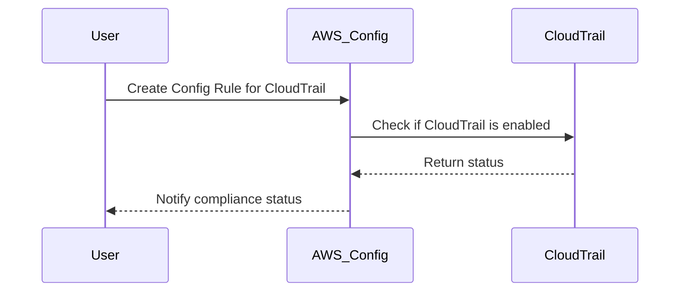
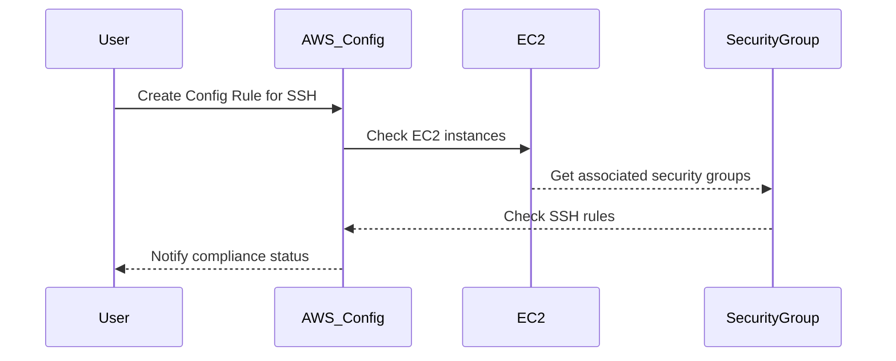

## Introduction to Compliance as Code

Compliance as Code is a practice that integrates compliance requirements into the development process through automated tools and scripts. This approach ensures that compliance policies are enforced consistently across all environments and applications. In the context of AWS, AWS Config is a service that enables you to assess, audit, and manage your AWS resource configurations at scale. By setting up AWS Config Rules, you can automatically check your resources against predefined compliance standards.

### Why Compliance as Code?

Compliance as Code is essential for several reasons:

1. **Automation**: Automating compliance checks reduces the likelihood of human error and ensures consistency.
2. **Scalability**: As your infrastructure grows, manual compliance checks become impractical. Automated rules can scale with your environment.
3. **Visibility**: Continuous monitoring provides real-time insights into your compliance status, enabling quick remediation of issues.
4. **Cost Efficiency**: Automated compliance checks reduce the need for manual audits, saving time and resources.

### AWS Config Overview

AWS Config is a fully managed service that provides you with an inventory of the AWS resources in your account, along with their relationships, configurations, and changes. It allows you to track and record the configurations of your resources, and it supports compliance checks through Config Rules.

#### Key Features of AWS Config

- **Inventory Management**: Tracks and records the configurations of your resources.
- **Configuration Change Tracking**: Monitors changes to your resources and records them.
- **Compliance Checks**: Uses Config Rules to evaluate your resources against compliance standards.
- **Integration**: Integrates with other AWS services like CloudWatch Events and SNS for notifications.

### Setting Up AWS Config Rules

In this section, we will set up two specific AWS Config Rules: one to ensure that CloudTrail is enabled and another to restrict SSH access to EC2 instances.

#### Rule 1: Ensure CloudTrail is Enabled

CloudTrail is a vital service that logs API calls made within your AWS account. Enabling CloudTrail provides visibility into actions taken within your account, which is crucial for auditing and compliance purposes.

##### Importance of CloudTrail

- **Audit Trails**: Provides a detailed log of all API calls made within your account.
- **Security Monitoring**: Helps identify unauthorized activities and potential security threats.
- **Compliance**: Essential for meeting regulatory requirements such as PCI DSS, HIPAA, and GDPR.

##### Config Rule Setup

To ensure CloudTrail is enabled, we can use a managed Config Rule provided by AWS.



**Steps to Set Up the CloudTrail Config Rule**

1. **Navigate to AWS Config Console**:
   - Go to the AWS Management Console.
   - Navigate to the AWS Config service.

2. **Create a New Config Rule**:
   - Click on "Config Rules" in the left-hand menu.
   - Click on "Create rule".
   - Select "Managed rule" and search for "CloudTrailEnabled".

3. **Configure the Rule**:
   - Name the rule (e.g., `cloudtrail-enabled`).
   - Add any necessary tags.
   - Click "Next" and then "Create rule".

4. **Verify the Rule**:
   - Once created, AWS Config will start evaluating your resources against this rule.
   - You can view the compliance status in the AWS Config console.

#### Rule 2: Restrict SSH Access to EC2 Instances

SSH access to EC2 instances should be restricted to prevent unauthorized access. This rule ensures that security groups associated with EC2 instances do not allow unrestricted SSH traffic.

##### Importance of Restricting SSH Access

- **Security**: Prevents unauthorized access to your EC2 instances.
- **Compliance**: Ensures adherence to security policies and regulations.
- **Operational Best Practices**: Reduces the attack surface of your infrastructure.

##### Config Rule Setup

To restrict SSH access, we can use another managed Config Rule provided by AWS.



**Steps to Set Up the SSH Config Rule**

1. **Navigate to AWS Config Console**:
   - Go to the AWS Management Console.
   - Navigate to the AWS Config service.

2. **Create a New Config Rule**:
   - Click on "Config Rules" in the left-hand menu.
   - Click on "Create rule".
   - Select "Managed rule" and search for "RestrictedSSH".

3. **Configure the Rule**:
   - Name the rule (e.g., `restricted-ssh-access`).
   - Add any necessary tags.
   - Click "Next" and then "Create rule".

4. **Verify the Rule**:
   - Once created, AWS Config will start evaluating your resources against this rule.
   - You can view the compliance status in the AWS Config console.

### Real-World Examples and Recent Breaches

#### Example 1: Unrestricted SSH Access Leading to Data Exfiltration

In a recent breach, an organization had unrestricted SSH access to their EC2 instances. An attacker exploited this vulnerability to gain unauthorized access and exfiltrate sensitive data. This incident highlights the importance of restricting SSH access and using Config Rules to enforce compliance.

#### Example 2: Disabled CloudTrail Leading to Undetected Malicious Activity

Another organization had CloudTrail disabled, leading to undetected malicious activity within their AWS account. Without CloudTrail, they were unable to trace the actions taken by the attacker, making it difficult to investigate and remediate the issue. This underscores the necessity of ensuring CloudTrail is enabled and using Config Rules to monitor compliance.

### How to Prevent / Defend

#### Detecting Non-Compliance

To detect non-compliance with the CloudTrail and SSH rules, you can set up alerts and notifications in AWS Config.

**Steps to Set Up Alerts**

1. **Navigate to AWS Config Console**:
   - Go to the AWS Management Console.
   - Navigate to the AWS Config service.

2. **Set Up Notifications**:
   - Click on "Notifications" in the left-hand menu.
   - Configure SNS topics to receive notifications for non-compliance events.

#### Preventing Non-Compliance

To prevent non-compliance, you can implement additional security measures and best practices.

**Secure Coding Fixes**

- **Restrict SSH Access**:
  - **Vulnerable Pattern**:
    ```yaml
    Resources:
      MySecurityGroup:
        Type: AWS::EC2::SecurityGroup
        Properties:
          GroupName: my-security-group
          VpcId: !Ref MyVPC
          SecurityGroupIngress:
            - IpProtocol: tcp
              FromPort: 22
              ToPort: 22
              CidrIp: 0.0.0.0/0
    ```
  - **Fixed Pattern**:
    ```yaml
    Resources:
      MySecurityGroup:
        Type: AWS::EC2::SecurityGroup
        Properties:
          GroupName: my-security-group
          VpcId: !Ref MyVPC
          SecurityGroupIngress:
            - IpProtocol: tcp
              FromPort: 22
              ToPort: 22
              CidrIp: 192.168.1.0/24
    ```

- **Enable CloudTrail**:
  - **Vulnerable Pattern**:
    ```json
    {
      "CloudTrail": {
        "Enabled": false
      }
    }
    ```
  - **Fixed Pattern**:
    ```json
    {
      "CloudTrail": {
        "Enabled": true,
        "S3BucketName": "my-cloudtrail-bucket",
        "SnsTopicName": "my-cloudtrail-topic"
      }
    }
    ```

#### Configuration Hardening

- **IAM Policies**:
  - Ensure IAM policies are configured to restrict access to CloudTrail and EC2 resources.
  - Use least privilege principles to minimize permissions granted to users and roles.

- **Network ACLs**:
  - Implement Network ACLs to further restrict inbound and outbound traffic to your EC2 instances.

### Conclusion

By setting up AWS Config Rules to monitor CloudTrail and SSH access, you can ensure compliance and enhance the security of your AWS environment. Regularly reviewing and updating these rules is crucial to maintaining a secure and compliant infrastructure.

### Practice Labs

For hands-on experience with AWS Config Rules, consider the following labs:

- **PortSwigger Web Security Academy**: Offers modules on AWS security and compliance.
- **CloudGoat**: Provides scenarios for practicing AWS security and compliance.
- **AWS Official Workshops**: Includes workshops on AWS Config and other security services.

These labs will help you gain practical experience in setting up and managing AWS Config Rules effectively.

---
<!-- nav -->
[[03-Introduction to Compliance as Code Part 2|Introduction to Compliance as Code Part 2]] | [[DevSecOps/DevSecOps Bootcamp/02-Security Governance & Compliance/02-Compliance as Code/Setting up AWS Config Rules/00-Overview|Overview]] | [[05-Introduction to Compliance as Code Part 4|Introduction to Compliance as Code Part 4]]
