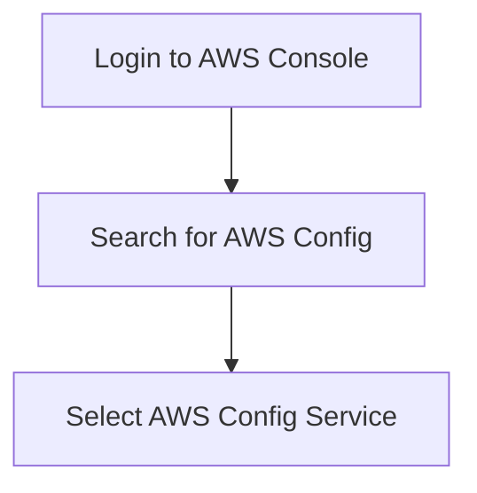
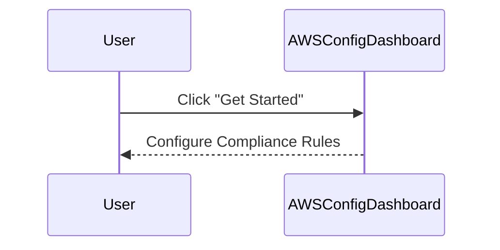
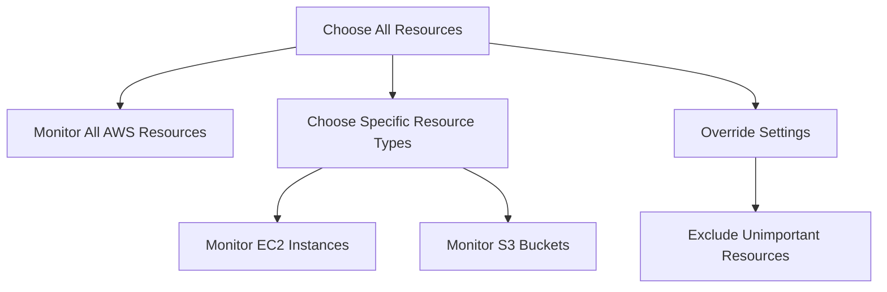
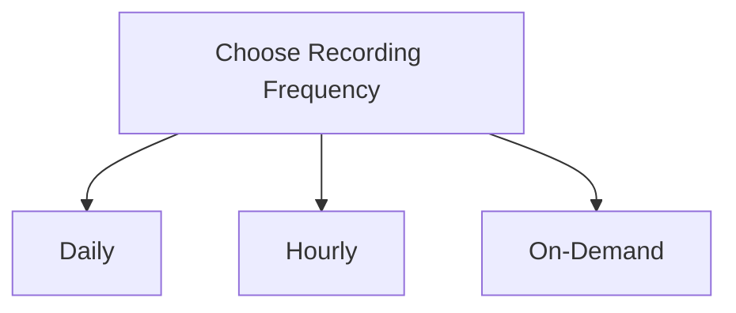
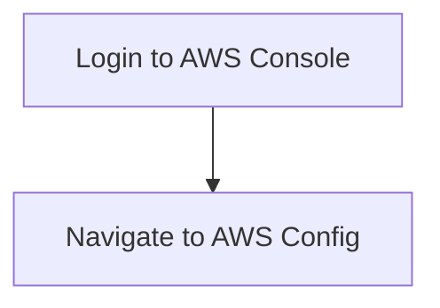
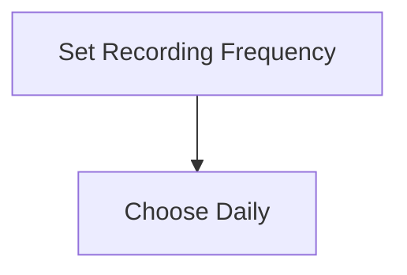
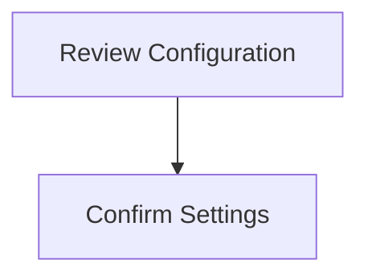

## Setting Up AWS Config Rules

Now that we understand the importance of Compliance as Code, let's dive into setting up AWS Config Rules. We will cover the steps to configure AWS Config and create custom rules based on CIS benchmarks.

### Step-by-Step Configuration

#### 1. Accessing AWS Config

To start, log into your AWS Management Console and navigate to the AWS Config service. You can find it by searching for "AWS Config" in the search bar.



#### 2. Getting Started with AWS Config

Once you are in the AWS Config dashboard, click on the "Get Started" button to begin configuring your compliance rules.



#### 3. Configuring Compliance Checks

In the configuration page, you can choose which resources to monitor for compliance. You have several options:

- **All Resources**: Monitor all AWS resources in your account.
- **Specific Resource Types**: Monitor specific types of resources, such as EC2 instances or S3 buckets.
- **Override Settings**: Exclude certain resources from monitoring.



#### 4. Recording Frequency

Next, you need to decide how often you want the compliance checks to run. AWS Config supports different recording frequencies:

- **Daily**: Run compliance checks once a day.
- **Hourly**: Run compliance checks every hour.
- **On-Demand**: Manually trigger compliance checks.



### Example Configuration

Let's walk through a complete example of setting up AWS Config Rules using the AWS Management Console.

#### 1. Access AWS Config

Log into your AWS Management Console and navigate to the AWS Config service.



#### 2. Configure Compliance Rules

Click on "Get Started" and select the resources you want to monitor. For this example, let's choose to monitor all EC2 instances.

```mermaid
flowchart TD
    A[Click "Get Started"] --> B[Select EC2 Instances]
```

#### 3. Set Recording Frequency

Set the recording frequency to daily.



#### 4. Review and Confirm

Review your configuration and confirm the settings.



### Full Example in Code

Here is a complete example of setting up AWS Config Rules using the AWS CLI:

```bash
# Enable AWS Config
aws configservice put-configuration-recorder --configuration-recorder file://recorder.json

# Create a new rule
aws configservice put-config-rule --config-rule file://rule.json

# Describe the rule to verify
aws configservice describe-config-rules --config-rule-names MyRuleName
```

Where `recorder.json` and `rule.json` are JSON files defining the recorder and rule configurations respectively.

### Vulnerable vs Secure Code Example

#### Vulnerable Code

```json
{
  "name": "MyRuleName",
  "inputParameters": {},
  "scope": {
    "complianceResourceTypes": ["AWS::EC2::Instance"]
  },
  "source": {
    "owner": "AWS",
    "sourceIdentifier": "EC2_INSTANCE_MANAGED_BY_SYSTEMS_MANAGER"
  }
}
```

This configuration lacks proper exclusion settings and does not specify a recording frequency.

#### Secure Code

```json
{
  "name": "MyRuleName",
  "inputParameters": {},
  "scope": {
    "complianceResourceTypes": ["AWS::EC2::Instance"],
    "complianceResourceId": "i-0123456789abcdef0"
  },
  "source": {
    "owner": "AWS",
    "sourceIdentifier": "EC2_INSTANCE_MANAGED_BY_SYSTEMS_MANAGER"
  },
  "recordingFrequency": "DAILY"
}
```

This configuration includes specific resource exclusions and sets a daily recording frequency.

### How to Prevent / Defend

#### Detection

Regularly review AWS Config reports to identify non-compliant resources. Use AWS Config's built-in dashboards and alerts to monitor compliance status.

#### Prevention

- **Use Override Settings**: Exclude unimportant resources from monitoring to reduce costs and focus on critical assets.
- **Set Appropriate Recording Frequencies**: Balance between cost and compliance needs by choosing appropriate recording frequencies.
- **Integrate with CI/CD Pipelines**: Automate compliance checks as part of your deployment pipeline to ensure continuous compliance.

### Complete Example

Here is a complete example of setting up AWS Config Rules using the AWS Management Console:

#### 1. Access AWS Config

Log into your AWS Management Console and navigate to the AWS Config service.


#### 2. Configure Compliance Rules

Click on "Get Started" and select the resources you want to monitor. For this example, let's choose to monitor all EC2 instances.

```mermaid
flowchart TD
    A[Click "Get Started"] --> B[Select EC2 Instances]
```

#### 3. Set Recording Frequency

Set the recording frequency to daily.


#### 4. Review and Confirm

Review your configuration and confirm the settings.


### Full Example in Code

Here is a complete example of setting up AWS Config Rules using the AWS CLI:

```bash
# Enable AWS Config
aws configservice put-configuration-recorder --configuration-recorder file://recorder.json

# Create a new rule
aws configservice put-config-rule --config-rule file://rule.json

# Describe the rule to verify
aws configservice describe-config-rules --config-rule-names MyRuleName
```

Where `recorder.json` and `rule.json` are JSON files defining the recorder and rule configurations respectively.

### Vulnerable vs Secure Code Example

#### Vulnerable Code

```json
{
  "name": "MyRuleName",
  "inputParameters": {},
  "scope": {
    "complianceResourceTypes": ["AWS::EC2::Instance"]
  },
  "source": {
   
```

### Common Pitfalls and Best Practices

When setting up AWS Config Rules, there are several common pitfalls to avoid:

1. **Over-monitoring**: Monitoring too many resources can lead to unnecessary costs and complexity. Use override settings to exclude unimportant resources.
2. **Insufficient Recording Frequency**: Setting the recording frequency too low can result in missed compliance violations. Balance between cost and compliance needs.
3. **Ignoring Compliance Reports**: Regularly reviewing compliance reports is crucial to identifying and addressing non-compliant resources.

### Best Practices

1. **Regular Audits**: Schedule regular audits to ensure ongoing compliance.
2. **Automated Alerts**: Set up automated alerts to notify you of compliance violations.
3. **Integration with CI/CD**: Integrate AWS Config checks into your CI/CD pipelines to ensure compliance during deployments.

### Real-World Example: SolarWinds Supply Chain Attack

The SolarWinds supply chain attack (CVE-2020-1014) highlights the importance of robust compliance and security measures. By leveraging Compliance as Code, organizations can detect and mitigate such vulnerabilities more effectively.

### Conclusion

By setting up AWS Config Rules and integrating Compliance as Code into your DevSecOps practices, you can ensure that your infrastructure remains compliant and secure. Regular reviews, automated alerts, and integration with CI/CD pipelines are key to maintaining compliance over time.

### Hands-On Labs

For hands-on practice, consider the following labs:

- **PortSwigger Web Security Academy**: Focuses on web application security but can provide insights into compliance and security best practices.
- **CloudGoat**: Provides a series of labs to learn about AWS security and compliance.
- **Pacu**: A penetration testing framework for AWS that can help you understand and test compliance rules.

These labs will help you gain practical experience in setting up and managing AWS Config Rules.

### Further Reading

For deeper understanding, explore the following resources:

- **AWS Config Documentation**: Official AWS documentation on AWS Config.
- **CIS AWS Foundations Benchmark**: Detailed security best practices for AWS.
- **OWASP Top Ten**: Comprehensive list of web application security risks.

By following these guidelines and best practices, you can effectively implement Compliance as Code in your DevSecOps workflow.

---
<!-- nav -->
[[08-Introduction to Compliance as Code|Introduction to Compliance as Code]] | [[DevSecOps/DevSecOps Bootcamp/02-Security Governance & Compliance/02-Compliance as Code/Setting up AWS Config Rules/00-Overview|Overview]] | [[DevSecOps/DevSecOps Bootcamp/02-Security Governance & Compliance/02-Compliance as Code/Setting up AWS Config Rules/10-Practice Questions & Answers|Practice Questions & Answers]]
