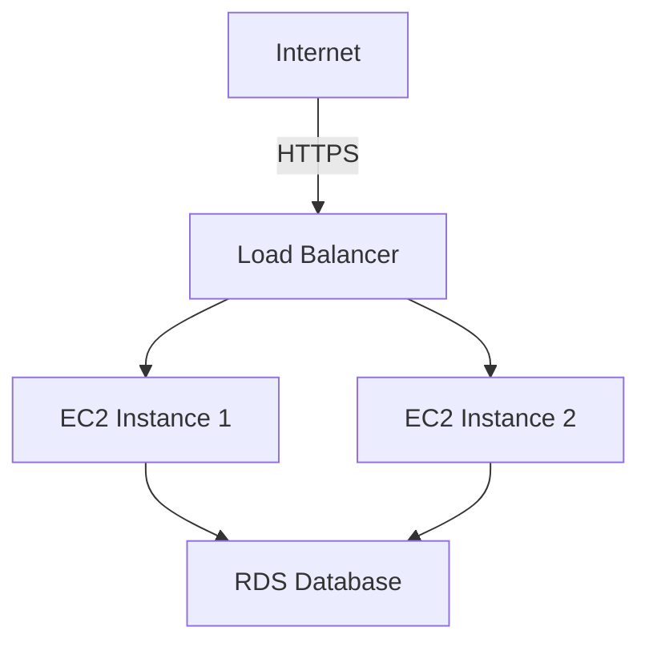
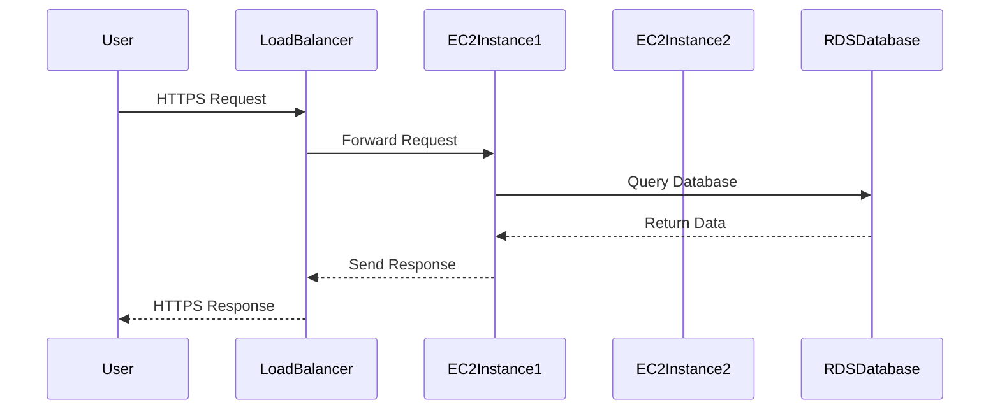

## Introduction to CIS Benchmarks

### What Are CIS Benchmarks?

The Center for Internet Security (CIS) provides a set of security controls and benchmarks designed to help organizations improve their security posture. These benchmarks are detailed lists of security configurations and best practices for various technologies, including network devices, cloud providers, mobile devices, operating systems, and more. The goal is to provide a standardized approach to securing these technologies, ensuring that organizations can implement consistent security measures across their infrastructure.

### Importance of CIS Benchmarks

CIS Benchmarks are crucial because they offer a comprehensive framework for securing different components of an IT environment. By following these benchmarks, organizations can reduce their exposure to security threats and vulnerabilities. Each benchmark includes detailed explanations of why certain security practices are important, how to audit compliance, and how to remediate issues if found non-compliant.

### Scope of CIS Benchmarks

CIS Benchmarks cover a wide range of technologies, including:

- **Network Devices**: Routers, switches, firewalls.
- **Cloud Providers**: AWS, Azure, Google Cloud Platform.
- **Mobile Devices**: iOS, Android.
- **Operating Systems**: Windows, Linux, macOS.
- **Containers and Orchestration Tools**: Docker, Kubernetes.

For instance, the CIS Kubernetes Benchmark provides specific security best practices tailored for Kubernetes environments. This includes recommendations for securing the Kubernetes control plane, worker nodes, and container images.

### Example: CIS Benchmarks for AWS

One of the most widely used CIS Benchmarks is the one for Amazon Web Services (AWS). The CIS AWS Foundations Benchmark is a detailed guide that helps organizations ensure their AWS accounts are configured securely. This benchmark covers over 200 pages of security recommendations, providing a thorough checklist for securing AWS resources.

### Structure of CIS Benchmarks

Each CIS Benchmark is structured to include:

- **Security Recommendations**: Detailed best practices for securing the technology.
- **Rationale**: Explanation of why each recommendation is important.
- **Audit Procedures**: Steps to verify compliance with the recommendation.
- **Remediation Procedures**: Guidance on how to fix any identified issues.

### Accessing CIS Benchmarks

To access CIS Benchmarks, you typically need to register with the CIS website. Upon registration, you can download the desired benchmark documents. For example, to obtain the CIS AWS Foundations Benchmark, you would:

1. Visit the CIS website.
2. Navigate to the "Benchmarks" section.
3. Select the AWS benchmark.
4. Fill out a form with organizational details and your engineering role.
5. Download the benchmark document.

### Example: CIS AWS Foundations Benchmark

Let’s take a closer look at the CIS AWS Foundations Benchmark. This document is extensive, covering over 200 pages of security recommendations. Here’s a breakdown of what you might find:

#### Security Recommendations

Each recommendation is categorized into different sections, such as:

- **Identity and Access Management (IAM)**: Best practices for managing user permissions and roles.
- **Logging and Monitoring**: Recommendations for enabling and configuring logging and monitoring services.
- **Network Security**: Guidelines for securing VPCs, subnets, and network interfaces.
- **Storage Security**: Best practices for securing S3 buckets and EBS volumes.

#### Rationale

For each recommendation, the benchmark provides a rationale explaining why the recommendation is important. For example, the recommendation to enable multi-factor authentication (MFA) for IAM users is justified by the increased security it provides against unauthorized access.

#### Audit Procedures

The benchmark includes detailed steps for auditing compliance with each recommendation. For instance, to audit IAM user permissions, you would:

1. List all IAM users.
2. Check the attached policies for each user.
3. Verify that the policies adhere to the principle of least privilege.

#### Remediation Procedures

If an audit reveals non-compliance, the benchmark provides guidance on how to remediate the issue. For example, if an IAM user has overly permissive permissions, you would:

1. Identify the user and their current permissions.
2. Create a new policy with the required permissions.
3. Attach the new policy to the user and detach the old one.

### Real-World Examples

#### Recent Breaches and CVEs

Recent breaches and CVEs highlight the importance of following CIS Benchmarks. For example:

- **CVE-2021-26855**: A vulnerability in AWS S3 bucket permissions allowed unauthorized access to sensitive data. Following the CIS AWS Foundations Benchmark recommendations for S3 bucket permissions could have prevented this breach.
- **CVE-2020-14882**: A misconfiguration in AWS IAM roles led to unauthorized access to EC2 instances. Adhering to the CIS AWS Foundations Benchmark recommendations for IAM roles could have mitigated this risk.

### How to Prevent / Defend

#### Detection

To detect non-compliance with CIS Benchmarks, you can use automated tools and scripts. For example, the `aws-config` tool can be used to audit AWS configurations against the CIS AWS Foundations Benchmark. Here’s an example of how to use `aws-config`:

```bash
# Install aws-config
pip install aws-config

# Configure aws-config
aws-config configure

# Run audit against CIS AWS Foundations Benchmark
aws-config audit --benchmark cis_aws_foundation_v1.2.0
```

#### Prevention

To prevent non-compliance, you should regularly audit your AWS configurations and apply the necessary remediations. This can be done using automated scripts and tools. For example, you can use the `aws-cli` to enforce specific IAM policies:

```bash
# Create a new IAM policy
aws iam create-policy \
    --policy-name MySecurePolicy \
    --policy-document file://my_secure_policy.json

# Attach the policy to an IAM user
aws iam attach-user-policy \
    --user-name my_user \
    --policy-arn arn:aws:iam::123456789012:policy/MySecurePolicy
```

#### Secure Coding Fixes

Here’s an example of a vulnerable IAM policy and its secure counterpart:

**Vulnerable Policy:**

```json
{
    "Version": "2012-10-17",
    "Statement": [
        {
            "Effect": "Allow",
            "Action": "*",
            "Resource": "*"
        }
    ]
}
```

**Secure Policy:**

```json
{
    "Version": "2012-10-17",
    "Statement": [
        {
            "Effect": "Allow",
            "Action": [
                "s3:GetObject",
                "s3:PutObject"
            ],
            "Resource": "arn:aws:s3:::my-bucket/*"
        }
    ]
}
```

### Mermaid Diagrams

#### Network Topology

A mermaid diagram can help visualize the network topology of an AWS environment:



#### Request/Response Flow

A mermaid sequence diagram can illustrate the request/response flow between different components:



### Practice Labs

To gain hands-on experience with CIS Benchmarks, consider the following labs:

- **PortSwigger Web Security Academy**: Offers interactive labs for web application security.
- **OWASP Juice Shop**: A deliberately insecure web application for practicing security skills.
- **DVWA (Damn Vulnerable Web Application)**: Another intentionally vulnerable web application for security training.
- **WebGoat**: An interactive training application for learning about web application security.

These labs provide practical scenarios where you can apply the principles learned from CIS Benchmarks.

### Conclusion

CIS Benchmarks are essential tools for improving the security posture of your IT environment. By following these benchmarks, you can ensure that your systems are configured securely and reduce the risk of security breaches. Regular audits and remediations are key to maintaining compliance with CIS Benchmarks. Additionally, using automated tools and scripts can help streamline the process of detecting and preventing non-compliance.

---
<!-- nav -->
[[DevSecOps/DevSecOps Bootcamp/02-Security Governance & Compliance/02-Compliance as Code/What are CIS Benchmarks/00-Overview|Overview]] | [[02-Introduction to CIS Benchmarks|Introduction to CIS Benchmarks]]
