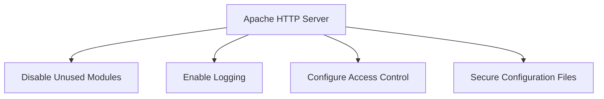

## Detailed Explanation of CIS Benchmarks

### Background Theory

CIS Benchmarks are based on the principle of least privilege, which means that systems should be configured to allow the minimum level of access necessary to perform a task. This approach helps to minimize the attack surface and reduce the risk of unauthorized access.

The benchmarks are developed through a collaborative process involving subject matter experts, industry professionals, and government agencies. This ensures that the recommendations are practical, effective, and up-to-date with the latest security threats.

### Key Components of CIS Benchmarks

#### Configuration Recommendations

Each benchmark provides detailed configuration settings for specific technologies. These settings are designed to enhance security by reducing vulnerabilities and minimizing the potential for exploitation.

For example, the CIS Benchmark for Windows Server 2019 includes recommendations for configuring firewall settings, disabling unnecessary services, and enabling auditing features. These configurations help to protect the server from common attack vectors and ensure that any suspicious activity is logged and can be investigated.

#### Audit and Remediation Process

The audit and remediation process is a critical component of CIS Benchmarks. It provides a structured approach for evaluating compliance and implementing corrective actions. The process typically involves the following steps:

1. **Assessment**: Evaluate the current configuration of the system against the benchmark recommendations.
2. **Remediation**: Identify and address any discrepancies between the current configuration and the benchmark recommendations.
3. **Verification**: Verify that the remediation steps have been successfully implemented and that the system is now compliant with the benchmark.

### Real-World Examples

#### Recent CVEs and Breaches

CIS Benchmarks have been instrumental in helping organizations mitigate the risks associated with recent CVEs and breaches. For example, the SolarWinds supply chain attack in 2020 highlighted the importance of securing network devices and ensuring that they are properly configured.

By following the CIS Benchmark for Cisco IOS, organizations can implement recommended configurations for network devices, such as disabling unused services, enabling logging, and configuring access control lists (ACLs). These configurations help to reduce the risk of unauthorized access and limit the potential impact of a breach.

#### Full Example: CIS Benchmark for Apache HTTP Server

Let's take a closer look at the CIS Benchmark for Apache HTTP Server. This benchmark provides detailed configuration recommendations for securing the Apache HTTP Server, which is widely used for serving web content.



#### Configuration Recommendations

1. **Disable Unused Modules**
   - Disable modules that are not required for the operation of the server.
   - Example configuration:
     ```apache
     LoadModule authz_core_module modules/mod_authz_core.so
     LoadModule authz_host_module modules/mod_authz_host.so
     LoadModule authn_core_module modules/mod_authn_core.so
     LoadModule auth_basic_module modules/mod_auth_basic.so
     LoadModule auth_digest_module modules/mod_auth_digest.so
     ```

2. **Enable Logging**
   - Enable logging to capture access and error information.
   - Example configuration:
     ```apache
     LogFormat "%h %l %u %t \"%r\" %>s %b \"%{Referer}i\" \"%{User-Agent}i\"" combined
     CustomLog logs/access_log combined
     ErrorLog logs/error_log
     ```

3. **Configure Access Control**
   - Configure access control to restrict access to sensitive directories.
   - Example configuration:
     ```apache
     <Directory "/var/www/html">
         Require all granted
     </Directory>
     <Directory "/var/www/html/admin">
         AuthType Basic
         AuthName "Admin Area"
         AuthUserFile /etc/httpd/conf/.htpasswd
         Require valid-user
     </Directory>
     ```

4. **Secure Configuration Files**
   - Ensure that configuration files are protected from unauthorized access.
   - Example configuration:
     ```apache
     <Files ".htaccess">
         Order allow,deny
         Deny from all
     </Files>
     ```

#### Full HTTP Request and Response Example

Here is an example of a full HTTP request and response using the Apache HTTP Server:

**HTTP Request:**
```http
GET /index.html HTTP/1.1
Host: example.com
User-Agent: Mozilla/5.0 (Windows NT 10.0; Win64; x64) AppleWebKit/537.36 (KHTML, like Gecko) Chrome/91.0.4472.124 Safari/537.36
Accept: text/html,application/xhtml+xml,application/xml;q=0.9,image/webp,*/*;q=0.8
Accept-Language: en-US,en;q=0.5
Accept-Encoding: gzip, deflate
Connection: keep-alive
Upgrade-Insecure-Requests: 1
```

**HTTP Response:**
```http
HTTP/1.1 200 OK
Date: Mon, 20 Sep 2021 12:00:00 GMT
Server: Apache/2.4.41 (Ubuntu)
Content-Type: text/html; charset=UTF-8
Content-Length: 1234
Last-Modified: Fri, 17 Sep 2021 10:00:00 GMT
ETag: "1234-56789abcdef"
Accept-Ranges: bytes
Vary: Accept-Encoding
Content-Encoding: gzip
Cache-Control: max-age=3600
Expires: Mon, 20 Sep 2021 13:00:00 GMT

<!DOCTYPE html>
<html>
<head>
    <title>Example Page</title>
</head>
<body>
    <h1>Welcome to Example Page</h1>
    <p>This is a sample page served by Apache HTTP Server.</p>
</body>
</html>
```

### How to Prevent / Defend

#### Detection

To detect compliance with CIS Benchmarks, organizations can use automated tools such as security scanners and compliance management platforms. These tools can scan systems and compare their configurations against the benchmark recommendations, identifying any discrepancies.

#### Prevention

To prevent non-compliance, organizations should implement a continuous monitoring and remediation process. This involves regularly assessing systems against the benchmark recommendations and taking corrective actions to address any identified issues.

#### Secure Coding Fixes

Here is an example of a vulnerable configuration and the corresponding secure configuration for Apache HTTP Server:

**Vulnerable Configuration:**
```apache
<Directory "/var/www/html">
    AllowOverride All
    Order allow,deny
    Allow from all
</Directory>
```

**Secure Configuration:**
```apache
<Directory "/var/www/html">
    AllowOverride None
    Require all granted
</Directory>
```

In the secure configuration, `AllowOverride` is set to `None`, which prevents `.htaccess` files from overriding server settings. Additionally, the `Order` and `Allow` directives are replaced with the `Require` directive, which provides a more secure and modern approach to access control.

#### Configuration Hardening

To further harden the configuration, organizations can implement additional security measures such as:

- Disabling directory listing:
  ```apache
  Options -Indexes
  ```

- Enabling mod_security to protect against common web application attacks:
  ```apache
  LoadModule security2_module modules/mod_security2.so
  SecRuleEngine On
  ```

### Practice Labs

To gain hands-on experience with CIS Benchmarks, consider the following practice labs:

- **PortSwigger Web Security Academy**: Offers interactive labs for learning web security concepts, including secure configuration of web servers.
- **OWASP Juice Shop**: A deliberately insecure web application for practicing web security skills, including configuration management.
- **DVWA (Damn Vulnerable Web Application)**: Another intentionally vulnerable web application for learning web security, including secure configuration practices.

These labs provide a safe environment to practice and apply the principles of CIS Benchmarks, helping to build confidence and proficiency in securing IT systems.

---
<!-- nav -->
[[02-Introduction to CIS Benchmarks|Introduction to CIS Benchmarks]] | [[DevSecOps/DevSecOps Bootcamp/02-Security Governance & Compliance/02-Compliance as Code/What are CIS Benchmarks/00-Overview|Overview]] | [[04-What Are CIS Benchmarks|What Are CIS Benchmarks]]
