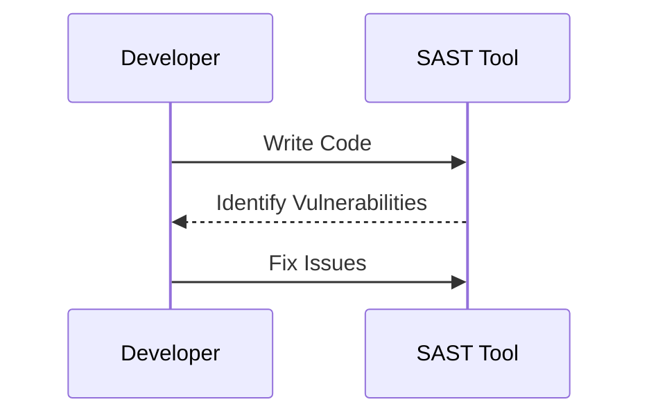
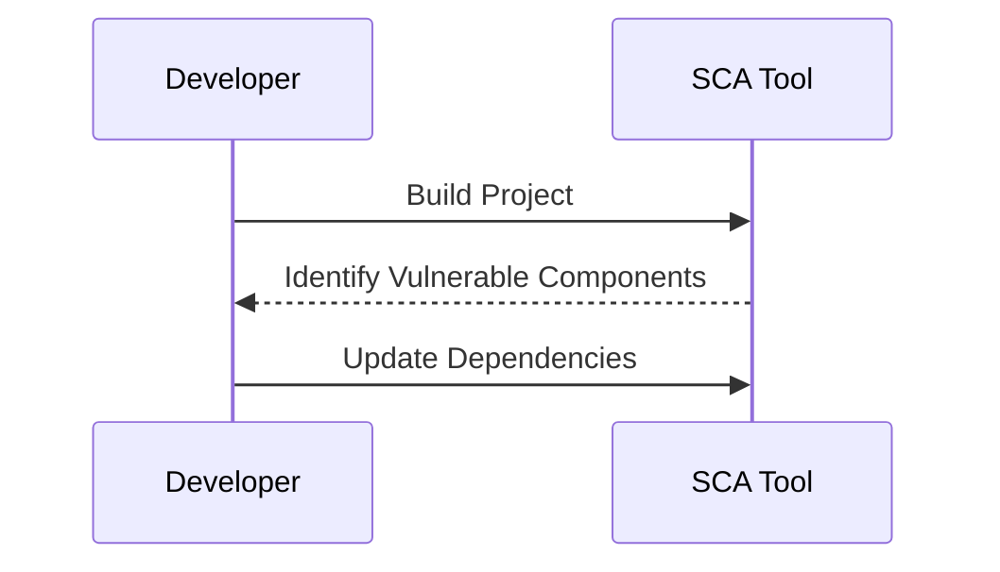
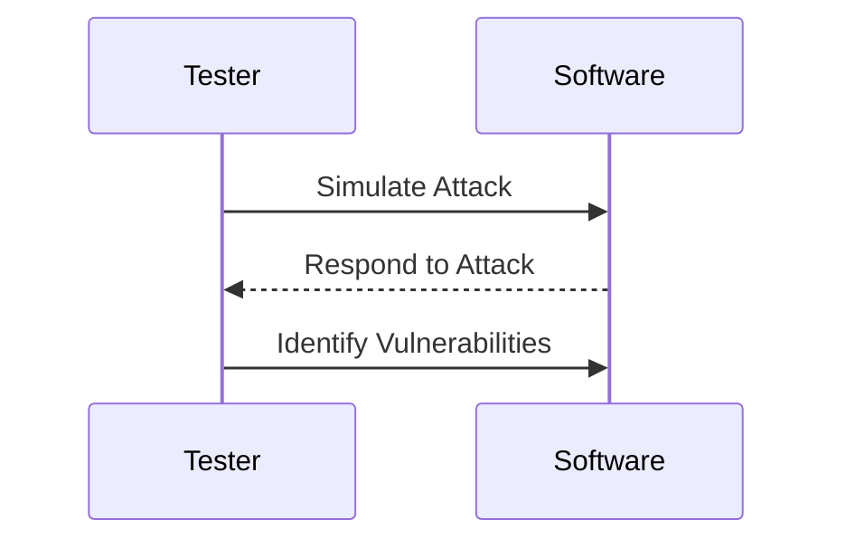

## Introduction to DevSecOps Governance and Compliance

In the realm of modern software development, DevSecOps has emerged as a critical approach to integrating security practices throughout the entire software development lifecycle (SDLC). According to a 2017 DevSecOps community survey, 58% of respondents indicated that security was an inhibitor to their DevSecOps agility. This highlights a significant challenge: ensuring security does not impede the rapid pace of development. To address this, it is essential to understand the nuances of integrating security checks into the DevSecOps pipeline effectively.

### The DevSecOps Pipeline

The DevSecOps pipeline can be broken down into several key stages: coding, building, and testing. Each stage presents unique opportunities to implement security checks and controls, thereby enhancing compliance and governance.

#### Coding Stage

During the coding stage, developers write the actual codebase. This is a critical phase where security vulnerabilities can be introduced. One of the primary tools used in this stage is Static Application Security Testing (SAST).

**Static Application Security Testing (SAST)**

SAST is a type of security analysis that examines the source code, bytecode, or binary code of a software application without executing the code. This allows developers to identify potential security vulnerabilities and coding errors early in the development process.

**Why SAST Matters**

SAST is crucial because it helps catch security issues before they become embedded in the codebase. This proactive approach reduces the cost and complexity of fixing vulnerabilities later in the development cycle. Additionally, SAST can help ensure that the code adheres to established security standards and best practices.

**How SAST Works**

SAST tools analyze the codebase against a set of predefined rules and patterns. These rules are designed to detect common security vulnerabilities such as SQL injection, cross-site scripting (XSS), buffer overflows, and insecure cryptographic practices. The analysis is typically performed during the continuous integration (CI) process, providing immediate feedback to developers.

**Real-World Example: CVE-2021-44228 (Log4Shell)**

One of the most notable recent vulnerabilities is CVE-2021-44228, commonly known as Log4Shell. This vulnerability affected the Apache Log4j library, allowing attackers to execute arbitrary code on affected systems. A SAST tool could have identified this vulnerability by flagging the use of the `JndiLookup` class, which is known to be vulnerable to remote code execution.

**Pitfalls of SAST**

While SAST is a powerful tool, it is not without its limitations. False positives can occur, leading developers to spend unnecessary time investigating non-issues. Additionally, SAST tools may miss certain types of vulnerabilities that require dynamic analysis.

**How to Prevent / Defend**

To effectively use SAST, it is important to configure the tool to use a comprehensive set of rules and patterns. Developers should also be trained to interpret and act on the findings provided by the SAST tool. Regular updates to the SAST tool’s rule set are necessary to keep up with new vulnerabilities and coding practices.

#### Build Phase

Once the code is written, the next stage is the build phase. This is where the code is compiled and packaged into a deployable artifact. At this stage, additional security checks can be implemented to ensure the final product is secure.

**Software Composition Analysis (SCA)**

Software Composition Analysis (SCA) is a process that identifies open-source and third-party components used in a software project. SCA tools analyze the dependencies and libraries used in the codebase to determine if any of these components contain known vulnerabilities.

**Why SCA Matters**

SCA is essential because many software projects rely heavily on open-source and third-party components. These components can introduce vulnerabilities if they are not kept up-to-date or if they are inherently flawed. By identifying these components and their associated vulnerabilities, SCA helps ensure that the final product is secure.

**How SCA Works**

SCA tools typically scan the project’s dependency tree and compare it against a database of known vulnerabilities. This allows developers to identify and address any vulnerable components before they are included in the final product.

**Real-World Example: CVE-2021-3427 (Apache Commons Collections)**

CVE-2021-3427 is a vulnerability affecting the Apache Commons Collections library. This vulnerability allows attackers to execute arbitrary code through deserialization attacks. An SCA tool would have flagged the use of this vulnerable component, prompting developers to update or replace it.

**Pitfalls of SCA**

SCA tools can sometimes produce false positives, especially if the database of known vulnerabilities is not comprehensive. Additionally, SCA tools may not be able to detect vulnerabilities in custom-built components or those that are not widely used.

**How to Prevent / Defend**

To effectively use SCA, it is important to regularly update the tool’s database of known vulnerabilities. Developers should also be trained to interpret and act on the findings provided by the SCA tool. Regular audits of the project’s dependency tree are necessary to ensure that all components are up-to-date and secure.

#### Testing Phase

After the code is built, the final stage is testing. This is where the software is subjected to various tests to ensure it meets the required quality and security standards.

**Penetration Testing**

Penetration testing, often referred to as pen testing, is a simulated cyberattack on a computer system to evaluate the security of the system. Pen testers attempt to find vulnerabilities that could be exploited by malicious actors.

**Why Pen Testing Matters**

Pen testing is crucial because it provides a real-world assessment of the software’s security posture. Unlike static and dynamic analysis tools, pen testing simulates actual attack scenarios, revealing vulnerabilities that might not be detected through automated means.

**How Pen Testing Works**

Pen testers use a variety of techniques to assess the security of the software. This includes scanning for open ports, identifying misconfigurations, and attempting to exploit known vulnerabilities. The goal is to identify any weaknesses that could be exploited by attackers.

**Real-World Example: Equifax Data Breach (2017)**

The Equifax data breach in 2017 exposed sensitive information of millions of customers. The breach was caused by a vulnerability in the Apache Struts framework. A thorough pen test could have identified this vulnerability, preventing the breach.

**Pitfalls of Pen Testing**

Pen testing can be time-consuming and resource-intensive. Additionally, pen testers may not always be able to simulate all possible attack scenarios, leaving some vulnerabilities undetected.

**How to Prevent / Defend**

To effectively use pen testing, it is important to engage experienced and certified pen testers. Regular pen tests should be conducted to ensure the software remains secure. Developers should also be trained to interpret and act on the findings provided by the pen testers.

### Conclusion

Integrating security checks into the DevSecOps pipeline is essential for ensuring compliance and governance. By implementing SAST, SCA, and pen testing, organizations can proactively identify and address security vulnerabilities throughout the development process. This not only enhances the security of the final product but also ensures that security does not inhibit the agility of the development team.

### Practice Labs

For hands-on experience with DevSecOps governance and compliance, consider the following practice labs:

- **PortSwigger Web Security Academy**: Offers a wide range of labs focused on web application security, including SAST and SCA.
- **OWASP Juice Shop**: A deliberately insecure web application for practicing security testing and vulnerability identification.
- **DVWA (Damn Vulnerable Web Application)**: Another intentionally vulnerable web application for learning and practicing web application security.

By engaging with these labs, you can gain practical experience in implementing and managing security checks within the DevSecOps pipeline.

---
<!-- nav -->
[[DevSecOps/DevSecOps Bootcamp/02-Security Governance & Compliance/03-Enabling Governance and Compliance with DevSecOps/01-Breaking down the DevSecOps Pipeline/00-Overview|Overview]] | [[02-Introduction to DevSecOps Pipeline|Introduction to DevSecOps Pipeline]]
