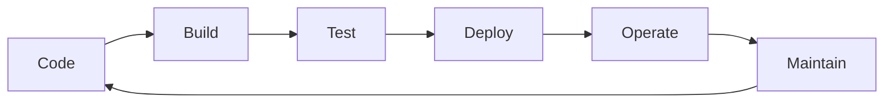
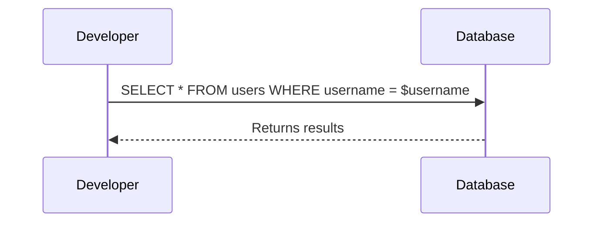
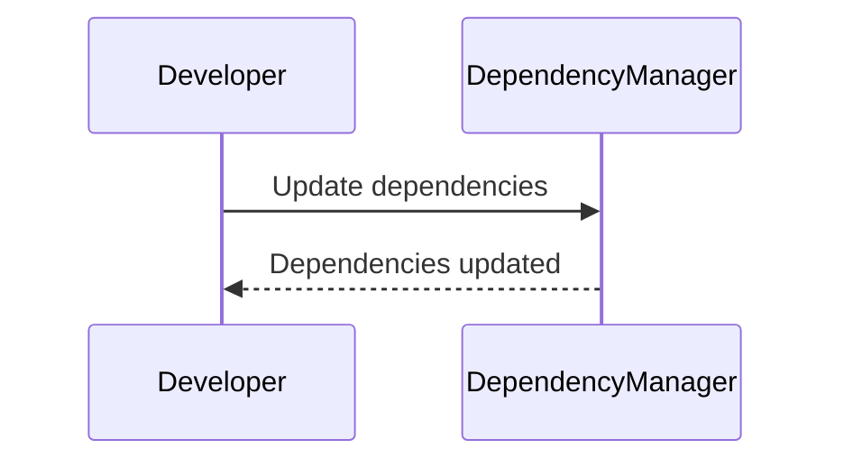
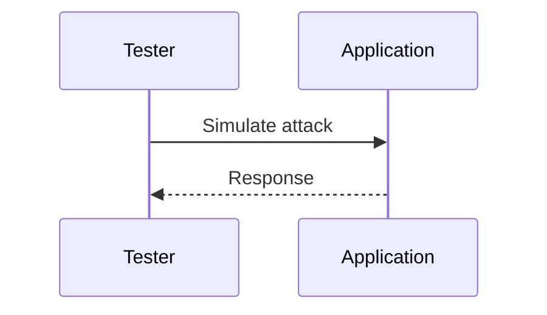

## Introduction to DevSecOps Pipeline

In the realm of modern software development, the integration of security practices into the DevOps pipeline has become increasingly critical. This approach, known as DevSecOps, aims to embed security throughout the entire software development lifecycle (SDLC) to ensure that applications are secure from the very beginning. The DevSecOps pipeline is a continuous process that encompasses various stages, each of which plays a crucial role in ensuring the security and compliance of the final product.

### Linear Representation of the DevSecOps Pipeline

To better understand the DevSecOps pipeline, let's break it down into its constituent stages. A typical DevSecOps pipeline can be visualized as follows:



This linear representation shows the iterative nature of the DevSecOps pipeline. Each stage feeds into the next, and once the final stage (Maintain) is completed, the process loops back to the beginning (Code) for the next iteration.

### Concentrating on Key Stages: Code, Build, and Test

For the purposes of this discussion, we will focus primarily on the first three stages of the pipeline: Code, Build, and Test. These stages are particularly important because they offer the most significant opportunities for introducing governance and compliance into the DevSecOps pipeline.

#### Why Focus on Code, Build, and Test?

The primary reason for focusing on these stages is that they provide the maximum impact in terms of reducing the cost of fixing security vulnerabilities. According to the principle of "shift-left," identifying and remediating security issues as early as possible in the SDLC significantly reduces the overall cost of software production. This is because the earlier a security vulnerability is discovered, the less expensive it is to fix.

### Understanding the Shift-Left Principle

The shift-left principle is a fundamental concept in DevSecOps that emphasizes the importance of integrating security practices as early as possible in the SDLC. By doing so, organizations can identify and address security issues before they become more costly to fix later in the development process.

#### Cost of Fixing Security Vulnerabilities

Security vulnerabilities are essentially software bugs that can be exploited to compromise the integrity, confidentiality, or availability of an application. The cost of fixing these vulnerabilities increases exponentially as the development process progresses. For instance, fixing a security issue during the coding phase is much cheaper than fixing it during the testing phase, and fixing it during the testing phase is cheaper than fixing it after deployment.

### Recent Real-World Examples

To illustrate the importance of the shift-left principle, let's consider a few recent real-world examples of security breaches that could have been prevented by implementing robust security practices earlier in the development process.

#### Example 1: Equifax Data Breach (CVE-2017-5638)

In 2017, Equifax suffered a massive data breach that exposed sensitive information of approximately 147 million consumers. The breach was caused by a vulnerability in the Apache Struts framework, which was not patched in a timely manner. This incident highlights the importance of having a robust patch management process and conducting regular security assessments to identify and mitigate vulnerabilities early in the development cycle.

#### Example 2: Capital One Data Breach (CVE-2019-11510)

In 2019, Capital One experienced a data breach that affected over 100 million customers. The breach was caused by a misconfiguration in the web application firewall (WAF) that allowed unauthorized access to customer data. This incident underscores the importance of proper configuration management and regular security audits to ensure that systems are configured securely.

### Detailed Breakdown of the DevSecOps Pipeline Stages

Now that we have a high-level understanding of the DevSecOps pipeline and the importance of the shift-left principle, let's delve deeper into each of the key stages: Code, Build, and Test.

#### Stage 1: Code

The code stage is where developers write the actual source code for the application. This stage is critical because it sets the foundation for the entire application. Any security vulnerabilities introduced at this stage can propagate through the rest of the pipeline.

##### Best Practices for Secure Coding

1. **Static Application Security Testing (SAST)**: SAST tools analyze the source code to identify potential security vulnerabilities. These tools can help developers catch issues such as SQL injection, cross-site scripting (XSS), and buffer overflows.
   
   ```mermaid
graph TD
       A[Developer Writes Code] --> B[SAST Tool Analysis]
       B --> C[Identify Vulnerabilities]
       C --> D[Remediate Issues]
       D --> A
```

2. **Code Reviews**: Peer code reviews are an essential practice for catching security issues early. Developers should review each other's code to ensure that security best practices are followed.

3. **Secure Coding Guidelines**: Organizations should establish secure coding guidelines that developers must follow. These guidelines can include rules for input validation, error handling, and secure communication protocols.

##### Common Pitfalls and How to Avoid Them

One common pitfall in the code stage is the lack of proper input validation. For example, failing to validate user input can lead to SQL injection attacks. To avoid this, developers should always validate user input using parameterized queries or prepared statements.



#### Stage 2: Build

The build stage is where the source code is compiled into executable code. This stage is critical because it ensures that the code is built correctly and that any dependencies are properly managed.

##### Best Practices for Secure Builds

1. **Dependency Management**: Ensure that all dependencies are up-to-date and free from known vulnerabilities. Tools like `npm audit` for Node.js and `pip-audit` for Python can help identify and fix vulnerable dependencies.

   ```mermaid
graph TD
       A[Source Code] --> B[Build Process]
       B --> C[Executable Code]
       B --> D[Dependency Check]
       D --> E[Update Dependencies]
       E --> B
```

2. **Containerization**: Using containerization technologies like Docker can help ensure that the build environment is consistent and secure. Containers can be scanned for vulnerabilities using tools like `Clair`.

3. **Immutable Infrastructure**: Implementing immutable infrastructure ensures that once a build is created, it cannot be modified. This helps prevent unauthorized changes that could introduce security vulnerabilities.

##### Common Pitfalls and How to Avoid Them

One common pitfall in the build stage is the use of outdated or vulnerable dependencies. To avoid this, organizations should regularly update their dependencies and use tools to scan for vulnerabilities.



#### Stage 3: Test

The test stage is where the application is tested to ensure that it functions correctly and meets the required security standards. This stage is critical because it helps catch any security vulnerabilities that were missed in the previous stages.

##### Best Practices for Secure Testing

1. **Dynamic Application Security Testing (DAST)**: DAST tools simulate real-world attacks to identify security vulnerabilities. These tools can help catch issues such as SQL injection, XSS, and CSRF.

   ```mermaid
graph TD
       A[Executable Code] --> B[DAST Tool Analysis]
       B --> C[Identify Vulnerabilities]
       C --> D[Remediate Issues]
       D --> A
```

2. **Penetration Testing**: Penetration testing involves simulating real-world attacks to identify and exploit vulnerabilities. This can help organizations identify and fix security issues before they can be exploited by attackers.

3. **Automated Testing**: Automated testing tools can help ensure that security tests are performed consistently and efficiently. Tools like `JUnit` for Java and `pytest` for Python can help automate the testing process.

##### Common Pitfalls and How to Avoid Them

One common pitfall in the test stage is the lack of comprehensive security testing. To avoid this, organizations should implement a combination of automated and manual testing to ensure that all potential security vulnerabilities are identified and addressed.



### How to Prevent and Defend Against Security Vulnerabilities

To effectively prevent and defend against security vulnerabilities, organizations should implement a multi-layered approach that includes both preventive and detective controls.

#### Preventive Controls

1. **Secure Coding Practices**: Implementing secure coding practices can help prevent security vulnerabilities from being introduced in the first place. This includes using SAST tools, conducting code reviews, and following secure coding guidelines.

2. **Dependency Management**: Ensuring that all dependencies are up-to-date and free from known vulnerabilities can help prevent security issues from being introduced through third-party libraries.

3. **Immutable Infrastructure**: Implementing immutable infrastructure ensures that once a build is created, it cannot be modified. This helps prevent unauthorized changes that could introduce security vulnerabilities.

#### Detective Controls

1. **Continuous Monitoring**: Continuous monitoring tools can help detect security issues in real-time. This includes tools like intrusion detection systems (IDS) and security information and event management (SIEM) systems.

2. **Regular Audits**: Regular security audits can help identify and address security issues before they can be exploited. This includes both internal and external audits conducted by independent third parties.

3. **Incident Response Plan**: Having a well-defined incident response plan can help organizations quickly respond to security incidents and minimize the impact of any breaches.

### Conclusion

In conclusion, the DevSecOps pipeline is a continuous process that encompasses various stages, each of which plays a crucial role in ensuring the security and compliance of the final product. By focusing on the key stages of Code, Build, and Test, organizations can maximize their impact in terms of reducing the cost of fixing security vulnerabilities. Implementing a multi-layered approach that includes both preventive and detective controls can help organizations effectively prevent and defend against security vulnerabilities.

### Practice Labs

To gain hands-on experience with DevSecOps principles, consider the following practice labs:

- **PortSwigger Web Security Academy**: Offers interactive labs for learning web security concepts.
- **OWASP Juice Shop**: A deliberately insecure web application for practicing web security skills.
- **DVWA (Damn Vulnerable Web Application)**: A PHP/MySQL web application that is vulnerable by design for educational purposes.
- **WebGoat**: An interactive, gamified training application for learning about web application security.

By engaging with these practice labs, you can apply the theoretical knowledge gained from this chapter to real-world scenarios and further enhance your understanding of DevSecOps principles.

---
<!-- nav -->
[[01-Introduction to DevSecOps Governance and Compliance|Introduction to DevSecOps Governance and Compliance]] | [[DevSecOps/DevSecOps Bootcamp/02-Security Governance & Compliance/03-Enabling Governance and Compliance with DevSecOps/01-Breaking down the DevSecOps Pipeline/00-Overview|Overview]] | [[DevSecOps/DevSecOps Bootcamp/02-Security Governance & Compliance/03-Enabling Governance and Compliance with DevSecOps/01-Breaking down the DevSecOps Pipeline/03-Practice Questions & Answers|Practice Questions & Answers]]
