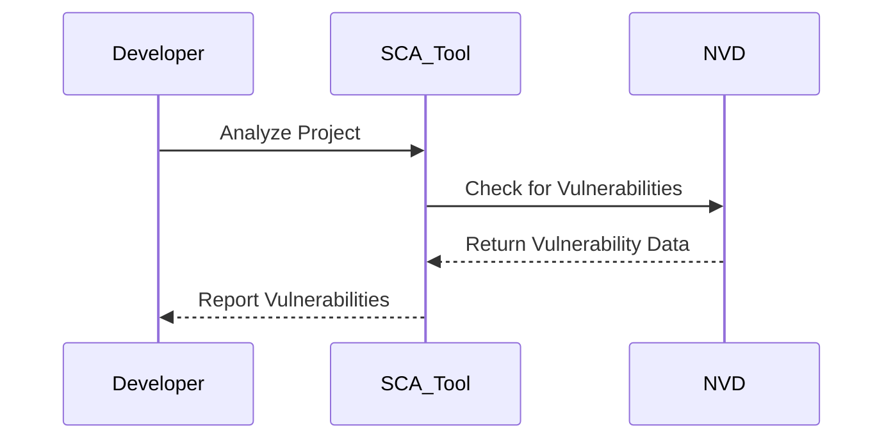
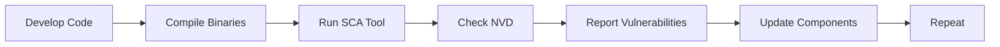
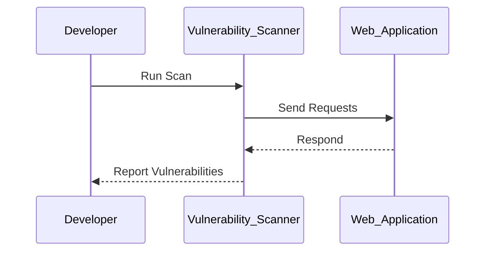
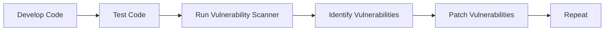

## Introduction to Governance and Compliance in the Build Stage

In the realm of DevSecOps, the build stage is a critical phase where developers compile their source code into executable artifacts. This stage is pivotal for ensuring that the final product meets both functional and non-functional requirements, including security and compliance standards. Two key areas where compliance and governance controls can be implemented during the build stage are **Software Composition Analysis (SCA)** and **Vulnerability Scanning**. Understanding these concepts thoroughly is essential for maintaining a robust and secure development pipeline.

### Software Composition Analysis (SCA)

#### What is SCA?

Software Composition Analysis (SCA) is a process used to identify open-source and third-party components within a software project. It helps in determining the presence of known vulnerabilities in these components. Unlike **Static Application Security Testing (SAST)**, which focuses on analyzing the source code of an application, SCA examines the compiled binaries and libraries used in the software.

#### Why is SCA Important?

Modern software projects rarely start from scratch. They often rely on a myriad of open-source libraries and frameworks. Each of these components can introduce vulnerabilities if not properly vetted. SCA ensures that developers are aware of the components they are using and any associated risks. This is crucial for maintaining compliance with various regulatory requirements, such as GDPR, HIPAA, and PCI-DSS.

#### How Does SCA Work?

SCA tools work by analyzing the binary signatures of the software components. They compare these signatures against a database of known vulnerabilities. One of the most widely used databases is the **National Vulnerability Database (NVD)**, maintained by the U.S. government. Other databases include:

- **CVE (Common Vulnerabilities and Exposures)**
- **OSV (Open Source Vulnerability Database)**

These databases contain detailed information about known vulnerabilities, including their severity ratings and potential impacts.

#### Example of SCA in Action

Consider a scenario where a software project uses the `log4j` library. In December 2021, a critical vulnerability (CVE-2021-44228) was discovered in `log4j`, leading to widespread exploitation. An SCA tool would identify the presence of `log4j` in the project and check the NVD for any known vulnerabilities. If the tool finds that the version of `log4j` being used is vulnerable, it would alert the developer to update to a safer version.

#### Common Tools for SCA

Several tools are available for performing SCA. Some of the most popular ones include:

- **JFrog Xray**: A comprehensive SCA tool that integrates with CI/CD pipelines.
- **Veracode**: Offers a suite of security testing tools, including SCA.
- **Checkmarx**: Provides SCA capabilities alongside other security testing features.

#### How to Prevent / Defend Against SCA Issues

To ensure that your software project remains compliant and secure, follow these steps:

1. **Regularly Update Components**: Keep all third-party components up to date with the latest security patches.
2. **Use Trusted Sources**: Only use components from trusted sources and repositories.
3. **Automate SCA**: Integrate SCA tools into your CI/CD pipeline to automatically scan for vulnerabilities.

### Vulnerability Scanning

#### What is Vulnerability Scanning?

Vulnerability scanning is the process of identifying security weaknesses in software applications. Unlike SCA, which focuses on third-party components, vulnerability scanning examines the entire application, including custom code. This process helps in identifying potential security issues that could be exploited by attackers.

#### Why is Vulnerability Scanning Important?

Vulnerability scanning is crucial for ensuring that the software is free from security flaws. It helps in identifying and mitigating risks before the application is deployed, thereby reducing the likelihood of post-deployment security incidents. This is particularly important for applications handling sensitive data, such as financial transactions or personal information.

#### How Does Vulnerability Scanning Work?

Vulnerability scanners work by sending various types of traffic to the application and analyzing the responses. They look for patterns that indicate the presence of known vulnerabilities. Some common types of vulnerability scans include:

- **Network Scans**: Identify open ports and services.
- **Application Scans**: Test the application for vulnerabilities like SQL injection, cross-site scripting (XSS), and buffer overflows.
- **Configuration Scans**: Check for misconfigurations that could lead to security issues.

#### Example of Vulnerability Scanning in Action

Consider a web application that handles user authentication. A vulnerability scanner might send a series of requests to test for SQL injection vulnerabilities. If the application is vulnerable, the scanner will identify this and report it to the developer.

#### Common Tools for Vulnerability Scanning

Several tools are available for performing vulnerability scanning. Some of the most popular ones include:

- **Nessus**: A widely used vulnerability scanner that supports both network and application scanning.
- **OWASP ZAP**: An open-source tool for testing web applications.
- **Qualys**: A cloud-based vulnerability management platform.

#### How to Prevent / Defend Against Vulnerability Scanning Issues

To ensure that your software project remains secure, follow these steps:

1. **Regularly Scan Applications**: Use vulnerability scanners to regularly check for security issues.
2. **Patch Known Vulnerabilities**: Apply security patches promptly to address any identified vulnerabilities.
3. **Implement Secure Coding Practices**: Follow secure coding guidelines to minimize the introduction of new vulnerabilities.

### Real-World Examples and Recent Breaches

#### Example 1: Equifax Data Breach (2017)

The Equifax data breach, one of the largest in history, was caused by a vulnerability in the Apache Struts framework. The company failed to patch a known vulnerability (CVE-2017-5638), which allowed attackers to gain unauthorized access to sensitive data. This breach highlights the importance of regular vulnerability scanning and timely patch management.

#### Example 2: SolarWinds Supply Chain Attack (2020)

In December 2020, SolarWinds, a provider of IT management software, was compromised through a supply chain attack. The attackers inserted malicious code into the company's software updates, which were then distributed to thousands of customers. This incident underscores the importance of SCA and the need to verify the integrity of third-party components.

### Conclusion

Ensuring compliance and governance in the build stage of a DevSecOps pipeline is crucial for maintaining the security and integrity of software projects. By implementing Software Composition Analysis (SCA) and Vulnerability Scanning, organizations can identify and mitigate risks associated with third-party components and custom code. Regularly updating components, using trusted sources, and integrating these tools into CI/CD pipelines are essential steps for maintaining a secure development environment.

### Practice Labs

For hands-on experience with SCA and vulnerability scanning, consider the following labs:

- **PortSwigger Web Security Academy**: Offers interactive labs for learning web security concepts, including vulnerability scanning.
- **OWASP Juice Shop**: A deliberately insecure web application for practicing web security skills.
- **DVWA (Damn Vulnerable Web Application)**: A PHP/MySQL web application that demonstrates common web application vulnerabilities.

By engaging with these labs, you can gain practical experience in implementing and defending against security threats in the build stage of a DevSecOps pipeline.

---
<!-- nav -->
[[DevSecOps/DevSecOps Bootcamp/02-Security Governance & Compliance/03-Enabling Governance and Compliance with DevSecOps/02-Build Stage/00-Overview|Overview]] | [[02-Build Stage in DevSecOps Pipeline|Build Stage in DevSecOps Pipeline]]
