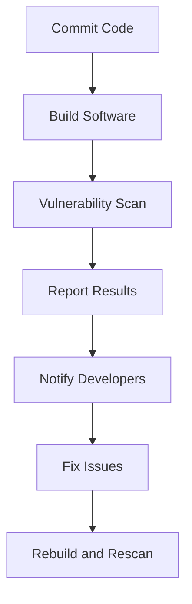

## Build Stage in DevSecOps Pipeline

In the context of DevSecOps, the build stage is a critical phase where the compiled software is ready for further analysis and testing. This stage is pivotal for ensuring that the software meets both functional and security requirements. One of the primary activities during this phase is running vulnerability scans on the compiled software. Traditionally, these scans were performed manually on a quarterly or monthly basis. However, with the advent of DevSecOps, the approach has shifted towards automating these scans within the Continuous Integration/Continuous Delivery (CI/CD) pipeline.

### Vulnerability Scans in Traditional Models

Traditionally, vulnerability scans were conducted manually and infrequently. These scans aimed to identify potential security weaknesses in the software. The process typically involved:

1. **Manual Execution**: Security teams would manually initiate the scan using tools like Nessus, Qualys, or EdgeScan.
2. **Periodic Scanning**: Scans were scheduled periodically, often on a monthly or quarterly basis.
3. **Manual Analysis**: After the scan, security analysts would review the results and report any identified vulnerabilities.

This traditional approach had several limitations:

- **Timeliness**: Vulnerabilities could go unnoticed for extended periods, increasing the risk of exploitation.
- **Resource Intensive**: Manual execution required significant human effort and expertise.
- **Limited Coverage**: Periodic scans might miss newly introduced vulnerabilities between scan intervals.

### Transition to DevSecOps Model

The DevSecOps model aims to address these limitations by integrating security practices into the CI/CD pipeline. This integration ensures that security checks are performed continuously and automatically, reducing the risk of vulnerabilities being overlooked.

#### Key Benefits of Automated Vulnerability Scans

1. **Frequent Scans**: By integrating vulnerability scans into the CI/CD pipeline, organizations can perform these scans much more frequently, often after every build.
2. **Automation**: Automation reduces the manual effort required for initiating and analyzing scans, making the process more efficient.
3. **Immediate Feedback**: Developers receive immediate feedback on the security status of their code, enabling them to address issues promptly.

### Common Tools for Vulnerability Scans

Several tools are commonly used for vulnerability scanning in the DevSecOps environment. These tools often expose APIs or webhooks that can be integrated into the CI/CD pipeline. Some popular tools include:

- **Qualys**: A comprehensive security platform that includes vulnerability management, web application scanning, and compliance management.
- **EdgeScan**: A cloud-based security testing platform that provides continuous monitoring and testing of web applications.
- **Nessus**: A widely-used vulnerability scanner that identifies security weaknesses in systems and networks.
- **Tenable.io**: A cloud-based vulnerability management solution that provides continuous monitoring and detailed reporting.

#### Example: Integrating Qualys with CI/CD Pipeline

To illustrate the integration process, let's consider an example using Qualys. The following steps outline how to integrate Qualys into a CI/CD pipeline:

1. **Setup Qualys Account**: Create an account on Qualys and obtain the necessary API credentials.
2. **Configure CI/CD Pipeline**: Modify the CI/CD pipeline to include a step for running the vulnerability scan using Qualys.
3. **Invoke Qualys API**: Use the Qualys API to trigger a scan and retrieve the results.

Here is a sample script to invoke the Qualys API:

```python
import requests
import json

# Qualys API credentials
api_url = "https://qualysapi.qualys.com/ms/assets/v1"
api_key = "your_api_key"
secret_key = "your_secret_key"

# Define the scan parameters
scan_params = {
    "action": "launch",
    "target": "your_target_ip_or_hostname",
    "title": "CI/CD Vulnerability Scan"
}

# Set up the API request
headers = {
    "X-Requested-With": "Python Requests",
    "Content-Type": "application/json"
}
auth = (api_key, secret_key)

# Trigger the scan
response = requests.post(api_url, data=json.dumps(scan_params), headers=headers, auth=auth)

# Check the response
if response.status_code == 200:
    print("Scan initiated successfully")
else:
    print(f"Failed to initiate scan: {response.text}")
```

### Real-World Examples and Recent Breaches

Recent breaches and vulnerabilities highlight the importance of continuous vulnerability scanning. For instance, the Log4j vulnerability (CVE-2021-44228) affected numerous applications and systems worldwide. Organizations that had implemented continuous vulnerability scanning were better equipped to identify and mitigate this vulnerability quickly.

#### Case Study: Log4j Vulnerability

The Log4j vulnerability was a critical security flaw that allowed attackers to execute arbitrary code on affected systems. Many organizations that had integrated vulnerability scanning into their CI/CD pipelines were able to detect and patch this vulnerability promptly.

### How to Prevent / Defend Against Vulnerabilities

To effectively prevent and defend against vulnerabilities, organizations should implement a multi-layered approach:

1. **Automated Scanning**: Integrate vulnerability scanning into the CI/CD pipeline to ensure frequent and automatic scans.
2. **Immediate Feedback**: Provide developers with immediate feedback on the security status of their code.
3. **Secure Coding Practices**: Encourage developers to follow secure coding practices and regularly review code for security vulnerabilities.
4. **Patch Management**: Maintain a robust patch management system to ensure that all systems are up-to-date with the latest security patches.
5. **Security Training**: Regularly train developers and security teams on the latest security threats and best practices.

#### Secure Coding Example

Consider a scenario where a developer writes a piece of code that is vulnerable to SQL injection. Here is an example of insecure code:

```python
# Insecure Code
def get_user_data(user_id):
    cursor.execute(f"SELECT * FROM users WHERE id = {user_id}")
    return cursor.fetchall()
```

To secure this code, parameterized queries should be used:

```python
# Secure Code
def get_user_data(user_id):
    cursor.execute("SELECT * FROM users WHERE id = %s", (user_id,))
    return cursor.fetchall()
```

### Mermaid Diagrams

To visualize the integration of vulnerability scanning into the CI/CD pipeline, consider the following mermaid diagram:



### Hands-On Labs

For practical experience with integrating vulnerability scanning into the CI/CD pipeline, consider the following labs:

- **PortSwigger Web Security Academy**: Offers modules on vulnerability scanning and secure coding practices.
- **OWASP Juice Shop**: Provides a vulnerable web application for practicing security assessments and vulnerability scanning.
- **DVWA (Damn Vulnerable Web Application)**: A deliberately insecure web application for practicing penetration testing and vulnerability scanning.

By following these guidelines and implementing the recommended practices, organizations can significantly enhance their security posture and reduce the risk of vulnerabilities being exploited.

---
<!-- nav -->
[[01-Introduction to Governance and Compliance in the Build Stage|Introduction to Governance and Compliance in the Build Stage]] | [[DevSecOps/DevSecOps Bootcamp/02-Security Governance & Compliance/03-Enabling Governance and Compliance with DevSecOps/02-Build Stage/00-Overview|Overview]] | [[DevSecOps/DevSecOps Bootcamp/02-Security Governance & Compliance/03-Enabling Governance and Compliance with DevSecOps/02-Build Stage/03-Practice Questions & Answers|Practice Questions & Answers]]
