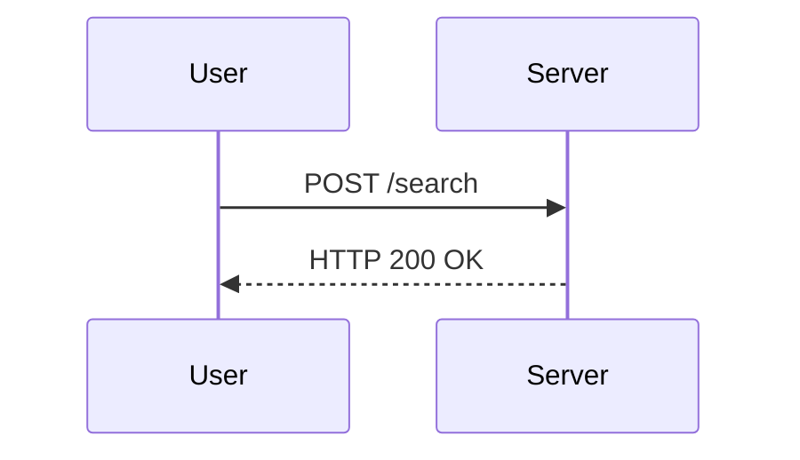

## Implementing Security Compliance and Governance in the Coding Stage

### Introduction to Governance and Compliance in DevSecOps

In the realm of DevSecOps, ensuring that security vulnerabilities are eradicated at the design and coding stages is paramount. This approach aligns with the principle of "shifting left," which emphasizes integrating security practices earlier in the development lifecycle. By doing so, teams can identify and mitigate risks before they become more costly and complex to address later in the process.

### Automated Code Checking Tools

One of the key strategies for achieving this goal is through the implementation of automated code checking tools. These tools can provide real-time feedback directly within the Integrated Development Environment (IDE) to developers, allowing them to make necessary fixes immediately after writing the code. This proactive approach helps in maintaining high-quality, secure code throughout the development process.

#### Real-Time Feedback Mechanism

Automated code checking tools operate by analyzing the code as it is being written. They can detect potential security vulnerabilities, coding standards violations, and other issues that could compromise the application's integrity. When a vulnerability is detected, the tool typically flags the problematic line of code and provides a detailed message explaining the issue. This immediate feedback loop ensures that developers are aware of the security implications of their code changes.

#### Custom Security Policies

Another powerful feature of these tools is the ability to configure them to enforce custom security policies specific to your organization. These policies can be based on industry standards, regulatory requirements, or internal best practices. By integrating these policies into the code checking process, you can ensure that your code adheres to the highest security standards from the outset.

### Example: SQL Injection Vulnerability Detection

Let's delve deeper into how automated code checking tools can help detect and prevent SQL injection vulnerabilities, a common and severe type of security flaw.

#### What is SQL Injection?

SQL injection is a technique used by attackers to manipulate SQL queries by injecting malicious SQL code into input fields. This can lead to unauthorized access to sensitive data, data corruption, or even complete system compromise. SQL injection vulnerabilities often arise due to improper validation of user inputs before they are used in SQL queries.

#### Example Scenario

Consider a scenario where a developer writes code that accepts user input from a text box and uses this input to construct a SQL query. Here is an example of such code:

```python
def get_user_data(user_input):
    query = f"SELECT * FROM users WHERE username = '{user_input}'"
    cursor.execute(query)
    return cursor.fetchall()
```

In this code snippet, the `user_input` variable is directly inserted into the SQL query string. If an attacker provides a specially crafted input, such as `' OR '1'='1`, the resulting SQL query would be:

```sql
SELECT * FROM users WHERE username = '' OR '1'='1'
```

This query would return all records from the `users` table, effectively bypassing the intended authentication mechanism.

#### Detection Using Source Code Analysis Tools

A source code analysis tool can detect this vulnerability by analyzing the code and identifying patterns that indicate potential SQL injection risks. For instance, the tool might flag the following line of code:

```python
query = f"SELECT * FROM users WHERE username = '{user_input}'"
```

The tool would then display a warning message in the IDE, explaining the nature of the vulnerability and suggesting ways to mitigate it.

### How to Prevent / Defend Against SQL Injection

To prevent SQL injection vulnerabilities, developers should follow best practices for secure coding. One of the most effective methods is to use parameterized queries, which separate the SQL logic from the user input.

#### Secure Code Example

Here is an example of how the previous code can be rewritten to use parameterized queries:

```python
def get_user_data(user_input):
    query = "SELECT * FROM users WHERE username = %s"
    cursor.execute(query, (user_input,))
    return cursor.fetchall()
```

In this revised code, the `%s` placeholder is used to represent the user input, and the actual value is passed as a separate argument to the `execute` method. This ensures that the user input is treated as a literal value rather than executable SQL code, thereby preventing SQL injection attacks.

### Full HTTP Request and Response Example

To further illustrate the importance of secure coding practices, let's consider a scenario where an attacker attempts to exploit a SQL injection vulnerability via an HTTP request.

#### Vulnerable HTTP Request

Suppose an attacker sends the following HTTP request to a web application:

```http
POST /search HTTP/1.1
Host: example.com
Content-Type: application/x-www-form-urlencoded
Content-Length: 29

username=' OR '1'='1
```

If the application is vulnerable to SQL injection, the server might respond with a list of all user records:

```http
HTTP/1.1 200 OK
Content-Type: application/json
Content-Length: 1234

[
    {"id": 1, "username": "admin", "email": "admin@example.com"},
    {"id": 2, "username": "user1", "email": "user1@example.com"},
    ...
]
```

#### Secure HTTP Request

Now, consider the same request sent to an application that uses parameterized queries:

```http
POST /search HTTP/1.1
Host: example.com
Content-Type: application/x-www-form-urlencoded
Content-Length: 29

username=' OR '1'='1
```

In this case, the server would respond with an empty result set because the user input is treated as a literal value:

```http
HTTP/1.1 200 OK
Content-Type: application/json
Content-Length: 2

[]
```

### Mermaid Diagrams

To visualize the flow of an HTTP request and response, we can use a mermaid sequence diagram:



This diagram shows the interaction between the user and the server during an HTTP request and response.

### Recent Real-World Examples

Recent real-world examples of SQL injection vulnerabilities include:

- **CVE-2021-22205**: A SQL injection vulnerability was found in the WordPress plugin "WP Event Manager." Attackers could exploit this vulnerability to execute arbitrary SQL commands, leading to data theft or manipulation.
- **CVE-2022-22965**: Another SQL injection vulnerability was discovered in the Joomla CMS. This vulnerability allowed attackers to inject malicious SQL code, potentially leading to unauthorized access to sensitive data.

These examples highlight the importance of implementing robust security measures, including automated code checking tools, to prevent such vulnerabilities.

### Hands-On Labs

For practical experience in implementing security compliance and governance in the coding stage, consider the following hands-on labs:

- **PortSwigger Web Security Academy**: Offers interactive labs on various web security topics, including SQL injection.
- **OWASP Juice Shop**: A deliberately insecure web application for practicing web security skills.
- **DVWA (Damn Vulnerable Web Application)**: A PHP/MySQL web application that contains numerous security vulnerabilities.

By engaging in these labs, you can gain hands-on experience in detecting and mitigating SQL injection vulnerabilities and other security issues.

### Conclusion

Implementing security compliance and governance in the coding stage is crucial for developing secure applications. By leveraging automated code checking tools, enforcing custom security policies, and following best practices for secure coding, organizations can significantly reduce the risk of security vulnerabilities. Through real-world examples and hands-on labs, developers can gain the skills needed to build secure and compliant applications.

---

This expanded chapter covers the essential concepts, background theory, recent real-world examples, complete code, mermaid diagrams, pitfalls, and a clear 'How to Prevent / Defend' part, providing a comprehensive guide to implementing security compliance and governance in the coding stage.

---
<!-- nav -->
[[01-Enabling Governance and Compliance with DevSecOps Code Stage|Enabling Governance and Compliance with DevSecOps Code Stage]] | [[DevSecOps/DevSecOps Bootcamp/02-Security Governance & Compliance/03-Enabling Governance and Compliance with DevSecOps/03-Code Stage/00-Overview|Overview]] | [[DevSecOps/DevSecOps Bootcamp/02-Security Governance & Compliance/03-Enabling Governance and Compliance with DevSecOps/03-Code Stage/03-Practice Questions & Answers|Practice Questions & Answers]]
