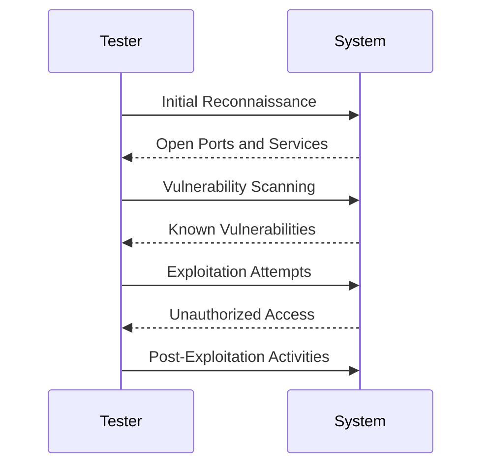
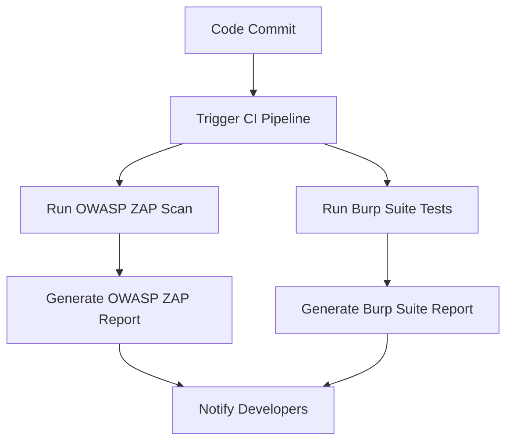
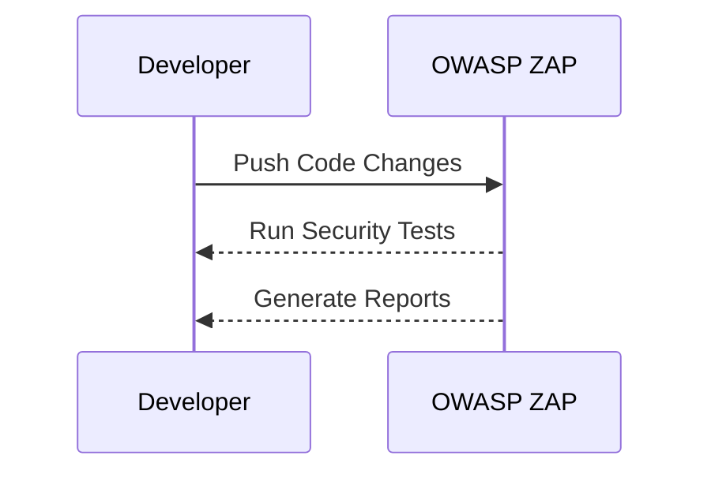

## Introduction to Testing Phase in DevSecOps

In the context of DevSecOps, the testing phase is a critical stage where the focus shifts from development to ensuring that the software meets both functional and non-functional requirements, including security and compliance. Traditionally, penetration testing was conducted during this phase to identify vulnerabilities and ensure that the system could withstand malicious attacks. However, with the advent of DevSecOps, the approach to testing has evolved to integrate security throughout the entire software development lifecycle (SDLC).

### Traditional Penetration Testing

Penetration testing, often referred to as "pen testing," is a simulated cyberattack against a computer system to check for exploitable vulnerabilities. The goal is to identify weaknesses in the system that could be exploited by attackers. During a traditional pen test, the following activities are typically performed:

1. **Vulnerability Scanning**: Automated tools are used to scan the system for known vulnerabilities.
2. **Discovery Tasks**: Manual exploration to understand the application's architecture and identify potential entry points.
3. **Automated Testing**: Running automated tools to test for specific vulnerabilities.
4. **Manual Penetration Testing**: Once the tester understands the application and the assignment scope, they perform detailed manual testing to exploit identified vulnerabilities.

#### Example of Traditional Penetration Testing

Consider a scenario where a company has developed a web application and wants to ensure it is secure before deployment. A traditional pen test might involve the following steps:

1. **Initial Reconnaissance**:
    - **Tools**: Nmap, Shodan
    - **Objective**: Identify open ports, services, and potential entry points.

2. **Vulnerability Scanning**:
    - **Tools**: Nessus, OpenVAS
    - **Objective**: Detect known vulnerabilities in the system.

3. **Exploitation**:
    - **Tools**: Metasploit, Burp Suite
    - **Objective**: Attempt to exploit identified vulnerabilities to gain unauthorized access.

4. **Post-Exploitation**:
    - **Tools**: Mimikatz, PowerShell Empire
    - **Objective**: Maintain access and gather additional information.



### Challenges with Traditional Penetration Testing

While traditional pen testing is effective, it comes with several challenges:

1. **Time-Consuming**: Pen tests require significant time and resources, often disrupting the development process.
2. **Disruption to Continuous Delivery**: Traditional pen testing requires handing over the code to the testing team, which can introduce delays and break the continuous delivery model.
3. **Limited Coverage**: Manual testing may miss certain vulnerabilities due to human error or oversight.

### Automating Penetration Testing in DevSecOps

To address these challenges, DevSecOps advocates for automating penetration testing to integrate security seamlessly into the SDLC. Automation allows for continuous testing without disrupting the development process, ensuring that security is an integral part of the software development pipeline.

#### Tools for Automated Penetration Testing

Several tools are available for automating penetration testing:

1. **OWASP ZAP**: An open-source tool for finding vulnerabilities in web applications.
2. **Burp Suite**: A commercial tool for web application security testing.
3. **Nessus**: A vulnerability scanner that can be integrated into automated testing pipelines.
4. **Metasploit**: A framework for developing and executing security audits and penetration tests.

#### Example of Automated Penetration Testing

Consider a web application that needs to be tested for security vulnerabilities. The following steps outline an automated penetration testing process:

1. **Setup Continuous Integration (CI) Pipeline**:
    - Integrate tools like OWASP ZAP and Burp Suite into the CI pipeline.
    - Configure the pipeline to automatically run security tests whenever changes are pushed to the repository.

2. **Run Automated Tests**:
    - Use OWASP ZAP to scan the application for vulnerabilities.
    - Use Burp Suite to perform automated penetration testing.

3. **Generate Reports**:
    - Automatically generate reports detailing any vulnerabilities found.
    - Integrate reporting into the CI pipeline to notify developers of issues.



### Real-World Examples and Recent Breaches

Recent breaches highlight the importance of robust security testing practices. For instance, the Capital One data breach in 2019 exposed sensitive customer data due to a misconfigured web application firewall. This incident underscores the need for thorough security testing to identify and mitigate such vulnerabilities.

#### CVE Example: CVE-2021-21972

CVE-2021-21972 is a vulnerability in the Apache Log4j library that allows remote code execution. This vulnerability was exploited in numerous high-profile breaches, emphasizing the need for continuous security testing and patch management.

### How to Prevent / Defend

To prevent and defend against security vulnerabilities, the following measures should be taken:

1. **Regular Security Audits**: Conduct regular security audits using automated tools to identify and mitigate vulnerabilities.
2. **Patch Management**: Ensure that all dependencies and libraries are up-to-date and patched against known vulnerabilities.
3. **Secure Coding Practices**: Implement secure coding practices to prevent common vulnerabilities such as SQL injection, cross-site scripting (XSS), and cross-site request forgery (CSRF).

#### Secure Coding Example

Consider a web application that uses user input to construct SQL queries. Without proper sanitization, this can lead to SQL injection vulnerabilities.

**Vulnerable Code**:
```python
def get_user_data(username):
    query = f"SELECT * FROM users WHERE username = '{username}'"
    cursor.execute(query)
    return cursor.fetchall()
```

**Secure Code**:
```python
def get_user_data(username):
    query = "SELECT * FROM users WHERE username = %s"
    cursor.execute(query, (username,))
    return cursor.fetchall()
```

### Detection and Prevention

Detection involves identifying vulnerabilities through automated testing and continuous monitoring. Prevention involves implementing secure coding practices and maintaining up-to-date dependencies.

#### Detection Example

Use tools like OWASP ZAP to continuously monitor the application for vulnerabilities.



### Conclusion

In conclusion, the testing phase in DevSecOps is crucial for ensuring that the software meets both functional and security requirements. By integrating automated penetration testing into the SDLC, organizations can maintain continuous delivery while ensuring robust security. Regular security audits, patch management, and secure coding practices are essential for preventing and defending against vulnerabilities.

### Practice Labs

For hands-on practice, consider the following labs:

- **PortSwigger Web Security Academy**: Offers interactive labs for learning web security concepts and techniques.
- **OWASP Juice Shop**: A deliberately insecure web application for practicing web security skills.
- **DVWA (Damn Vulnerable Web Application)**: A PHP/MySQL web application that is riddled with vulnerabilities for educational purposes.

These labs provide practical experience in identifying and mitigating security vulnerabilities, reinforcing the theoretical knowledge gained from this chapter.

---
<!-- nav -->
[[DevSecOps/DevSecOps Bootcamp/02-Security Governance & Compliance/03-Enabling Governance and Compliance with DevSecOps/04-Test Stage/00-Overview|Overview]] | [[02-Enabling Governance and Compliance with DevSecOps Test Stage|Enabling Governance and Compliance with DevSecOps Test Stage]]
