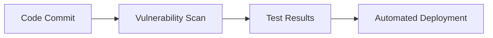
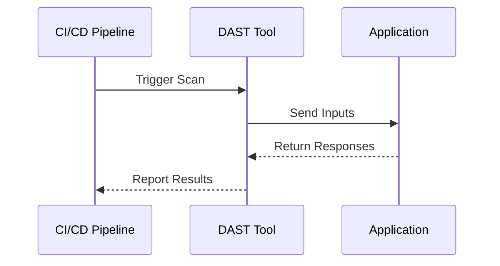
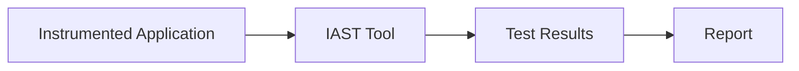
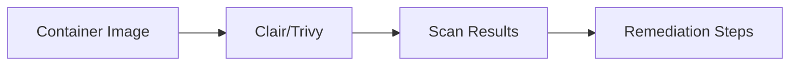
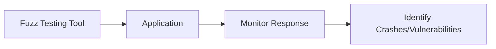

## Enabling Governance and Compliance with DevSecOps: Test Stage

### Introduction to Governance and Compliance in DevSecOps

Governance and compliance are critical components of DevSecOps, ensuring that software development processes adhere to regulatory requirements and internal policies. In the context of DevSecOps, governance involves the establishment of rules, policies, and procedures to manage and control the development lifecycle effectively. Compliance ensures that these rules and policies are followed, thereby minimizing risks and maintaining trust among stakeholders.

### Breaking Down Penetration Testing Tasks

Penetration testing is a crucial aspect of ensuring the security of applications. However, traditional penetration testing can be time-consuming and resource-intensive. To address this, it is recommended to break down the tasks performed by the penetration testing team and identify which tasks can be automated. Automating these tasks can significantly reduce the effort and time required for manual testing, making the process more efficient.

#### Example: Vulnerability Scans

One of the primary tasks that can be automated is vulnerability scanning. Instead of relying on the penetration testing team to perform these scans manually, they can be pushed left towards an earlier stage in the process. This means integrating vulnerability scanning tools into the continuous integration/continuous deployment (CI/CD) pipeline.



**Why Automate Vulnerability Scans?**

- **Efficiency**: Automated scans can be run frequently, ensuring that vulnerabilities are detected early in the development cycle.
- **Consistency**: Automated tools provide consistent results, reducing the variability associated with manual testing.
- **Cost-Effective**: Reduces the need for dedicated resources to perform repetitive tasks.

### Dynamic Application Security Testing (DAST)

Dynamic Application Security Testing (DAST) is a type of security testing that involves analyzing the application while it is running. DAST tools simulate attacks on the application to identify vulnerabilities such as SQL injection, cross-site scripting (XSS), and others.

#### How DAST Works

DAST tools interact with the application through its user interface, sending various inputs to check for vulnerabilities. These tools can be integrated into the CI/CD pipeline to automatically scan the application during each build.



**Real-World Example: CVE-2021-21972**

CVE-2021-21972 is a vulnerability in the Jenkins plugin that allows attackers to execute arbitrary code. DAST tools can detect such vulnerabilities by simulating attacks and checking for unexpected behavior.

### Interactive Application Security Testing (IAST)

Interactive Application Security Testing (IAST) combines elements of both static and dynamic testing. IAST tools instrument the application to gain insights into its internal workings, providing a more comprehensive view of potential vulnerabilities.

#### How IAST Works

IAST tools typically require the application to be instrumented, meaning that the tool injects code into the application to monitor its behavior. This allows the tool to detect vulnerabilities as they occur during runtime.



**Real-World Example: CVE-2021-3427**

CVE-2021-3427 is a vulnerability in the Apache Struts framework that allows remote code execution. IAST tools can detect such vulnerabilities by monitoring the application's behavior and identifying suspicious activities.

### Container Security Testing

Container security testing is becoming increasingly important as more applications are deployed using container technologies like Docker and Kubernetes. Containers introduce new security challenges, including the need to ensure that images are free from vulnerabilities and that runtime configurations are secure.

#### How Container Security Testing Works

Container security testing involves scanning container images for vulnerabilities and verifying that the runtime environment is configured securely. Tools like Clair and Trivy can be used to scan container images for known vulnerabilities.



**Real-World Example: CVE-2021-44228**

CVE-2021-44228 is a vulnerability in the Log4j library that affects many containerized applications. Container security testing tools can detect such vulnerabilities by scanning the container images for known vulnerabilities.

### Fuzz Testing

Fuzz testing is a technique that involves providing random input data to an application to identify unexpected behaviors or crashes. Fuzz testing can help uncover vulnerabilities that might not be detected through other forms of testing.

#### How Fuzz Testing Works

Fuzz testing tools generate random input data and feed it into the application. The tool then monitors the application's response to identify any unexpected behavior or crashes.



**Real-World Example: CVE-2021-3156**

CVE-2021-3156 is a vulnerability in the Microsoft Windows Print Spooler service that allows remote code execution. Fuzz testing tools can detect such vulnerabilities by generating random input data and monitoring the application's response.

### Integrating Security Testing into the CI/CD Pipeline

To ensure that security testing is an integral part of the development process, it is essential to integrate these tests into the CI/CD pipeline. This involves automating the execution of security tests and incorporating the results into the build process.

#### Example: Jenkins Pipeline with Security Tests

Here is an example of a Jenkins pipeline that integrates security tests:

```yaml
pipeline {
    agent any
    stages {
        stage('Build') {
            steps {
                sh 'mvn clean package'
            }
        }
        stage('Security Tests') {
            steps {
                script {
                    def dastResult = sh(script: 'dast-tool --target http://localhost:8080', returnStdout: true)
                    def iastResult = sh(script: 'iast-tool --target http://localhost:8080', returnStdout: true)
                    def containerResult = sh(script: 'trivy image my-container-image', returnStdout: true)
                    def fuzzResult = sh(script: 'fuzz-tool --target http://localhost:8080', returnStdout: true)
                    
                    if (dastResult.contains('Vulnerability found')) {
                        error 'DAST found a vulnerability'
                    }
                    if (iastResult.contains('Vulnerability found')) {
                        error 'IAST found a vulnerability'
                    }
                    if (containerResult.contains('Vulnerability found')) {
                        error 'Container scan found a vulnerability'
                    }
                    if (fuzzResult.contains('Vulnerability found')) {
                        error 'Fuzz testing found a vulnerability'
                    }
                }
            }
        }
        stage('Deploy') {
            steps {
                sh 'kubectl apply -f deployment.yaml'
            }
        }
    }
}
```

### How to Prevent / Defend

#### Detection

- **Automated Scanning Tools**: Use tools like DAST, IAST, and container security scanners to automatically detect vulnerabilities.
- **Continuous Monitoring**: Implement continuous monitoring to detect and respond to security incidents in real-time.

#### Prevention

- **Secure Coding Practices**: Follow secure coding practices to minimize the introduction of vulnerabilities.
- **Configuration Hardening**: Ensure that all systems and applications are configured securely to reduce attack surfaces.

#### Secure Code Fix

Here is an example of a vulnerable code snippet and its secure counterpart:

**Vulnerable Code:**
```java
public class UserInputHandler {
    public void handleInput(String userInput) {
        // Vulnerable to SQL Injection
        String query = "SELECT * FROM users WHERE username = '" + userInput + "'";
        executeQuery(query);
    }

    private void executeQuery(String query) {
        // Execute the query
    }
}
```

**Secure Code:**
```java
public class UserInputHandler {
    public void handleInput(String userInput) {
        // Secure against SQL Injection
        String query = "SELECT * FROM users WHERE username = ?";
        executeQuery(query, userInput);
    }

    private void executeQuery(String query, String parameter) {
        // Use prepared statements to prevent SQL Injection
        PreparedStatement pstmt = connection.prepareStatement(query);
        pstmt.setString(1, parameter);
        pstmt.executeUpdate();
    }
}
```

### Conclusion

Enabling governance and compliance with DevSecOps requires a comprehensive approach to security testing. By breaking down tasks and automating as much as possible, organizations can reduce the effort and time required for manual testing. Integrating security tests into the CI/CD pipeline ensures that security is an integral part of the development process. By following secure coding practices and implementing configuration hardening, organizations can further reduce their attack surface and improve overall security posture.

### Practice Labs

For hands-on experience with DevSecOps and security testing, consider the following practice labs:

- **PortSwigger Web Security Academy**: Offers interactive labs for learning web application security.
- **OWASP Juice Shop**: A deliberately insecure web application for practicing security testing.
- **DVWA (Damn Vulnerable Web Application)**: A PHP/MySQL web application that is riddled with vulnerabilities for educational purposes.
- **WebGoat**: An interactive, gamified training application for learning about web application security.

These labs provide practical experience in applying the concepts discussed in this chapter.

---
<!-- nav -->
[[01-Introduction to Testing Phase in DevSecOps|Introduction to Testing Phase in DevSecOps]] | [[DevSecOps/DevSecOps Bootcamp/02-Security Governance & Compliance/03-Enabling Governance and Compliance with DevSecOps/04-Test Stage/00-Overview|Overview]] | [[DevSecOps/DevSecOps Bootcamp/02-Security Governance & Compliance/03-Enabling Governance and Compliance with DevSecOps/04-Test Stage/03-Practice Questions & Answers|Practice Questions & Answers]]
