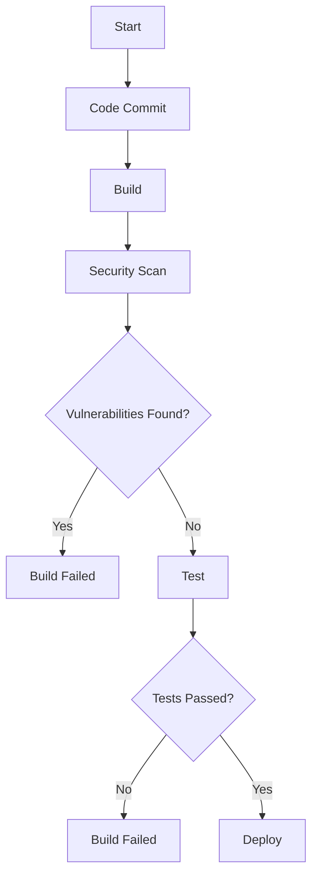
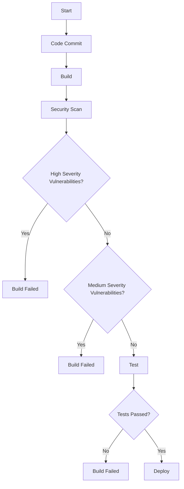

## Introduction to Security Governance in DevSecOps

Security governance in DevSecOps is a critical aspect of ensuring that software development processes adhere to established security policies and standards. The goal is to integrate security practices throughout the entire software development lifecycle (SDLC), from planning and coding to testing and deployment. This ensures that security is not an afterthought but an integral part of the development process.

### What is Security Governance?

Security governance refers to the framework of policies, procedures, and controls that an organization uses to manage and protect its information assets. In the context of DevSecOps, security governance involves embedding security checks and controls into the continuous integration and continuous delivery (CI/CD) pipeline. This ensures that security is considered at every stage of the software development process.

### Why is Security Governance Important?

Security governance is crucial because it helps organizations maintain compliance with regulatory requirements and industry standards. It also reduces the risk of security breaches and vulnerabilities, which can lead to significant financial and reputational damage. By integrating security into the CI/CD pipeline, organizations can catch and address security issues early in the development process, reducing the cost and complexity of fixing them later.

### How Does Security Governance Work in DevSecOps?

In DevSecOps, security governance is implemented through a series of automated security checks and controls integrated into the CI/CD pipeline. These checks ensure that code meets predefined security standards before it is deployed to production. This approach helps to prevent the introduction of security vulnerabilities into the final product.

### Embedding Security Checks in the CI/CD Pipeline

One of the key aspects of security governance in DevSecOps is embedding security checks into the CI/CD pipeline. This involves integrating various security tools and tests into the pipeline to automatically scan code for vulnerabilities and compliance issues.

#### Example: Integrating Static Application Security Testing (SAST)

Static Application Security Testing (SAST) is a type of security testing that analyzes the source code of an application to identify potential security vulnerabilities. By integrating SAST into the CI/CD pipeline, developers can automatically scan their code for security issues during the build process.

```yaml
# Jenkinsfile example for integrating SAST
pipeline {
    agent any
    stages {
        stage('Build') {
            steps {
                sh 'mvn clean install'
            }
        }
        stage('Security Scan') {
            steps {
                sh 'sonar-scanner'
            }
        }
    }
}
```

In this example, the `Jenkinsfile` defines a CI/CD pipeline with two stages: `Build` and `Security Scan`. The `Security Scan` stage runs the `sonar-scanner`, which performs a static analysis of the code using SonarQube, a popular SAST tool.

### Handling Test Results

Once security tests are run, the results need to be handled appropriately. If a component fails a security test, it should not be released to production. This requires implementing control points in the pipeline to block the release of insecure code.

#### Example: Blocking Deployment Based on Security Test Results

To block deployment based on security test results, you can configure your CI/CD tool to fail the build if certain conditions are met. For instance, if a SAST tool identifies high-severity vulnerabilities, the build should fail, preventing the deployment of the code.

```yaml
# Jenkinsfile example for failing build on high-severity vulnerabilities
pipeline {
    agent any
    stages {
        stage('Build') {
            steps {
                sh 'mvn clean install'
            }
        }
        stage('Security Scan') {
            steps {
                script {
                    def sonarReport = sh(script: 'sonar-scanner', returnStdout: true)
                    def vulnerabilities = parseSonarReport(sonarReport)
                    if (vulnerabilities.highSeverity > 0) {
                        error("High severity vulnerabilities found. Build failed.")
                    }
                }
            }
        }
    }
}
```

In this example, the `Security Scan` stage parses the SonarQube report and checks for high-severity vulnerabilities. If any are found, the build fails, preventing the deployment of the code.

### Quality Gates for Security Checks

Quality gates are checkpoints in the CI/CD pipeline that enforce specific criteria before allowing the pipeline to proceed. In the context of security governance, quality gates can be used to ensure that code meets predefined security standards before it is deployed.

#### Example: Implementing Quality Gates

To implement quality gates for security checks, you can define specific thresholds for different types of vulnerabilities. For example, you might set a threshold that allows low-severity vulnerabilities but blocks high-severity ones.

```yaml
# Jenkinsfile example for quality gates
pipeline {
    agent any
    stages {
        stage('Build') {
            steps {
                sh 'mvn clean install'
            }
        }
        stage('Security Scan') {
            steps {
                script {
                    def sonarReport = sh(script: 'sonar-scanner', returnStdout: true)
                    def vulnerabilities = parseSonarReport(sonarReport)
                    if (vulnerabilities.highSeverity > 0) {
                        error("High severity vulnerabilities found. Build failed.")
                    } else if (vulnerabilities.mediumSeverity > 5) {
                        error("More than 5 medium severity vulnerabilities found. Build failed.")
                    }
                }
            }
        }
    }
}
```

In this example, the `Security Scan` stage checks for high-severity and medium-severity vulnerabilities. If more than five medium-severity vulnerabilities are found, the build fails.

### Transitioning from Monitoring to Blocking

Initially, security checks may be set up to monitor and report on vulnerabilities without blocking the pipeline. As the DevSecOps pipeline matures, these checks can be transitioned to blocking mode, where the pipeline is halted if security standards are not met.

#### Example: Transitioning from Monitoring to Blocking

To transition from monitoring to blocking, you can gradually increase the strictness of the quality gates. For example, you might start by setting a threshold that allows low-severity vulnerabilities but blocks high-severity ones. Over time, you can lower the threshold to block medium-severity vulnerabilities as well.

```yaml
# Jenkinsfile example for transitioning from monitoring to blocking
pipeline {
    agent any
    stages {
        stage('Build') {
            steps {
                sh 'mvn clean install'
            }
        }
        stage('Security Scan') {
            steps {
                script {
                    def sonarReport = sh(script: 'sonar-scanner', returnStdout: true)
                    def vulnerabilities = parseSonarReport(sonarReport)
                    if (vulnerabilities.highSeverity > 0) {
                        error("High severity vulnerabilities found. Build failed.")
                    } else if (vulnerabilities.mediumSeverity > 5) {
                        error("More than 5 medium severity vulnerabilities found. Build failed.")
                    }
                }
            }
        }
    }
}
```

In this example, the `Security Scan` stage initially allows low-severity vulnerabilities but blocks high-severity ones. Over time, the threshold can be lowered to block medium-severity vulnerabilities as well.

### Real-World Examples

#### Example: Equifax Data Breach (CVE-2017-5638)

The Equifax data breach in 2017 was caused by a vulnerability in the Apache Struts framework. The breach exposed sensitive personal information of millions of customers. This incident highlights the importance of embedding security checks into the CI/CD pipeline to catch such vulnerabilities early.

#### Example: Capital One Data Breach (CVE-2019-11510)

The Capital One data breach in 2019 was caused by a misconfiguration in a web application firewall. The breach exposed sensitive personal information of millions of customers. This incident underscores the importance of implementing quality gates to ensure that configurations meet security standards.

### How to Prevent / Defend

#### Detection

To detect security vulnerabilities, organizations can use a combination of static and dynamic application security testing (SAST and DAST) tools. These tools can be integrated into the CI/CD pipeline to automatically scan code and configurations for vulnerabilities.

#### Prevention

To prevent security vulnerabilities, organizations can implement strict quality gates in the CI/CD pipeline. These gates can be configured to block the deployment of code that does not meet predefined security standards.

#### Secure Coding Fixes

To fix security vulnerabilities, organizations can follow secure coding practices and use tools like SAST and DAST to identify and address vulnerabilities. For example, if a SAST tool identifies a SQL injection vulnerability, the code can be modified to use parameterized queries.

#### Configuration Hardening

To harden configurations, organizations can use tools like Ansible and Terraform to enforce consistent and secure configurations across environments. For example, Ansible playbooks can be used to configure firewalls and other security settings.

### Conclusion

Security governance in DevSecOps is essential for ensuring that software development processes adhere to established security policies and standards. By embedding security checks and controls into the CI/CD pipeline, organizations can catch and address security issues early in the development process, reducing the risk of security breaches and vulnerabilities.

### Practice Labs

For hands-on practice with DevSecOps security governance, consider the following labs:

- **PortSwigger Web Security Academy**: Offers interactive labs for learning web security concepts and techniques.
- **OWASP Juice Shop**: A deliberately insecure web application for practicing web security skills.
- **DVWA (Damn Vulnerable Web Application)**: A PHP/MySQL web application that is riddled with vulnerabilities for educational purposes.
- **WebGoat**: An interactive, gamified training application for learning about web application security.

These labs provide practical experience with integrating security checks into the CI/CD pipeline and implementing quality gates to enforce security standards.

### Diagrams

#### Mermaid Diagram: CI/CD Pipeline with Security Checks



This diagram illustrates a CI/CD pipeline with security checks integrated into the build process. If vulnerabilities are found, the build fails. Otherwise, the code is tested and deployed.

#### Mermaid Diagram: Quality Gates



This diagram illustrates a CI/CD pipeline with quality gates for high and medium severity vulnerabilities. If vulnerabilities are found, the build fails. Otherwise, the code is tested and deployed.

### Summary

Security governance in DevSecOps is crucial for ensuring that software development processes adhere to established security policies and standards. By embedding security checks and controls into the CI/CD pipeline, organizations can catch and address security issues early in the development process, reducing the risk of security breaches and vulnerabilities. This chapter provided a comprehensive overview of security governance in DevSecOps, including background theory, recent real-world examples, complete code, mermaid diagrams, pitfalls, and a clear 'How to Prevent / Defend' part.

---
<!-- nav -->
[[DevSecOps/DevSecOps Bootcamp/02-Security Governance & Compliance/03-Enabling Governance and Compliance with DevSecOps/05-Using DevSecOps for Security Governance/00-Overview|Overview]] | [[02-Enabling Governance and Compliance with DevSecOps|Enabling Governance and Compliance with DevSecOps]]
