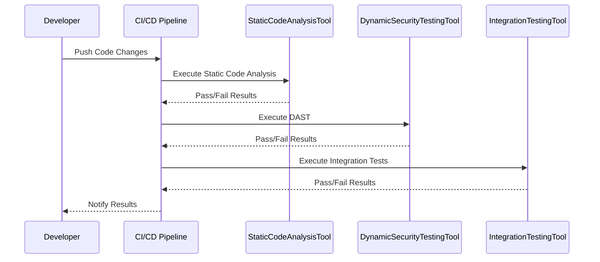

## Enabling Governance and Compliance with DevSecOps

### Introduction to Governance and Compliance in DevSecOps

In the realm of DevSecOps, governance and compliance play a crucial role in ensuring that software development processes adhere to predefined standards and regulations. This ensures that the codebase remains secure, reliable, and meets the necessary legal requirements. The primary goal is to integrate security practices throughout the software development lifecycle (SDLC) and ensure that the code is subjected to rigorous quality gates.

### Quality Gates in DevSecOps

Quality gates are checkpoints in the SDLC where specific criteria must be met before proceeding to the next phase. These gates help maintain high standards of code quality and security. In a DevSecOps environment, these quality gates are highly automated, ensuring consistency and reliability regardless of who writes the code.

#### What Are Quality Gates?

Quality gates are predefined criteria that must be satisfied at various stages of the software development process. They serve as a mechanism to enforce policies and standards, ensuring that the codebase adheres to best practices and security guidelines.

#### Why Are Quality Gates Important?

Quality gates are essential because they:

- **Ensure Consistency**: By enforcing consistent standards across different phases of the SDLC, quality gates help maintain uniformity in the codebase.
- **Prevent Security Vulnerabilities**: Automated checks can identify and mitigate potential security issues early in the development cycle.
- **Facilitate Compliance**: Quality gates can be configured to ensure compliance with regulatory requirements, such as GDPR, HIPAA, etc.

#### How Do Quality Gates Work?

Quality gates typically involve a series of automated tests and checks that are executed at specific points in the SDLC. These checks can include static code analysis, dynamic application security testing (DAST), and integration testing. The results of these checks determine whether the code can proceed to the next phase.

### Automation in DevSecOps

Automation is a cornerstone of DevSecOps, enabling consistent and efficient execution of quality gates. By automating these checks, organizations can ensure that the codebase is subject to the same rigorous standards regardless of who writes the code.

#### What Is Automation in DevSecOps?

Automation in DevSecOps refers to the use of tools and scripts to automate repetitive tasks and checks. This includes continuous integration (CI), continuous delivery (CD), and continuous security (CS) pipelines.

#### Why Is Automation Important?

Automation is crucial because it:

- **Ensures Consistency**: Automated checks provide consistent results, reducing the variability that can arise from manual processes.
- **Improves Efficiency**: Automation speeds up the development process by eliminating the need for manual intervention in routine tasks.
- **Enforces Best Practices**: Automated tools can enforce coding standards and security best practices, ensuring that the codebase adheres to predefined guidelines.

#### How Does Automation Work?

Automation in DevSecOps typically involves setting up CI/CD pipelines that automatically execute a series of checks whenever changes are made to the codebase. These checks can include:

- **Static Code Analysis**: Tools like SonarQube analyze the code for potential vulnerabilities and coding errors.
- **Dynamic Application Security Testing (DAST)**: Tools like OWASP ZAP test the application for runtime vulnerabilities.
- **Integration Testing**: Automated tests ensure that different components of the application work together seamlessly.

### Real-World Examples of Quality Gates and Automation

To illustrate the importance of quality gates and automation, let's consider some recent real-world examples.

#### Example 1: Equifax Data Breach (CVE-2017-5638)

The Equifax data breach in 2017 exposed sensitive personal information of millions of customers. One of the root causes was a lack of proper quality gates and automation in their software development process. Had they implemented robust quality gates and automated security checks, the vulnerability might have been identified and mitigated earlier.

```mermaid
sequenceDiagram
    participant Developer
    participant CI/CD Pipeline
    participant StaticCodeAnalysisTool
    participant DynamicSecurityTestingTool
    participant IntegrationTestingTool
    Developer->>CI/CD Pipeline: Push Code Changes
    CI/CD Pipeline->>StaticCodeAnalysisTool: Execute Static Code Analysis
    StaticCodeAnalysisTool-->>CI/CD Pipeline: Pass/Fail Results
    CI/CD Pipeline->>DynamicSecurityTestingTool: Execute DAST
    DynamicSecurityTestingTool-->>CI/CD Pipeline: Pass/Fail Results
    CI/CD Pipeline->>IntegrationTestingTool: Execute Integration Tests
    IntegrationTestingTool-->>CI/
```

#### Example 2: Capital One Data Breach (CVE-2019-11510)

The Capital One data breach in 2019 exposed sensitive customer data due to a misconfigured web application firewall. This incident highlights the importance of having robust quality gates and automated security checks to identify and mitigate such vulnerabilities.



### Common Pitfalls and How to Avoid Them

While implementing quality gates and automation in DevSecOps, several pitfalls can arise. Understanding these pitfalls and how to avoid them is crucial for maintaining a secure and compliant codebase.

#### Pitfall 1: Over-reliance on Manual Processes

One common pitfall is over-relying on manual processes instead of automating quality gates. This can lead to inconsistencies and missed vulnerabilities.

**How to Avoid:** Ensure that all quality gates are automated and integrated into the CI/CD pipeline. Use tools like Jenkins, GitLab CI, or CircleCI to manage these processes.

#### Pitfall 2: Lack of Comprehensive Testing

Another pitfall is not conducting comprehensive testing, leading to undetected vulnerabilities.

**How to Avoid:** Implement a combination of static code analysis, dynamic security testing, and integration testing. Use tools like SonarQube, OWASP ZAP, and Selenium to cover different aspects of testing.

#### Pitfall 3: Ignoring Regulatory Requirements

Ignoring regulatory requirements can result in non-compliance and legal issues.

**How to Avoid:** Ensure that your quality gates are configured to meet regulatory requirements. Use tools like Open Policy Agent (OPA) to enforce compliance policies.

### How to Prevent / Defend

To effectively implement governance and compliance in DevSecOps, it is essential to have a clear strategy for detection, prevention, and mitigation.

#### Detection

Detection involves identifying vulnerabilities and compliance issues early in the development cycle. This can be achieved through:

- **Automated Static Code Analysis**: Tools like SonarQube can identify potential vulnerabilities and coding errors.
- **Dynamic Security Testing**: Tools like OWASP ZAP can test the application for runtime vulnerabilities.
- **Compliance Audits**: Regular audits using tools like Open Policy Agent (OPA) can ensure compliance with regulatory requirements.

#### Prevention

Prevention involves implementing measures to avoid vulnerabilities and compliance issues. This can be achieved through:

- **Secure Coding Practices**: Encourage developers to follow secure coding practices and use tools like Checkmarx to enforce these practices.
- **Automated Quality Gates**: Integrate automated quality gates into the CI/CD pipeline to ensure consistent enforcement of standards.
- **Regular Training and Awareness**: Conduct regular training sessions to keep developers informed about the latest security practices and compliance requirements.

#### Mitigation

Mitigation involves addressing identified vulnerabilities and compliance issues. This can be achieved through:

- **Patch Management**: Regularly update and patch the codebase to address known vulnerabilities.
- **Incident Response Plan**: Develop an incident response plan to quickly address and mitigate any security incidents.
- **Continuous Monitoring**: Continuously monitor the codebase and infrastructure for any signs of compromise or compliance issues.

### Secure-Coding Fixes

To illustrate the secure-coding fixes, let's consider a common vulnerability: SQL injection.

#### Vulnerable Code

```sql
SELECT * FROM users WHERE username = '$username' AND password = '$password';
```

#### Secure Code

```sql
PreparedStatement stmt = connection.prepareStatement("SELECT * FROM users WHERE username = ? AND password = ?");
stmt.setString(1, username);
stmt.setString(2, password);
ResultSet rs = stmt.executeQuery();
```

### Configuration Hardening

Configuration hardening involves securing the configuration settings of the application and infrastructure. This can be achieved through:

- **Least Privilege Principle**: Ensure that users and services have the minimum privileges required to perform their tasks.
- **Secure Configuration Management**: Use tools like Ansible, Puppet, or Chef to manage and enforce secure configurations.
- **Regular Audits**: Conduct regular audits to ensure that configurations remain secure and comply with best practices.

### Hands-On Labs

To gain practical experience with governance and compliance in DevSecOps, consider the following hands-on labs:

- **PortSwigger Web Security Academy**: Offers interactive labs to practice web application security.
- **OWASP Juice Shop**: A deliberately insecure web application for practicing security testing.
- **DVWA (Damn Vulnerable Web Application)**: Another intentionally vulnerable web application for security testing.
- **CloudGoat**: A set of labs for practicing cloud security on AWS.
- **Kubernetes Goat**: A set of labs for practicing Kubernetes security.

By following these steps and utilizing the recommended tools and labs, you can effectively implement governance and compliance in your DevSecOps environment, ensuring a secure and compliant codebase.

---
<!-- nav -->
[[01-Introduction to Security Governance in DevSecOps|Introduction to Security Governance in DevSecOps]] | [[DevSecOps/DevSecOps Bootcamp/02-Security Governance & Compliance/03-Enabling Governance and Compliance with DevSecOps/05-Using DevSecOps for Security Governance/00-Overview|Overview]] | [[DevSecOps/DevSecOps Bootcamp/02-Security Governance & Compliance/03-Enabling Governance and Compliance with DevSecOps/05-Using DevSecOps for Security Governance/03-Practice Questions & Answers|Practice Questions & Answers]]
