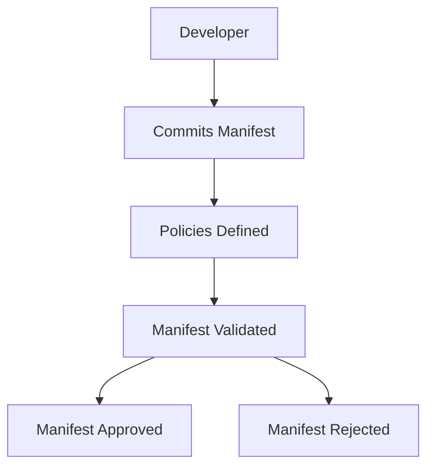
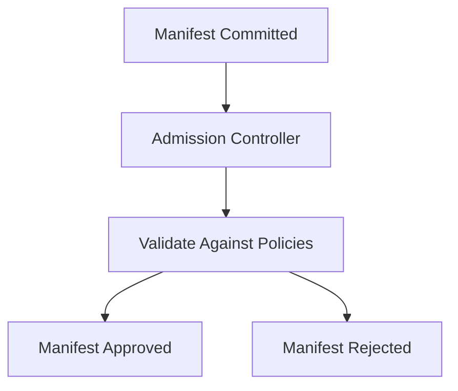

## Introduction to Policy as Code

In the realm of DevSecOps, ensuring the security and integrity of your infrastructure and applications is paramount. One critical aspect of this is validating the configurations and manifests that define your infrastructure and applications before they are deployed. This is where **Policy as Code** comes into play. Policy as Code allows you to define, enforce, and audit policies programmatically, ensuring that your infrastructure remains secure and compliant.

### Background Theory

Before diving into the specifics of Policy as Code, let's first understand the context in which it operates. In modern DevOps environments, infrastructure is often defined using declarative configuration files, such as Kubernetes manifests. These manifests describe the desired state of your infrastructure, including services, deployments, and resources. When these manifests are committed to a GitOps repository, they are automatically deployed to the cluster using tools like Argo CD.

However, this automation introduces a significant risk: if developers or product teams commit misconfigured or insecure manifests, these could be automatically deployed, leading to potential security vulnerabilities. This is where Policy as Code becomes essential. By defining policies that validate these manifests before deployment, you can ensure that only secure and compliant configurations are deployed.

### Why Policy as Code?

The primary reasons for implementing Policy as Code are:

1. **Security**: Ensuring that only secure configurations are deployed helps prevent security vulnerabilities.
2. **Compliance**: Policies can enforce compliance with organizational standards and regulatory requirements.
3. **Scalability**: Manual validation of every manifest is impractical in large organizations with many teams. Policy as Code automates this process.
4. **Consistency**: Policies ensure that all configurations adhere to consistent standards, reducing human error.

### How Policy as Code Works

Policy as Code involves several key components:

1. **Policy Definition**: Policies are defined using a declarative language, such as Open Policy Agent (OPA) or Kubernetes Admission Controllers.
2. **Validation**: Policies are used to validate manifests before they are committed to the repository or deployed to the cluster.
3. **Enforcement**: If a manifest violates a policy, it is either rejected or flagged for manual review.
4. **Audit**: Policies can be audited to ensure compliance and identify areas for improvement.

### Example Scenario

Consider a scenario where a developer commits a Kubernetes manifest to a GitOps repository. Before this manifest is deployed to the cluster, it must pass through a series of validations defined by Policy as Code. Let's walk through this process step-by-step.

#### Step 1: Define Policies

First, you need to define the policies that will be used to validate the manifests. For example, you might define a policy that ensures all pods have a specific label:

```yaml
# Example OPA policy
package kubernetes.pods

default allow = false

allow {
    input.kind == "Pod"
    input.metadata.labels["app"] != null
}
```

This policy ensures that all pods have an `app` label. If a pod does not have this label, the policy will reject it.

#### Step 2: Validate Manifests

When a developer commits a manifest to the GitOps repository, the policy engine validates the manifest against the defined policies. For example, consider the following Kubernetes manifest:

```yaml
apiVersion: v1
kind: Pod
metadata:
  name: my-pod
spec:
  containers:
  - name: my-container
    image: my-image
```

This manifest does not include the required `app` label. When validated against the policy, it will be rejected.

#### Step 3: Enforcement

If a manifest violates a policy, it can be either rejected outright or flagged for manual review. For example, using an admission controller in Kubernetes, you can enforce this policy:

```yaml
apiVersion: admissionregistration.k8s.io/v1
kind: ValidatingWebhookConfiguration
metadata:
  name: pod-label-validator
webhooks:
- name: pod-label-validator.example.com
  rules:
  - apiGroups: [""]
    apiVersions: ["v1"]
    resources: ["pods"]
    scope: "*"
  clientConfig:
    service:
      namespace: kube-system
      name: pod-label-validator
    caBundle: <base64-encoded-ca-bundle>
  admissionReviewVersions: ["v1", "v1beta1"]
  sideEffects: None
  timeoutSeconds: 5
```

This admission controller ensures that all pods have the required `app` label before they are admitted to the cluster.

### Real-World Examples

#### CVE-2021-25741: Kubernetes API Server Privilege Escalation

In 2021, a critical vulnerability (CVE-2021-25741) was discovered in the Kubernetes API server, allowing attackers to escalate privileges and gain unauthorized access to the cluster. This vulnerability highlights the importance of enforcing strict policies to prevent such attacks.

By implementing Policy as Code, you can define policies that restrict access to sensitive resources and prevent unauthorized actions. For example, you might define a policy that restricts access to the API server to only authorized users:

```yaml
# Example OPA policy
package kubernetes.api

default allow = false

allow {
    input.kind == "ServiceAccount"
    input.metadata.name == "admin"
}
```

This policy ensures that only the `admin` service account can access the API server, preventing unauthorized access.

### Common Pitfalls

While Policy as Code offers significant benefits, there are several common pitfalls to be aware of:

1. **Complexity**: Defining and maintaining policies can be complex, especially in large organizations with many teams.
2. **False Positives/Negatives**: Policies may sometimes flag valid configurations as violations or miss actual violations.
3. **Performance**: Enforcing policies can introduce additional latency, especially if the policies are computationally intensive.

### How to Prevent / Defend

To effectively implement Policy as Code, follow these best practices:

1. **Define Clear Policies**: Clearly define policies that align with your organization's security and compliance requirements.
2. **Automate Validation**: Use automated tools to validate manifests against policies before deployment.
3. **Monitor and Audit**: Regularly monitor and audit policies to ensure compliance and identify areas for improvement.
4. **Educate Teams**: Educate developers and product teams about the importance of Policy as Code and how to write secure configurations.

### Complete Example

Let's walk through a complete example of implementing Policy as Code using Open Policy Agent (OPA) and Kubernetes Admission Controllers.

#### Step 1: Define Policies

First, define the policies using OPA:

```rego
# Example OPA policy
package kubernetes.pods

default allow = false

allow {
    input.kind == "Pod"
    input.metadata.labels["app"] != null
}
```

#### Step 2: Set Up OPA

Next, set up OPA to evaluate the policies:

```yaml
apiVersion: opa.example.com/v1
kind: Policy
metadata:
  name: pod-label-policy
spec:
  rego: |
    package kubernetes.pods

    default allow = false

    allow {
        input.kind == "Pod"
        input.metadata.labels["app"] != null
    }
```

#### Step 3: Configure Admission Controller

Configure a Kubernetes Admission Controller to enforce the policies:

```yaml
apiVersion: admissionregistration.k8s.io/v1
kind: ValidatingWebhookConfiguration
metadata:
  name: pod-label-validator
webhooks:
- name: pod-label-validator.example.com
  rules:
  - apiGroups: [""]
    apiVersions: ["v1"]
    resources: ["pods"]
    scope: "*"
  clientConfig:
    service:
      namespace: kube-system
      name: pod-label-validator
    caBundle: <base64-encoded-ca-bundle>
  admissionReviewVersions: ["v1", "v1beta1"]
  sideEffects: None
  timeoutSeconds: 5
```

#### Step 4: Test and Deploy

Test the setup by committing a manifest that violates the policy and observe the rejection:

```yaml
apiVersion: v1
kind: Pod
metadata:
  name: my-pod
spec:
  containers:
  - name: my-container
    image: my-image
```

This manifest will be rejected due to the missing `app` label.

### Mermaid Diagrams

To visualize the flow of Policy as Code, consider the following mermaid diagrams:

#### Policy Definition Flow



#### Admission Controller Flow



### Conclusion

Implementing Policy as Code is crucial for ensuring the security and compliance of your infrastructure and applications. By defining, validating, and enforcing policies programmatically, you can prevent security vulnerabilities and maintain consistency across your organization. Follow best practices and regularly monitor and audit your policies to ensure they remain effective.

### Practice Labs

For hands-on experience with Policy as Code, consider the following practice labs:

- **PortSwigger Web Security Academy**: Focuses on web application security but includes modules on infrastructure security.
- **OWASP Juice Shop**: A deliberately insecure web application for practicing security testing.
- **Kubernetes Goat**: A Kubernetes-based security training platform that includes Policy as Code exercises.
- **CloudGoat**: A cloud security training platform that covers various aspects of cloud security, including Policy as Code.

These labs provide practical experience in implementing and managing Policy as Code in real-world scenarios.

---
<!-- nav -->
[[DevSecOps/DevSecOps Bootcamp/02-Security Governance & Compliance/04-Policy as Code/07-Why Policy as Code/00-Overview|Overview]] | [[DevSecOps/DevSecOps Bootcamp/02-Security Governance & Compliance/04-Policy as Code/07-Why Policy as Code/02-Policy as Code in DevSecOps|Policy as Code in DevSecOps]]
