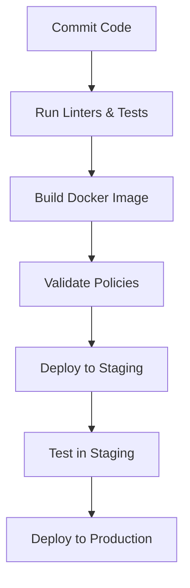

## Policy as Code in DevSecOps

### Introduction to Policy as Code

Policy as Code is a practice that integrates security policies into the continuous integration and continuous delivery (CI/CD) pipeline. This approach ensures that security policies are enforced automatically during the build and deployment phases, reducing the risk of security vulnerabilities making it into production environments. In the context of Kubernetes, this means validating Kubernetes manifest files before they are deployed to the cluster.

### Background Theory

#### What is Policy as Code?

Policy as Code refers to the practice of expressing security policies in machine-readable formats, such as code or configuration files, rather than relying solely on human-readable documentation. This allows these policies to be integrated into automated workflows, ensuring consistent enforcement across the entire development lifecycle.

#### Why is Policy as Code Important?

In traditional software development processes, security policies were often documented in text files or shared via email. This approach was prone to errors and inconsistencies because developers had to manually interpret and apply these policies. With Policy as Code, security policies are defined in a structured format that can be automatically checked and enforced by tools. This reduces the likelihood of human error and ensures that security policies are consistently applied across all environments.

#### How Does Policy as Code Work?

Policy as Code works by integrating security policies into the CI/CD pipeline. These policies are typically defined using a declarative language, such as YAML or JSON, and are checked against the application code and infrastructure configurations during the build and deployment phases. If the policies are violated, the build or deployment process will fail, preventing insecure code from being deployed.

### Integration with CI/CD Workflow

#### Automated Validation in CI/CD Pipeline

The CI/CD pipeline is a series of steps that automate the process of building, testing, and deploying software. By integrating Policy as Code into this pipeline, you can ensure that security policies are validated at key points in the process, such as before a deployment.



#### Example: Kubernetes Manifest Validation

In the context of Kubernetes, Policy as Code can be used to validate Kubernetes manifest files before they are deployed to the cluster. This ensures that the manifests adhere to predefined security policies, such as namespace restrictions, resource limits, and pod security policies.

### Real-World Examples

#### Recent CVEs and Breaches

One notable example of the importance of Policy as Code is the Kubernetes API server vulnerability (CVE-2020-8558). This vulnerability allowed an attacker to bypass authentication and gain unauthorized access to the Kubernetes cluster. By integrating Policy as Code into the CI/CD pipeline, organizations could have detected and prevented the deployment of manifests that exposed this vulnerability.

### Complete Example

#### Kubernetes Manifest Validation

Let's consider a scenario where we want to validate Kubernetes manifest files before deploying them to a cluster. We can use a tool like `kube-score` to check the manifests against predefined policies.

##### Vulnerable Manifest

Here is an example of a Kubernetes manifest file that violates some security policies:

```yaml
apiVersion: v1
kind: Pod
metadata:
  name: vulnerable-pod
spec:
  containers:
  - name: vulnerable-container
    image: nginx:latest
    ports:
    - containerPort: 80
```

##### Secure Manifest

Here is the same manifest after applying security policies:

```yaml
apiVersion: v1
kind: Pod
metadata:
  name: secure-pod
spec:
  containers:
  - name: secure-container
    image: nginx:latest
    ports:
    - containerPort: 80
    securityContext:
      privileged: false
      readOnlyRootFilesystem: true
```

### Full Raw HTTP Messages

While Kubernetes manifests are not typically sent over HTTP, let's consider a scenario where a Kubernetes API request is made to deploy a manifest.

##### HTTP Request

```http
POST /apis/v1/namespaces/default/pods HTTP/1.1
Host: kubernetes.default.svc.cluster.local
Authorization: Bearer <token>
Content-Type: application/json

{
  "apiVersion": "v1",
  "kind": "Pod",
  "metadata": {
    "name": "secure-pod"
  },
  "spec": {
    "containers": [
      {
        "name": "secure-container",
        "image": "nginx:latest",
        "ports": [
          {
            "containerPort": 80
          }
        ],
        "securityContext": {
          "privileged": false,
          "readOnlyRootFilesystem": true
        }
      }
    ]
  }
}
```

##### HTTP Response

```http
HTTP/1.1 201 Created
Date: Mon, 01 Jan 2024 00:00:00 GMT
Content-Type: application/json
Content-Length: 1234

{
  "kind": "Pod",
  "apiVersion": "v1",
  "metadata": {
    "name": "secure-pod",
    "namespace": "default",
    "selfLink": "/api/v1/namespaces/default/pods/secure-pod",
    "uid": "12345678-1234-1234-1234-1234567890ab",
    "resourceVersion": "12345678",
    "creationTimestamp": "2024-01-01T00:00:00Z"
  },
  "spec": {
    "containers": [
      {
        "name": "secure-container",
        "image": "nginx:latest",
        "ports": [
          {
            "containerPort": 80
          }
        ],
        "securityContext": {
          "privileged": false,
          "readOnlyRootFilesystem": true
        }
      }
    ]
  },
  "status": {
    "phase": "Pending",
    "conditions": [
      {
        "type": "Initialized",
        "status": "True",
        "lastProbeTime": null,
        "lastTransitionTime": "2024-01-01T00:00:00Z"
      }
    ],
    "hostIP": "10.0.0.1",
    "podIP": "10.0.0.2",
    "startTime": "2024-01-01T00:00:00Z"
  }
}
```

### Common Pitfalls and Mistakes

#### Overly Permissive Policies

One common mistake is creating overly permissive policies that do not effectively enforce security. For example, allowing all containers to run with elevated privileges or without read-only root filesystems can lead to security vulnerabilities.

#### Inconsistent Policy Enforcement

Another pitfall is inconsistent policy enforcement across different environments. If policies are not enforced uniformly across development, staging, and production environments, security vulnerabilities can slip through.

### How to Prevent / Defend

#### Detection

To detect violations of security policies, you can integrate tools like `kube-score`, `Kube-bench`, or `Falco` into your CI/CD pipeline. These tools can automatically check Kubernetes manifests and running pods against predefined security policies.

##### Example: Using `kube-score`

```bash
# Install kube-score
curl -s https://raw.githubusercontent.com/zegl/kube-score/master/install.sh | bash

# Validate Kubernetes manifest
kube-score score my-manifest.yaml
```

#### Prevention

To prevent security vulnerabilities, you should define strict security policies and enforce them consistently across all environments. This includes setting up role-based access control (RBAC) policies, namespace isolation, and pod security policies.

##### Example: RBAC Policy

```yaml
apiVersion: rbac.authorization.k8s.io/v1
kind: Role
metadata:
  namespace: default
  name: pod-reader
rules:
- apiGroups: [""]
  resources: ["pods"]
  verbs: ["get", "watch", "list"]
---
apiVersion: rbac.authorization.k8s.io/v1
kind: RoleBinding
metadata:
  name: read-pods
  namespace: default
subjects:
- kind: ServiceAccount
  name: default
  namespace: default
roleRef:
  kind: Role
  name: pod-reader
  apiGroup: rbac.authorization.k8s.io
```

#### Secure Coding Fixes

To fix insecure coding practices, you should follow secure coding guidelines and best practices. This includes using least privilege principles, avoiding hard-coded secrets, and using secure libraries and frameworks.

##### Example: Secure Coding Fix

```yaml
# Vulnerable code
apiVersion: v1
kind: Pod
metadata:
  name: vulnerable-pod
spec:
  containers:
  - name: vulnerable-container
    image: nginx:latest
    ports:
    - containerPort: 80

# Secure code
apiVersion: v1
kind: Pod
metadata:
  name: secure-pod
spec:
  containers:
  - name: secure-container
    image: nginx:latest
    ports:
    - containerPort: 80
    securityContext:
      privileged: false
      readOnlyRootFilesystem: true
```

### Configuration Hardening

To harden your Kubernetes cluster, you should configure security settings such as network policies, pod security policies, and admission controllers.

##### Example: Network Policy

```yaml
apiVersion: networking.k8s.io/v1
kind: NetworkPolicy
metadata:
  name: deny-all-ingress
spec:
  podSelector: {}
  ingress: []
```

### Conclusion

By integrating Policy as Code into your CI/CD pipeline, you can ensure that security policies are consistently enforced across all environments. This reduces the risk of security vulnerabilities making it into production and helps maintain a secure and reliable Kubernetes cluster.

### Practice Labs

For hands-on experience with Policy as Code in Kubernetes, consider the following labs:

- **PortSwigger Web Security Academy**: Offers interactive labs on web security, including Kubernetes security.
- **OWASP Juice Shop**: A deliberately insecure web application for security training.
- **DVWA (Damn Vulnerable Web Application)**: A PHP/MySQL web application that is riddled with vulnerabilities.
- **WebGoat**: An interactive, gamified training application for learning about web application security.

These labs provide practical experience in securing Kubernetes clusters and integrating security policies into CI/CD pipelines.

---
<!-- nav -->
[[DevSecOps/DevSecOps Bootcamp/02-Security Governance & Compliance/04-Policy as Code/07-Why Policy as Code/01-Introduction to Policy as Code|Introduction to Policy as Code]] | [[DevSecOps/DevSecOps Bootcamp/02-Security Governance & Compliance/04-Policy as Code/07-Why Policy as Code/00-Overview|Overview]] | [[DevSecOps/DevSecOps Bootcamp/02-Security Governance & Compliance/04-Policy as Code/07-Why Policy as Code/03-Practice Questions & Answers|Practice Questions & Answers]]
