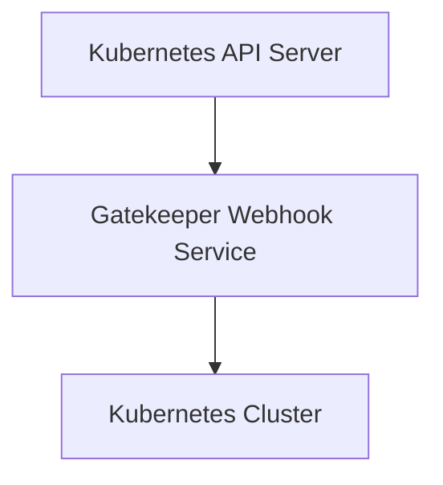
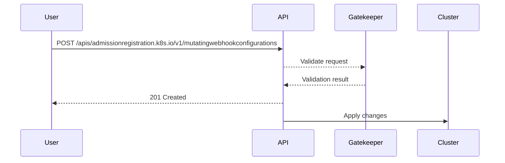

## Policy as Code in Kubernetes

### Introduction to Policy as Code

Policy as Code is a fundamental practice in modern DevSecOps environments, particularly within Kubernetes clusters. It allows organizations to enforce security and compliance rules through declarative policies that are checked during the deployment process. This approach ensures that only compliant and secure configurations are deployed, reducing the risk of vulnerabilities and misconfigurations.

### Why Policy as Code Matters

In Kubernetes, the complexity of managing numerous microservices and their configurations can lead to human errors and security gaps. Policy as Code helps mitigate these risks by automating the enforcement of security policies. This automation ensures consistency across deployments and reduces the likelihood of manual errors.

### How Policy as Code Works

#### Background Theory

Kubernetes uses a declarative model where the desired state of the system is defined in YAML or JSON manifests. These manifests describe the resources such as Pods, Deployments, Services, etc., that make up the application. Policy as Code extends this model by defining additional rules that must be satisfied before these resources can be deployed.

#### Key Components

1. **Constraint Templates**: These are reusable definitions of policies that can be applied to different resources.
2. **Constraints**: These are specific instances of constraint templates that are applied to particular resources or namespaces.

#### Example Constraint Template

```yaml
apiVersion: constraints.gatekeeper.sh/v1beta1
kind: K8sConstraintTemplate
metadata:
  name: k8srequiredlabels
spec:
  crd:
    spec:
      names:
        kind: RequiredLabels
  targets:
    - target: admission.k8s.gatekeeper.sh
      rego: |
        package requiredlabels
        
        violation[{"msg": msg, "details": {"missing_labels": missing}}] {
          provided := {label | input.review.object.metadata.labels[label]}
          required := {label | label := data.values.required_labels[_]}
          missing := required - provided
          msg := sprintf("missing labels: %v", [missing])
        }
```

This template defines a policy that requires certain labels to be present on all Kubernetes resources.

#### Example Constraint

```yaml
apiVersion: constraints.gatekeeper.sh/v1beta1
kind: RequiredLabels
metadata:
  name: required-namespace-labels
spec:
  match:
    kinds:
      - apiGroups: [""]
        kinds: ["Namespace"]
  parameters:
    required_labels:
      - "owner"
      - "environment"
```

This constraint applies the `RequiredLabels` template to all `Namespace` resources, requiring the presence of `owner` and `environment` labels.

### Real-World Examples

#### Recent Breaches and CVEs

One notable example is the Kubernetes API server vulnerability (CVE-2021-25741), where improper RBAC settings allowed unauthorized access to sensitive resources. Policy as Code could have prevented this by enforcing strict RBAC policies.

#### Implementation in Real Environments

Many organizations, including large tech companies like Google and Amazon, use Policy as Code to ensure compliance and security. For instance, Google uses Open Policy Agent (OPA) to enforce policies across its Kubernetes clusters.

### Pitfalls and Common Mistakes

1. **Overly Broad Policies**: Policies that are too broad can lead to false positives and hinder productivity.
2. **Complexity**: Managing a large number of policies can become complex and difficult to maintain.
3. **False Negatives**: Inadequate policies might fail to catch certain types of misconfigurations.

### How to Prevent / Defend

#### Detection

Use tools like OPA and Gatekeeper to monitor and audit Kubernetes configurations. Regularly review logs and alerts generated by these tools to identify potential issues.

#### Prevention

1. **Define Clear Policies**: Clearly define what constitutes a secure configuration and enforce these policies.
2. **Automate Enforcement**: Automate the enforcement of policies using tools like Gatekeeper.
3. **Regular Audits**: Conduct regular audits to ensure compliance with policies.

#### Secure Coding Fixes

**Vulnerable Configuration**

```yaml
apiVersion: v1
kind: Pod
metadata:
  name: my-pod
spec:
  containers:
  - name: my-container
    image: my-image
```

**Fixed Configuration**

```yaml
apiVersion: v1
kind: Pod
metadata:
  name: my-pod
  labels:
    owner: "devops-team"
    environment: "production"
spec:
  containers:
  - name: my-container
    image: my-image
```

### Complete Example

#### Full HTTP Request and Response

When deploying a resource, the Kubernetes API server will check against the defined policies:

**HTTP Request**

```http
POST /apis/admissionregistration.k8s.io/v1/mutatingwebhookconfigurations HTTP/1.1
Host: localhost:8080
Content-Type: application/json

{
  "apiVersion": "admissionregistration.k8s.io/v1",
  "kind": "MutatingWebhookConfiguration",
  "metadata": {
    "name": "gatekeeper-validating-webhook"
  },
  "webhooks": [
    {
      "name": "validation.gatekeeper.sh",
      "rules": [
        {
          "operations": ["CREATE", "UPDATE"],
          "apiGroups": ["*"],
          "apiVersions": ["*"],
          "resources": ["*"]
        }
      ],
      "clientConfig": {
        "service": {
          "name": "gatekeeper-webhook-service",
          "namespace": "gatekeeper-system",
          "path": "/mutate"
        },
        "caBundle": "<base64-encoded-ca-cert>"
      },
      "sideEffects": "None",
      "timeoutSeconds": 10
    }
  ]
}
```

**HTTP Response**

```http
HTTP/1.1 201 Created
Content-Type: application/json

{
  "apiVersion": "admissionregistration.k8s.io/v1",
  "kind": "MutatingWebhookConfiguration",
  "metadata": {
    "name": "gatekeeper-validating-webhook",
    "uid": "some-uid",
    "resourceVersion": "some-version",
    "creationTimestamp": "2023-01-01T00:00:00Z"
  },
  "webhooks": [
    {
      "name": "validation.gatekeeper.sh",
      "rules": [
        {
          "operations": ["CREATE", "UPDATE"],
          "apiGroups": ["*"],
          "apiVersions": ["*"],
          "resources": ["*"]
        }
      ],
      "clientConfig": {
        "service": {
          "name": "gatekeeper-webhook-service",
          "namespace": "gatekeeper-system",
          "path": "/mutate"
        },
        "caBundle": "<base64-encoded-ca-cert>"
      },
      "sideEffects": "None",
      "timeoutSeconds": 1
    }
  ]
}
```

### Mermaid Diagrams

#### Network Topology



#### Request/Response Flow



### Hands-On Labs

For practical experience with Policy as Code in Kubernetes, consider the following labs:

- **PortSwigger Web Security Academy**: Offers exercises on securing Kubernetes deployments.
- **OWASP Juice Shop**: Provides a vulnerable application to practice securing Kubernetes deployments.
- **CloudGoat**: Focuses on cloud security practices, including Kubernetes security.
- **Pacu**: A penetration testing framework that includes Kubernetes security exercises.

These labs provide real-world scenarios to practice and reinforce the concepts covered in this chapter.

### Conclusion

Policy as Code is a critical component of modern DevSecOps practices, especially in Kubernetes environments. By automating the enforcement of security policies, organizations can significantly reduce the risk of vulnerabilities and misconfigurations. Understanding and implementing Policy as Code effectively requires a deep dive into the underlying principles, tools, and best practices.

---
<!-- nav -->
[[01-Policy as Code in DevSecOps|Policy as Code in DevSecOps]] | [[DevSecOps/DevSecOps Bootcamp/02-Security Governance & Compliance/04-Policy as Code/08-Summary/00-Overview|Overview]] | [[DevSecOps/DevSecOps Bootcamp/02-Security Governance & Compliance/04-Policy as Code/08-Summary/03-Practice Questions & Answers|Practice Questions & Answers]]
