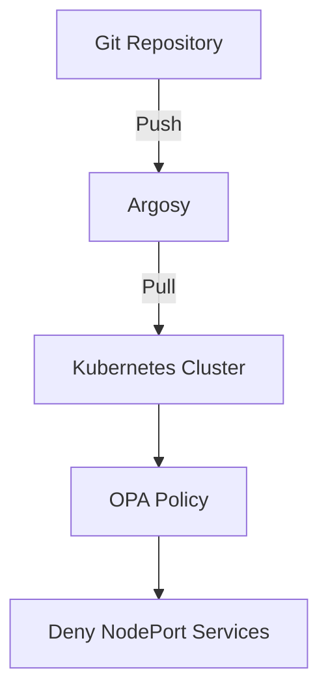
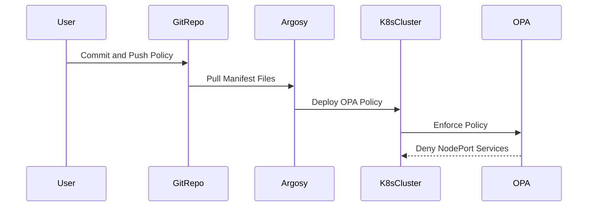

## Introduction to Policy as Code

Policy as Code is a practice where infrastructure policies are defined using code rather than manual configurations. This approach ensures consistency, traceability, and automation in managing infrastructure policies. In the context of Kubernetes, Open Policy Agent (OPA) is a popular tool used to enforce policies across the cluster. This chapter will focus on defining a policy to reject NodePort services using OPA.

### Background Theory

Open Policy Agent (OPA) is an open-source project that provides a general-purpose policy engine. It allows you to define, serve, and enforce policies written in Rego, a high-level declarative language. OPA can be integrated with various systems, including Kubernetes, to enforce policies at runtime.

#### Why Use Policy as Code?

- **Consistency**: Policies are defined once and applied consistently across environments.
- **Traceability**: Changes to policies are tracked via version control systems like Git.
- **Automation**: Policies can be automatically enforced and updated through CI/CD pipelines.
- **Security**: Policies can be audited and reviewed, ensuring compliance with security standards.

### Defining a Policy to Reject NodePort Services

In Kubernetes, services can be exposed using different types such as ClusterIP, NodePort, and LoadBalancer. A NodePort service exposes the service on a static port on each node in the cluster. While this can be useful, it can also pose security risks if not managed properly.

#### Step-by-Step Guide

1. **Create the OPA Policy Folder**:
   - Create a directory named `open-policy-agent` in your project.
   - This directory will contain all the policy files and configurations.

```bash
mkdir -p open-policy-agent
cd open-policy-agent
```

2. **Define the Customization File**:
   - Create a file named `customization.rego` within the `open-policy-agent` directory.
   - This file will define the policy to reject NodePort services.

```rego
package kubernetes.admission

deny[msg] {
    input.request.kind == { "kind": "Service" }
    input.request.object.spec.type == "NodePort"
    msg = sprintf("NodePort services are not allowed: %v", [input.request.object.metadata.name])
}
```

3. **Namespace Configuration**:
   - Ensure that the policy is deployed in the same namespace as the Open Policy Agent.
   - This can be done by specifying the namespace in the deployment configuration.

```yaml
apiVersion: v1
kind: Namespace
metadata:
  name: opa-policy
---
apiVersion: apps/v1
kind: Deployment
metadata:
  name: opa-deployment
  namespace: opa-policy
spec:
  replicas: 1
  selector:
    matchLabels:
      app: opa
  template:
    metadata:
      labels:
        app: opa
    spec:
      containers:
      - name: opa
        image: openpolicyagent/opa:latest
        args: ["run", "--server", "--listen", ":8181", "--set", "decisions=regodata", "--set", "data=rego"]
        volumeMounts:
        - name: policy-volume
          mountPath: /policy
      volumes:
      - name: policy-volume
        configMap:
          name: opa-policy-config
```

4. **Resource Definition**:
   - List all the resources that need to be included in the policy.
   - This includes the policy files and any other necessary configurations.

```yaml
apiVersion: v1
kind: ConfigMap
metadata:
  name: opa-policy-config
  namespace: opa-policy
data:
  customization.rego: |
    package kubernetes.admission
    
    deny[msg] {
        input.request.kind == { "kind": "Service" }
        input.request.object.spec.type == "NodePort"
        msg = sprintf("NodePort services are not allowed: %v", [input.request.object.metadata.name])
    }
```

5. **Commit and Push to Repository**:
   - Add the `open-policy-agent` directory and its contents to the Git repository.
   - Commit the changes and push them to the remote repository.

```bash
git add .
git commit -m "Add OPA policy to reject NodePort services"
git push origin main
```

6. **Connect Argosy to the Repository**:
   - Ensure that Argosy, which is running in the cluster, is connected to the repository.
   - Configure Argosy to pull the manifest files automatically and create the OPA policy.

```yaml
apiVersion: argoproj.io/v1alpha1
kind: Application
metadata:
  name: opa-policy-app
  namespace: argocd
spec:
  project: default
  source:
    repoURL: https://github.com/your-repo/your-project.git
    targetRevision: HEAD
    path: open-policy-agent
  destination:
    server: https://kubernetes.default.svc
    namespace: opa-policy
```

### Full Example

#### Raw HTTP Request and Response

Here is a full example of the HTTP request and response when deploying the policy:

```http
POST /apis/admissionregistration.k8s.io/v1/mutatingwebhookconfigurations HTTP/1.1
Host: kubernetes.default.svc
Content-Type: application/json
Authorization: Bearer <token>

{
  "apiVersion": "admissionregistration.k8s.io/v1",
  "kind": "MutatingWebhookConfiguration",
  "metadata": {
    "name": "opa-webhook"
  },
  "webhooks": [
    {
      "name": "opa-webhook.example.com",
      "rules": [
        {
          "apiGroups": [""],
          "apiVersions": ["v1"],
          "resources": ["services"],
          "operations": ["CREATE", "UPDATE"]
        }
      ],
      "clientConfig": {
        "service": {
          "namespace": "opa-policy",
          "name": "opa-deployment"
        },
        "path": "/mutate"
      },
      "sideEffects": "None",
      "admissionReviewVersions": ["v1", "v1beta1"]
    }
  ]
}

HTTP/1.1 201 Created
Content-Type: application/json
Date: Mon, 01 Jan 2024 00:00:00 GMT

{
  "apiVersion": "admissionregistration.k8s.io/v1",
  "kind": "MutatingWebhookConfiguration",
  "metadata": {
    "name": "opa-webhook",
    "uid": "some-uid",
    "resourceVersion": "123456",
    "creationTimestamp": "2024-01-01T00:00:00Z"
  },
  "webhooks": [
    {
      "name": "opa-webhook.example.com",
      "rules": [
        {
          "apiGroups": [""],
          "apiVersions": ["v1"],
          "resources": ["services"],
          "operations": ["CREATE", "UPDATE"]
        }
      ],
      "clientConfig": {
        "service": {
          "namespace": "opa-policy",
          "name": "opa-deployment"
        },
        "path": "/mutate"
      },
      "sideEffects": "None",
      "admissionReviewVersions": ["v1", "v1beta1"]
    }
  ]
}
```

### Mermaid Diagrams

#### Network Topology



#### Sequence Diagram



### Common Pitfalls and How to Avoid Them

#### Pitfall 1: Incorrect Policy Path

Ensure that the path to the policy files is correct and consistent across all configurations.

**Secure Fix**:
- Double-check the relative paths in the customization file and the deployment configuration.
- Use absolute paths if necessary to avoid confusion.

#### Pitfall 2: Missing Permissions

Ensure that the service account used by OPA has the necessary permissions to enforce policies.

**Secure Fix**:
- Grant the required RBAC permissions to the service account.
- Verify that the service account is correctly referenced in the deployment configuration.

### How to Prevent / Defend

#### Detection

- Regularly audit the Kubernetes API server logs for any attempts to create NodePort services.
- Use tools like Falco to monitor and alert on suspicious activities.

#### Prevention

- Implement strict RBAC policies to limit the creation of NodePort services.
- Use OPA to enforce policies that deny NodePort services.

#### Secure Coding Fixes

**Vulnerable Code**:
```yaml
apiVersion: v1
kind: Service
metadata:
  name: my-service
spec:
  type: NodePort
  ports:
  - port: 80
    targetPort: 8080
```

**Fixed Code**:
```yaml
apiVersion: v1
kind: Service
metadata:
  name: my-service
spec:
  type: ClusterIP
  ports:
  - port: 80
    targetPort: 8080
```

### Real-World Examples

#### Recent Breach Example

In a recent breach, attackers were able to gain access to a Kubernetes cluster and create NodePort services to expose sensitive data. By implementing a policy to reject NodePort services, such breaches can be prevented.

### Hands-On Labs

For hands-on practice, consider the following labs:

- **PortSwigger Web Security Academy**: Focuses on web application security but can provide insights into securing Kubernetes clusters.
- **OWASP Juice Shop**: Provides a vulnerable web application that can be used to practice securing Kubernetes deployments.
- **Kubernetes Goat**: A vulnerable Kubernetes cluster designed for security training.

### Conclusion

By implementing Policy as Code using Open Policy Agent, you can ensure that your Kubernetes cluster adheres to strict security policies. This chapter covered the steps to define a policy to reject NodePort services, including background theory, detailed steps, and real-world examples. By following these guidelines, you can enhance the security of your Kubernetes environment.

---
<!-- nav -->
[[DevSecOps/DevSecOps Bootcamp/02-Security Governance & Compliance/04-Policy as Code/Define Policy to reject NodePort Service/00-Overview|Overview]] | [[DevSecOps/DevSecOps Bootcamp/02-Security Governance & Compliance/04-Policy as Code/Define Policy to reject NodePort Service/02-Introduction to Policy as Code Part 2|Introduction to Policy as Code Part 2]]
