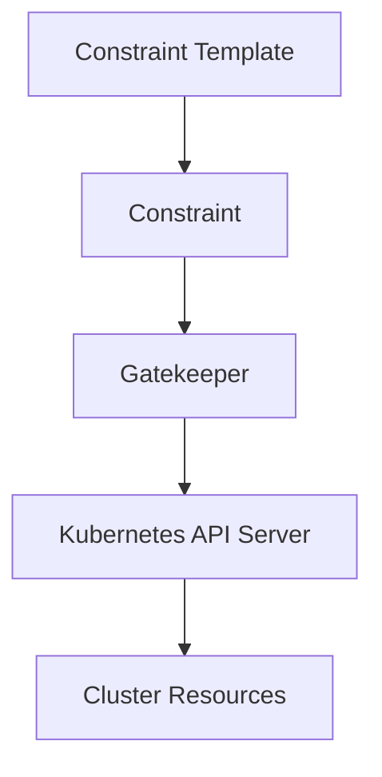

## Introduction to Policy as Code

Policy as Code is a practice that involves defining policies and constraints using code, which can then be enforced within a system or environment. In the context of Kubernetes, this often involves using tools like Open Policy Agent (OPA) and Gatekeeper to define and enforce policies. One common use case is to define policies that restrict certain types of resources, such as NodePort services, to ensure that the cluster remains secure and compliant with organizational policies.

### What is a NodePort Service?

In Kubernetes, a `NodePort` service is a type of service that exposes the service on a static port on each node in the cluster. This allows external traffic to reach the service via the IP address of any node in the cluster. While this can be useful for development and testing purposes, it can also pose security risks if not properly controlled.

#### Why Restrict NodePort Services?

Restricting NodePort services is important because they can expose internal services to the internet, potentially allowing unauthorized access. By enforcing a policy that disallows NodePort services, organizations can reduce the attack surface of their Kubernetes clusters and ensure that only authorized services are exposed externally.

### Background Theory: Constraint Templates and Constraints

To enforce policies in Kubernetes using Gatekeeper, you need to define both constraint templates and constraints. A constraint template is a reusable definition of a policy that can be applied to various resources. A constraint, on the other hand, is an instance of a constraint template that specifies the exact resources to which the policy should be applied.

#### Constraint Template

A constraint template defines the logic of what constitutes a violation of the policy. It is essentially a template that can be used to create specific constraints. For example, a constraint template might define a policy that checks if a resource is a NodePort service.

```yaml
apiVersion: templates.gatekeeper.sh/v1
kind: ConstraintTemplate
metadata:
  name: k8srequiredlabels
spec:
  crd:
    spec:
      names:
        kind: K8sRequiredLabels
  targets:
    - target: admission.k8s.gatekeeper.sh
      rego: |
        package k8srequiredlabels
        
        violation[{"msg": msg, "details": {"kind": input.request.object.kind, "name": input.request.object.metadata.name}}] {
          input.request.operation == "CREATE"
          input.request.object.kind == "Service"
          input.request.object.spec.type == "NodePort"
          msg = sprintf("%v %v is a NodePort service", [input.request.object.kind, input.request.object.metadata.name])
        }
```

#### Constraint

A constraint is an instance of a constraint template that specifies the exact resources to which the policy should be applied. For example, a constraint might specify that the policy should be applied to all services in a particular namespace.

```yaml
apiVersion: constraints.gatekeeper.sh/v1
kind: K8sRequiredLabels
metadata:
  name: deny-nodeport-services
spec:
  match:
    kinds:
      - apiGroups: [""] # "" refers to the core API group
        kinds: ["Service"]
  parameters:
    labels:
      - "app"
```

### How to Prevent / Defend Against NodePort Services

To prevent the deployment of NodePort services in a Kubernetes cluster, you can use Gatekeeper to enforce a policy that rejects such services. Here’s how you can set up and enforce this policy:

#### Step-by-Step Guide

1. **Install Gatekeeper**: First, you need to install Gatekeeper in your Kubernetes cluster. You can do this using the following command:

   ```sh
   kubectl apply -f https://raw.githubusercontent.com/open-policy-agent/gatekeeper/master/deploy/gatekeeper.yaml
   ```

2. **Define the Constraint Template**: Create a constraint template that defines the logic for rejecting NodePort services. Save the following YAML to a file named `nodeport-template.yaml`.

   ```yaml
   apiVersion: templates.gatekeeper.sh/v1
   kind: ConstraintTemplate
   metadata:
     name: k8srequiredlabels
   spec:
     crd:
       spec:
         names:
           kind: K8sRequiredLabels
     targets:
       - target: admission.k8s.gatekeeper.sh
         rego: |
           package k8srequiredlabels
           
           violation[{"msg": msg, "details": {"kind": input.request.object.kind, "name": input.request.object.metadata.name}}] {
             input.request.operation == "CREATE"
             input.request.object.kind == "Service"
             input.request.object.spec.type == "NodePort"
             msg = sprintf("%v %v is a NodePort service", [input.request.object.kind, input.request.object.metadata.name])
           }
   ```

3. **Apply the Constraint Template**: Apply the constraint template to your cluster using the following command:

   ```sh
   kubectl apply -f nodeport-template.yaml
   ```

4. **Create the Constraint**: Create a constraint that uses the template to enforce the policy. Save the following YAML to a file named `nodeport-constraint.yaml`.

   ```yaml
   apiVersion: constraints.gatekeeper.sh/v1
   kind: K8sRequiredLabels
   metadata:
     name: deny-nodeport-services
   spec:
     match:
       kinds:
         - apiGroups: [""] # "" refers to the core API group
           kinds: ["Service"]
   ```

5. **Apply the Constraint**: Apply the constraint to your cluster using the following command:

   ```sh
   kubectl apply -f nodeport-constraint.yaml
   ```

#### Detection and Prevention

To ensure that the policy is being enforced correctly, you can check the status of the constraint and verify that no NodePort services are being deployed.

```sh
kubectl get k8srequiredlabels
```

If a NodePort service is attempted to be deployed, Gatekeeper will reject the request and provide an error message.

#### Secure Coding Fix

Here is an example of a vulnerable service manifest and the corrected version:

**Vulnerable Manifest:**

```yaml
apiVersion: v1
kind: Service
metadata:
  name: my-service
spec:
  ports:
    - port: 80
      targetPort: 8080
  selector:
    app: MyApp
  type: NodePort
```

**Corrected Manifest:**

```yaml
apiVersion: v1
kind: Service
metadata:
  name: my-service
spec:
  ports:
    - port: 80
      targetPort: 8080
  selector:
    app: MyApp
  type: ClusterIP
```

### Real-World Examples and Recent Breaches

One recent example of a breach related to NodePort services is the incident involving a Kubernetes cluster that was exposed to the internet due to a misconfigured NodePort service. This allowed attackers to gain unauthorized access to the cluster and steal sensitive data.

#### Example: CVE-2021-25741

CVE-2021-25741 is a vulnerability in Kubernetes that allows attackers to bypass RBAC (Role-Based Access Control) restrictions by creating a NodePort service. This vulnerability highlights the importance of enforcing strict policies to prevent the deployment of NodePort services.

### Mermaid Diagrams

#### Constraint Template and Constraint Relationship



### Hands-On Labs

For hands-on practice with Policy as Code, you can use the following labs:

- **PortSwigger Web Security Academy**: Offers a variety of labs that cover different aspects of web application security, including Kubernetes security.
- **OWASP Juice Shop**: A deliberately insecure web application that can be used to practice various security techniques, including securing Kubernetes clusters.
- **Kubernetes Goat**: A Kubernetes-based security training platform that includes labs specifically designed to teach Kubernetes security practices.

By following these steps and practicing with real-world examples, you can effectively enforce policies to prevent the deployment of NodePort services in your Kubernetes cluster, thereby enhancing the overall security of your environment.

---
<!-- nav -->
[[DevSecOps/DevSecOps Bootcamp/02-Security Governance & Compliance/04-Policy as Code/Define Policy to reject NodePort Service/02-Introduction to Policy as Code Part 2|Introduction to Policy as Code Part 2]] | [[DevSecOps/DevSecOps Bootcamp/02-Security Governance & Compliance/04-Policy as Code/Define Policy to reject NodePort Service/00-Overview|Overview]] | [[04-Policy as Code Defining Policies to Reject NodePort Services|Policy as Code Defining Policies to Reject NodePort Services]]
