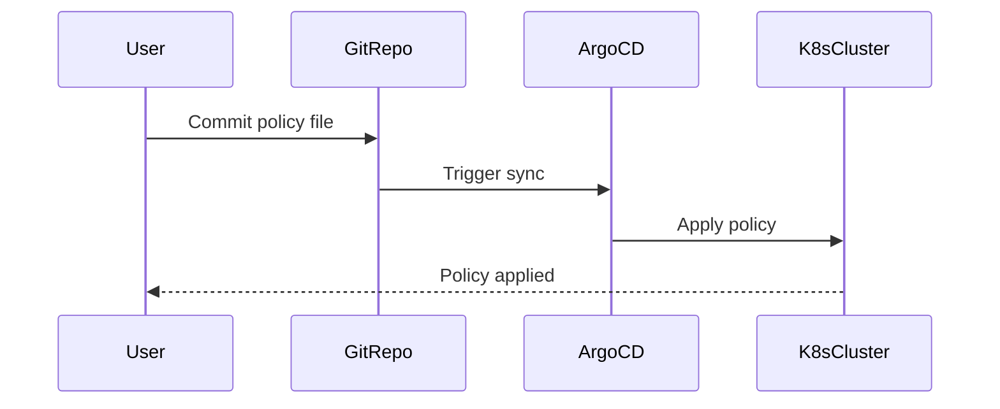

## Policy as Code in DevSecOps

### Introduction to Policy as Code

Policy as Code is a practice in DevSecOps where policies and configurations are defined in code, typically in a version-controlled repository like Git. This approach allows teams to manage infrastructure and security policies programmatically, ensuring consistency, traceability, and automation. In the context of Kubernetes, policies can be applied to control various aspects of the cluster, such as resource allocation, network policies, and security settings.

### Background Theory

#### What is Policy as Code?

Policy as Code involves defining policies in machine-readable formats (like YAML or JSON) and storing them in a version-controlled repository. This enables teams to manage policies using familiar tools and practices from software development, such as pull requests, code reviews, and automated testing.

#### Why Use Policy as Code?

1. **Consistency**: Policies are applied consistently across environments, reducing human error.
2. **Traceability**: Changes to policies are tracked in the version control system, making it easy to audit and understand the history of policy changes.
3. **Automation**: Policies can be automatically enforced and updated, reducing manual intervention.
4. **Collaboration**: Teams can collaborate on policy definitions through code review processes.

### Real-World Examples

#### Recent Breaches and CVEs

One notable example is the Kubernetes API server misconfiguration that led to unauthorized access. CVE-2021-25741 highlighted the importance of properly configuring network policies and service types to prevent unauthorized access. By using Policy as Code, organizations can ensure that such configurations are correctly applied and audited.

### Deploying Manifest Files to the Cluster

To deploy manifest files to a Kubernetes cluster, we need to define and apply these files using tools like `kubectl` or orchestration platforms like Argo CD.

#### Step-by-Step Mechanics

1. **Create Manifest Files**: Define your Kubernetes resources (deployments, services, etc.) in YAML files.
2. **Store in Version Control**: Place these files in a Git repository.
3. **Deploy Using Argo CD**: Use Argo CD to sync the manifests from the Git repository to the Kubernetes cluster.

### Example: Rejecting NodePort Services

Let's walk through an example where we define a policy to reject NodePort services in a Kubernetes cluster.

#### Background

NodePort services expose the service on a static port on every node in the cluster. While useful for certain use cases, they can pose security risks if not managed properly. By rejecting NodePort services, we can enforce a more secure configuration.

#### Step-by-Step Implementation

1. **Define the Policy**:
    - Create a policy file in YAML format.
    - Specify the conditions under which the policy should be applied.

```yaml
apiVersion: kyverno.io/v1
kind: ClusterPolicy
metadata:
  name: reject-nodeport-services
spec:
  validationFailureAction: enforce
  background: false
  rules:
  - name: reject-nodeport
    match:
      resources:
        kinds:
        - Service
    validate:
      message: "NodePort services are not allowed"
      deny:
        conditions:
        - key: spec.type
          operator: NotIn
          value: ["NodePort"]
```

2. **Apply the Policy**:
    - Use `kubectl` to apply the policy to the cluster.

```bash
kubectl apply -f reject-nodeport-services.yaml
```

3. **Verify the Policy**:
    - Test by attempting to create a NodePort service.

```yaml
apiVersion: v1
kind: Service
metadata:
  name: test-service
spec:
  type: NodePort
  selector:
    app: test-app
  ports:
  - protocol: TCP
    port: 80
    targetPort: 8080
```

```bash
kubectl apply -f test-service.yaml
```

If the policy is correctly applied, the above command will fail with a message indicating that NodePort services are not allowed.

### Mermaid Diagrams

#### Policy Application Flow



### Common Pitfalls and How to Avoid Them

#### Pitfall: Incorrect Policy Definition

Incorrectly defined policies can lead to unintended behavior or security vulnerabilities. Always review and test policies thoroughly before applying them.

#### Pitfall: Lack of Monitoring

Without proper monitoring, policy violations may go unnoticed. Implement logging and alerting mechanisms to detect and respond to policy violations.

### How to Prevent / Defend

#### Detection

Use tools like Kyverno or Open Policy Agent (OPA) to monitor and enforce policies. These tools provide detailed logs and alerts when policy violations occur.

#### Prevention

1. **Secure Coding Practices**:
    - Ensure that all policies are reviewed and tested before deployment.
    - Use automated testing frameworks to validate policy behavior.

2. **Configuration Hardening**:
    - Regularly audit and update policies to address new security threats.
    - Implement least privilege principles to minimize exposure.

#### Secure-Coding Fixes

##### Vulnerable Pattern

```yaml
apiVersion: v1
kind: Service
metadata:
  name: insecure-service
spec:
  type: NodePort
  selector:
    app: insecure-app
  ports:
  - protocol: TCP
    port: 80
    targetPort: 8080
```

##### Corrected Secure Version

```yaml
apiVersion: v1
kind: Service
metadata:
  name: secure-service
spec:
  type: ClusterIP
  selector:
    app: secure-app
  ports:
  - protocol: TCP
    port: 80
    targetPort: 8080
```

### Complete Example

#### Full HTTP Request and Response

When deploying a policy using Argo CD, the following HTTP request and response might occur:

```http
POST /api/v1/namespaces/argo-apps/apps HTTP/1.1
Host: argocd-server.example.com
Content-Type: application/json

{
  "apiVersion": "argoproj.io/v1alpha1",
  "kind": "Application",
  "metadata": {
    "name": "platform-argo-app",
    "namespace": "argo-city"
  },
  "spec": {
    "project": "default",
    "source": {
      "repoURL": "https://github.com/example/infrastructure-repo.git",
      "targetRevision": "main",
      "path": "platform"
    },
    "destination": {
      "server": "https://kubernetes.default.svc",
      "namespace": "argo-city"
    },
    "syncPolicy": {
      "automated": {
        "prune": true,
        "selfHeal": true
      }
    }
  }
}
```

```http
HTTP/1.1 201 Created
Date: Mon, 01 Jan 2024 00:00:00 GMT
Content-Type: application/json

{
  "apiVersion": "argoproj.io/v1alpha1",
  "kind": "Application",
  "metadata": {
    "name": "platform-argo-app",
    "namespace": "argo-city",
    "uid": "unique-id",
    "resourceVersion": "123456"
  },
  "spec": {
    "project": "default",
    "source": {
      "repoURL": "https://github.com/example/infrastructure-repo.git",
      "targetRevision": "main",
      "path": "platform"
    },
    "destination": {
      "server": "https://kubernetes.default.svc",
      "namespace": "argo-city"
    },
    "syncPolicy": {
      "automated": {
        "prune": true,
        "selfHeal": true
      }
    }
  }
}
```

### Expected Result

After deploying the policy, the Kubernetes cluster should enforce the rejection of NodePort services. Any attempt to create a NodePort service should result in an error message indicating that the policy has been violated.

### Hands-On Labs

For practical experience with Policy as Code, consider the following labs:

- **Kubernetes Goat**: A hands-on lab for learning Kubernetes security concepts, including Policy as Code.
- **OWASP WrongSecrets**: A series of challenges to learn about various security topics, including securing Kubernetes deployments.
- **kube-hunter**: A tool for hunting down security issues in Kubernetes clusters, which can be used to test and verify policy enforcement.

By following these steps and best practices, you can effectively implement and manage policies in a Kubernetes environment using Policy as Code.

---
<!-- nav -->
[[06-Policy as Code in DevSecOps Part 2|Policy as Code in DevSecOps Part 2]] | [[DevSecOps/DevSecOps Bootcamp/02-Security Governance & Compliance/04-Policy as Code/Define Policy to reject NodePort Service/00-Overview|Overview]] | [[08-Policy as Code in DevSecOps Part 4|Policy as Code in DevSecOps Part 4]]
