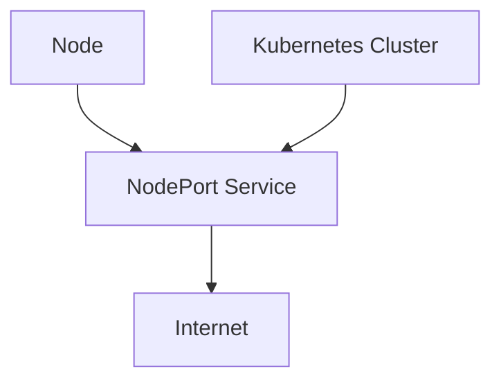
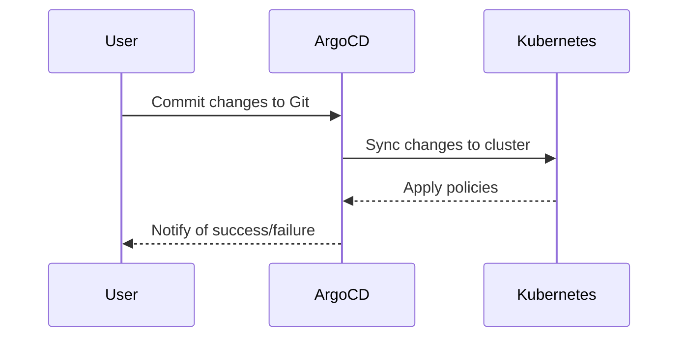

## Policy as Code in DevSecOps

### Introduction to Policy as Code

Policy as Code is a practice within DevSecOps that involves defining policies and rules using code rather than traditional configuration files or manual processes. This approach allows for better automation, consistency, and traceability in managing infrastructure and applications. One specific use case is defining policies to reject certain types of Kubernetes services, such as NodePort services, which can pose security risks.

### Background Theory

#### What is Policy as Code?

Policy as Code refers to the practice of expressing policies and rules in a machine-readable format, typically using a programming language or a domain-specific language (DSL). This enables policies to be version-controlled, tested, and deployed alongside the rest of the infrastructure and application code.

#### Why Use Policy as Code?

Using Policy as Code offers several benefits:

1. **Automation**: Policies can be automatically enforced during the deployment process, reducing the likelihood of human error.
2. **Consistency**: Policies are applied consistently across all environments, ensuring uniformity.
3. **Traceability**: Version control systems can track changes to policies, providing a clear audit trail.
4. **Integration**: Policies can be integrated into continuous integration/continuous deployment (CI/CD) pipelines, enabling automated compliance checks.

### Real-World Examples

#### Recent CVEs and Breaches

One notable example of the importance of Policy as Code is the Kubernetes API server vulnerability (CVE-2020-8558). This vulnerability allowed attackers to bypass authentication and authorization mechanisms, leading to unauthorized access to the cluster. By implementing strict policies and enforcing them through code, organizations can mitigate such risks.

Another example is the Capital One data breach in 2019, where misconfigured firewall rules exposed sensitive customer data. Using Policy as Code to define and enforce firewall rules could have prevented this breach.

### Defining Policy to Reject NodePort Services

#### What is a NodePort Service?

A NodePort service in Kubernetes exposes the service on a static port on each node in the cluster. While this can be useful for development purposes, it poses significant security risks in production environments because it exposes the service to the internet.

#### Why Reject NodePort Services?

Rejecting NodePort services helps mitigate the following risks:

1. **Exposure to the Internet**: NodePort services are accessible from outside the cluster, increasing the attack surface.
2. **Lack of Authentication**: Without proper authentication mechanisms, anyone can access the service.
3. **Resource Misuse**: Unauthorized users can consume resources intended for legitimate services.

### Implementation Using Argo CD

#### Setting Up Argo CD

Argo CD is a declarative, GitOps continuous delivery tool for Kubernetes. It allows you to manage your Kubernetes applications using Git repositories.

##### Step-by-Step Mechanics

1. **Install Argo CD**: First, install Argo CD in your Kubernetes cluster. This can be done using the `kubectl` command:

    ```sh
    kubectl create namespace argocd
    kubectl apply -n argocd -f https://raw.githubusercontent.com/argoproj/argo-cd/stable/manifests/install.yaml
    ```

2. **Configure Argo CD**: Configure Argo CD to sync with your Git repository. This involves creating an `Application` resource in Kubernetes.

    ```yaml
    apiVersion: argoproj.io/v1alpha1
    kind: Application
    metadata:
      name: my-app
      namespace: argocd
    spec:
      project: default
      source:
        repoURL: https://github.com/myorg/myrepo.git
        targetRevision: HEAD
        path: manifests
      destination:
        server: https://kubernetes.default.svc
        namespace: default
    ```

3. **Define Policy**: Create a policy to reject NodePort services. This can be done using a custom validation webhook or by defining a policy in your Git repository.

    ```yaml
    apiVersion: policies.k8s.io/v1
    kind: PodSecurityPolicy
    metadata:
      name: restrict-nodeport
    spec:
      privileged: false
      allowPrivilegeEscalation: false
      requiredDropCapabilities:
      - ALL
      volumes:
      - '*'
      hostNetwork: false
      hostPorts:
      - min: 0
        max: 65535
      runAsUser:
        rule: MustRunAsNonRoot
      seLinux:
        rule: RunAsAny
      supplementalGroups:
        rule: MustRunAs
        ranges:
        - min: 1
          max: 65535
      fsGroup:
        rule: MustRunAs
        ranges:
        - min: 1
          max:  65535
      readOnlyRootFilesystem: true
    ```

4. **Apply Policy**: Apply the policy to your cluster using `kubectl`.

    ```sh
    kubectl apply -f pod-security-policy.yaml
    ```

### Mermaid Diagrams

#### Network Topology



#### Request/Response Flow



### Pitfalls and Common Mistakes

#### Overly Permissive Policies

One common mistake is creating overly permissive policies that do not adequately restrict access. This can lead to security vulnerabilities.

#### Lack of Testing

Failing to test policies thoroughly can result in unexpected behavior or security gaps. Always test policies in a staging environment before deploying them to production.

### How to Prevent / Defend

#### Detection

Use tools like `kube-bench` to check for compliance with best practices and security policies.

```sh
docker run --rm -v /var/run/docker.sock:/var/run/docker.sock aquasec/kube-bench:latest --version 1.21 --check all
```

#### Prevention

1. **Secure Coding Practices**: Ensure that all policies are written securely and reviewed by multiple team members.
2. **Configuration Hardening**: Harden your Kubernetes cluster by disabling unnecessary features and services.
3. **Regular Audits**: Conduct regular audits of your policies and configurations to ensure they remain effective.

#### Secure-Coding Fixes

**Vulnerable Pattern**

```yaml
apiVersion: v1
kind: Service
metadata:
  name: my-service
spec:
  type: NodePort
  ports:
  - port: 80
    targetPort: 8080
  selector:
    app: MyApp
```

**Corrected Secure Version**

```yaml
apiVersion: v1
kind: Service
metadata:
  name: my-service
spec:
  type: ClusterIP
  ports:
  - port: 80
    targetPort: 8080
  selector:
    app: MyApp
```

### Complete Example

#### Full HTTP Request and Response

```http
POST /apis/policy/v1beta1/podsecuritypolicies HTTP/1.1
Host: localhost:8080
Content-Type: application/json

{
  "apiVersion": "policy/v1beta1",
  "kind": "PodSecurityPolicy",
  "metadata": {
    "name": "restrict-nodeport"
  },
  "spec": {
    "privileged": false,
    "allowPrivilegeEscalation": false,
    "requiredDropCapabilities": [
      "ALL"
    ],
    "volumes": [
      "*"
    ],
    "hostNetwork": false,
    "hostPorts": [
      {
        "min": 0,
        "max": 65535
      }
    ],
    "runAsUser": {
      "rule": "MustRunAsNonRoot"
    },
    "seLinux": {
      "rule": "RunAsAny"
    },
    "supplementalGroups": {
      "rule": "MustRunAs",
      "ranges": [
        {
          "min": 1,
          "max": 65535
        }
      ]
    },
    "fsGroup": {
      "rule": "MustRunAs",
      "ranges": [
        {
          "min": 1,
          "max": 65535
        }
      ]
    },
    "readOnlyRootFilesystem": true
  }
}
```

#### Expected Result

```json
{
  "kind": "PodSecurityPolicy",
  "apiVersion": "policy/v1beta1",
  "metadata": {
    "name": "restrict-nodeport",
    "selfLink": "/apis/policy/v1beta1/podsecuritypolicies/restrict-nodeport",
    "uid": "b1b1b1b1-b1b1-b1b1-b1b1-b1b1b1b1b1b1",
    "resourceVersion": "123456",
    "creationTimestamp": "2023-01-01T00:00:00Z"
  },
  "spec": {
    "privileged": false,
    "allowPrivilegeEscalation": false,
    "requiredDropCapabilities": [
      "ALL"
    ],
    "volumes": [
      "*"
    ],
    "hostNetwork": false,
    "hostPorts": [
      {
        "min": 0,
        "max": 65535
      }
    ],
    "runAsUser": {
      "rule": "MustRunAsNonRoot"
    },
    "seLinux": {
      "rule": "RunAsAny"
    },
    "supplementalGroups": {
      "rule": "MustRunAs",
      "ranges": [
        {
          "min": 1,
          "max": 65535
        }
      ]
    },
    "fsGroup": {
      "rule": "MustRunAs",
      "ranges": [
        {
          "min": 1,
          "max": 65535
        }
      ]
    },
    "readOnlyRootFilesystem": true
  }
}
```

### Hands-On Labs

For practical experience with Policy as Code, consider the following labs:

- **Kubernetes Goat**: A hands-on lab for learning Kubernetes security.
- **OWASP WrongSecrets**: A series of challenges to learn about secrets management and security.
- **kube-hunter**: A tool for hunting down security issues in Kubernetes clusters.

These labs provide real-world scenarios and challenges to help you master Policy as Code in a DevSecOps context.

By following these steps and best practices, you can effectively implement Policy as Code to enhance the security and reliability of your Kubernetes deployments.

---
<!-- nav -->
[[07-Policy as Code in DevSecOps Part 3|Policy as Code in DevSecOps Part 3]] | [[DevSecOps/DevSecOps Bootcamp/02-Security Governance & Compliance/04-Policy as Code/Define Policy to reject NodePort Service/00-Overview|Overview]] | [[09-Policy as Code in DevSecOps Part 5|Policy as Code in DevSecOps Part 5]]
