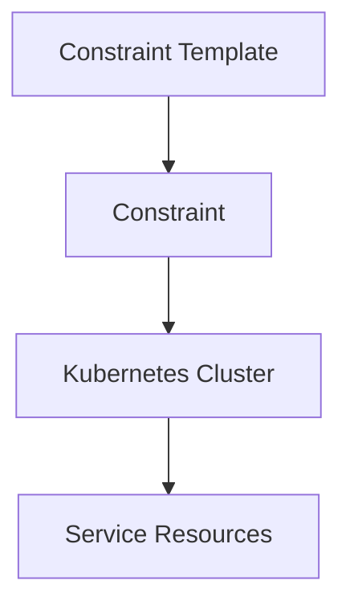

## Policy as Code in DevSecOps

### Introduction to Policy as Code

Policy as Code is an approach to managing infrastructure policies using code, typically within a version-controlled repository. This method allows teams to enforce consistent and repeatable configurations across their environments, ensuring compliance and security. In the context of Kubernetes, policies can be defined using tools like Gatekeeper, which is a policy controller for Kubernetes. These policies can enforce constraints on the resources created within the cluster, such as services, deployments, and pods.

### Constraint Types in Gatekeeper

Gatekeeper supports various types of constraints, each designed to enforce specific rules on different aspects of the Kubernetes cluster. Constraints are defined using Constraint Template objects, which specify the structure and logic of the constraint. Each constraint type can be tailored to meet specific organizational requirements.

#### Example Constraint Types

- **Kubernetes NodePort**: This constraint ensures that no services are configured with the `NodePort` type, which can expose the internal services to the external network.
- **Namespace Resource Quotas**: This constraint enforces limits on the resources used by each namespace, preventing resource exhaustion.
- **Pod Security Policies**: This constraint ensures that pods adhere to specific security policies, such as running as non-root users or restricting access to sensitive files.

### Deploying Constraints in Gatekeeper

To deploy constraints in Gatekeeper, you need to create and apply the necessary manifest files. These manifest files define the constraints and their associated templates. Let's walk through the process of defining and deploying a constraint to reject `NodePort` services.

#### Step-by-Step Deployment

1. **Define the Constraint Template**:
   Create a Constraint Template object that defines the structure and logic of the constraint. This template specifies the fields and conditions that the constraint will evaluate.

   ```yaml
   apiVersion: templates.gatekeeper.sh/v1
   kind: ConstraintTemplate
   metadata:
     name: k8snodeport
   spec:
     crd:
       spec:
         names:
           kind: K8sNodePort
     targets:
       - target: admission.k8s.gatekeeper.sh
         rego: |
           package k8snodeport
           
           violation[{"msg": msg, "details": {}}] {
             input.review.object.kind == "Service"
             input.review.object.spec.type == "NodePort"
             msg = sprintf("%v/%v is of type NodePort", [input.review.object.metadata.namespace, input.review.object.metadata.name])
           }
   ```

2. **Create the Constraint**:
   Define the actual constraint that references the template and specifies the conditions to be enforced.

   ```yaml
   apiVersion: constraints.gatekeeper.sh/v1beta1
   kind: K8sNodePort
   metadata:
     name: deny-nodeport-services
   spec:
     match:
       kinds:
         - apiGroups: [""] # Core API group
           kinds: ["Service"]
   ```

3. **Deploy the Manifest Files**:
   Apply the manifest files to your Kubernetes cluster using `kubectl`.

   ```sh
   kubectl apply -f k8snodeport-template.yaml
   kubectl apply -f deny-nodeport-services.yaml
   ```

### Visualizing Constraints in Argo CD

Argo CD is a declarative, GitOps continuous delivery tool for Kubernetes. One of its features is the ability to visualize the deployment of constraints and their effects on the cluster.

#### Visualizing Constraints

When you deploy a constraint using Argo CD, you can view the deployed components and their relationships in the Argo CD UI. This visualization helps you understand the impact of the constraint on the cluster.



In the above diagram, the Constraint Template (`A`) defines the structure of the constraint, which is then instantiated as a Constraint (`B`). This constraint is applied to the Kubernetes Cluster (`C`), affecting the Service Resources (`D`).

### Verifying the Policy

Once the policy is deployed, you need to verify that it is working as intended. This involves creating a service with the `NodePort` type and checking if the policy correctly rejects it.

#### Creating a NodePort Service

Let's create a service with the `NodePort` type and attempt to deploy it.

```yaml
apiVersion: v1
kind: Service
metadata:
  name: example-service
spec:
  type: NodePort
  selector:
    app: example-app
  ports:
    - protocol: TCP
      port: 80
      targetPort: 8080
```

#### Attempting to Deploy the Service

Apply the service manifest to the cluster.

```sh
kubectl apply -f example-service.yaml
```

If the policy is correctly enforced, the deployment should fail with an error message indicating that the service is of type `NodePort`, which is not allowed.

### Full HTTP Request and Response

Here is the full HTTP request and response for deploying the service:

```http
POST /apis/v1/namespaces/default/services HTTP/1.1
Host: localhost:8080
Content-Type: application/json
Authorization: Bearer <token>

{
  "apiVersion": "v1",
  "kind": "Service",
  "metadata": {
    "name": "example-service"
  },
  "spec": {
    "type": "NodePort",
    "selector": {
      "app": "example-app"
    },
    "ports": [
      {
        "protocol": "TCP",
        "port": 80,
        "targetPort": 8080
      }
    ]
  }
}
```

Response:

```http
HTTP/1.1 403 Forbidden
Content-Type: application/json
Date: Mon, 01 Jan 2024 00:00:00 GMT
Content-Length: 123

{
  "kind": "Status",
  "apiVersion": "v1",
  "metadata": {},
  "status": "Failure",
  "message": "admission webhook \"validation.gatekeeper.sh\" denied the request: [denied by deny-nodeport-services]: example-service/default is of type NodePort",
  "reason": "Forbidden",
  "details": {
    "name": "example-service",
    "group": "",
    "kind": "service"
  },
  "code": 403
}
```

### How to Prevent / Defend

#### Detection

To detect violations of the policy, you can monitor the audit logs and alerts generated by Gatekeeper. These logs provide detailed information about the violations and the resources involved.

#### Prevention

To prevent violations, ensure that all developers and operators are aware of the policies and their implications. Regular training and code reviews can help enforce compliance.

#### Secure Coding Fixes

Compare the vulnerable and secure versions of the service manifest:

**Vulnerable Version**

```yaml
apiVersion: v1
kind: Service
metadata:
  name: example-service
spec:
  type: NodePort
  selector:
    app: example-app
  ports:
    - protocol: TCP
      port: 80
      targetPort: 8080
```

**Secure Version**

```yaml
apiVersion: v1
kind: Service
metadata:
  name: example-service
spec:
  type: ClusterIP
  selector:
    app: example-app
  ports:
    - protocol: TCP
      port: 80
      targetPort: 8080
```

#### Configuration Hardening

Ensure that the Gatekeeper policies are properly configured and enforced across all namespaces. Use tools like `kubectl` to verify the configuration and check for any misconfigurations.

### Real-World Examples

Recent breaches and vulnerabilities often involve misconfigured Kubernetes services. For example, a breach might occur due to a service being exposed via `NodePort` without proper authentication or encryption. Ensuring that services are properly configured and enforcing policies can prevent such issues.

### Practice Labs

For hands-on practice with Policy as Code in Kubernetes, consider the following labs:

- **PortSwigger Web Security Academy**: Offers a variety of labs related to Kubernetes security, including policy enforcement.
- **OWASP Juice Shop**: Provides a vulnerable web application that can be deployed in a Kubernetes environment, allowing you to test and enforce policies.
- **CloudGoat**: Focuses on cloud security and includes scenarios for enforcing policies in Kubernetes clusters.

By following these steps and practices, you can effectively manage and enforce policies in your Kubernetes cluster, ensuring compliance and security.

---
<!-- nav -->
[[10-Policy as Code in DevSecOps Part 6|Policy as Code in DevSecOps Part 6]] | [[DevSecOps/DevSecOps Bootcamp/02-Security Governance & Compliance/04-Policy as Code/Define Policy to reject NodePort Service/00-Overview|Overview]] | [[12-Policy as Code in DevSecOps Part 8|Policy as Code in DevSecOps Part 8]]
