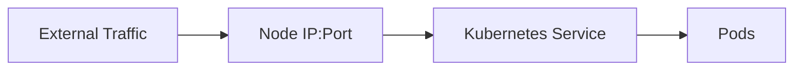

## Policy as Code in DevSecOps

### Introduction to Policy as Code

Policy as Code is a fundamental concept in modern DevSecOps practices. It involves defining and enforcing policies using code, rather than manual processes. This approach ensures consistency, automation, and traceability in policy enforcement across development, testing, and production environments. In the context of Kubernetes, Policy as Code can be used to enforce security best practices, such as rejecting certain types of services or configurations that do not meet organizational standards.

### Understanding NodePort Services

Before diving into the specifics of creating policies to reject NodePort services, it is essential to understand what NodePort services are and why they might be problematic.

#### What is a NodePort Service?

A NodePort service is a type of Kubernetes service that exposes the service on a static port on every node in the cluster. This allows external traffic to reach the service via the node IP and the specified port. The range of ports available for NodePort services is typically between 30000 and 32767.



#### Why NodePort Services Can Be Problematic

While NodePort services provide a simple way to expose services externally, they can introduce several security risks:

1. **Exposure to External Threats**: By exposing services on static ports, NodePort services can make it easier for attackers to target specific services.
2. **Resource Management Issues**: Managing a large number of NodePort services can lead to resource management issues, especially if the ports are not properly managed.
3. **Inconsistent Security Policies**: Without proper policy enforcement, different teams might deploy NodePort services inconsistently, leading to security gaps.

### Creating a Policy to Reject NodePort Services

To address these issues, we can create a policy that rejects NodePort services. This policy will ensure that only services that comply with organizational security standards are deployed.

#### Step-by-Step Guide to Creating the Policy

1. **Define the Policy**:
   - We will use a tool like `OPA` (Open Policy Agent) to define and enforce our policy.
   - The policy will check if a service is of type `NodePort` and reject it if it is.

2. **Implement the Policy**:
   - We will write the policy in Rego, OPA's policy language.
   - The policy will be integrated into the Kubernetes admission controller to automatically enforce it.

#### Example Policy in Rego

Here is an example of a Rego policy that rejects NodePort services:

```rego
package kubernetes.admission

deny[msg] {
    input.request.kind.kind == "Service"
    input.request.object.spec.type == "NodePort"
    msg = sprintf("NodePort services are not allowed: %v", [input.request.object.metadata.name])
}
```

#### Explanation of the Policy

- **Package Declaration**: `package kubernetes.admission` declares the package name.
- **Deny Rule**: The `deny[msg]` rule checks if the request is for a `Service` kind and if the `type` of the service is `NodePort`.
- **Message Construction**: If the conditions are met, the policy constructs a message indicating that NodePort services are not allowed.

#### Integrating the Policy with Kubernetes

To integrate this policy with Kubernetes, we need to set up an admission controller that uses OPA to enforce the policy.

```yaml
apiVersion: apiserver.config.k8s.io/v1
kind: AdmissionConfiguration
plugins:
- name: opa
  configuration:
    apiVersion: opa.example.com/v1
    kind: OpaConfiguration
    regoPolicies:
      - path: /path/to/nodeport_policy.rego
```

This configuration sets up an admission controller named `opa` and specifies the path to the Rego policy file.

### Testing the Policy

To test the policy, we can attempt to create a NodePort service and observe the result.

#### Example of Creating a NodePort Service

```yaml
apiVersion: v1
kind: Service
metadata:
  name: ad-service-nodeport
spec:
  type: NodePort
  selector:
    app: ad-service
  ports:
  - protocol: TCP
    port: 80
    targetPort: 8080
```

#### Expected Result

When attempting to create this service, the admission controller should reject it based on the policy:

```http
HTTP/1.1 403 Forbidden
Content-Type: application/json
{
  "kind": "Status",
  "apiVersion": "v1",
  "metadata": {},
  "status": "Failure",
  "message": "admissions webhook \"opa\" denied the request: NodePort services are not allowed: ad-service-nodeport",
  "reason": "Forbidden",
  "details": {
    "name": "ad-service-nodeport",
    "kind": "Service"
  },
  "code": 403
}
```

### Fixing the Service Configuration

To fix the service configuration, we need to change the service type from `NodePort` to `ClusterIP`.

#### Corrected Service Configuration

```yaml
apiVersion: v1
kind: Service
metadata:
  name: ad-service-clusterip
spec:
  type: ClusterIP
  selector:
    app: ad-service
  ports:
  - protocol: TCP
    port: 80
    targetPort: 8080
```

#### Expected Result

When applying this corrected configuration, the service should be created successfully:

```http
HTTP/1.1 201 Created
Content-Type: application/json
{
  "kind": "Service",
  "apiVersion": "v1",
  "metadata": {
    "name": "ad-service-clusterip",
    "namespace": "default",
    "selfLink": "/api/v1/namespaces/default/services/ad-service-clusterip",
    "uid": "unique-id",
    "resourceVersion": "version-number",
    "creationTimestamp": "timestamp"
  },
  "spec": {
    "ports": [
      {
        "protocol": "TCP",
        "port": 80,
        "targetPort": 8080
      }
    ],
    "selector": {
      "app": "ad-service"
    },
    "clusterIP": "cluster-ip-address",
    "type": "ClusterIP"
  },
  "status": {
    "loadBalancer": {}
  }
}
```

### Creating Another Policy for Pod Configurations

Now that we have enforced a policy to reject NodePort services, we can extend this approach to other security best practices, such as enforcing specific pod configurations.

#### Example Policy for Pod Configurations

Here is an example of a Rego policy that enforces a specific pod configuration:

```rego
package kubernetes.admission

deny[msg] {
    input.request.kind.kind == "Pod"
    not input.request.object.spec.securityContext.runAsNonRoot
    msg = sprintf("Pods must run as non-root: %v", [input.request.object.metadata.name])
}
```

#### Explanation of the Policy

- **Package Declaration**: `package kubernetes.admission` declares the package name.
- **Deny Rule**: The `deny[msg]` rule checks if the request is for a `Pod` kind and if the `securityContext.runAsNonRoot` field is not set.
- **Message Construction**: If the conditions are met, the policy constructs a message indicating that pods must run as non-root.

### How to Prevent / Defend

#### Detection

To detect violations of the policy, you can use tools like `kubectl` to inspect the resources in your cluster:

```sh
kubectl get pods --all-namespaces -o json | jq '.items[] | select(.spec.securityContext.runAsNonRoot == false)'
```

This command will list all pods that do not run as non-root.

#### Prevention

To prevent violations, ensure that the admission controller is properly configured and that all policies are enforced. Additionally, you can use tools like `kube-bench` to audit your cluster for compliance with best practices.

#### Secure Coding Fixes

Here is an example of a pod configuration that violates the policy and the corrected version:

**Vulnerable Pod Configuration**

```yaml
apiVersion: v1
kind: Pod
metadata:
  name: vulnerable-pod
spec:
  containers:
  - name: container-name
    image: image-name
    command: ["command"]
```

**Corrected Pod Configuration**

```yaml
apiVersion: v1
kind: Pod
metadata:
  name: secure-pod
spec:
  securityContext:
    runAsNonRoot: true
  containers:
  - name: container-name
    image: image-name
    command: ["command"]
```

### Real-World Examples and Recent Breaches

Recent breaches have highlighted the importance of enforcing strict security policies. For example, the SolarWinds breach (CVE-2020-1014) demonstrated how a lack of proper security controls can lead to significant vulnerabilities. By implementing policies to reject NodePort services and enforce other security best practices, organizations can mitigate such risks.

### Practice Labs

For hands-on experience with Policy as Code in Kubernetes, consider the following labs:

- **Kubernetes Goat**: A Kubernetes-based security training platform that includes exercises on policy enforcement.
- **OWASP WrongSecrets**: A series of challenges that focus on various security aspects, including policy enforcement in Kubernetes.

These labs provide practical scenarios to reinforce the concepts learned in this chapter.

### Conclusion

Policy as Code is a powerful tool in the DevSecOps toolkit. By defining and enforcing policies using code, organizations can ensure consistent and automated enforcement of security best practices. This chapter has covered the fundamentals of creating and applying policies to reject NodePort services and enforce other security configurations in Kubernetes. By following these guidelines, you can significantly enhance the security posture of your Kubernetes clusters.

---
<!-- nav -->
[[12-Policy as Code in DevSecOps Part 8|Policy as Code in DevSecOps Part 8]] | [[DevSecOps/DevSecOps Bootcamp/02-Security Governance & Compliance/04-Policy as Code/Define Policy to reject NodePort Service/00-Overview|Overview]] | [[14-Policy as Code in DevSecOps|Policy as Code in DevSecOps]]
