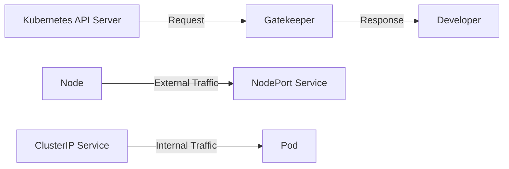
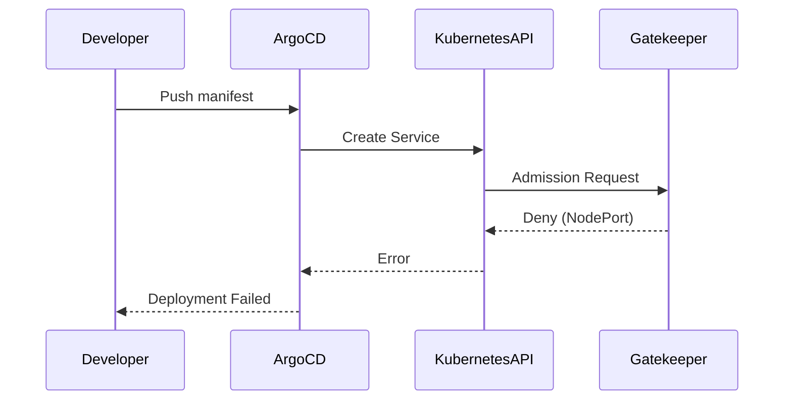

## Policy as Code in DevSecOps

### Introduction to Policy as Code

Policy as Code is a practice in DevSecOps where security policies are defined and enforced using code. This approach allows organizations to manage security policies in a consistent, repeatable, and auditable manner. In Kubernetes environments, this means defining constraints and policies that govern how resources can be deployed and managed within the cluster.

### Understanding NodePort Services

Before diving into the specifics of blocking NodePort services, let's first understand what NodePort services are and why they might need to be restricted.

#### What is a NodePort Service?

In Kubernetes, a `NodePort` service is a type of service that exposes the service on a static port on each node in the cluster. This allows external traffic to reach the service by accessing `<NodeIP>:<NodePort>`. The range of ports available for NodePort services is typically from 30000 to 32767.

```yaml
apiVersion: v1
kind: Service
metadata:
  name: my-service
spec:
  type: NodePort
  selector:
    app: MyApp
  ports:
    - protocol: TCP
      port: 80
      targetPort: 9376
```

#### Why Restrict NodePort Services?

Restricting NodePort services can be important for several reasons:

1. **Security**: Exposing services via NodePort can increase the attack surface of your cluster. External entities can directly access the service, potentially bypassing network policies and other security measures.
2. **Network Complexity**: Managing a large number of NodePort services can lead to complex network configurations, making it harder to maintain and troubleshoot.
3. **Resource Management**: Each NodePort service consumes a port on every node in the cluster, which can be a limited resource.

### Implementing a Policy to Block NodePort Services

To implement a policy that blocks NodePort services, we will use Open Policy Agent (OPA) and Gatekeeper, a Kubernetes-native policy controller that integrates with OPA.

#### Step 1: Install Gatekeeper

First, ensure that Gatekeeper is installed in your Kubernetes cluster. You can install it using Helm:

```bash
helm repo add gatekeeper https://open-policy-agent.github.io/gatekeeper/charts
helm repo update
helm install gatekeeper gatekeeper/gatekeeper --namespace gatekeeper-system --create-namespace
```

#### Step 2: Define the Constraint Template

The constraint template defines the logic for detecting policy violations. In this case, we want to detect services with the `type` set to `NodePort`.

```yaml
apiVersion: templates.gatekeeper.sh/v1
kind: ConstraintTemplate
metadata:
  name: k8srequiredlabels
spec:
  crd:
    spec:
      names:
        kind: K8sRequiredLabels
  targets:
    - target: admission.k8s.gatekeeper.sh
      rego: |
        package k8srequiredlabels
        
        violation[{"msg": msg, "details": {"kind": input.request.object.kind, "name": input.request.object.metadata.name}}] {
          input.request.operation == "CREATE"
          input.request.object.kind == "Service"
          input.request.object.spec.type == "NodePort"
          msg = sprintf("%v %v is not allowed to be of type NodePort", [input.request.object.kind, input.request.object.metadata.name])
        }
```

#### Step 3: Apply the Constraint

Next, apply the constraint to enforce the policy. This constraint will use the template defined above to check for `NodePort` services during creation.

```yaml
apiVersion: constraints.gatekeeper.sh/v1beta1
kind: K8sRequiredLabels
metadata:
  name: deny-nodeport-services
spec:
  match:
    kinds:
      - apiGroups: [""] # "" refers to the core API group
        kinds: ["Service"]
```

### Full Example of Request and Response

Let's consider a scenario where a developer attempts to deploy a `NodePort` service.

#### Developer's Manifest File

```yaml
apiVersion: v1
kind: Service
metadata:
  name: my-service
spec:
  type: NodePort
  selector:
    app: MyApp
  ports:
    - protocol: TCP
      port: 80
      targetPort: 9376
```

#### Full HTTP Request

When the developer pushes this manifest to the GitHub repository, Argo CD will attempt to apply it to the cluster. The request to the Kubernetes API server will look like this:

```http
POST /apis/v1/namespaces/default/services HTTP/1.1
Host: <Kubernetes-API-Server>
Content-Type: application/json
Authorization: Bearer <Token>

{
  "apiVersion": "v1",
  "kind": "Service",
  "metadata": {
    "name": "my-service"
  },
  "spec": {
    "type": "NodePort",
    "selector": {
      "app": "MyApp"
    },
    "ports": [
      {
        "protocol": "TCP",
        "port": 80,
        "targetPort": 9376
      }
    ]
  }
}
```

#### Full HTTP Response

Gatekeeper will intercept this request and evaluate it against the defined constraint. If the service is of type `NodePort`, the request will be rejected with an error message.

```http
HTTP/1.1 403 Forbidden
Content-Type: application/json

{
  "kind": "Status",
  "apiVersion": "v1",
  "metadata": {},
  "status": "Failure",
  "message": "admission webhook \"validation.webhook.gatekeeper.sh\" denied the request: [denied by deny-nodeport-services]: Service my-service is not allowed to be of type NodePort",
  "reason": "Forbidden",
  "details": {
    "name": "my-service",
    "group": "",
    "kind": "Service"
  },
  "code": 403
}
```

### How to Prevent / Defend

#### Detection

To detect whether NodePort services are being used in your cluster, you can run a simple `kubectl` command:

```bash
kubectl get svc --all-namespaces -o json | jq '.items[] | select(.spec.type == "NodePort")'
```

This command will list all services of type `NodePort` across all namespaces.

#### Prevention

To prevent the deployment of NodePort services, follow these steps:

1. **Install and Configure Gatekeeper**: Ensure that Gatekeeper is installed and configured correctly in your cluster.
2. **Define and Apply Constraints**: Use the constraint template and constraint definitions provided above to enforce the policy.
3. **Educate Developers**: Make sure developers are aware of the policy and understand the implications of using NodePort services.

#### Secure Coding Fixes

Here is a comparison of a vulnerable and a secure version of the service definition:

**Vulnerable Version**

```yaml
apiVersion: v1
kind: Service
metadata:
  name: my-service
spec:
  type: NodePort
  selector:
    app: MyApp
  ports:
    - protocol: TCP
      port: 80
      targetPort: 9376
```

**Secure Version**

```yaml
apiVersion: v1
kind: Service
metadata:
  name: my-service
spec:
  type: ClusterIP
  selector:
    app: MyApp
  ports:
    - protocol: TCP
      port: 80
      targetPort: 9376
```

### Real-World Examples and Breaches

#### Recent CVEs and Breaches

One notable example is the Kubernetes API server vulnerability (CVE-2021-25741), where an attacker could exploit a flaw in the API server to bypass RBAC and deploy unauthorized resources, including NodePort services. By enforcing strict policies, such vulnerabilities can be mitigated.

### Mermaid Diagrams

#### Network Topology



#### Sequence Diagram



### Practice Labs

For hands-on experience with Policy as Code in Kubernetes, consider the following labs:

- **Kubernetes Goat**: A hands-on lab for learning Kubernetes security practices.
- **OWASP WrongSecrets**: A series of challenges to learn about Kubernetes security.
- **kube-hunter**: A tool for finding security issues in Kubernetes clusters.

These labs provide practical scenarios to test and enforce policies in a controlled environment.

### Conclusion

Implementing Policy as Code to block NodePort services is a crucial step in securing your Kubernetes cluster. By leveraging tools like Gatekeeper and OPA, you can enforce strict policies that prevent unauthorized deployments and reduce the attack surface. Always ensure that developers are educated on these policies and that regular audits are performed to detect and mitigate any potential issues.

---
<!-- nav -->
[[13-Policy as Code in DevSecOps Part 9|Policy as Code in DevSecOps Part 9]] | [[DevSecOps/DevSecOps Bootcamp/02-Security Governance & Compliance/04-Policy as Code/Define Policy to reject NodePort Service/00-Overview|Overview]] | [[DevSecOps/DevSecOps Bootcamp/02-Security Governance & Compliance/04-Policy as Code/Define Policy to reject NodePort Service/15-Practice Questions & Answers|Practice Questions & Answers]]
