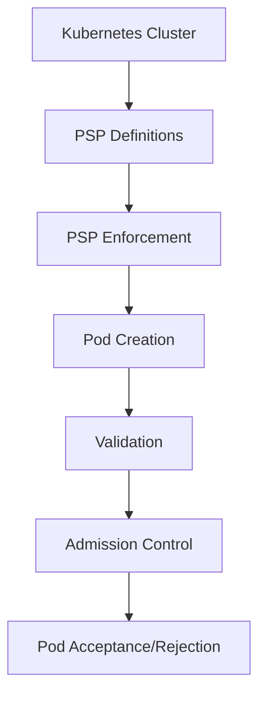
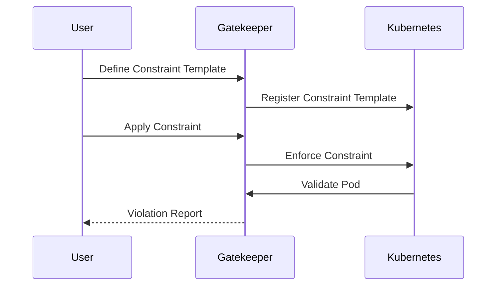

## Policy as Code in DevSecOps

### Introduction to Policy as Code

Policy as Code is a practice in DevSecOps where security policies are defined and enforced through code rather than manual processes. This approach ensures consistency, automation, and traceability in enforcing security policies across different environments and stages of the software development lifecycle. In the context of Kubernetes, one critical aspect of Policy as Code is ensuring that containers do not run with elevated privileges, such as root access. This is crucial because running containers with root privileges can lead to severe security vulnerabilities.

### Understanding Privileged Containers

A privileged container is a container that runs with elevated permissions, typically those of the root user. This means the container has unrestricted access to the host system, which can be exploited by attackers to gain control over the entire system. Running containers with root privileges is generally considered a bad practice due to the increased risk of security breaches.

#### Why Privileged Containers Are Dangerous

Running containers with root privileges poses several risks:

1. **Elevation of Privilege**: An attacker who gains access to a container running with root privileges can potentially escalate their privileges to control the entire host system.
2. **Data Exposure**: Root access allows an attacker to read sensitive data stored on the host system.
3. **System Compromise**: With root access, an attacker can modify system configurations, install malicious software, or perform other actions that can compromise the integrity of the system.

#### Real-World Example: CVE-2019-10126

CVE-2019-10126 is a critical vulnerability in Docker that allowed an attacker to escape the container and gain root access to the host system. This vulnerability highlights the importance of avoiding privileged containers and implementing strict security policies.

### Enforcing Non-Privileged Containers in Kubernetes

To ensure that containers do not run with root privileges, Kubernetes provides mechanisms to define and enforce security policies. One such mechanism is the use of Pod Security Policies (PSPs).

#### What is a Pod Security Policy (PSP)?

A Pod Security Policy (PSP) is a resource in Kubernetes that defines a set of conditions that a pod must meet in order to be accepted by the system. These conditions can include restrictions on the capabilities of the containers within the pod, such as whether they can run with root privileges.

#### How to Define a PSP to Reject Privileged Containers

To define a PSP that rejects privileged containers, you need to create a policy that explicitly disallows the `privileged` flag in pod configurations. Here is an example of how to define such a policy:

```yaml
apiVersion: policy/v1beta1
kind: PodSecurityPolicy
metadata:
  name: non-privileged-psp
spec:
  privileged: false
  allowPrivilegeEscalation: false
  requiredDropCapabilities:
  - ALL
  readOnlyRootFilesystem: true
  seLinux:
    rule: RunAsAny
  supplementalGroups:
    rule: RunAsAny
  runAsUser:
    rule: RunAsAny
  fsGroup:
    rule: RunAsAny
```

This PSP ensures that pods cannot run with root privileges by setting `privileged` to `false`. Additionally, it sets `allowPrivilegeEscalation` to `false`, which prevents containers from escalating their privileges.

### Using Gatekeeper for Policy Enforcement

Gatekeeper is a popular open-source project that extends Kubernetes with custom validation and admission controllers. It allows you to define and enforce custom policies using Constraint Templates and Constraints.

#### Constraint Template for Privileged Containers

To define a policy that rejects privileged containers using Gatekeeper, you can create a Constraint Template and a corresponding Constraint. Here is an example of a Constraint Template that checks for the `privileged` flag in pod configurations:

```yaml
apiVersion: templates.gatekeeper.sh/v1
kind: ConstraintTemplate
metadata:
  name: k8spspprivilegedcontainer
spec:
  crd:
    spec:
      names:
        kind: K8sPSPPrivilegedContainer
  targets:
    - target: admission.k8s.gatekeeper.sh
      rego: |
        package k8spspprivilegedcontainer
        
        violation[{"msg": msg, "details": {"kind": input.request.object.kind, "name": input.request.object.metadata.name}}] {
          input.request.operation == "CREATE"
          input.request.object.kind == "Pod"
          input.request.object.spec.containers[_].securityContext.privileged
          msg := sprintf("Pod %v is attempting to run with privileged containers", [input.request.object.metadata.name])
        }
```

This Constraint Template checks if a pod is attempting to run with privileged containers during creation and generates a violation if it finds such a pod.

#### Applying the Constraint

Once you have defined the Constraint Template, you can apply a Constraint to enforce the policy:

```yaml
apiVersion: constraints.gatekeeper.sh/v1
kind: K8sPSPPrivilegedContainer
metadata:
  name: deny-privileged-containers
spec:
  match:
    kinds:
      - apiGroups: [""] # Core API Group
        kinds: ["Pod"]
```

This Constraint applies the policy defined in the Constraint Template to all pods in the cluster.

### Full Example: Request, Response, and Result

Here is a complete example of how the policy enforcement works in practice:

#### HTTP Request

```http
POST /apis/admissionregistration.k8s.io/v1/mutatingwebhookconfigurations HTTP/1.1
Host: localhost:8080
Content-Type: application/json

{
  "apiVersion": "admissionregistration.k8s.io/v1",
  "kind": "MutatingWebhookConfiguration",
  "metadata": {
    "name": "gatekeeper-webhook"
  },
  "webhooks": [
    {
      "name": "validation.gatekeeper.sh",
      "rules": [
        {
          "operations": ["CREATE"],
          "apiGroups": [""],
          "apiVersions": ["v1"],
          "resources": ["pods"]
        }
      ],
      "clientConfig": {
        "service": {
          "namespace": "gatekeeper-system",
          "name": "gatekeeper-audit"
        },
        "path": "/mutate"
      },
      "sideEffects": "None"
    }
  ]
}
```

#### HTTP Response

```http
HTTP/1.1 201 Created
Content-Type: application/json

{
  "apiVersion": "admissionregistration.k8s.io/v1",
  "kind": "MutatingWebhookConfiguration",
  "metadata": {
    "name": "gatekeeper-webhook",
    "uid": "some-uid",
    "resourceVersion": "some-resource-version",
    "creationTimestamp": "2023-10-01T12:00:00Z"
  },
  "webhooks": [
    {
      "name": "validation.gatekeeper.sh",
      "rules": [
        {
          "operations": ["CREATE"],
          "apiGroups": [""],
          "apiVersions": ["v1"],
          "resources": ["pods"]
        }
      ],
      "clientConfig": {
        "service": {
          "namespace": "gatekeeper-system",
          "name": "gatekeeper-audit"
        },
        "path": "/mutate"
      },
      "sideEffects": "None"
    }
  ]
}
```

#### Result

When a pod is created with a privileged container, Gatekeeper will reject the request and generate a violation:

```json
{
  "kind": "K8sPSPPrivilegedContainer",
  "apiVersion": "constraints.gatekeeper.sh/v1",
  "metadata": {
    "name": "deny-privileged-containers"
  },
  "spec": {
    "match": {
      "kinds": [
        {
          "apiGroups": [""],
          "kinds": ["Pod"]
        }
      ]
    }
  },
  "status": {
    "violations": [
      {
        "message": "Pod my-pod is attempting to run with privileged containers",
        "details": {
          "kind": "Pod",
          "name": "my-pod"
        }
      }
    ]
  }
}
```

### How to Prevent / Defend

#### Detection

To detect if any pods are running with privileged containers, you can use tools like `kubectl` to inspect pod configurations:

```sh
kubectl get pods --all-namespaces -o json | jq '.items[] | select(.spec.containers[].securityContext?.privileged)'
```

This command will list all pods that have the `privileged` flag set to `true`.

#### Prevention

To prevent pods from running with privileged containers, you should:

1. **Define and Apply PSPs**: Ensure that PSPs are defined and applied to all namespaces in your cluster.
2. **Use Gatekeeper**: Implement Gatekeeper to enforce custom policies that reject privileged containers.
3. **Audit Regularly**: Regularly audit your cluster to ensure that no pods are running with privileged containers.

#### Secure Coding Fixes

Here is an example of a vulnerable pod configuration and the corresponding secure configuration:

**Vulnerable Configuration**

```yaml
apiVersion: v1
kind: Pod
metadata:
  name: my-pod
spec:
  containers:
  - name: my-container
    image: my-image
    securityContext:
      privileged: true
```

**Secure Configuration**

```yaml
apiVersion: v1
kind: Pod
metadata:
  name: my-pod
spec:
  containers:
  - name: my-container
    image: my-image
```

By removing the `securityContext` with `privileged: true`, the pod will not run with root privileges.

### Hardening

To further harden your Kubernetes cluster against privileged containers, consider the following measures:

1. **Enable Pod Security Admission Controller**: Enable the Pod Security Admission Controller in your Kubernetes cluster to automatically enforce Pod Security Policies.
2. **Use Network Policies**: Implement Network Policies to restrict communication between pods and limit the potential damage in case of a breach.
3. **Regular Audits**: Perform regular audits of your cluster to ensure compliance with security policies.

### Mermaid Diagrams

#### Pod Security Policy Architecture



#### Gatekeeper Constraint Template Flow



### Practice Labs

For hands-on experience with Policy as Code in Kubernetes, consider the following labs:

- **PortSwigger Web Security Academy**: Offers interactive labs on Kubernetes security, including Pod Security Policies.
- **OWASP Juice Shop**: Provides a vulnerable web application that can be deployed in a Kubernetes environment to test security policies.
- **CloudGoat**: A cloud security training platform that includes Kubernetes security exercises.

These labs provide practical experience in defining and enforcing security policies in Kubernetes, helping you to master the concepts discussed in this chapter.

---
<!-- nav -->
[[06-Policy as Code in DevSecOps Part 1|Policy as Code in DevSecOps Part 1]] | [[DevSecOps/DevSecOps Bootcamp/02-Security Governance & Compliance/04-Policy as Code/Define Policy to reject Privileged Containers/00-Overview|Overview]] | [[DevSecOps/DevSecOps Bootcamp/02-Security Governance & Compliance/04-Policy as Code/Define Policy to reject Privileged Containers/08-Practice Questions & Answers|Practice Questions & Answers]]
