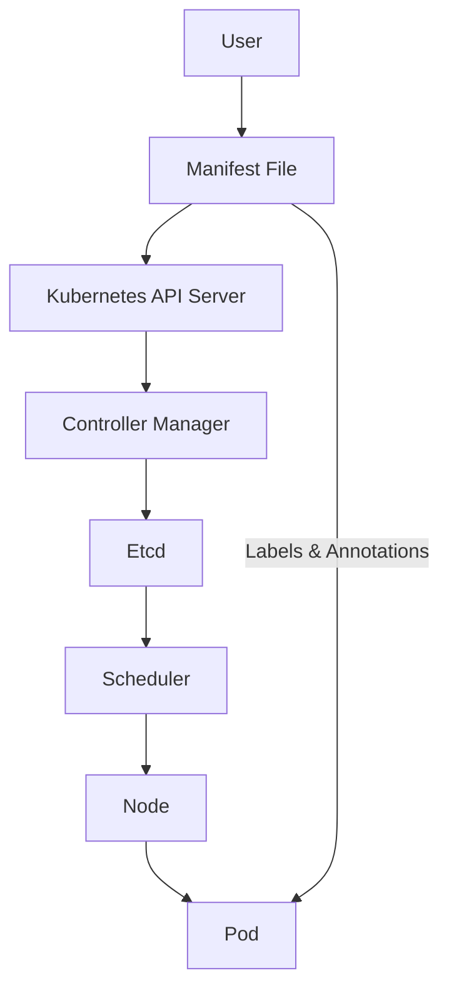

## Policy as Code: Defining Policies Using Labels and Annotations

### Background Theory

Policy as Code is a practice in DevSecOps where security policies are defined and managed as code. This approach allows teams to version control their policies, automate enforcement, and integrate security checks into the continuous integration and delivery (CI/CD) pipeline. One common way to implement Policy as Code is through the use of labels and annotations in Kubernetes manifests or other configuration files.

### What Are Labels and Annotations?

**Labels** are key-value pairs that are attached to objects in Kubernetes, such as pods, services, and deployments. They are used to organize and select subsets of objects. For example, a label might be `app=webserver` to identify all web server components.

**Annotations**, on the other hand, are also key-value pairs but are used to store additional information about an object. Unlike labels, annotations are not intended for selecting objects and are often used for metadata that is useful for tools and automation scripts. For example, an annotation might be `description="This is a critical web server"`.

### Why Use Labels and Annotations in Policy as Code?

Using labels and annotations in Policy as Code helps in several ways:

1. **Organization**: Labels help in organizing resources logically, making it easier to manage and enforce policies.
2. **Automation**: Annotations can be used to trigger automated actions, such as security scans or compliance checks.
3. **Version Control**: By defining policies using labels and annotations in code, teams can version control their policies and track changes over time.
4. **Consistency**: Enforcing policies consistently across different environments and teams becomes easier with a code-based approach.

### How to Define Policies Using Labels and Annotations

Let's consider a scenario where we want to enforce a policy that all critical web servers should have a specific label and annotation. Here’s how you can define such a policy:

#### Example Policy Definition

```yaml
apiVersion: v1
kind: Pod
metadata:
  name: critical-web-server
  labels:
    app: webserver
    criticality: high
  annotations:
    description: "This is a critical web server"
spec:
  containers:
  - name: web-container
    image: nginx:latest
```

In this example:
- The `labels` section includes `app: webserver` and `criticality: high`.
- The `annotations` section includes `description: "This is a critical web server"`.

### Real-World Examples and Recent Breaches

Consider the recent breach of a major cloud provider where unauthorized access was gained due to misconfigured Kubernetes clusters. In one instance, critical services were not properly labeled, leading to a lack of visibility and control over these resources. Properly defining and enforcing policies using labels and annotations could have helped mitigate this issue.

### Common Pitfalls and How to Avoid Them

#### Pitfall 1: Inconsistent Labeling

**Problem**: If labels are not consistently applied across resources, it becomes difficult to enforce policies uniformly.

**Solution**: Use a standardized naming convention for labels and annotations. Ensure that all team members follow this convention.

#### Pitfall 2: Overuse of Annotations

**Problem**: Annotations can clutter manifests if overused, making them harder to read and maintain.

**Solution**: Use annotations judiciously. Reserve them for metadata that is useful for automation and tooling.

### How to Prevent / Defend

#### Detection

To detect misconfigurations or missing labels/annotations, you can use tools like `kube-linter` or `kubescape`. These tools can scan your Kubernetes manifests and report any issues.

```sh
# Install kube-linter
curl -sSf https://raw.githubusercontent.com/stackrox/kube-linter/main/install.sh | sh

# Scan a manifest file
kube-linter lint my-manifest.yaml
```

#### Prevention

To prevent misconfigurations, integrate policy enforcement into your CI/CD pipeline. Tools like `OPA` (Open Policy Agent) can be used to enforce policies at build time.

```yaml
# Example OPA policy
package kubernetes.policies

default allow = false

allow {
  input.kind == "Pod"
  input.metadata.labels["criticality"] == "high"
}
```

#### Secure Coding Fixes

Here’s an example of a vulnerable manifest and its corrected version:

**Vulnerable Manifest**

```yaml
apiVersion: v1
kind: Pod
metadata:
  name: critical-web-server
spec:
  containers:
  - name: web-container
    image: nginx:latest
```

**Corrected Manifest**

```yaml
apiVersion: v1
kind: Pod
metadata:
  name: critical-web-server
  labels:
    app: webserver
    criticality: high
  annotations:
    description: "This is a critical web server"
spec:
  containers:
  - name: web-container
    image: nginx:latest
```

### Network Topology and Request/Response Flow

To visualize how labels and annotations work within a Kubernetes cluster, consider the following `mermaid` diagram:



### Practice Labs

For hands-on experience with Policy as Code using labels and annotations, consider the following labs:

- **PortSwigger Web Security Academy**: Offers modules on securing Kubernetes configurations.
- **Kubernetes Goat**: Provides a series of challenges to learn and practice Kubernetes security.
- **CloudGoat**: Focuses on cloud security practices, including Kubernetes configurations.

By following these guidelines and practicing with real-world examples, you can effectively use labels and annotations to enforce policies in your DevSecOps environment.

---
<!-- nav -->
[[DevSecOps/DevSecOps Bootcamp/02-Security Governance & Compliance/04-Policy as Code/Defining Policies/01-Introduction to Policy as Code|Introduction to Policy as Code]] | [[DevSecOps/DevSecOps Bootcamp/02-Security Governance & Compliance/04-Policy as Code/Defining Policies/00-Overview|Overview]] | [[03-Policy as Code in DevSecOps Part 1|Policy as Code in DevSecOps Part 1]]
