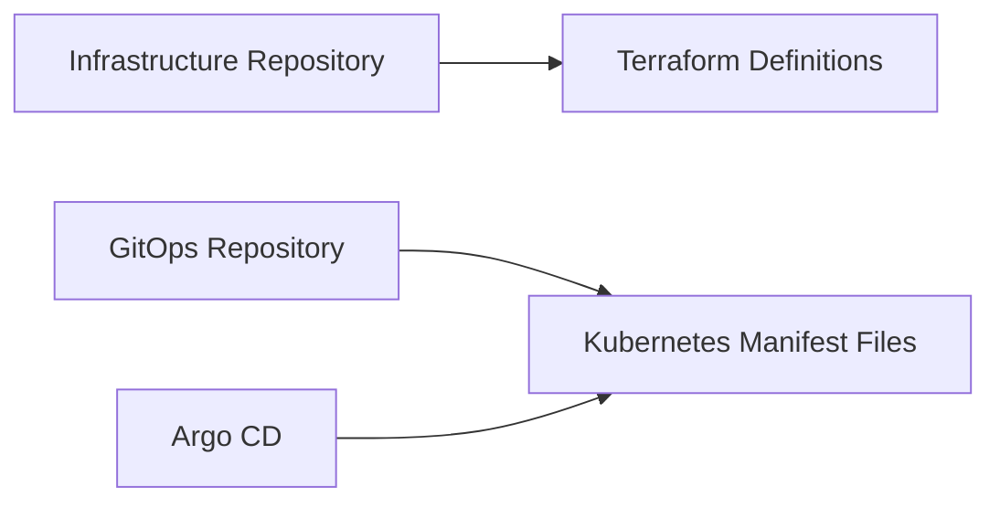

## Policy as Code in DevSecOps

### Introduction to Policy as Code

Policy as Code is a practice in DevSecOps where security policies and configurations are managed as code, stored in version control systems, and deployed using automated tools. This approach ensures consistency, traceability, and auditability of security policies across different environments. In the context of Kubernetes and other container orchestration platforms, Policy as Code can be used to enforce security controls, manage access, and ensure compliance with organizational policies.

### Differentiating Infrastructure and Application Repositories

In a typical DevSecOps environment, there are two main repositories:

1. **Infrastructure Repository**: This repository contains the infrastructure-as-code (IaC) definitions, typically written in Terraform. These definitions describe the infrastructure resources such as virtual machines, networks, and storage.

2. **GitOps Repository**: This repository contains the Kubernetes manifest files that define the application deployments, services, and other Kubernetes resources. These manifest files are typically managed using GitOps tools like Argo CD, which automatically syncs the manifests into the Kubernetes cluster.



### Differentiating Application and Administrative Components

Within the GitOps repository, it is crucial to differentiate between application manifest files and administrative or operational components. This separation ensures that the application logic remains distinct from the operational policies, making it easier to manage and maintain both aspects.

#### Application Manifest Files

Application manifest files define the microservices and their deployment configurations. These files are typically written in YAML and describe the pods, deployments, services, and other Kubernetes resources required to run the application.

Example of an application manifest file (`app-deployment.yaml`):

```yaml
apiVersion: apps/v1
kind: Deployment
metadata:
  name: my-app
spec:
  replicas: 3
  selector:
    matchLabels:
      app: my-app
  template:
    metadata:
      labels:
        app: my-app
    spec:
      containers:
      - name: my-app-container
        image: my-app-image:latest
        ports:
        - containerPort: 8080
```

#### Administrative Components

Administrative components include policies, controllers, and other operational resources that support the application. These components ensure that the application is deployed securely and complies with organizational policies.

Example of an administrative component (`network-policy.yaml`):

```yaml
apiVersion: networking.k8s.io/v1
kind: NetworkPolicy
metadata:
  name: deny-all-ingress
spec:
  podSelector: {}
  ingress: []
```

### Creating Separate Applications in Argo CD

To manage the separation between application and administrative components, you can create separate Argo CD applications. Each application can be configured to watch a specific directory in the GitOps repository, ensuring that changes to application manifests and administrative policies are isolated.

Example of an Argo CD application configuration (`argocd-application.yaml`):

```yaml
apiVersion: argoproj.io/v1alpha1
kind: Application
metadata:
  name: my-app
spec:
  project: default
  source:
    repoURL: https://github.com/myorg/gitops-repo.git
    targetRevision: HEAD
    path: manifests/applications
  destination:
    server: https://kubernetes.default.svc
    namespace: my-app-namespace
```

### Using Separate Git Repositories

For larger organizations with multiple applications, it may be beneficial to use separate Git repositories for application and administrative components. This approach further isolates the concerns and allows for more granular access control and management.

Example of separate Git repositories:

- `https://github.com/myorg/application-manifests.git`
- `https://github.com/myorg/administrative-policies.git`

### Real-World Examples and CVEs

#### Example: CVE-2021-25741

CVE-2021-25741 is a critical vulnerability in Kubernetes that allows attackers to bypass network policies and gain unauthorized access to pods. This vulnerability highlights the importance of properly configuring and managing network policies as code.

Example of a vulnerable network policy (`network-policy-vulnerable.yaml`):

```yaml
apiVersion: networking.k8s.io/v1
kind: NetworkPolicy
metadata:
  name: allow-all-ingress
spec:
  podSelector: {}
  ingress:
  - from:
    - podSelector: {}
```

Example of a secure network policy (`network-policy-secure.yaml`):

```yaml
apiVersion: networking.k8s.io/v1
kind: NetworkPolicy
metadata:
  name: allow-specific-ingress
spec:
  podSelector:
    matchLabels:
      app: my-app
  ingress:
  - from:
    - podSelector:
        matchLabels:
          role: frontend
```

### How to Prevent / Defend

#### Detection

To detect misconfigurations and vulnerabilities in your Kubernetes policies, you can use tools like `kube-bench`, `kubescape`, and `trivy`. These tools scan your Kubernetes cluster and manifest files for known vulnerabilities and misconfigurations.

Example of using `kube-bench`:

```sh
kubectl apply -f https://raw.githubusercontent.com/aquasecurity/kube-bench/master/job.yaml
```

#### Prevention

To prevent misconfigurations and vulnerabilities, follow these best practices:

1. **Use Policy as Code**: Store all policies in version control and deploy them using automated tools.
2. **Regular Audits**: Regularly review and audit your policies to ensure they are up-to-date and secure.
3. **Least Privilege**: Apply the principle of least privilege to your policies, allowing only the necessary access and permissions.
4. **Automated Scanning**: Use automated scanning tools to detect and remediate vulnerabilities.

#### Secure Coding Fixes

Compare the vulnerable and secure versions of a network policy:

**Vulnerable Version**:

```yaml
apiVersion: networking.k8s.io/v1
kind: NetworkPolicy
metadata:
  name: allow-all-ingress
spec:
  podSelector: {}
  ingress:
  - from:
    - podSelector: {}
```

**Secure Version**:

```yaml
apiVersion: networking.k8s.io/v1
kind: NetworkPolicy
metadata:
  name: allow-specific-ingress
spec:
  podSelector:
    matchLabels:
      app: my-app
  ingress:
  - from:
    - podSelector:
        matchLabels:
          role: frontend
```

### Hands-On Labs

To practice and reinforce your understanding of Policy as Code in DevSecOps, consider the following labs:

- **PortSwigger Web Security Academy**: Focuses on web application security but includes modules on securing Kubernetes deployments.
- **OWASP Juice Shop**: A deliberately insecure web application for practicing security testing and learning about common vulnerabilities.
- **Kubernetes Goat**: A hands-on lab for learning Kubernetes security and best practices.
- **Pacu**: A penetration testing framework for AWS that includes modules for testing Kubernetes security.

By following these guidelines and practicing with real-world examples, you can effectively manage and secure your Kubernetes policies using Policy as Code in a DevSecOps environment.

---
<!-- nav -->
[[DevSecOps/DevSecOps Bootcamp/02-Security Governance & Compliance/04-Policy as Code/Defining Policies/02-Policy as Code Defining Policies Using Labels and Annotations|Policy as Code Defining Policies Using Labels and Annotations]] | [[DevSecOps/DevSecOps Bootcamp/02-Security Governance & Compliance/04-Policy as Code/Defining Policies/00-Overview|Overview]] | [[04-Policy as Code in DevSecOps Part 2|Policy as Code in DevSecOps Part 2]]
