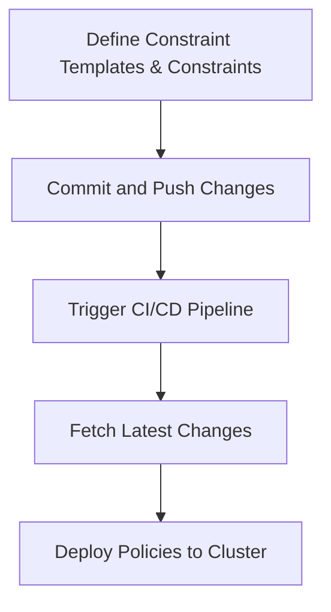

## Policy as Code in DevSecOps

### Introduction to Policy as Code

Policy as Code is an approach to managing and enforcing policies within a DevSecOps environment using code-based definitions. This method allows organizations to automate the enforcement of security policies, compliance rules, and operational constraints across their infrastructure and applications. By treating policies as code, teams can leverage version control systems, continuous integration/continuous deployment (CI/CD) pipelines, and automated testing to ensure that policies are consistently applied and updated.

### Defining Policies

In the context of Kubernetes, policies are often defined using Constraint Templates and Constraints. These are Kubernetes manifest files that specify the rules and conditions that must be met for resources to be deployed or modified within the cluster.

#### Constraint Templates

Constraint Templates are custom resource definitions (CRDs) that define the structure and logic of the policies. They allow you to create reusable policy templates that can be applied to various resources in the cluster.

**Example Constraint Template:**

```yaml
apiVersion: templates.gatekeeper.sh/v1
kind: ConstraintTemplate
metadata:
  name: k8sgatekeeperexample
spec:
  crd:
    spec:
      names:
        kind: K8SGatekeeperExample
  targets:
    - target: admission.k8s.gatekeeper.sh
      rego: |
        package k8sgatekeeperexample
        
        violation[{"msg": msg, "details": {"constraint_template": "k8sgatekeeperexample", "constraint": "example"}}] {
          input.review.object.kind = "Pod"
          input.review.object.metadata.namespace != "default"
          msg = sprintf("Pod %v should be in the default namespace", [input.review.object.metadata.name])
        }
```

This template defines a policy that ensures all `Pod` resources are deployed in the `default` namespace.

#### Constraints

Constraints are instances of Constraint Templates that enforce specific policies. They reference the Constraint Template and provide additional parameters or configurations.

**Example Constraint:**

```yaml
apiVersion: constraints.gatekeeper.sh/v1
kind: K8SGatekeeperExample
metadata:
  name: example
spec:
  match:
    kinds:
      - apiGroups: [""] # Core API group
        kinds: ["Pod"]
```

This constraint applies the `K8SGatekeeperExample` policy to all `Pod` resources in the cluster.

### Applying Policies in Kubernetes Cluster

To apply these policies in a Kubernetes cluster, you need to deploy them using your CI/CD pipeline. This ensures that policies are consistently enforced and updated alongside your infrastructure and application code.

#### Workflow Overview

The workflow for defining and applying policies involves the following steps:

1. **Define Constraint Templates and Constraints**: Create the necessary manifest files in your GitOps repository.
2. **Commit and Push Changes**: Commit the changes to your GitOps repository and push them to the remote repository.
3. **Trigger CI/CD Pipeline**: The CI/CD pipeline is triggered by the commit, which fetches the latest changes and deploys them to the Kubernetes cluster.
4. **Deploy Policies**: The policies are deployed to the cluster using tools like Argo CD.

**Mermaid Diagram: Workflow Overview**



### Separation of Concerns

In a typical DevSecOps setup, you might have separate repositories for different types of code:

- **Infrastructure as Code (IaC)**: Contains scripts and manifests for setting up and configuring infrastructure (e.g., Terraform scripts).
- **GitOps Repository**: Contains Kubernetes manifest files for deploying resources in the cluster.

**Example Directory Structure:**

```
├── infra-as-code
│   └── terraform
│       ├── main.tf
│       └── variables.tf
└── gitops-repo
    ├── kubernetes-manifests
    │   ├── pod.yaml
    │   ├── deployment.yaml
    │   └── service.yaml
    └── policies
        ├── constraint-template.yaml
        └── constraint.yaml
```

### Automated Workflows

Automated workflows are crucial for ensuring that policies are consistently applied and updated. In a production-grade workflow, you would avoid manual `kubectl apply` commands and instead rely on CI/CD pipelines to manage deployments.

**Example CI/CD Pipeline Configuration:**

```yaml
jobs:
  - name: Deploy Policies
    steps:
      - checkout
      - run:
          name: Apply Policies
          command: |
            kubectl apply -f ./gitops-repo/policies/
```

### Real-World Examples

#### Recent CVEs and Breaches

One notable example is the Kubernetes API server vulnerability (CVE-2021-25741), which allowed unauthorized access to sensitive data. By implementing strict policies and using tools like Gatekeeper, organizations can mitigate such risks.

**Example Vulnerability Mitigation:**

```yaml
apiVersion: constraints.gatekeeper.sh/v1
kind: K8SGatekeeperExample
metadata:
  name: restrict-api-access
spec:
  match:
    kinds:
      - apiGroups: [""] # Core API group
        kinds: ["Service"]
  parameters:
    allowedPorts:
      - 443
      - 8443
```

This constraint ensures that services can only expose specific ports, reducing the risk of unauthorized access.

### How to Prevent / Defend

#### Detection

To detect policy violations, you can use tools like Gatekeeper, which provides a webhook to intercept and validate Kubernetes API requests.

**Example Detection Mechanism:**

```yaml
apiVersion: templates.gatekeeper.sh/v1
kind: ConstraintTemplate
metadata:
  name: k8sgatekeeperexample
spec:
  crd:
    spec:
      names:
        kind: K8SGatekeeperExample
  targets:
    - target: admission.k8s.gatekeeper.sh
      rego: |
        package k8sgatekeeperexample
        
        violation[{"msg": msg, "details": {"constraint_template": "k8sgatekeeperexample", "constraint": "example"}}] {
          input.review.object.kind = "Pod"
          input.review.object.metadata.namespace != "default"
          msg = sprintf("Pod %v should be in the default namespace", [input.review.object.metadata.name])
        }
```

#### Prevention

Prevent policy violations by ensuring that all changes are validated through the CI/CD pipeline. Use tools like Argo CD to enforce GitOps practices.

**Example Prevention Mechanism:**

```yaml
apiVersion: argoproj.io/v1alpha1
kind: Application
metadata:
  name: my-app
spec:
  project: default
  source:
    repoURL: https://github.com/myorg/gitops-repo.git
    targetRevision: HEAD
    path: kubernetes-manifests
  destination:
    server: https://kubernetes.default.svc
    namespace: default
  syncPolicy:
    automated:
      prune: true
      selfHeal: true
```

#### Secure Coding Fixes

Compare the vulnerable and secure versions of a policy definition:

**Vulnerable Version:**

```yaml
apiVersion: constraints.gatekeeper.sh/v1
kind: K8SGatekeeperExample
metadata:
  name: insecure-policy
spec:
  match:
    kinds:
      - apiGroups: [""] # Core API group
        kinds: ["Pod"]
```

**Secure Version:**

```yaml
apiVersion: constraints.gatekeeper.sh/v1
kind: K8SGatekeeperExample
metadata:
  name: secure-policy
spec:
  match:
    kinds:
      - apiGroups: [""] # Core API group
        kinds: ["Pod"]
  parameters:
    allowedNamespaces:
      - default
```

### Complete Example

#### Full HTTP Request and Response

When deploying policies, you might interact with the Kubernetes API server using HTTP requests.

**HTTP Request:**

```http
POST /apis/constraints.gatekeeper.sh/v1/namespaces/default/k8sgatekeeperexamples HTTP/1.1
Host: kubernetes.default.svc
Content-Type: application/json
Authorization: Bearer <token>

{
  "apiVersion": "constraints.gatekeeper.sh/v1",
  "kind": "K8SGatekeeperExample",
  "metadata": {
    "name": "secure-policy"
  },
  "spec": {
    "match": {
      "kinds": [
        {
          "apiGroups": [""], # Core API group
          "kinds": ["Pod"]
        }
      ]
    },
    "parameters": {
      "allowedNamespaces": ["default"]
    }
  }
}
```

**HTTP Response:**

```http
HTTP/1.1 201 Created
Content-Type: application/json
Date: Tue, 01 Jan 2024 00:00:00 GMT
Content-Length: 1234

{
  "kind": "K8SGatekeeperExample",
  "apiVersion": "constraints.gatekeeper.sh/v1",
  "metadata": {
    "name": "secure-policy",
    "namespace": "default",
    "uid": "abc123",
    "resourceVersion": "123456",
    "creationTimestamp": "2024-01-01T00:00:00Z"
  },
  "spec": {
    "match": {
      "kinds": [
        {
          "apiGroups": [""],
          "kinds": ["Pod"]
        }
      ]
    },
    "parameters": {
      "allowedNamespaces": ["default"]
    }
  }
}
```

### Hands-On Labs

For practical experience with Policy as Code in Kubernetes, consider the following labs:

- **PortSwigger Web Security Academy**: Focuses on web application security but includes modules on securing Kubernetes environments.
- **OWASP Juice Shop**: A deliberately insecure web app for security training, which can be deployed in a Kubernetes cluster to practice securing it.
- **Kubernetes Goat**: A Kubernetes-based security training platform that simulates real-world attacks and vulnerabilities.

These labs provide a comprehensive way to understand and implement Policy as Code in a controlled environment.

### Conclusion

By treating policies as code and leveraging automated workflows, organizations can ensure consistent and secure deployment of policies in their Kubernetes clusters. This approach not only enhances security but also streamlines operations and compliance management.

---
<!-- nav -->
[[04-Policy as Code in DevSecOps Part 2|Policy as Code in DevSecOps Part 2]] | [[DevSecOps/DevSecOps Bootcamp/02-Security Governance & Compliance/04-Policy as Code/Defining Policies/00-Overview|Overview]] | [[DevSecOps/DevSecOps Bootcamp/02-Security Governance & Compliance/04-Policy as Code/Defining Policies/06-Practice Questions & Answers|Practice Questions & Answers]]
