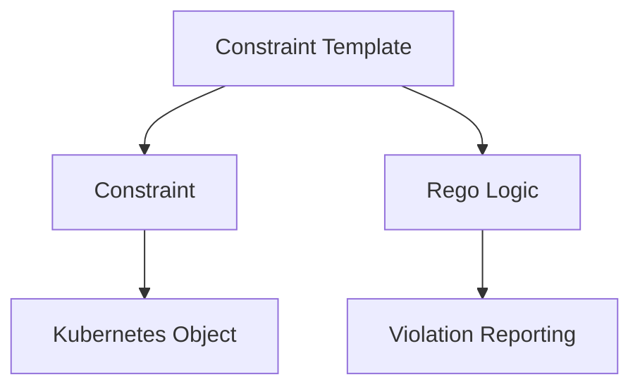

## Introduction to Policy as Code

Policy as Code is an approach to managing infrastructure and application configurations through declarative policies written in code. This method allows organizations to automate compliance checks, enforce security policies, and maintain consistency across environments. Two prominent tools in this space are **Gatekeeper** and **OPA (Open Policy Agent)**. These tools enable the definition and enforcement of policies in a Kubernetes environment, ensuring that resources adhere to specified rules and constraints.

### What is Gatekeeper?

Gatekeeper is a Kubernetes admission controller that enforces custom policies on your cluster. It integrates with Kubernetes Admission Webhooks to intercept and validate API requests before they are persisted. By leveraging Constraint Templates and Constraints, Gatekeeper ensures that resources comply with organizational policies.

### What is OPA?

OPA (Open Policy Agent) is a general-purpose policy engine that can be used to enforce policies across various systems, including Kubernetes. OPA uses Rego, a domain-specific language (DSL), to define and evaluate policies. Rego provides a powerful and flexible way to express complex policy logic.

### Why Use Policy as Code?

Using Policy as Code offers several benefits:

1. **Consistency**: Policies are defined in code, ensuring consistent enforcement across different environments.
2. **Automation**: Policies can be automatically applied and enforced, reducing the risk of human error.
3. **Auditability**: Policies are version-controlled, making it easier to track changes and audit compliance.
4. **Flexibility**: Policies can be easily updated and adapted to changing requirements.

### Example: Required Labels Constraint Template

Let's start with a concrete example: ensuring that all namespaces in a Kubernetes cluster have a specific label (`gatekeeper`). We'll use Gatekeeper to enforce this policy.

#### Constraint Template Definition

First, we define a Constraint Template that specifies the desired state of Kubernetes objects. In this case, we want to ensure that all namespaces have the `gatekeeper` label.

```yaml
apiVersion: templates.gatekeeper.sh/v1
kind: ConstraintTemplate
metadata:
  name: k8srequiredlabels
spec:
  crd:
    spec:
      names:
        kind: K8sRequiredLabels
  targets:
    - target: admission.k8s.gatekeeper.sh
      rego: |
        package k8srequiredlabels
        
        violation[{"msg": msg, "details": {"object": obj}}] {
          provided := {k | input.review.object.metadata.labels[k] == v; k, v := input.parameters.required_labels[_]}
          required := {k | k := input.parameters.required_labels[_]}
          missing := required - provided
          
          count(missing) > 0
          msg := sprintf("missing required labels: %v", [missing])
          obj := sprintf("%v/%v", [input.review.object.kind, input.review.object.metadata.name])
        }
```

This Constraint Template defines a policy that checks if the required labels are present on a namespace. If any required labels are missing, a violation is reported.

#### Constraint Definition

Next, we define a Constraint that references the Constraint Template and specifies the required labels.

```yaml
apiVersion: constraints.gatekeeper.sh/v1
kind: K8sRequiredLabels
metadata:
  name: k8srequiredlabels-namespaces
spec:
  match:
    kinds:
      - apiGroups: [""]
        kinds: ["Namespace"]
  parameters:
    required_labels:
      - "gatekeeper"
```

This Constraint ensures that all namespaces have the `gatekeeper` label.

### How Constraint Templates and Constraints Work Together

Constraint Templates and Constraints work together to enforce policies in a Kubernetes cluster. A Constraint Template defines the logic for enforcing a policy, while a Constraint specifies the desired state and references the Constraint Template.

#### Constraint Template Referencing Constraint

The Constraint Template references the name of the Constraint that it applies to. This linkage ensures that the policy logic defined in the Constraint Template is applied to the specified resources.



### Multiple Constraints Based on the Same Constraint Template

It's possible to have multiple Constraints that implement certain policies based on the same Constraint Template. This flexibility allows you to apply the same policy logic to different sets of resources.

#### Example: Multiple Constraints

```yaml
apiVersion: constraints.gatekeeper.sh/v1
kind: K8sRequiredLabels
metadata:
  name: k8srequiredlabels-namespaces-1
spec:
  match:
    kinds:
      - apiGroups: [""]
        kinds: ["Namespace"]
  parameters:
    required_labels:
      - "gatekeeper"

---
apiVersion: constraints.gatekeeper.sh/v1
kind: K8sRequiredLabels
metadata:
  name: k8srequiredlabels-namespaces-2
spec:
  match:
    kinds:
      - apiGroups: [""]
        kinds: ["Namespace"]
  parameters:
    required_labels:
      - "gatekeeper"
```

### Complexity of Rego

While Rego is a powerful language for defining policy logic, it can be complex and unintuitive. Understanding Rego is crucial for effectively using OPA and Gatekeeper.

#### Rego Syntax Example

Here's a simple Rego rule that checks if a namespace has a specific label:

```rego
package k8srequiredlabels

violation[{"msg": msg, "details": {"object": obj}}] {
  provided := {k | input.review.object.metadata.labels[k] == v; k, v := input.parameters.required_labels[_]}
  required := {k | k := input.parameters.required_labels[_]}
  missing := required - provided
  
  count(missing) > 0
  msg := sprintf("missing required labels: %v", [missing])
  obj := sprintf("%v/%v", [input.review.object.kind, input.review.object.metadata.name])
}
```

### Real-World Examples and CVEs

#### Example: CVE-2021-25741

CVE-2021-25741 is a vulnerability in Kubernetes that allows an attacker to bypass admission controllers. This vulnerability highlights the importance of properly configuring and enforcing policies in a Kubernetes cluster.

#### Example: CVE-2020-8558

CVE-2020-8558 is another Kubernetes vulnerability that allows an attacker to escalate privileges by manipulating pod security contexts. Using Policy as Code can help mitigate such vulnerabilities by enforcing strict security policies.

### How to Prevent / Defend

#### Detection

To detect policy violations, you can use tools like `kubectl` to check the status of resources and verify that they comply with the defined policies.

```sh
kubectl get namespaces --all-namespaces -o json | jq '.items[] | select(.metadata.labels.gatekeeper == null)'
```

#### Prevention

To prevent policy violations, ensure that all resources are configured to comply with the defined policies. Use tools like Gatekeeper and OPA to enforce these policies.

#### Secure Coding Fixes

Compare the vulnerable and secure versions of a policy:

**Vulnerable Version:**

```yaml
apiVersion: constraints.gatekeeper.sh/v1
kind: K8sRequiredLabels
metadata:
  name: k8srequiredlabels-namespaces
spec:
  match:
    kinds:
      - apiGroups: [""]
        kinds: ["Namespace"]
  parameters:
    required_labels:
      - "gatekeeper"
```

**Secure Version:**

```yaml
apiVersion: constraints.gatekeeper.sh/v1
kind: K8sRequiredLabels
metadata:
  name: k8srequiredlabels-namespaces
spec:
  match:
    kinds:
      - apiGroups: [""]
        kinds: ["Namespace"]
  parameters:
    required_labels:
      - "gatekeeper"
      - "security"
```

### Configuration Hardening

Ensure that your Kubernetes cluster is hardened against potential vulnerabilities. Use tools like `kube-bench` to perform security audits and ensure compliance with best practices.

### Hands-On Labs

For hands-on practice with Policy as Code, consider the following labs:

- **PortSwigger Web Security Academy**: Offers exercises on securing web applications.
- **OWASP Juice Shop**: Provides a vulnerable web application for learning security concepts.
- **CloudGoat**: Focuses on cloud security and provides scenarios for practicing security in cloud environments.
- **Pacu**: A framework for automating cloud security assessments.

### Conclusion

Policy as Code is a powerful approach to managing and enforcing policies in a Kubernetes environment. Tools like Gatekeeper and OPA provide the necessary capabilities to define and enforce complex policies. By understanding the concepts and practical applications of Policy as Code, you can ensure that your Kubernetes cluster remains secure and compliant.

---
<!-- nav -->
[[DevSecOps/DevSecOps Bootcamp/02-Security Governance & Compliance/04-Policy as Code/How Gatekeeper and OPA works/00-Overview|Overview]] | [[DevSecOps/DevSecOps Bootcamp/02-Security Governance & Compliance/04-Policy as Code/How Gatekeeper and OPA works/02-Introduction to Policy as Code Part 2|Introduction to Policy as Code Part 2]]
