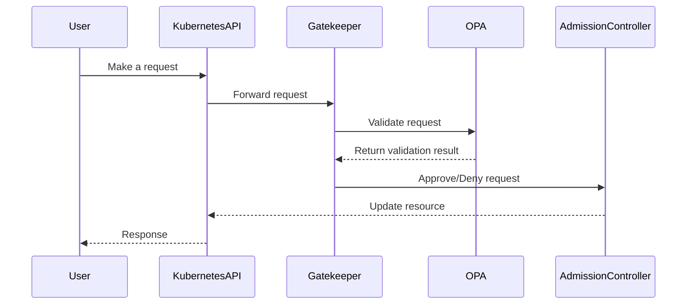

## Gatekeeper and OPA Integration

Gatekeeper acts as a bridge between the Kubernetes API server and the Open Policy Agent (OPA). When a request is made to the Kubernetes API server, Gatekeeper intercepts the request and validates it against the policies defined using OPA.

### Components of Gatekeeper

#### Constraint Template

A constraint template is a reusable definition of a policy that can be applied to various Kubernetes resources. It defines the logic that will be used to validate Kubernetes components in the admission controller. This logic is written using a domain-specific language (DSL) called Rego.

**Example Constraint Template**

```yaml
apiVersion: templates.gatekeeper.sh/v1
kind: ConstraintTemplate
metadata:
  name: k8srequiredlabels
spec:
  crd:
    spec:
      names:
        kind: K8sRequiredLabels
  targets:
    - target: admission.k8s.gatekeeper.sh
      rego: |
        package k8srequiredlabels
        
        violation[{"msg": msg, "details": {}}] {
          provided := [label | input.review.object.metadata.labels[label]]
          required := {"app", "owner"}
          missing := required - provided
          msg := sprintf("missing labels: %v", [missing])
        }
```

In this example, the constraint template `K8sRequiredLabels` ensures that all Kubernetes objects have the `app` and `owner` labels.

#### Constraint

A constraint is an instantiation of a constraint template that specifies the desired configuration for specific components. Constraints are applied to Kubernetes resources and enforce the policies defined in the constraint templates.

**Example Constraint**

```yaml
apiVersion: constraints.gatekeeper.sh/v1
kind: K8sRequiredLabels
metadata:
  name: k8srequiredlabels
spec:
  match:
    kinds:
      - apiGroups: [""]
        kinds: ["Pod"]
```

In this example, the constraint `k8srequiredlabels` applies the `K8sRequiredLabels` constraint template to all `Pod` resources.

### Installation of Gatekeeper

Gatekeeper can be installed using a Helm chart. During installation, several Custom Resource Definitions (CRDs) are created, which are essential for defining and enforcing policies.

**Helm Installation Command**

```sh
helm repo add gatekeeper https://open-policy-agent.github.io/gatekeeper/helm
helm repo update
helm install gatekeeper gatekeeper/gatekeeper --namespace gatekeeper-system --create-namespace
```

### Workflow of Gatekeeper and OPA

When a request is made to the Kubernetes API server, Gatekeeper intercepts the request and validates it against the policies defined using OPA. If the request violates any policy, it is rejected.

#### Mermaid Diagram: Request Validation Process



### Real-World Example: CVE-2021-25741

CVE-2021-25741 is a vulnerability in Kubernetes that allows attackers to bypass admission controllers. By using Gatekeeper and OPA, organizations can enforce policies that mitigate such vulnerabilities.

**Example Policy to Mitigate CVE-2021-25741**

```yaml
apiVersion: templates.gatekeeper.sh/v1
kind: ConstraintTemplate
metadata:
  name: k8ssecureadmission
spec:
  crd:
    spec:
      names:
        kind: K8sSecureAdmission
  targets:
    - target: admission.k8s.gatekeeper.sh
      rego: |
        package k8ssecureadmission
        
        violation[{"msg": msg, "details": {}}] {
          input.review.request.method == "POST"
          input.review.request.path == "/apis/admissionregistration.k8s.io/v1/mutatingwebhookconfigurations"
          msg := "Mutating webhook configurations are not allowed"
        }
```

This policy prevents the creation of mutating webhook configurations, which could be exploited by attackers.

### How to Prevent / Defend

To prevent policy violations and ensure security, organizations should:

- **Regularly audit policies**: Ensure that policies are up-to-date and cover all necessary security requirements.
- **Test policies**: Use testing frameworks to validate policies before deploying them.
- **Monitor policy violations**: Set up monitoring and alerting for policy violations.
- **Educate teams**: Ensure that development and operations teams understand the importance of adhering to policies.

#### Secure Coding Practices

**Vulnerable Code**

```yaml
apiVersion: v1
kind: Pod
metadata:
  name: my-pod
spec:
  containers:
    - name: my-container
      image: my-image
```

**Fixed Code**

```yaml
apiVersion: v1
kind: Pod
metadata:
  name: my-pod
  labels:
    app: my-app
    owner: my-owner
spec:
  containers:
    - name: my-container
      image: my-image
```

By adding the required labels, the pod now complies with the `K8sRequiredLabels` policy.

### Complete Example: Full HTTP Request and Response

#### HTTP Request

```http
POST /apis/admissionregistration.k8s.io/v1/mutatingwebhookconfigurations HTTP/1.1
Host: localhost:8080
Content-Type: application/json
Authorization: Bearer <token>

{
  "apiVersion": "admissionregistration.k8s.io/v1",
  "kind": "MutatingWebhookConfiguration",
  "metadata": {
    "name": "my-webhook"
  },
  "webhooks": [
    {
      "name": "example.com",
      "rules": [
        {
          "operations": ["CREATE"],
          "apiGroups": [""],
          "apiVersions": ["v1"],
          "resources": ["pods"]
        }
      ]
    }
  ]
}
```

#### HTTP Response

```http
HTTP/1.1 403 Forbidden
Content-Type: application/json
Date: Mon, 01 Jan 2024 00:00:00 GMT
Content-Length: 111

{
  "kind": "Status",
  "apiVersion": "v1",
  "metadata": {},
  "status": "Failure",
  "message": "Mutating webhook configurations are not allowed",
  "reason": "Forbidden",
  "code": 403
}
```

### Hands-On Labs

For hands-on practice with Gatekeeper and OPA, consider the following labs:

- **PortSwigger Web Security Academy**: Offers a variety of labs related to web security and policy enforcement.
- **OWASP Juice Shop**: Provides a vulnerable web application for practicing security policies.
- **DVWA (Damn Vulnerable Web Application)**: Another web application for practicing security policies.
- **CloudGoat**: Focuses on cloud security and can be used to practice policy enforcement in cloud environments.
- **Pacu**: A collection of cloud security tools that can be used to practice policy enforcement.

These labs provide practical experience in implementing and enforcing policies using Gatekeeper and OPA.

### Conclusion

Policy as Code is a powerful approach to managing infrastructure and application configurations. By using tools like Gatekeeper and OPA, organizations can enforce policies, ensure compliance, and maintain security across their infrastructure. Regular auditing, testing, and monitoring are essential to maintaining the effectiveness of these policies.

---
<!-- nav -->
[[DevSecOps/DevSecOps Bootcamp/02-Security Governance & Compliance/04-Policy as Code/How Gatekeeper and OPA works/03-Introduction to Policy as Code|Introduction to Policy as Code]] | [[DevSecOps/DevSecOps Bootcamp/02-Security Governance & Compliance/04-Policy as Code/How Gatekeeper and OPA works/00-Overview|Overview]] | [[05-Policy as Code with Gatekeeper and Open Policy Agent (OPA)|Policy as Code with Gatekeeper and Open Policy Agent (OPA)]]
