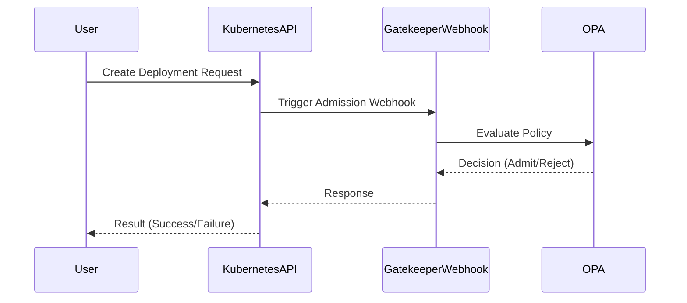

## Policy as Code with Gatekeeper and Open Policy Agent (OPA)

### Background Theory

Policy as Code is a practice where policies are written in code, making them more manageable, testable, and version-controlled. In the context of Kubernetes, this means defining rules for how resources can be created, updated, or deleted within a cluster. Two prominent tools used for implementing Policy as Code in Kubernetes are **Gatekeeper** and **Open Policy Agent (OPA)**.

#### What is Gatekeeper?

Gatekeeper is a Kubernetes-native policy controller that uses OPA to enforce policies. It operates as a **validating admission controller**, meaning it intercepts requests to the Kubernetes API server and determines whether they should be allowed based on predefined policies.

#### What is Open Policy Agent (OPA)?

OPA is a policy engine that allows you to define, serve, and enforce policies as code. It provides a declarative language called **Rego** for writing policies. OPA can be integrated with various systems, including Kubernetes, to enforce policies at runtime.

### Installation and Setup

To install Gatekeeper in a Kubernetes cluster, you typically use a Helm chart. Helm is a package manager for Kubernetes that simplifies the installation and management of applications.

```bash
helm repo add open-policy-agent https://open-policy-agent.github.io/gatekeeper/charts
helm repo update
helm install gatekeeper open-policy-agent/gatekeeper --namespace gatekeeper-system --create-namespace
```

This command installs the Gatekeeper controller and audit service into the `gatekeeper-system` namespace.

### Mechanism Overview

Once Gatekeeper is installed, it integrates with the Kubernetes API server through an **admission webhook**. Here’s how the mechanism works:

1. **Initial Request**: A user or application makes a request to the Kubernetes API server to create, update, or delete a resource.
2. **Admission Webhook Trigger**: The API server triggers the Gatekeeper admission webhook to process the request.
3. **Policy Evaluation**: Gatekeeper evaluates the request against the defined policies using OPA.
4. **Decision Making**: Based on the evaluation, Gatekeeper decides whether to admit the request or reject it.

### Detailed Workflow

Let's break down the workflow in more detail:

#### Step 1: Initial Request

When a user or application sends a request to the Kubernetes API server, the request is initially received by the API server. This could be a request to create a new deployment, update a service, or delete a pod.

#### Step 2: Admission Webhook Trigger

The Kubernetes API server is configured to trigger the Gatekeeper admission webhook for certain types of requests. This webhook is responsible for evaluating the request against the defined policies.



#### Step 3: Policy Evaluation

Gatekeeper uses OPA to evaluate the request against the defined policies. Policies are written in Rego, a declarative language designed for writing policies.

Here’s an example of a simple policy written in Rego:

```rego
package k8s.admission

deny[msg] {
    input.request.kind.kind == "Deployment"
    input.request.object.spec.replicas > 5
    msg = sprintf("Replicas cannot exceed 5, but found %v", [input.request.object.spec.replicas])
}
```

This policy denies any deployment request where the number of replicas exceeds 5.

#### Step 4: Decision Making

Based on the evaluation, Gatekeeper decides whether to admit the request or reject it. If the request violates any policy, Gatekeeper returns a rejection response to the Kubernetes API server.

### Full Example

Let’s walk through a complete example of a request being processed by Gatekeeper.

#### Request

A user sends a request to create a new deployment with 10 replicas.

```http
POST /apis/apps/v1/namespaces/default/deployments HTTP/1.1
Host: 127.0.0.1:8080
Content-Type: application/json
Authorization: Bearer <token>

{
  "apiVersion": "apps/v1",
  "kind": "Deployment",
  "metadata": {
    "name": "example-deployment"
  },
  "spec": {
    "replicas": 10,
    "selector": {
      "matchLabels": {
        "app": "example"
      }
    },
    "template": {
      "metadata": {
        "labels": {
          "app": "example"
        }
      },
      "spec": {
        "containers": [
          {
            "name": "example-container",
            "image": "nginx:latest",
            "ports": [
              {
                "containerPort": 80
              }
            ]
          }
        ]
      }
    }
  }
}
```

#### Response

If the policy defined above is in place, Gatekeeper will reject the request because the number of replicas exceeds 5.

```http
HTTP/1.1 403 Forbidden
Content-Type: application/json

{
  "kind": "Status",
  "apiVersion": "v1",
  "metadata": {},
  "status": "Failure",
  "message": "Replicas cannot exceed 5, but found 10",
  "reason": "Forbidden",
  "details": {
    "name": "example-deployment",
    "group": "apps",
    "kind": "deployments",
    "causes": [
      {
        "reason": "FieldValueForbidden",
        "message": "Replicas cannot exceed 5, but found 10"
      }
    ]
  },
  "code": 403
}
```

### Common Pitfalls and Best Practices

#### Pitfall: Overly Restrictive Policies

One common pitfall is creating overly restrictive policies that hinder legitimate operations. It’s important to balance security with usability.

#### Best Practice: Gradual Rollout

Start with a small set of policies and gradually expand as you gain confidence. Monitor the effects of each policy to ensure it doesn’t cause unintended issues.

### How to Prevent / Defend

#### Detection

To detect policy violations, you can monitor the logs of the Gatekeeper controller and audit service. These logs will contain information about denied requests and the reasons for denial.

#### Prevention

1. **Secure Coding**: Ensure that policies are correctly implemented and tested. Use tools like **OPA Playground** to test policies before deploying them.
   
2. **Configuration Hardening**: Harden the configuration of Gatekeeper and OPA to prevent unauthorized access. For example, ensure that the admission webhook is properly authenticated and authorized.

3. **Regular Audits**: Regularly review and audit policies to ensure they remain effective and up-to-date.

#### Secure-Coding Fixes

Here’s an example of a vulnerable policy and its secure version:

**Vulnerable Policy**:
```rego
package k8s.admission

deny[msg] {
    input.request.kind.kind == "Pod"
    input.request.object.spec.containers[_].securityContext.capabilities.add[_] == "NET_ADMIN"
    msg = "Pods cannot have NET_ADMIN capability"
}
```

**Secure Policy**:
```rego
package k8s.admission

deny[msg] {
    input.request.kind.kind == "Pod"
    input.request.object.spec.containers[_].securityContext.capabilities.add[_] == "NET_ADMIN"
    msg = "Pods cannot have NET_ADMIN capability"
}

allow[msg] {
    input.request.kind.kind == "Pod"
    not input.request.object.spec.containers[_].securityContext.capabilities.add[_] == "NET_ADMIN"
    msg = "Pod creation allowed"
}
```

### Real-World Examples

#### Recent CVEs and Breaches

In 2021, a misconfigured Kubernetes cluster led to a data breach due to insufficient policy enforcement. The cluster allowed unauthorized access to sensitive data because the policies were not correctly implemented.

#### Example: CVE-2021-25741

CVE-2021-25741 was a vulnerability in Kubernetes where an attacker could bypass admission controllers by manipulating the `dryRun` field. This highlights the importance of robust policy enforcement.

### Conclusion

Policy as Code with Gatekeeper and OPA provides a powerful way to enforce security policies in Kubernetes clusters. By understanding the mechanisms and best practices, you can effectively manage and secure your Kubernetes environment.

### Hands-On Labs

For hands-on experience with Gatekeeper and OPA, consider the following labs:

- **PortSwigger Web Security Academy**: Offers exercises on securing Kubernetes clusters.
- **OWASP Juice Shop**: Provides a vulnerable web application to practice security policies.
- **Kubernetes Goat**: A vulnerable Kubernetes cluster for learning and testing security policies.

These labs provide practical experience in implementing and managing policies in a Kubernetes environment.

---
<!-- nav -->
[[04-Gatekeeper and OPA Integration|Gatekeeper and OPA Integration]] | [[DevSecOps/DevSecOps Bootcamp/02-Security Governance & Compliance/04-Policy as Code/How Gatekeeper and OPA works/00-Overview|Overview]] | [[DevSecOps/DevSecOps Bootcamp/02-Security Governance & Compliance/04-Policy as Code/How Gatekeeper and OPA works/06-Practice Questions & Answers|Practice Questions & Answers]]
