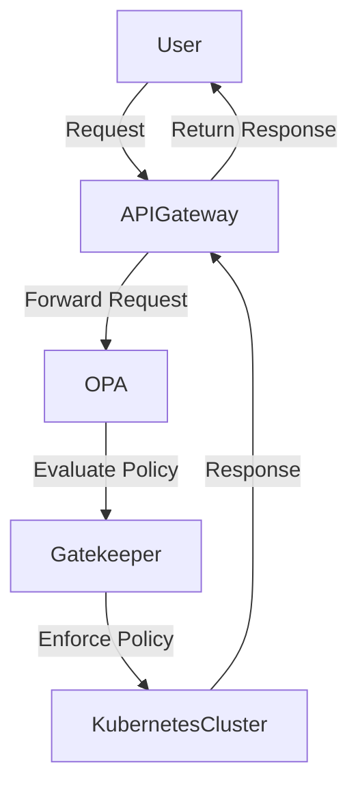
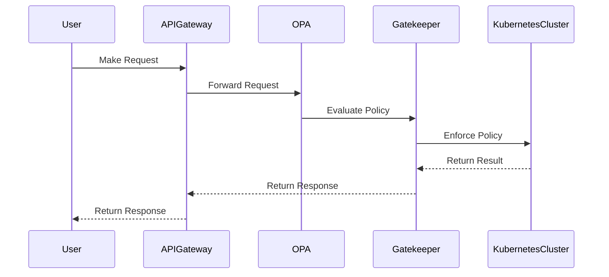

## Introduction to Open Policy Agent (OPA) and OPA Gatekeeper

### Background Theory

Open Policy Agent (OPA) is an open-source project that provides a general-purpose policy engine designed to enable developers to write, evaluate, and manage policies as code. This approach allows organizations to centralize their policy management and enforce consistent rules across different systems and environments. OPA supports a wide range of use cases, including access control, compliance, and service mesh policies.

#### What is Policy as Code?

Policy as Code is the practice of defining and managing policies using code rather than manual configurations. This approach offers several advantages:

- **Centralized Management**: Policies can be stored in version control systems like Git, allowing for centralized management and collaboration.
- **Consistency**: Policies can be enforced consistently across different environments and systems.
- **Automation**: Policies can be automatically evaluated and enforced through continuous integration and deployment pipelines.

#### Why Use OPA?

OPA provides a flexible and powerful framework for defining and enforcing policies. Some key benefits include:

- **Granular Access Control**: OPA allows for fine-grained access control based on various criteria such as roles, IP addresses, and request parameters.
- **Declarative Policy Language**: OPA uses a declarative language called Rego, which simplifies policy definition and evaluation.
- **Extensibility**: OPA can be integrated with various systems and services, making it suitable for a wide range of use cases.

### OPA Gatekeeper

OPA Gatekeeper is a policy controller specifically designed for Kubernetes. It leverages the power of OPA to enforce policies within a Kubernetes cluster. Gatekeeper provides a higher-level abstraction and easier-to-use interface compared to OPA, making it ideal for Kubernetes environments.

#### What is OPA Gatekeeper?

OPA Gatekeeper is a policy controller for Kubernetes that uses OPA under the hood. It allows users to define and enforce policies in a Kubernetes-native way. Gatekeeper supports a variety of policy types, including admission controllers, constraint templates, and constraint definitions.

#### How Does Gatekeeper Work?

Gatekeeper works by intercepting and evaluating Kubernetes API requests against defined policies. When a request is made to the Kubernetes API, Gatekeeper checks whether the request complies with the defined policies. If the request violates any policies, Gatekeeper can reject the request or take corrective actions.

### Policy Definition with Rego

Rego is the declarative language used by OPA and Gatekeeper to define policies. Rego is designed to be expressive and concise, making it suitable for complex policy definitions.

#### Syntax and Semantics

Rego uses a simple syntax that resembles a combination of functional programming and declarative logic. Here is a basic example of a Rego policy:

```rego
package example

default allow = false

allow {
    input.role == "admin"
}
```

In this example, the `allow` variable is set to `false` by default. The policy specifies that `allow` should be `true` if the `input.role` is `"admin"`.

#### Example: Access Control Policy

Let's consider a more complex example of an access control policy:

```rego
package access_control

default allow = false

allow {
    input.role == "admin" || input.role == "editor"
}

deny {
    input.ip_address not in allowed_ips
}

allowed_ips := ["192.168.1.1", "192.168.1.2"]
```

In this policy, `allow` is `true` if the user has either the `"admin"` or `"editor"` role. Additionally, `deny` is `true` if the user's IP address is not in the list of allowed IPs.

### Real-World Examples

#### Recent CVEs and Breaches

One recent example of a breach that could have been prevented with proper policy enforcement is the Capital One data breach in 2019. In this case, an attacker exploited a misconfigured web application firewall (WAF) to gain unauthorized access to sensitive customer data. A properly defined and enforced policy using OPA or Gatekeeper could have helped prevent this breach by ensuring that the WAF was configured correctly.

#### Real-World Implementation

Consider a scenario where a company wants to enforce strict access controls on its Kubernetes cluster. They decide to use OPA Gatekeeper to define and enforce these policies. Here is an example of a policy definition using Rego:

```rego
package kubernetes.admission

default allow = false

allow {
    input.request.kind.kind == "Pod"
    input.request.object.metadata.labels["app"] == "webserver"
    input.request.object.spec.containers[_].image == "nginx:latest"
}
```

This policy ensures that only pods labeled with `app=webserver` and using the `nginx:latest` image are allowed to be created.

### How to Prevent / Defend

#### Detection

To detect policy violations, organizations can use monitoring tools that integrate with OPA or Gatekeeper. These tools can log and alert on any policy violations, allowing administrators to take corrective actions.

#### Prevention

To prevent policy violations, organizations should ensure that policies are properly defined and enforced. This includes:

- **Regular Audits**: Regularly audit policies to ensure they are up-to-date and effective.
- **Training**: Train developers and administrators on how to define and enforce policies using OPA and Gatekeeper.
- **Automated Enforcement**: Use automated tools to enforce policies in real-time.

#### Secure Coding Fixes

Here is an example of a vulnerable policy definition and its secure counterpart:

**Vulnerable Policy**

```rego
package access_control

default allow = false

allow {
    input.role == "admin"
}
```

**Secure Policy**

```rego
package access_control

default allow = false

allow {
    input.role == "admin" && input.ip_address in allowed_ips
}

allowed_ips := ["192.168.1.1", "192.168.1.2"]
```

In the secure policy, the `allow` condition now includes an additional check for the user's IP address.

### Complete Example: Full HTTP Request and Response

Consider a scenario where a user makes a request to create a pod in a Kubernetes cluster. Here is the full HTTP request and response:

#### HTTP Request

```http
POST /apis/admissionregistration.k8s.io/v1/mutatingwebhookconfigurations HTTP/1.1
Host: localhost:8443
Content-Type: application/json
Authorization: Bearer <token>

{
  "apiVersion": "admissionregistration.k8s.io/v1",
  "kind": "MutatingWebhookConfiguration",
  "metadata": {
    "name": "gatekeeper-validating-webhook"
  },
  "webhooks": [
    {
      "name": "validation.gatekeeper.sh",
      "rules": [
        {
          "operations": [ "CREATE", "UPDATE" ],
          "apiGroups": [ "*" ],
          "apiVersions": [ "*" ],
          "resources": [ "pods" ]
        }
      ],
      "clientConfig": {
        "service": {
          "namespace": "gatekeeper-system",
          "name": "gatekeeper-audit"
        },
        "path": "/mutate"
      },
      "sideEffects": "None",
      "timeoutSeconds": 10
    }
  ]
}
```

#### HTTP Response

```http
HTTP/1.1 200 OK
Content-Type: application/json
Date: Mon, 01 Jan 2024 00:00:00 GMT
Content-Length: 1024

{
  "apiVersion": "admissionregistration.k8s.io/v1",
  "kind": "MutatingWebhookConfiguration",
  "metadata": {
    "name": "gatekeeper-validating-webhook",
    "uid": "abc123",
    "resourceVersion": "123456789",
    "creationTimestamp": "2024-01-01T00:00:00Z"
  },
  "webhooks": [
    {
      "name": "validation.gatekeeper.sh",
      "rules": [
        {
          "operations": [ "CREATE", "UPDATE" ],
          "apiGroups": [ "*" ],
          "apiVersions": [ "*" ],
          "resources": [ "pods" ]
        }
      ],
      "clientConfig": {
        "service": {
          "namespace": "gatekeeper-system",
          "name": "gatekeeper-audit"
        },
        "path": "/mutate"
      },
      "sideEffects": "None",
      "timeoutSeconds": 1
    }
  ]
}
```

### Mermaid Diagrams

#### Network Topology



#### Sequence Diagram



### Hands-On Labs

For hands-on practice with OPA and Gatekeeper, consider the following labs:

- **PortSwigger Web Security Academy**: Focuses on web application security but can provide insights into policy enforcement.
- **OWASP Juice Shop**: A deliberately insecure web application for practicing web security skills.
- **CloudGoat**: A series of labs designed to teach cloud security concepts, including policy enforcement.
- **flaws.cloud**: A cloud security training platform that includes labs on Kubernetes security.

These labs provide practical experience in defining and enforcing policies using OPA and Gatekeeper.

### Conclusion

Open Policy Agent (OPA) and OPA Gatekeeper provide powerful tools for defining and enforcing policies as code. By leveraging these tools, organizations can achieve consistent and automated policy enforcement across different systems and environments. Understanding the theory, syntax, and practical applications of OPA and Gatekeeper is crucial for effectively implementing policy as code in modern DevSecOps practices.

---
<!-- nav -->
[[DevSecOps/DevSecOps Bootcamp/02-Security Governance & Compliance/04-Policy as Code/Introduction to Open Policy Agent OPA and OPA Gatekeeper/00-Overview|Overview]] | [[02-Introduction to Open Policy Agent (OPA) and OPA Gatekeeper Part 2|Introduction to Open Policy Agent (OPA) and OPA Gatekeeper Part 2]]
