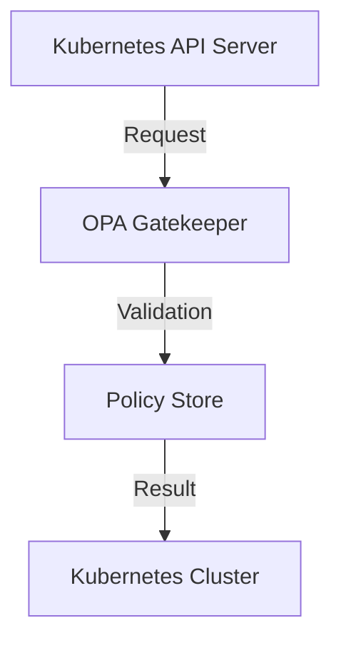
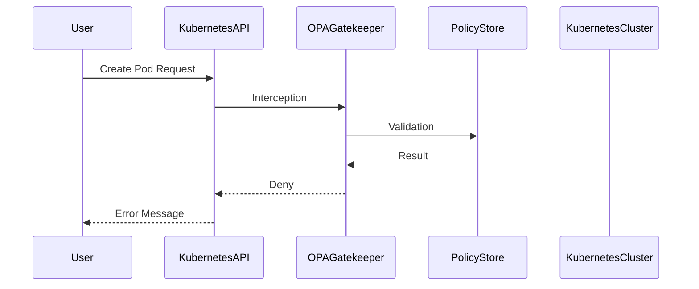

## Introduction to Open Policy Agent (OPA) and OPA Gatekeeper

### What is Policy as Code?

Policy as Code is an approach to managing infrastructure and application policies using declarative code. This means that policies are written in a structured format, typically YAML or JSON, and are version-controlled alongside the rest of your codebase. This allows for better collaboration, traceability, and automation in enforcing compliance and security rules across your environment.

### What is Open Policy Agent (OPA)?

Open Policy Agent (OPA) is an open-source, general-purpose policy engine developed by Styra. OPA enables you to separate policy enforcement from your applications and infrastructure. By doing so, you can manage policies centrally and apply them consistently across different systems and environments. OPA uses a declarative language called Rego to define policies, which makes it easy to express complex logic and conditions.

#### Why Use OPA?

- **Centralized Policy Management**: Policies are managed in one place, making it easier to update and enforce them across multiple systems.
- **Declarative Language**: Rego allows you to express policies in a clear and concise manner, making it easier to understand and maintain.
- **Integration with Infrastructure**: OPA can integrate with various infrastructure components, including Kubernetes, to enforce policies at runtime.
- **Version Control**: Policies can be version-controlled alongside your codebase, ensuring that changes are tracked and auditable.

### What is OPA Gatekeeper?

OPA Gatekeeper is a Kubernetes admission controller that leverages OPA to enforce custom policies within a Kubernetes cluster. It acts as a gatekeeper, intercepting requests to the Kubernetes API server and validating them against predefined policies. If a request violates any policy, Gatekeeper rejects it, preventing unauthorized actions.

#### How Does OPA Gatekeeper Work?

When a request is made to the Kubernetes API server, OPA Gatekeeper intercepts it and checks it against the defined policies. These policies can cover a wide range of scenarios, such as:

- **Resource Limits**: Ensuring that pods do not exceed certain resource limits.
- **Security Policies**: Enforcing security best practices, such as requiring specific labels or annotations.
- **Compliance Policies**: Ensuring that resources comply with organizational or regulatory requirements.

If the request passes all the policy checks, it is allowed to proceed. Otherwise, the request is rejected, and an error message is returned to the user.

### Background Theory

#### Policy Enforcement in Kubernetes

In Kubernetes, policies can be enforced using various mechanisms, including:

- **Admission Controllers**: These are plugins that intercept requests to the API server and perform additional checks before allowing the request to proceed.
- **Network Policies**: These control network traffic between pods and external entities.
- **Pod Security Policies**: These restrict what operations a pod can perform, such as mounting volumes or accessing host resources.

However, these mechanisms are often limited in their flexibility and scope. OPA Gatekeeper provides a more powerful and flexible way to enforce policies by leveraging the full power of OPA and Rego.

#### Declarative Policy Languages

Declarative languages like Rego allow you to express policies in a clear and concise manner. Unlike imperative languages, which describe how to achieve a goal, declarative languages describe what the goal is. This makes it easier to reason about the policies and ensure that they are correct.

### Real-World Examples

#### Recent CVEs and Breaches

One recent example of a breach that could have been prevented by using OPA Gatekeeper is the Kubernetes API server vulnerability (CVE-2020-8558). This vulnerability allowed attackers to bypass authentication and gain unauthorized access to the cluster. By using OPA Gatekeeper, you can enforce additional authentication and authorization policies to mitigate such risks.

Another example is the misconfiguration of Kubernetes resources, which can lead to security vulnerabilities. For instance, if a pod is configured to run with elevated privileges, it can potentially compromise the entire cluster. OPA Gatekeeper can enforce policies to ensure that pods are configured securely.

### Complete Example

Let's walk through a complete example of how to set up OPA Gatekeeper to enforce a simple policy in a Kubernetes cluster.

#### Step 1: Install OPA Gatekeeper

First, you need to install OPA Gatekeeper in your Kubernetes cluster. You can do this using the following Helm chart:

```yaml
helm repo add gatekeeper https://open-policy-agent.github.io/gatekeeper/charts
helm repo update
helm install gatekeeper gatekeeper/gatekeeper --namespace gatekeeper-system --create-namespace
```

This will install OPA Gatekeeper in the `gatekeeper-system` namespace.

#### Step 2: Define a Policy

Next, you need to define a policy using Rego. Let's create a policy that ensures that all pods have a specific label.

```rego
package kubernetes.admission.pod

deny[msg] {
    input.request.object.kind == "Pod"
    not input.request.object.metadata.labels["app"]
    msg = sprintf("Pod %v must have an 'app' label", [input.request.object.metadata.name])
}
```

This policy checks if a pod has an `app` label. If it doesn't, the policy denies the request and returns an error message.

#### Step 3: Apply the Policy

To apply the policy, you need to create a `ConstraintTemplate` and a `Constraint` in your Kubernetes cluster.

```yaml
apiVersion: templates.gatekeeper.sh/v1beta1
kind: ConstraintTemplate
metadata:
  name: k8srequiredlabel
spec:
  crd:
    spec:
      names:
        kind: K8sRequiredLabel
  targets:
    - target: admission.k8s.gatekeeper.sh
      rego: |
        package kubernetes.admission.pod

        deny[msg] {
          input.request.object.kind == "Pod"
          not input.request.object.metadata.labels["app"]
          msg = sprintf("Pod %v must have an 'app' label", [input.request.object.metadata.name])
        }
---
apiVersion: constraints.gatekeeper.sh/v1beta1
kind: K8sRequiredLabel
metadata:
  name: require-app-label
spec:
  match:
    kinds:
      - group: ""
        kind: Pod
```

This creates a `ConstraintTemplate` and a `Constraint` that enforces the policy.

#### Step 4: Test the Policy

Now, let's test the policy by creating a pod without the `app` label.

```yaml
apiVersion: v1
kind: Pod
metadata:
  name: test-pod
spec:
  containers:
    - name: test-container
      image: nginx
```

When you try to create this pod, OPA Gatekeeper will reject the request and return an error message.

```sh
kubectl apply -f pod.yaml
Error from server: admission webhook "validation.gatekeeper.sh" denied the request: [k8srequiredlabel] Pod test-pod must have an 'app' label
```

### Mermaid Diagrams

#### Network Topology



#### Request/Response Flow



### Pitfalls and Common Mistakes

#### Overly Broad Policies

One common mistake is to define overly broad policies that are too restrictive. This can lead to unnecessary rejections and frustration among users. It's important to strike a balance between security and usability.

#### Incomplete Policy Coverage

Another common mistake is to define incomplete policies that do not cover all the necessary scenarios. This can leave gaps in your security posture. It's important to thoroughly review and test your policies to ensure that they cover all the necessary cases.

### How to Prevent / Defend

#### Detection

To detect policy violations, you can use OPA Gatekeeper's built-in logging and monitoring capabilities. You can also integrate OPA Gatekeeper with other monitoring tools to get real-time alerts when a policy is violated.

#### Prevention

To prevent policy violations, you need to ensure that all policies are correctly defined and enforced. This includes:

- **Regular Audits**: Regularly audit your policies to ensure that they are up-to-date and effective.
- **Training**: Train your users on the importance of following the policies and how to avoid violations.
- **Automated Testing**: Use automated testing tools to verify that your policies are correctly enforced.

#### Secure Coding Fixes

Here is an example of a vulnerable pod definition and the corresponding secure version:

**Vulnerable Pod Definition**

```yaml
apiVersion: v1
kind: Pod
metadata:
  name: test-pod
spec:
  containers:
    - name: test-container
      image: nginx
```

**Secure Pod Definition**

```yaml
apiVersion: v1
kind: Pod
metadata:
  name: test-pod
  labels:
    app: test-app
spec:
  containers:
    - name: test-container
      image: nginx
```

### Practice Labs

For hands-on practice with OPA Gatekeeper, you can use the following labs:

- **PortSwigger Web Security Academy**: While primarily focused on web security, this platform offers some exercises that can help you understand the principles of policy enforcement.
- **OWASP Juice Shop**: This platform offers a variety of security challenges that can help you understand the importance of policy enforcement in a real-world context.
- **Kubernetes Goat**: This platform offers a series of challenges that focus specifically on Kubernetes security, including policy enforcement using OPA Gatekeeper.

By following these steps and practicing with real-world examples, you can gain a deep understanding of how to effectively use OPA Gatekeeper to enforce policies in your Kubernetes cluster.

---
<!-- nav -->
[[02-Introduction to Open Policy Agent (OPA) and OPA Gatekeeper Part 2|Introduction to Open Policy Agent (OPA) and OPA Gatekeeper Part 2]] | [[DevSecOps/DevSecOps Bootcamp/02-Security Governance & Compliance/04-Policy as Code/Introduction to Open Policy Agent OPA and OPA Gatekeeper/00-Overview|Overview]] | [[04-Introduction to Policy as Code Part 1|Introduction to Policy as Code Part 1]]
