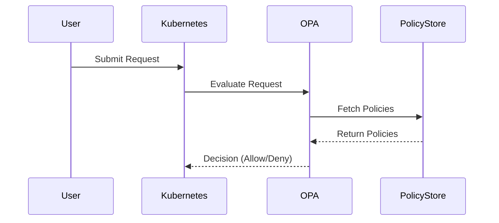

## Introduction to Policy as Code

### Background Theory

Policy as Code is an approach to managing and enforcing policies within a system using code. This method allows organizations to define, manage, and enforce policies in a consistent, repeatable, and auditable manner. In the context of Kubernetes, Policy as Code enables administrators to define and enforce rules around resource configurations, access controls, and compliance requirements.

### Why Policy as Code?

The traditional approach to managing policies often involves manual processes, which can be error-prone and difficult to scale. By contrast, Policy as Code leverages automation and version control systems to ensure consistency and traceability. This approach is particularly valuable in modern DevOps environments where infrastructure is managed as code, and continuous integration and delivery (CI/CD) pipelines are standard.

### Key Concepts

#### Static vs. Dynamic Policy Checking

- **Static Checking**: This involves analyzing the configuration files before they are deployed. Static checks can identify known vulnerabilities and non-compliance issues based on predefined rules.
- **Dynamic Checking**: This involves evaluating requests or events at runtime. Dynamic checks can enforce more complex policies that depend on the current state of the system.

#### Custom Policies

Custom policies are specific to an organization's unique requirements. These policies can address various aspects such as:

- **Security**: Ensuring that resources are configured securely.
- **Compliance**: Adhering to regulatory requirements.
- **Best Practices**: Following industry-standard practices.

### Tools for Policy as Code

One of the most popular tools for implementing Policy as Code is the Open Policy Agent (OPA).

#### Open Policy Agent (OPA)

OPA is a compliance and governance management solution that can be used to enforce policies across various environments, including Kubernetes, microservices, CI/CD pipelines, and API gateways.

##### How OPA Works

OPA evaluates requests or events against a set of predefined policies. These policies are written in Rego, a high-level declarative language designed specifically for policy enforcement.



### Implementing Policy as Code with OPA

To implement Policy as Code using OPA, you need to define policies, deploy OPA, and integrate it with your Kubernetes cluster.

#### Defining Policies

Policies are defined using Rego, which is a powerful and expressive language for defining policies. Here is an example of a simple policy that ensures that all pods have a `securityContext` defined:

```rego
package kubernetes.pods

default allow = false

allow {
    input.kind == "Pod"
    input.spec.securityContext != null
}
```

This policy checks if the `kind` of the resource is a `Pod` and if the `spec.securityContext` field is defined.

#### Deploying OPA

OPA can be deployed as a sidecar container in your Kubernetes cluster. Here is an example of a deployment manifest for OPA:

```yaml
apiVersion: apps/v1
kind: Deployment
metadata:
  name: opa-deployment
spec:
  replicas: 1
  selector:
    matchLabels:
      app: opa
  template:
    metadata:
      labels:
        app: opa
    spec:
      containers:
      - name: opa
        image: openpolicyagent/opa:latest
        args: ["run", "--server", "--listen", ":8181"]
        ports:
        - containerPort: 8181
```

This deployment runs OPA as a server listening on port 8181.

#### Integrating OPA with Kubernetes

To integrate OPA with Kubernetes, you can use OPA Gatekeeper, which is a Kubernetes admission controller that enforces policies defined in OPA.

##### Installing OPA Gatekeeper

You can install OPA Gatekeeper using Helm:

```bash
helm repo add open-policy-agent https://open-policy-agent.github.io/gatekeeper/charts
helm repo update
helm install gatekeeper open-policy-agent/gatekeeper --namespace gatekeeper-system --create-namespace
```

##### Configuring Policies

Once OPA Gatekeeper is installed, you can configure policies by creating `ConstraintTemplate` and `Constraint` resources. Here is an example of a `ConstraintTemplate` and a corresponding `Constraint`:

```yaml
# ConstraintTemplate
apiVersion: templates.gatekeeper.sh/v1beta1
kind: ConstraintTemplate
metadata:
  name: k8srequiredlabels
spec:
  crd:
    spec:
      names:
        kind: K8sRequiredLabels
  targets:
    - target: admission.k8s.gatekeeper.sh
      rego: |
        package k8srequiredlabels

        violation[{"msg": msg, "details": {}}] {
          provided := {"app", "version"}
          missing := difference(provided, input.review.object.metadata.labels)
          count(missing) > 0
          msg := sprintf("missing labels: %v", [missing])
        }
```

```yaml
# Constraint
apiVersion: constraints.gatekeeper.sh/v1beta1
kind: K8sRequiredLabels
metadata:
  name: k8srequiredlabels
spec:
  match:
    kinds:
      - group: ""
        kind: Pod
```

This constraint ensures that all pods have `app` and `version` labels defined.

### Real-World Examples

#### Recent CVEs and Breaches

One recent example of a breach that could have been prevented with proper policy enforcement is the Capital One data breach in 2019. The breach was caused by misconfigured AWS S3 buckets, which allowed unauthorized access to sensitive data. A policy as code approach could have enforced strict access controls and monitoring on S3 buckets, preventing such a breach.

#### Example Vulnerable Configuration

Here is an example of a vulnerable Kubernetes deployment configuration:

```yaml
apiVersion: apps/v1
kind: Deployment
metadata:
  name: my-app
spec:
  replicas: 3
  selector:
    matchLabels:
      app: my-app
  template:
    metadata:
      labels:
        app: my-app
    spec:
      containers:
      - name: my-container
        image: my-image:latest
        ports:
        - containerPort: 8080
```

This configuration does not define any `securityContext`, leaving the pod vulnerable to potential security issues.

#### Secure Configuration

Here is the same configuration with a `securityContext` defined:

```yaml
apiVersion: apps/v1
kind: Deployment
metadata:
  name: my-app
spec:
  replicas: 3
  selector:
    matchLabels:
      app: my-app
  template:
    metadata:
      labels:
        app: my-app
    spec:
      securityContext:
        runAsUser: 1000
        fsGroup: 2000
      containers:
      - name: my-container
        image: my-image:latest
        ports:
        - containerPort: 8080
```

This configuration ensures that the pod runs with a specific user ID and file system group, reducing the risk of privilege escalation.

### How to Prevent / Defend

#### Detection

To detect policy violations, you can use OPA Gatekeeper's audit capabilities. You can run audits periodically to check if any resources violate the defined policies.

```bash
kubectl get constrainttemplate k8srequiredlabels -o json | jq '.status.conforms'
```

This command checks if all resources conform to the `k8srequiredlabels` constraint.

#### Prevention

To prevent policy violations, you can enforce the policies using OPA Gatekeeper's admission controller. This ensures that any resource that violates the policies is rejected during creation or update.

#### Secure Coding Fixes

Here is an example of a vulnerable policy and its secure counterpart:

**Vulnerable Policy**

```rego
package kubernetes.pods

default allow = false

allow {
    input.kind == "Pod"
}
```

**Secure Policy**

```rego
package kubernetes.pods

default allow = false

allow {
    input.kind == "Pod"
    input.spec.securityContext != null
}
```

The secure policy ensures that all pods have a `securityContext` defined, reducing the risk of security issues.

### Complete Example

#### Full HTTP Request and Response

Here is an example of a full HTTP request and response when submitting a policy to OPA:

**Request**

```http
POST /v1/data/kubernetes/pods HTTP/1.1
Host: localhost:8181
Content-Type: application/json

{
  "input": {
    "kind": "Pod",
    "spec": {
      "securityContext": {}
    }
  }
}
```

**Response**

```http
HTTP/1.1 200 OK
Content-Type: application/json

{
  "result": true
}
```

This response indicates that the policy allows the pod because it has a `securityContext` defined.

### Common Pitfalls

#### Overly Broad Policies

One common pitfall is defining overly broad policies that do not provide sufficient protection. For example, a policy that allows any pod without checking for a `securityContext` is too permissive.

#### Lack of Monitoring

Another pitfall is not monitoring policy violations. Without regular audits, policy violations may go unnoticed, leading to security risks.

### Conclusion

Policy as Code is a powerful approach to managing and enforcing policies in Kubernetes and other environments. By using tools like OPA and OPA Gatekeeper, you can define, deploy, and enforce policies consistently and effectively. This approach helps ensure that your systems are secure, compliant, and aligned with your organization's unique requirements.

### Practice Labs

For hands-on practice with Policy as Code, consider the following labs:

- **PortSwigger Web Security Academy**: Offers exercises on securing web applications.
- **OWASP Juice Shop**: Provides a vulnerable web application for practicing security testing.
- **CloudGoat**: Offers scenarios for practicing cloud security.
- **Kubernetes Goat**: Provides Kubernetes-specific security challenges.

These labs will help you gain practical experience with implementing and enforcing policies in various environments.

---
<!-- nav -->
[[04-Introduction to Policy as Code Part 1|Introduction to Policy as Code Part 1]] | [[DevSecOps/DevSecOps Bootcamp/02-Security Governance & Compliance/04-Policy as Code/Introduction to Open Policy Agent OPA and OPA Gatekeeper/00-Overview|Overview]] | [[06-Empowering Teams While Ensuring Security in Kubernetes Clusters|Empowering Teams While Ensuring Security in Kubernetes Clusters]]
