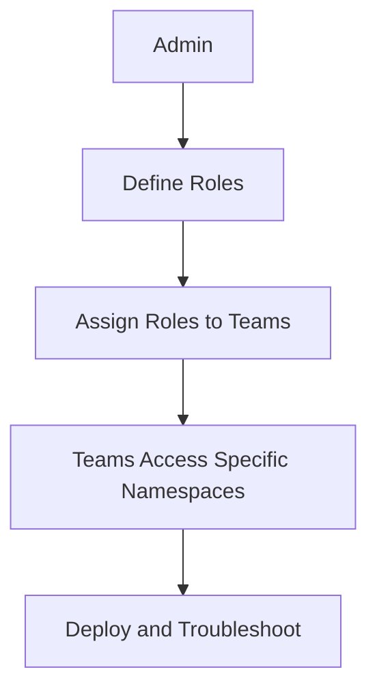
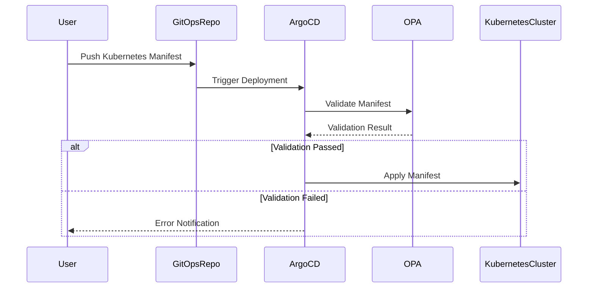

## Empowering Teams While Ensuring Security in Kubernetes Clusters

In modern DevOps environments, especially those leveraging Kubernetes, the challenge of balancing team empowerment with security is paramount. Product teams often lack the deep expertise required to configure Kubernetes resources securely and efficiently. This leads to a scenario where administrators are hesitant to grant broader access to these teams due to the risk of misconfigurations or accidental disruptions to the cluster.

### The Trade-off Between Empowerment and Control

The primary goal is to allow teams to deploy applications and manage resources within the Kubernetes cluster independently. However, this must be done in a manner that ensures security and adherence to best practices. This balance is crucial for maintaining both operational efficiency and security.

#### Role-Based Access Control (RBAC)

One approach to achieving this balance is through Role-Based Access Control (RBAC). RBAC allows administrators to define roles and permissions that restrict access to specific namespaces or resources. For instance, a team might be granted access to a specific namespace for troubleshooting and deployment purposes. This setup ensures that teams can operate within their designated areas without affecting other parts of the cluster.



However, RBAC alone may not be sufficient. As noted in the transcript, even with restricted access, teams can still deploy misconfigured Kubernetes manifests. This highlights the need for additional layers of control and validation.

### The Need for Policy as Code

To address these challenges, the concept of **Policy as Code** becomes essential. Policy as Code involves defining and enforcing policies programmatically, ensuring that configurations adhere to predefined rules and best practices. This approach provides a systematic way to validate and enforce security and compliance requirements across the entire cluster.

#### Open Policy Agent (OPA)

One of the leading tools for implementing Policy as Code is the **Open Policy Agent (OPA)**. OPA is an open-source, general-purpose policy engine that enables organizations to define, enforce, and audit policies across various systems and services. In the context of Kubernetes, OPA can be used to validate and enforce policies on Kubernetes manifests before they are applied to the cluster.

##### How OPA Works

OPA operates based on a declarative policy language called **Rego**. Rego allows administrators to define policies in a clear and concise manner. These policies can then be enforced at runtime, ensuring that only compliant configurations are allowed.



#### Example Policy Definition

Let's consider an example where we want to ensure that all pods in a namespace have a specific label (`app=web`). This can be achieved using OPA and Rego.

```rego
package kubernetes.admission

deny[msg] {
    input.request.kind.kind == "Pod"
    not input.request.object.metadata.labels["app"] == "web"
    msg = sprintf("Pod must have label app=web")
}
```

This policy checks if the `Pod` being created has the label `app=web`. If not, the policy denies the request and returns an error message.

### Integrating OPA with Kubernetes

To integrate OPA with Kubernetes, we typically use **OPA Gatekeeper**, a Kubernetes-native policy controller built on top of OPA. Gatekeeper allows you to define and enforce policies directly within the Kubernetes cluster.

#### Installing OPA Gatekeeper

First, install OPA Gatekeeper using `kubectl`.

```sh
kubectl apply -f https://raw.githubusercontent.com/open-policy-agent/gatekeeper/master/deploy/gatekeeper.yaml
```

Once installed, you can start defining and applying policies.

#### Defining and Applying Policies

Policies in Gatekeeper are defined using custom resources called **Constraint Templates** and **Constraints**.

##### Constraint Template

A Constraint Template defines the structure of a policy. For example, let's create a template to ensure that all pods have a specific label.

```yaml
apiVersion: templates.gatekeeper.sh/v1beta1
kind: ConstraintTemplate
metadata:
  name: k8srequiredlabels
spec:
  crd:
    spec:
      names:
        kind: K8sRequiredLabels
  targets:
    - target: admission.k8s.gatekeeper.sh
      rego: |
        package k8srequiredlabels
        
        violation[{"msg": msg, "details": {}}] {
          input.review.object.kind == "Pod"
          not input.review.object.metadata.labels["app"] == "web"
          msg := sprintf("Pod must have label app=web")
        }
```

##### Constraint

A Constraint applies the policy defined by the Constraint Template.

```yaml
apiVersion: constraints.gatekeeper.sh/v1beta1
kind: K8sRequiredLabels
metadata:
  name: pod-must-have-label-web
spec:
  match:
    kinds:
      - apiGroups: [""]
        kinds: ["Pod"]
```

Apply these definitions to the cluster:

```sh
kubectl apply -f constraint-template.yaml
kubectl apply -f constraint.yaml
```

### Real-World Examples and Breaches

Recent breaches and vulnerabilities highlight the importance of Policy as Code. For instance, the **CVE-2021-25741** in Kubernetes involved a privilege escalation vulnerability where attackers could bypass RBAC controls. By implementing robust policies using OPA and Gatekeeper, such vulnerabilities can be mitigated.

### Common Pitfalls and Best Practices

#### Common Pitfalls

1. **Overly Permissive Policies**: Ensure that policies are not too permissive, allowing unintended actions.
2. **Complexity**: Overly complex policies can be difficult to maintain and understand.
3. **False Positives/Negatives**: Striking a balance between false positives and negatives is crucial.

#### Best Practices

1. **Start Small**: Begin with simple policies and gradually expand.
2. **Regular Audits**: Regularly review and audit policies to ensure they remain effective.
3. **Documentation**: Maintain thorough documentation of policies and their rationale.

### How to Prevent / Defend

#### Detection

Use tools like OPA and Gatekeeper to continuously monitor and validate configurations. Implement logging and alerting mechanisms to detect policy violations.

#### Prevention

1. **Secure-Coding Fixes**: Ensure that all configurations adhere to security best practices.
2. **Configuration Hardening**: Harden configurations to minimize attack surfaces.
3. **Mitigations**: Implement additional mitigations such as network segmentation and least privilege access.

#### Secure Coding Example

Compare the insecure and secure versions of a Kubernetes manifest.

**Insecure Version**

```yaml
apiVersion: v1
kind: Pod
metadata:
  name: my-pod
spec:
  containers:
  - name: my-container
    image: my-image
```

**Secure Version**

```yaml
apiVersion: v1
kind: Pod
metadata:
  name: my-pod
  labels:
    app: web
spec:
  containers:
  - name: my-container
    image: my-image
```

### Hands-On Labs

For practical experience with Policy as Code and OPA/Gatekeeper, consider the following labs:

- **PortSwigger Web Security Academy**: Offers modules on Kubernetes security and policy enforcement.
- **CloudGoat**: Provides scenarios for securing cloud infrastructure, including Kubernetes clusters.
- **OPA Playground**: Interactive environment to experiment with Rego policies.

By leveraging these tools and best practices, organizations can effectively balance team empowerment with stringent security controls in Kubernetes environments.

---
<!-- nav -->
[[05-Introduction to Policy as Code|Introduction to Policy as Code]] | [[DevSecOps/DevSecOps Bootcamp/02-Security Governance & Compliance/04-Policy as Code/Introduction to Open Policy Agent OPA and OPA Gatekeeper/00-Overview|Overview]] | [[DevSecOps/DevSecOps Bootcamp/02-Security Governance & Compliance/04-Policy as Code/Introduction to Open Policy Agent OPA and OPA Gatekeeper/07-Practice Questions & Answers|Practice Questions & Answers]]
